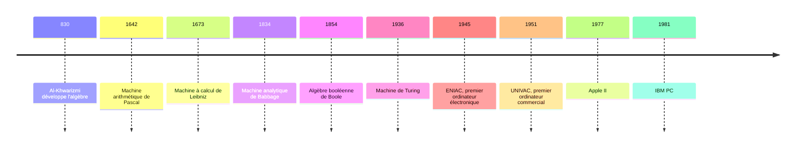
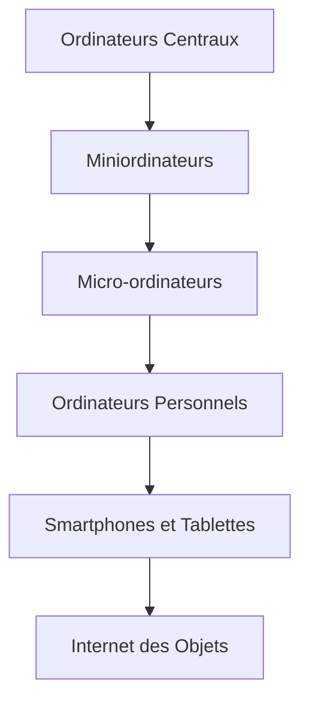

> préparé et enseigné par Ihababdelbasset ANNAKI ( Maitre de Conférences IA et Développement Avancé)
> 

# Histoire de l'Informatique : Des Origines Algébriques aux Innovations Modernes

# Introduction

L'histoire de l'informatique est un voyage fascinant à travers les âges, reliant les anciennes civilisations aux technologies modernes. Ce cours explore les contributions cruciales de figures emblématiques et l'évolution des concepts mathématiques qui ont façonné notre monde numérique.

## Chronologie de l'Informatique



## 1. Les Fondations Algébriques : Al-Khwarizmi

Muhammad ibn Musa al-Khwarizmi, mathématicien persan du 9ème siècle, est considéré comme le père de l'algèbre.

- Contribution au concept d'algorithme
- Introduction du système décimal et du zéro en Occident
- Influence sur le développement des mathématiques computationnelles

<aside>

**Image :** Portrait d'Al-Khwarizmi

Note : Insérez ici une image d'Al-Khwarizmi ou d'un manuscrit arabe ancien représentant des équations algébriques.

</aside>

## 2. L'Ère des Machines à Calculer

Du 17ème au 19ème siècle, plusieurs inventeurs ont posé les bases des calculateurs mécaniques.

- Blaise Pascal et sa machine arithmétique (1642)
- Gottfried Wilhelm Leibniz et sa machine à calcul (1673)
- Charles Babbage et sa machine analytique (1834)

| **Inventeur** | **Machine** | **Année** |
| --- | --- | --- |
| Blaise Pascal | Machine arithmétique | 1642 |
| Gottfried Wilhelm Leibniz | Machine à calcul | 1673 |
| Charles Babbage | Machine analytique | 1834 |

## 3. L'Avènement de la Logique Moderne

Le 19ème siècle a vu l'émergence de nouveaux concepts logiques essentiels à l'informatique.

- George Boole et l'algèbre booléenne (1854)
- Augustus De Morgan et ses lois logiques

<aside>

**Diagramme :** Opérations de base de l'algèbre booléenne

Note : Insérez ici un diagramme montrant les opérations AND, OR, et NOT de l'algèbre booléenne.

</aside>

## 4. Alan Turing et la Naissance de l'Informatique Moderne

Alan Turing, mathématicien britannique, est considéré comme le père de l'informatique théorique.

- Concept de la machine de Turing (1936)
- Contributions au décryptage pendant la Seconde Guerre mondiale
- Test de Turing et réflexions sur l'intelligence artificielle

<aside>

**Image :** Alan Turing et la machine Enigma

Note : Insérez ici une image d'Alan Turing travaillant sur la machine Enigma.

</aside>


## 5. L'Ère des Ordinateurs Électroniques

Le milieu du 20ème siècle a vu l'émergence des premiers ordinateurs électroniques.

- ENIAC (1945) : premier ordinateur électronique généraliste
- UNIVAC (1951) : premier ordinateur commercial

## 6. L'Essor de l'Informatique Personnelle

Les années 1970 et 1980 ont marqué la démocratisation de l'informatique.

- Apple II (1977) et Macintosh (1984)
- IBM PC (1981) et l'ère des compatibles PC



## Conclusion

L'histoire de l'informatique est un témoignage de l'ingéniosité humaine, reliant les concepts mathématiques anciens aux technologies modernes. Elle continue d'évoluer, promettant de nouvelles innovations pour l'avenir.

La compréhension de la structure d'un ordinateur est essentielle pour saisir son fonctionnement. Cette section explore en détail les composants clés d'un ordinateur moderne et leurs interactions.

## 1. Vue d'Ensemble : L'Architecture de Von Neumann

L'architecture de Von Neumann, proposée par John von Neumann en 1945, reste le fondement de la plupart des ordinateurs modernes. Elle se compose de quatre éléments principaux :

- Unité Centrale de Traitement (CPU)
- Mémoire
- Dispositifs d'Entrée/Sortie
- Bus de Données

```mermaid
graph TD
    A[Unité Centrale de Traitement] &lt;--&gt; B[Mémoire]
    A &lt;--&gt; C[Dispositifs d'Entrée/Sortie]
    B &lt;--&gt; C
    D[Bus de Données] --- A
    D --- B
    D --- C
```

## 2. Unité Centrale de Traitement (CPU)

Le CPU est le "cerveau" de l'ordinateur. Il exécute les instructions et effectue les calculs.

### 2.1 Composants du CPU

- Unité Arithmétique et Logique (UAL) : Effectue les opérations mathématiques et logiques
- Unité de Contrôle : Gère le flux d'instructions et coordonne les opérations
- Registres : Stockage rapide pour les données en cours de traitement

### 2.2 Cycle d'Instruction

Le CPU suit un cycle d'instruction pour exécuter les programmes :

1. Fetch (Chercher) : L'instruction est récupérée de la mémoire
2. Decode (Décoder) : L'instruction est interprétée
3. Execute (Exécuter) : L'instruction est exécutée
4. Store (Stocker) : Les résultats sont stockés

```mermaid
graph TD
    A[Fetch] --&gt; B[Decode]
    B --&gt; C[Execute]
    C --&gt; D[Store]
    D --&gt; A
```

## 3. Mémoire

La mémoire stocke les données et les instructions. Il existe plusieurs types de mémoire, chacun avec ses caractéristiques :

### 3.1 Mémoire Vive (RAM)

La RAM est une mémoire volatile à accès rapide utilisée pour le stockage temporaire.

- SRAM (Static RAM) : Plus rapide mais plus coûteuse
- DRAM (Dynamic RAM) : Plus lente mais moins chère et plus dense

### 3.2 Mémoire Morte (ROM)

La ROM est une mémoire non volatile contenant des instructions permanentes.

- PROM : Programmable une seule fois
- EPROM : Effaçable et programmable
- EEPROM : Effaçable électriquement

### 3.3 Mémoire Cache

La mémoire cache est une mémoire rapide qui sert d'intermédiaire entre le CPU et la RAM.

- Cache L1 : Le plus rapide, intégré au CPU
- Cache L2 : Plus grand mais un peu plus lent
- Cache L3 : Encore plus grand, partagé entre les cœurs du CPU

## 4. Dispositifs d'Entrée/Sortie

Ces dispositifs permettent à l'ordinateur d'interagir avec le monde extérieur.

### 4.1 Dispositifs d'Entrée

- Clavier
- Souris
- Scanner
- Microphone

### 4.2 Dispositifs de Sortie

- Écran
- Haut-parleurs
- Imprimante

### 4.3 Dispositifs de Stockage

- Disque Dur (HDD)
- Solid State Drive (SSD)
- Clé USB

## 5. Bus de Données

Les bus sont des systèmes de communication qui transfèrent les données entre les composants.

- Bus de Données : Transporte les données
- Bus d'Adresses : Indique où les données doivent être envoyées ou récupérées
- Bus de Contrôle : Gère les signaux de contrôle entre les composants

## 6. Carte Mère

La carte mère est le circuit imprimé principal qui relie tous les composants.

- Chipset : Gère les communications entre le CPU, la mémoire et les périphériques
- BIOS/UEFI : Firmware qui initialise le matériel au démarrage
- Slots d'extension : Pour ajouter des cartes supplémentaires (graphique, son, réseau)

## Conclusion

La structure d'un ordinateur est un système complexe et interconnecté. Chaque composant joue un rôle crucial dans le fonctionnement global de la machine. Comprendre cette structure permet non seulement de mieux appréhender le fonctionnement des ordinateurs, mais aussi d'optimiser leur utilisation et leur maintenance.

<aside>

**Activité pratique suggérée :** Démontage guidé d'un vieil ordinateur pour identifier physiquement les composants étudiés. Cette activité pratique peut grandement améliorer la compréhension de la structure de l'ordinateur.

</aside>

# Histoire des Langages de Programmation

L'évolution des langages de programmation est étroitement liée à l'histoire de l'informatique. Cette section explore les étapes clés de leur développement.

## 1. Les Débuts : Langages Machine et Assembleur

Les premiers ordinateurs étaient programmés directement en langage machine, utilisant des séquences de 0 et de 1.

- Années 1940 : Langage machine
- Années 1950 : Assembleur, première abstraction du langage machine

## 2. Langages de Haut Niveau

L'apparition des langages de haut niveau a révolutionné la programmation, la rendant plus accessible et efficace.

- 1957 : FORTRAN, premier langage de haut niveau largement utilisé
- 1958 : ALGOL, influent pour les langages scientifiques
- 1959 : COBOL, conçu pour les applications commerciales
- 1964 : BASIC, créé pour l'enseignement

## 3. Paradigmes de Programmation

Différents paradigmes ont émergé, offrant diverses approches de résolution de problèmes.

- 1958 : LISP, premier langage fonctionnel
- 1972 : Prolog, langage de programmation logique
- 1967 : Simula, premier langage orienté objet

## 4. Langages Modernes et Spécialisés

Les dernières décennies ont vu l'apparition de langages adaptés à des besoins spécifiques.

- 1972 : C, langage système influent
- 1983 : C++, extension orientée objet de C
- 1991 : Python, langage polyvalent et lisible
- 1995 : Java, "write once, run anywhere"
- 2009 : Go, conçu pour la programmation système moderne

## 5. Tendances Actuelles

Les langages continuent d'évoluer pour répondre aux besoins changeants de l'industrie.

- Langages pour l'intelligence artificielle et l'apprentissage machine
- Langages pour le développement web et mobile
- Langages pour la programmation quantique

<aside>

**Activité suggérée :** Créez une frise chronologique interactive montrant l'évolution des langages de programmation, en mettant en évidence leurs influences mutuelles et leurs domaines d'application principaux.

</aside>

L'histoire des langages de programmation reflète l'évolution des besoins en informatique et continue de façonner la manière dont nous interagissons avec les technologies.

# Transcodage : Binaire, Décimal et Hexadécimal

Le transcodage entre les systèmes binaire, décimal et hexadécimal est une compétence essentielle en informatique. Voici une explication détaillée avec de nombreux exemples pour chaque type de transformation.

## 1. Binaire vers Décimal

Pour convertir du binaire en décimal, on multiplie chaque chiffre par une puissance de 2 (en commençant par 2^0 pour le chiffre le plus à droite) et on additionne les résultats.

```jsx
Exemple 1: 1010 (binaire)
= (1 × 2³) + (0 × 2²) + (1 × 2¹) + (0 × 2⁰)
= 8 + 0 + 2 + 0
= 10 (décimal)

Exemple 2: 11001 (binaire)
= (1 × 2⁴) + (1 × 2³) + (0 × 2²) + (0 × 2¹) + (1 × 2⁰)
= 16 + 8 + 0 + 0 + 1
= 25 (décimal)
```

**EXERCICE : Convertir 10 001 011**

## 2. Décimal vers Binaire

Pour convertir du décimal en binaire, on divise successivement par 2 et on note les restes dans l'ordre inverse.

```jsx
Exemple 1: 19 (décimal)
19 ÷ 2 = 9 reste 1
9 ÷ 2 = 4 reste 1
4 ÷ 2 = 2 reste 0
2 ÷ 2 = 1 reste 0
1 ÷ 2 = 0 reste 1

Résultat : 10011 (binaire)

Exemple 2: 45 (décimal)
45 ÷ 2 = 22 reste 1
22 ÷ 2 = 11 reste 0
11 ÷ 2 = 5 reste 1
5 ÷ 2 = 2 reste 1
2 ÷ 2 = 1 reste 0
1 ÷ 2 = 0 reste 1

Résultat : 101101 (binaire)
```

**CONVERTIR 145 en binaire**

**CONVERTIR 256 en binaire**

## 3. Binaire vers Hexadécimal

On groupe les chiffres binaires par 4 (en ajoutant des 0 à gauche si nécessaire) et on convertit chaque groupe en son équivalent hexadécimal.

```jsx
Exemple 1: 1011 0101 (binaire)
1011 = B
0101 = 5
Résultat : B5 (hexadécimal)

Exemple 2: 1110 0011 1010 (binaire)
1110 = E
0011 = 3
1010 = A
Résultat : E3A (hexadécimal)
```

**CONVERTIR EN BINAIRE 1011 0111**

## 4. Hexadécimal vers Binaire

On convertit chaque chiffre hexadécimal en son équivalent binaire sur 4 bits.

```jsx
Exemple 1: 2F (hexadécimal)
2 = 0010
F = 1111
Résultat : 0010 1111 (binaire)

Exemple 2: A7C (hexadécimal)
A = 1010
7 = 0111
C = 1100
Résultat : 1010 0111 1100 (binaire)
```

**Convertir  ABC5 = 1010 1011 1100 0101**

## 5.Décimal vers Hexadécimal

On divise successivement par 16 et on note les restes (en utilisant A-F pour 10-15) dans l'ordre inverse.

```jsx
Exemple 1: 173 (décimal)
173 ÷ 16 = 10 reste 13 (D)
10 ÷ 16 = 0 reste 10 (A)

Résultat : AD (hexadécimal)

Exemple 2: 2748 (décimal)
2748 ÷ 16 = 171 reste 12 (C)
171 ÷ 16 = 10 reste 11 (B)
10 ÷ 16 = 0 reste 10 (A)

Résultat : ABC (hexadécimal)
```

## 6. Hexadécimal vers Décimal

On multiplie chaque chiffre par une puissance de 16 (en commençant par 16^0 pour le chiffre le plus à droite) et on additionne les résultats.

```jsx
Exemple 1: 3F (hexadécimal)
= (3 × 16¹) + (15 × 16⁰)
= 48 + 15
= 63 (décimal)

Exemple 2: 1A5 (hexadécimal)
= (1 × 16²) + (10 × 16¹) + (5 × 16⁰)
= 256 + 160 + 5
= 421 (décimal)
```

<aside>

**Astuce pratique :** Pour maîtriser ces conversions, il est utile de mémoriser les valeurs hexadécimales de 0 à 15 :
0-9 restent inchangés
10 = A, 11 = B, 12 = C, 13 = D, 14 = E, 15 = F

</aside>

Ces exemples détaillés devraient vous aider à mieux comprendre et pratiquer les différentes conversions entre les systèmes binaire, décimal et hexadécimal. N'hésitez pas à vous entraîner avec d'autres nombres pour renforcer votre compréhension.

Le transcodage entre les systèmes binaire, décimal et hexadécimal est une compétence fondamentale en informatique. Voici une explication avec des exemples simples :

# Réseaux et Internet

Les réseaux informatiques et Internet forment l'épine dorsale de notre monde numérique moderne. Ils permettent la communication et l'échange de données entre les ordinateurs et les appareils à l'échelle mondiale.

## Concepts fondamentaux des réseaux

Un réseau informatique est un ensemble d'ordinateurs et d'autres dispositifs interconnectés, capables de partager des ressources et de communiquer entre eux. Les réseaux peuvent être classés selon leur taille et leur portée :

- LAN (Local Area Network) : réseau local, typiquement dans un bâtiment ou un campus
- WAN (Wide Area Network) : réseau étendu, couvrant une grande zone géographique
- Internet : le réseau mondial des réseaux

## Protocoles de communication

Les protocoles sont des règles standardisées qui permettent aux appareils de communiquer sur un réseau. Voici quelques protocoles essentiels :

- TCP/IP (Transmission Control Protocol/Internet Protocol) : la base d'Internet
- HTTP (Hypertext Transfer Protocol) : utilisé pour le transfert de pages web
- FTP (File Transfer Protocol) : pour le transfert de fichiers

Exemple de communication TCP/IP :

```
1. L'ordinateur A veut envoyer des données à l'ordinateur B
2. Les données sont divisées en paquets
3. Chaque paquet reçoit une adresse IP de destination
4. Les paquets sont envoyés à travers le réseau
5. L'ordinateur B reçoit les paquets et les réassemble
```

# Le codage

Le codage est le processus de conversion de l'information en une forme que les ordinateurs peuvent comprendre et traiter. C'est la base de toute opération informatique.

## Systèmes de numération

Les systèmes de numération sont des méthodes pour représenter les nombres. En informatique, on utilise principalement :

- Décimal (base 10) : le système que nous utilisons quotidiennement
- Binaire (base 2) : utilisé par les ordinateurs pour le traitement interne
- Octal (base 8) : parfois utilisé pour représenter des groupes de bits
- Hexadécimal (base 16) : couramment utilisé pour représenter de grandes valeurs binaires de manière plus compacte

Exemple de conversion :

```
Décimal : 42
Binaire : 101010
Octal : 52
Hexadécimal : 2A
```

## Codage des nombres entiers

Les nombres entiers sont généralement codés en utilisant une représentation binaire. Pour les nombres signés, on utilise souvent le complément à deux.

Exemple de codage d'un entier sur 8 bits :

```
Nombre décimal : 42
Représentation binaire : 00101010
```

Exemple de complément à deux pour les nombres négatifs :

```
Nombre décimal : -42
1. Représentation binaire positive : 00101010
2. Inversion des bits : 11010101
3. Addition de 1 : 11010110
Résultat final : 11010110
```

## Codage des nombres réels

Les nombres réels sont généralement codés en utilisant la notation en virgule flottante, qui permet de représenter une large gamme de valeurs avec une précision variable.

Format IEEE 754 (simple précision, 32 bits) :

```
| Signe (1 bit) | Exposant (8 bits) | Mantisse (23 bits) |

Exemple pour π (3.14159...):
Valeur décimale : 3.14159
Représentation binaire : 1.1001001000011111101101
Exposant : 1
IEEE 754 : 0 10000000 10010010000111111011011

```

## Codage des caractères

Les caractères sont codés à l'aide de systèmes d'encodage qui associent des valeurs numériques à des caractères.

Exemple avec ASCII :

```
'A' : 65 (01000001 en binaire)
'a' : 97 (01100001 en binaire)
'1' : 49 (00110001 en binaire)
```

Unicode étend ce concept pour inclure des caractères de nombreuses langues et systèmes d'écriture.

## Codages des images et du son

Les images et le son sont codés en utilisant diverses techniques de représentation numérique et de compression.

Exemple de codage d'image (format bitmap simple) :

```
Image 4x4 pixels en noir et blanc :
1 0 1 1
0 1 0 1
1 1 0 0
0 1 1 1

Codage : 10110101110001111
```

Pour le son, on utilise souvent l'échantillonnage, qui consiste à mesurer l'amplitude du son à intervalles réguliers.

Exemple d'échantillonnage audio :

```
Fréquence d'échantillonnage : 44.1 kHz (CD audio)
Profondeur : 16 bits

Une seconde de son stéréo non compressé :
44100 échantillons * 2 canaux * 16 bits = 1,411,200 bits = 176,400 octets
```

Ces concepts de codage sont fondamentaux en informatique et sous-tendent toutes les opérations de traitement et de stockage de données dans les systèmes numériques.

# Introduction des composants d'une interface utilisateur

Avant d'aborder les balises HTML, il est important de comprendre les composants fondamentaux d'un UI Kit (User Interface Kit). Un UI Kit est un ensemble d'éléments d'interface utilisateur conçus pour être cohérents et réutilisables dans la création d'interfaces web ou d'applications.

## 1. Typographie

- Styles de titres (h1, h2, h3, etc.)
- Styles de paragraphes
- Liens
- Listes (ordonnées et non ordonnées)

## 2. Boutons

- Boutons primaires, secondaires, tertiaires
- États des boutons (normal, hover, actif, désactivé)
- Boutons avec icônes

## 3. Formulaires

- Champs de texte
- Cases à cocher
- Boutons radio
- Menus déroulants
- Étiquettes et messages d'erreur

## 4. Navigation

- Barres de navigation
- Menus déroulants
- Fil d'Ariane (Breadcrumbs)
- Pagination

## 5. Cartes et Conteneurs

- Cartes d'information
- Panneaux
- Modales
- Accordéons

## 6. Icônes et Illustrations

- Ensemble d'icônes cohérent
- Illustrations de marque

## 7. Grilles et Mise en page

- Système de grille responsive
- Conteneurs et marges

## 8. Composants de Feedback

- Messages d'alerte
- Notifications
- Barres de progression
- Tooltips

## 9. Tableaux et Listes

- Styles de tableaux
- Listes de données

## 10. Couleurs et Styles

- Palette de couleurs
- Variables de style (pour les espacements, les rayons de bordure, etc.)

Ces composants forment la base d'un UI Kit complet. Ils sont généralement implémentés en HTML, CSS et JavaScript, en utilisant les balises HTML appropriées pour chaque élément.

# Composants d'un UI Kit : Tableau détaillé

| Composant | Description | Quand l'utiliser | Pourquoi l'utiliser |
| --- | --- | --- | --- |
| Typographie | Définit les styles de texte, y compris les titres, paragraphes, et liens | Pour tout contenu textuel sur le site | Assure la cohérence visuelle et améliore la lisibilité |
| Boutons | Éléments interactifs pour déclencher des actions | Pour les appels à l'action, soumissions de formulaires | Guide l'utilisateur vers des actions importantes |
| Formulaires | Champs de saisie, cases à cocher, boutons radio, etc. | Pour collecter des données utilisateur | Facilite l'interaction et la collecte d'informations |
| Navigation | Menus, barres de navigation, fil d'Ariane | Pour aider les utilisateurs à naviguer sur le site | Améliore l'expérience utilisateur et l'accessibilité |
| Cartes et Conteneurs | Boîtes pour regrouper des informations connexes | Pour présenter des informations de manière organisée | Améliore la lisibilité et l'organisation du contenu |
| Icônes et Illustrations | Éléments visuels pour représenter des concepts | Pour compléter le texte ou fournir des repères visuels | Améliore la compréhension et l'attrait visuel |
| Grilles et Mise en page | Systèmes pour organiser le contenu sur la page | Pour structurer la disposition des éléments | Assure la cohérence et la responsivité du design |
| Composants de Feedback | Alertes, notifications, barres de progression | Pour informer l'utilisateur sur les actions ou l'état du système | Améliore l'interaction et réduit la confusion |
| Tableaux et Listes | Structures pour présenter des données organisées | Pour afficher des informations structurées | Facilite la comparaison et l'analyse des données |
| Couleurs et Styles | Palette de couleurs et variables de style | Pour maintenir la cohérence visuelle à travers l'interface | Renforce l'identité de marque et améliore l'expérience utilisateur |

Ce tableau détaillé fournit un aperçu complet des composants essentiels d'un UI , expliquant leur utilité et leur importance dans la conception d'interfaces utilisateur cohérentes et efficaces. Chaque composant joue un rôle crucial dans la création d'une expérience utilisateur fluide et agréable, tout en maintenant une identité visuelle cohérente à travers l'application ou le site web.

# Éléments UI en HTML : Explications Détaillées

```html
<!DOCTYPE html>
<html lang="fr">
<head>
    <title>Titre de la page</title>
</head>
<body>
    <!-- Contenu de la page -->
</body>
</html>
```

Explication en français :

1. **<!DOCTYPE html>** : Déclare que c'est un document HTML5.
2. **<html lang="fr">** : L'élément racine du document HTML, avec l'attribut de langue défini sur français.
3. **<head>** : Contient les métadonnées de la page.
4. **<title>** : Définit le titre de la page affiché dans l'onglet du navigateur.
5. **<body>** : Contient tout le contenu visible de la page web.

Cette structure représente le squelette minimal d'une page HTML, incluant uniquement les éléments essentiels demandés : doctype, head, body, et title.

## 1. Typographie

### Titres (h1 à h6)

Les balises de titre <h1> à <h6> sont utilisées pour structurer le contenu de la page. Elles définissent une hiérarchie d'importance, <h1> étant le plus important et <h6> le moins important.

```html
<h1>Titre principal</h1>
<h2>Sous-titre</h2>
<h3>Sous-sous-titre</h3>
<h4>Titre de niveau 4</h4>
<h5>Titre de niveau 5</h5>
<h6>Titre de niveau 6</h6>
```

Cet exemple montre la hiérarchie des titres en HTML, du plus important (h1) au moins important (h6). Chaque niveau de titre a généralement une taille de police différente par défaut, reflétant son importance dans la structure du document.

**Explication : Ces balises aident les moteurs de recherche à comprendre la structure de votre page et améliorent l'accessibilité pour les lecteurs d'écran.**


### Paragraphes

La balise <p> est utilisée pour définir des paragraphes de texte.

```html
<p>Ceci est un paragraphe de texte. Il peut contenir plusieurs phrases.</p>
```

Explication : Les paragraphes créent des blocs de texte séparés, améliorant la lisibilité et la structure du contenu.

### Liens

La balise <a> (ancre) est utilisée pour créer des hyperliens vers d'autres pages web ou des ressources.

```html
<a href="https://www.example.com">Cliquez ici pour visiter Example.com</a>
```

Explication : L'attribut 'href' spécifie la destination du lien. Le texte entre les balises devient cliquable.


### Listes

Il existe deux types principaux de listes : non ordonnées (<ul>) et ordonnées (<ol>). Les éléments de liste sont définis par la balise <li>.

```html
<ul>
  <li>Élément non ordonné 1</li>
  <li>Élément non ordonné 2</li>
</ul>

<ol>
  <li>Premier élément ordonné</li>
  <li>Deuxième élément ordonné</li>
</ol>
```

Explication : Les listes non ordonnées utilisent généralement des puces, tandis que les listes ordonnées utilisent des chiffres ou des lettres. Elles sont utiles pour présenter des informations de manière structurée.


## 2. Boutons

Les boutons sont créés avec la balise <button> ou <input type="button">. Ils sont essentiels pour l'interactivité de l'interface utilisateur.

```html
<button type="button">Cliquez-moi</button>
<input type="submit" value="Envoyer">
```

Explication : Les boutons peuvent déclencher des actions JavaScript ou soumettre des formulaires. L'attribut 'type' spécifie le comportement du bouton.


## 3. Formulaires

Les formulaires sont créés avec la balise <form> et contiennent divers éléments d'entrée.

```html
<form action="/submit-form" method="post">
  <label for="name">Nom :</label>
  <input type="text" id="name" name="name" required>

  <label for="email">Email :</label>
  <input type="email" id="email" name="email" required>

  <input type="checkbox" id="subscribe" name="subscribe">
  <label for="subscribe">S'abonner à la newsletter</label>

  <input type="radio" id="option1" name="option" value="option1">
  <label for="option1">Option 1</label>

  <input type="radio" id="option2" name="option" value="option2">
  <label for="option2">Option 2</label>

  <select name="country">
    <option value="">Sélectionnez un pays</option>
    <option value="fr">France</option>
    <option value="us">États-Unis</option>
  </select>

  <button type="submit">Envoyer</button>
</form>
```

Explication :

- <form> : Contient tous les éléments du formulaire.
- <label> : Fournit une description pour chaque champ de formulaire, améliorant l'accessibilité.
- <input type="text"> : Crée un champ de texte pour la saisie.
- <input type="email"> : Spécifiquement pour les adresses e-mail, avec validation intégrée.
- <input type="checkbox"> : Crée une case à cocher pour les options oui/non.
- <input type="radio"> : Crée des boutons radio pour sélectionner une option parmi plusieurs.
- <select> et <option> : Créent un menu déroulant pour choisir parmi plusieurs options.
- <button type="submit"> : Soumet le formulaire.


## 4. Navigation

La navigation est généralement créée avec la balise <nav> contenant une liste de liens.

```html
<nav>
  <ul>
    <li><a href="#home">Accueil</a></li>
    <li><a href="#about">À propos</a></li>
    <li><a href="#contact">Contact</a></li>
  </ul>
</nav>
```

Explication : La balise <nav> indique au navigateur et aux lecteurs d'écran que cette section contient des liens de navigation principaux. L'utilisation d'une liste non ordonnée (<ul>) avec des éléments de liste (<li>) est une pratique courante pour structurer les menus de navigation.


## 5. Cartes et Conteneurs

Les cartes sont souvent créées en utilisant des <div> avec des classes CSS spécifiques.

```html
<div class="card">
  
  <div class="card-content">
    <h3>Titre de la carte</h3>
    <p>Contenu de la carte</p>
  </div>
</div>
```

Explication : Cette structure crée une "carte" contenant une image, un titre et du texte. Les classes CSS (comme "card" et "card-content") sont utilisées pour styliser ces éléments.

## 6. Tableaux

Les tableaux sont créés avec la balise <table> et sont utilisés pour présenter des données tabulaires.

```html
<table>
  <thead>
    <tr>
      <th>En-tête 1</th>
      <th>En-tête 2</th>
    </tr>
  </thead>
  <tbody>
    <tr>
      <td>Donnée 1</td>
      <td>Donnée 2</td>
    </tr>
    <tr>
      <td>Donnée 3</td>
      <td>Donnée 4</td>
   
    </tr>
    
    
  </tbody>
</table>
"
```

Explication :

- <table> : Contient l'ensemble du tableau.
- <thead> : Groupe les lignes d'en-tête du tableau.
- <tbody> : Contient le corps principal du tableau.
- <tr> : Représente une ligne du tableau.
- <th> : Définit une cellule d'en-tête.
- <td> : Définit une cellule de données.

Ces éléments HTML forment la base de la plupart des interfaces utilisateur web. Ils sont généralement stylisés avec CSS et rendus interactifs avec JavaScript pour créer des expériences utilisateur riches et engageantes.


## Images

Les images sont intégrées avec la balise ``, utilisée pour afficher des images sur une page Web.

```html


```

Explication :

- `` : Balise auto-fermante utilisée pour afficher une image.
- `src` : Spécifie le chemin de l'image (URL ou chemin relatif).
- `alt` : Fournit un texte alternatif lorsque l'image ne peut pas être affichée.
- `width` et `height` : Définissent la largeur et la hauteur de l'image.

## Sections et Division de Contenu

Les éléments de section et de division structurent le contenu.

### `<div>`

```html

<div class="container">Contenu divisé ici</div>

```

Explication :

- `<div>` : Conteneur générique utilisé pour regrouper d'autres éléments.

### `<section>`

```html

<section>
  <h2>Section Titre</h2>
  <p>Contenu de la section</p>
</section>

```

Explication :

- `<section>` : Définit une section thématique dans un document.

### `<article>`

```html

<article>
  <h2>Article Titre</h2>
  <p>Contenu de l'article.</p>
</article>

```

Explication :

- `<article>` : Définit un contenu autonome tel qu'un article ou un blog.

### `<header>`, `<footer>`, `<aside>`

```html

<header>
  <h1>Titre Principal</h1>
</header>
<footer>
  <p>Pied de page</p>
</footer>
<aside>
  <p>Contenu complémentaire</p>
</aside>

```

Explication :

- `<header>` : Section d'en-tête.
- `<footer>` : Section de pied de page.
- `<aside>` : Contenu lié de manière contextuelle, souvent utilisé pour des barres latérales.

---

## Multimédia

### Audio

```html

<audio controls>
  <source src="audio.mp3" type="audio/mpeg">
  Votre navigateur ne supporte pas l'élément audio.
</audio>

```

Explication :

- `<audio>` : Intègre un fichier audio.
- `<source>` : Spécifie le fichier audio et son type.
- `controls` : Affiche les contrôles pour la lecture.

### Vidéo

```html

<video width="320" height="240" controls>
  <source src="video.mp4" type="video/mp4">
  Votre navigateur ne supporte pas l'élément vidéo.
</video>

```

Explication :

- `<video>` : Intègre un fichier vidéo.
- `width` et `height` : Dimensions de la vidéo.
- `controls` : Affiche les contrôles de lecture.

---

## Tableaux de bord et Conteneurs Logiques

### `<main>`

```html

<main>
  <p>Contenu principal ici.</p>
</main>

```

Explication :

- `<main>` : Contient le contenu principal d'un document.

### `<nav>`

```html
html
Copy code
<nav>
  <ul>
    <li><a href="#section1">Section 1</a></li>
    <li><a href="#section2">Section 2</a></li>
  </ul>
</nav>

```

Explication :

- `<nav>` : Définit une section de navigation.

---

## Métadonnées et Structure de Document

### `<meta>`

```html
html
Copy code
<meta charset="UTF-8">
<meta name="description" content="Description de la page">

```

Explication :

- `<meta>` : Fournit des métadonnées telles que le codage des caractères ou la description de la page.

### `<title>`

```html
html
Copy code
<title>Mon Titre</title>

```

Explication :

- `<title>` : Définit le titre du document, visible dans l'onglet du navigateur.

---

## Tableaux de Données Complexes

### `<caption>`

```html
html
Copy code
<table>
  <caption>Légende du tableau</caption>
  <!-- reste du tableau -->
</table>

```

Explication :

- `<caption>` : Fournit une légende pour le tableau.

---

## Inline Elements

### `<span>`

```html
html
Copy code
<p>Ce texte est <span class="important">important</span>.</p>

```

Explication :

- `<span>` : Conteneur générique en ligne pour appliquer du style.

### `<strong>` et `<em>`

```html
html
Copy code
<p><strong>Texte en gras</strong> et <em>texte en italique</em>.</p>

```

Explication :

- `<strong>` : Met en valeur du texte en gras (importance).
- `<em>` : Met en valeur du texte en italique (emphase).

---

## Iframes

```html
html
Copy code
<iframe src="https://example.com" width="300" height="200"></iframe>

```

Explication :

- `<iframe>` : Embedde un document ou un contenu externe dans la page.

Cela couvre une large palette d'éléments HTML essentiels au développement web moderne.

[Corrigé de Guide ](https://www.notion.so/Corrig-de-Guide-14917e49e13480cba9a3f7e4f14eb494?pvs=21)

### **Introduction à CSS**

Le CSS (Cascading Style Sheets) est utilisé pour styliser les pages web. Il permet de définir la présentation des éléments HTML, comme les couleurs, les polices, les marges, et bien plus encore.

---

### **1. Qu’est-ce que le CSS ?**

CSS est un langage de style qui décrit **l’apparence** des documents HTML. Il permet de séparer la structure (HTML) et le design (CSS).

### Exemple :

HTML (structure) :

```html
html
Copy code
<h1>Bienvenue</h1>
<p>Ceci est un paragraphe.</p>

```

**Bienvenue**

CSS (style) :

```css
css
Copy code
h1 {
    color: blue;
    font-size: 30px;
}
p {
    color: gray;
    line-height: 1.5;
}

```

---

### **2. Intégration du CSS dans une Page Web**

Il existe trois façons d’ajouter du CSS à une page HTML :

1. **CSS en ligne** : Directement dans l’attribut `style` d’un élément HTML.
    
    ```html
    html
    Copy code
    <h1 style="color: red;">Bonjour</h1>
    
    ```
    
2. **CSS interne** : Dans une balise `<style>` placée dans le `<head>` du fichier HTML.
    
    ```html
    html
    Copy code
    <style>
        h1 {
            color: green;
        }
    </style>
    
    ```
    
3. **CSS externe** : Dans un fichier séparé (ex. `styles.css`), lié avec `<link>`.
    
    ```html
    html
    Copy code
    <link rel="stylesheet" href="styles.css">
    
    ```
    

---

### **3. Sélecteurs CSS**

Les sélecteurs permettent de cibler les éléments HTML à styliser.

### Sélecteurs principaux :

1. **Par balise** : S’applique à tous les éléments du type spécifié.
    
    ```css
    css
    Copy code
    p {
        color: blue;
    }
    
    ```
    
2. **Par `class`** : Cible les éléments ayant une classe spécifique.
    
    ```html
    html
    Copy code
    <p class="important">Ceci est important.</p>
    
    ```
    
    ```css
    css
    Copy code
    .important {
        font-weight: bold;
    }
    
    ```
    
3. **Par `id`** : Cible un élément unique identifié par un ID.
    
    ```html
    html
    Copy code
    <h1 id="titre-principal">Bienvenue</h1>
    
    ```
    
    ```css
    css
    Copy code
    #titre-principal {
        font-size: 40px;
    }
    
    ```
    
4. **Groupement** : Applique le même style à plusieurs sélecteurs.
    
    ```css
    css
    Copy code
    h1, h2, h3 {
        color: orange;
    }
    
    ```
    

---

### **4. Propriétés CSS Essentielles**

### **Texte :**

- `color` : Change la couleur du texte.
- `font-size` : Taille de la police.
- `font-weight` : Épaisseur du texte (`normal`, `bold`).
- `text-align` : Alignement (`left`, `center`, `right`).

### Exemple :

```css
css
h1 {
    color: purple;
    font-size: 36px;
    text-align: center;
}

```

### **Couleur et Fond :**

- `background-color` : Change la couleur de fond.
- `opacity` : Transparence (de 0 à 1).

### Exemple :

```css
css
Copy code
p {
    background-color: lightgray;
    opacity: 0.8;
}

```

### **Marges et Espacements :**

- `margin` : Espace **extérieur** à l’élément.
- `padding` : Espace **intérieur** (entre le contenu et la bordure).

### Exemple :

```css
css
Copy code
div {
    margin: 20px;
    padding: 10px;
}

```

### **Bordures :**

- `border` : Définir une bordure (taille, type, couleur).
- `border-radius` : Coins arrondis.

### Exemple :

```css
css
Copy code
div {
    border: 2px solid black;
    border-radius: 10px;
}

```

---

### **5. Organisation avec les Classes et les ID**

- **Les classes** sont utilisées pour styliser plusieurs éléments similaires.
    
    ```css
    css
    Copy code
    .bouton {
        background-color: blue;
        color: white;
        padding: 10px 20px;
        border: none;
        border-radius: 5px;
    }
    
    ```
    
    Exemple HTML :
    
    ```html
    html
    Copy code
    <button class="bouton">Envoyer</button>
    <button class="bouton">Annuler</button>
    
    ```
    
- **Les ID** sont utilisés pour styliser un seul élément unique.
    
    ```css
    css
    Copy code
    #entete {
        background-color: navy;
        color: white;
        text-align: center;
    }
    
    ```
    
    Exemple HTML :
    
    ```html
    html
    Copy code
    <div id="entete">Mon site web</div>
    
    ```
    

---

### **6. Mise en Page avec CSS**

### Propriétés essentielles :

1. **`display`** : Contrôle la disposition des éléments.
    - `block` : L’élément occupe toute la largeur.
    - `inline` : L’élément reste dans le flux du texte.
    - `flex` : Permet un agencement flexible.
    
    Exemple :
    
    ```css
    css
    Copy code
    .container {
        display: flex;
        justify-content: space-between;
    }
    
    ```
    
2. **`position`** : Définit le positionnement d’un élément.
    - `static` : Position par défaut.
    - `absolute` : Position par rapport à son conteneur parent.
    - `fixed` : Fixe à l’écran.
    
    Exemple :
    
    ```css
    css
    Copy code
    #menu {
        position: fixed;
        top: 0;
        left: 0;
        width: 100%;
    }
    
    ```
    
3. **`width` et `height`** : Taille des éléments.
    
    ```css
    css
    Copy code
    div {
        width: 50%;
        height: 100px;
    }
    
    ```
    

---

### **7. Exemple Complet : Une Carte de Profil**

### HTML :

```html
html
Copy code
<div class="carte">
    <h2 class="nom">Julie Durand</h2>
    <p class="description">Développeuse Web</p>
</div>

```

### CSS :

```css
css
Copy code
.carte {
    width: 300px;
    padding: 20px;
    border: 1px solid #ddd;
    border-radius: 10px;
    text-align: center;
    background-color: #f9f9f9;
}
.nom {
    color: #333;
    font-size: 24px;
    margin-bottom: 10px;
}
.description {
    color: #555;
    font-size: 16px;
}

```

---

### **Conclusion**

Le CSS est un outil puissant pour transformer une page HTML basique en une interface attrayante. Avec les **propriétés CSS** et l’organisation via **id** et **class**, vous pouvez créer des designs complexes tout en gardant un code clair et structuré.

### Introduction Générale aux Bases de Données Relationnelles

Les bases de données relationnelles (BDR) sont une méthode puissante et populaire pour organiser et gérer des données. Cette introduction vous donnera une vision claire de leurs principes fondamentaux avant de plonger dans des outils spécifiques comme Access ou SQL.

---

### 1. **Qu’est-ce qu’une Base de Données ?**

Une base de données (BD) est un système qui permet de stocker des données de manière organisée afin qu’elles soient faciles à :

- **Chercher** : Trouver rapidement des informations spécifiques.
- **Mettre à jour** : Modifier ou ajouter des données.
- **Gérer** : Maintenir un ensemble cohérent de données.

Exemple : Un carnet d’adresses peut être vu comme une base de données où chaque contact représente une entrée.

---

### 2. **Les Bases de Données Relationnelles : Une Organisation en Tables**

Une **base de données relationnelle** organise les données en **tables**, similaires à des feuilles Excel. Ces tables sont liées entre elles grâce à des **relations**, ce qui permet d’éviter la duplication des données.

### Exemple : Une École

Imaginez une école qui gère des informations sur les étudiants et les cours.

Au lieu de tout mettre dans un seul tableau, nous allons organiser les données en plusieurs tables :

1. **Table Étudiants**
    
    Contient les informations personnelles des étudiants.
    
    | ID Étudiant | Nom | Prénom | Classe |
    | --- | --- | --- | --- |
    | 1 | Durand | Julie | A |
    | 2 | Lefèvre | Karim | B |
2. **Table Cours**
    
    Contient les détails des cours.
    
    | ID Cours | Nom Cours |
    | --- | --- |
    | 101 | Mathématiques |
    | 102 | Physique |
3. **Table Inscriptions**
    
    Fait le lien entre les étudiants et les cours.
    
    | ID Étudiant | ID Cours |
    | --- | --- |
    | 1 | 101 |
    | 2 | 102 |

**Relation entre les tables :**

- La colonne `ID Étudiant` dans "Inscriptions" correspond à la clé primaire de la table "Étudiants".
- La colonne `ID Cours` dans "Inscriptions" correspond à la clé primaire de la table "Cours".

---

### 3. **Pourquoi les Bases de Données Relationnelles ?**

1. **Élimination des Redondances**
    
    Les données sont stockées une seule fois. Par exemple, le nom d’un étudiant n’est enregistré que dans la table "Étudiants".
    
2. **Facilité de Mise à Jour**
    
    Si un étudiant change de classe, il suffit de modifier une seule ligne dans la table "Étudiants".
    
3. **Flexibilité des Requêtes**
    
    Grâce aux relations, il est possible de retrouver des informations complexes, comme :
    
    *"Quels étudiants suivent le cours de Mathématiques ?"*
    
4. **Cohérence des Données**
    
    Les relations permettent de maintenir des données cohérentes. Par exemple, un étudiant ne peut pas être inscrit à un cours si son ID n’existe pas dans la table "Étudiants".
    

---

### 4. **Les Concepts Clés**

1. **Table** : Une structure pour stocker des données. Chaque table représente un type d’information.
    
    Exemple : La table "Étudiants" stocke les données des étudiants.
    
2. **Colonne** : Représente une catégorie d’information dans une table.
    
    Exemple : "Nom" ou "Prénom".
    
3. **Ligne** : Représente une unité d’information (un enregistrement).
    
    Exemple : Une ligne pour Julie Durand.
    
4. **Clé Primaire (Primary Key)** : Une colonne qui identifie chaque ligne de façon unique.
    
    Exemple : `ID Étudiant` dans la table "Étudiants".
    
5. **Clé Étrangère (Foreign Key)** : Une colonne qui crée un lien avec une autre table.
    
    Exemple : `ID Étudiant` dans la table "Inscriptions" pointe vers la clé primaire de la table "Étudiants".
    
6. **Relation** : Un lien entre deux tables basé sur une clé étrangère et une clé primaire.

---

### 5. **Un Exercice Visuel : Comprendre les Relations**

Imaginez une bibliothèque :

1. Une table "Livres" contient des informations sur chaque livre (titre, auteur, etc.).
2. Une table "Membres" contient les informations des personnes inscrites à la bibliothèque.
3. Une table "Emprunts" enregistre quel membre a emprunté quel livre, et à quelle date.

Les relations permettent de répondre à des questions comme :

- Quels livres ont été empruntés par Karim ?
- Quels membres ont emprunté un livre écrit par Victor Hugo ?

---

### 6. **Les Langages Utilisés**

Les bases de données relationnelles utilisent principalement le **SQL (Structured Query Language)** pour interagir avec les données. Voici quelques exemples simples :

- Créer une table :
    
    ```sql
    sql
    CREATE TABLE Étudiants (
        ID_Etudiant INT PRIMARY KEY,
        Nom VARCHAR(50),
        Prénom VARCHAR(50),
        Classe VARCHAR(10)
    );
    
    ```
    
- Insérer des données :
    
    ```sql
    sql
    INSERT INTO Étudiants (ID_Etudiant, Nom, Prénom, Classe)
    VALUES (1, 'Durand', 'Julie', 'A');
    
    ```
    
- Rechercher des données :
    
    ```sql
    sql
    SELECT * FROM Étudiants;
    
    ```
    

---

### 7. **Conclusion : Comprendre les Bases Relationnelles**

Les bases de données relationnelles organisent les informations de manière logique, en utilisant des relations pour éviter les redondances et faciliter les requêtes. Ces concepts sont universels, que vous utilisiez Microsoft Access, MySQL ou d’autres outils.

### Prochaine étape :

- Créer une base de données relationnelle simple dans un logiciel comme Access.
- Découvrir comment représenter ces relations visuellement avec des diagrammes (modèle Entité/Association).

### Créer une Base de Données Relationnelle avec Microsoft Access : Guide Pas à Pas

Microsoft Access est un outil idéal pour débuter avec les bases de données relationnelles. Dans cet exercice, nous allons créer une petite base de données pour une école qui gère des étudiants, des cours, et leurs inscriptions.

---

### Objectif

Créer une base de données dans Access avec :

1. Une table **Étudiants**.
2. Une table **Cours**.
3. Une table **Inscriptions** (pour relier les deux).
4. Mettre en place des relations entre ces tables.

---

### Étapes pour Créer la Base de Données

### **1. Ouvrir Microsoft Access**

1. Lancez Microsoft Access.
2. Cliquez sur **Nouvelle Base de Données**.
3. Donnez-lui un nom, par exemple : `GestionÉcole.accdb`, puis cliquez sur **Créer**.

---

### **2. Créer la Table "Étudiants"**

1. Dans Access, allez dans l'onglet **Créer**, puis cliquez sur **Table**.
2. Passez en mode **Création** :
    - Faites un clic droit sur la table et choisissez **Mode Création**.
3. Définissez les colonnes suivantes :
    - `ID Étudiant` : Type **Numéro** (clé primaire).
    - `Nom` : Type **Texte Court**.
    - `Prénom` : Type **Texte Court**.
    - `Classe` : Type **Texte Court**.
4. Enregistrez la table sous le nom **Étudiants**.

### Exemple :

| ID Étudiant | Nom | Prénom | Classe |
| --- | --- | --- | --- |
| 1 | Durand | Julie | A |
| 2 | Lefèvre | Karim | B |

---

### **3. Créer la Table "Cours"**

1. Créez une nouvelle table et passez en **Mode Création**.
2. Définissez les colonnes suivantes :
    - `ID Cours` : Type **Numéro** (clé primaire).
    - `Nom Cours` : Type **Texte Court**.
3. Enregistrez la table sous le nom **Cours**.

### Exemple :

| ID Cours | Nom Cours |
| --- | --- |
| 101 | Mathématiques |
| 102 | Physique |

---

### **4. Créer la Table "Inscriptions"**

1. Créez une autre table et passez en **Mode Création**.
2. Définissez les colonnes suivantes :
    - `ID Inscription` : Type **Numéro** (clé primaire, définissez-le comme automatique).
    - `ID Étudiant` : Type **Numéro**.
    - `ID Cours` : Type **Numéro**.
3. Enregistrez la table sous le nom **Inscriptions**.

### Exemple :

| ID Inscription | ID Étudiant | ID Cours |
| --- | --- | --- |
| 1 | 1 | 101 |
| 2 | 2 | 102 |

---

### **5. Mettre en Place les Relations**

1. Allez dans l’onglet **Outils de Base de Données**, puis cliquez sur **Relations**.
2. Ajoutez les trois tables (**Étudiants**, **Cours**, et **Inscriptions**) au diagramme.
3. Créez les relations :
    - Reliez `ID Étudiant` de la table **Étudiants** à `ID Étudiant` dans la table **Inscriptions**.
    - Reliez `ID Cours` de la table **Cours** à `ID Cours` dans la table **Inscriptions**.
4. Activez l’**Intégrité Référentielle** pour garantir la cohérence des données.

---

### **6. Saisir des Données dans les Tables**

1. Double-cliquez sur chaque table pour ouvrir la vue **Feuille de Données**.
2. Ajoutez quelques lignes d’exemple :
    - Dans **Étudiants** :
        
        
        | ID Étudiant | Nom | Prénom | Classe |
        | --- | --- | --- | --- |
        | 1 | Durand | Julie | A |
        | 2 | Lefèvre | Karim | B |
    - Dans **Cours** :
        
        
        | ID Cours | Nom Cours |
        | --- | --- |
        | 101 | Mathématiques |
        | 102 | Physique |
    - Dans **Inscriptions** :
        
        
        | ID Inscription | ID Étudiant | ID Cours |
        | --- | --- | --- |
        | 1 | 1 | 101 |
        | 2 | 2 | 102 |

---

### **7. Interroger les Données avec une Requête**

1. Allez dans l'onglet **Créer** et cliquez sur **Création de Requête**.
2. Ajoutez les trois tables à la requête.
3. Reliez-les dans la vue des relations.
4. Sélectionnez les colonnes que vous souhaitez afficher, par exemple :
    - Nom et prénom de l'étudiant.
    - Nom du cours.
5. Cliquez sur **Exécuter** pour voir les résultats.

### Exemple de Résultat :

| Nom | Prénom | Nom Cours |
| --- | --- | --- |
| Durand | Julie | Mathématiques |
| Lefèvre | Karim | Physique |

---

### Conclusion