# Algorithmes de recherche et optimisation

## Introduction aux problèmes de recherche

La recherche est l'un des piliers fondamentaux de l'intelligence artificielle. Dans de nombreux domaines, nous cherchons à trouver une solution optimale ou satisfaisante parmi un ensemble de possibilités, souvent très vaste.

### 🎮 Les différents types de problèmes : Comme dans un jeu vidéo !

Imaginez que résoudre un problème, c'est comme jouer à un jeu vidéo où vous devez aller du point A au point B. Il y a différents types de "jeux" selon la situation !

### 🗺️ Type 1 : Les problèmes de "navigation" (Recherche d'état)

**L'idée simple :** Vous êtes quelque part et vous voulez aller ailleurs. À chaque étape, vous pouvez faire certaines actions.

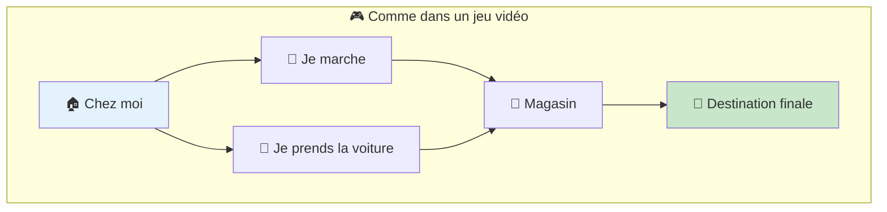

**Les 4 éléments magiques :**

1. **🏠 Où je suis maintenant** (l'état de départ)
   - Exemple : "Je suis à la maison"

2. **🎯 Où je veux arriver** (l'état final)
   - Exemple : "Je veux être au cinéma"

3. **🚶 Ce que je peux faire** (les actions possibles)
   - Exemple : marcher, prendre le bus, appeler un taxi

4. **💰 Combien ça coûte** (le prix de chaque action)
   - Exemple : marcher = gratuit, bus = 2€, taxi = 15€

### 📱 Exemple 1 : Votre GPS qui vous guide

**La situation :** Vous voulez aller de votre maison au restaurant.

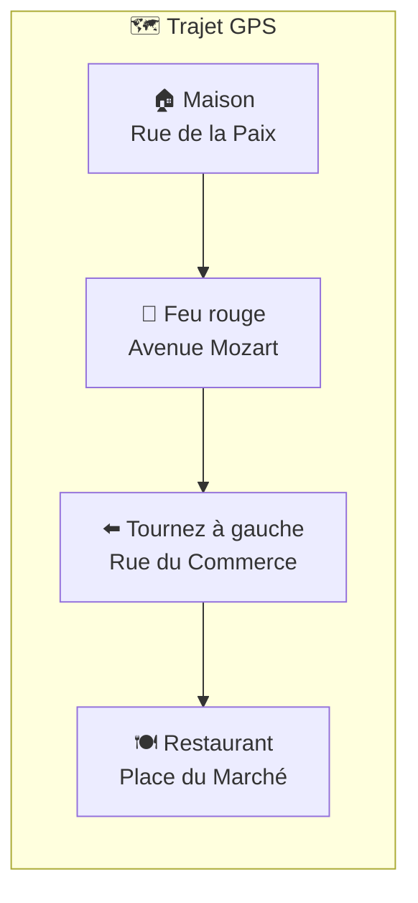

**Ce que fait votre GPS :**
- **Point de départ** : Votre adresse actuelle
- **Point d'arrivée** : L'adresse du restaurant
- **Actions possibles** : Tout droit, tourner à gauche, tourner à droite, faire demi-tour
- **Critère** : Le chemin le plus rapide (ou le plus court)

### 🧩 Exemple 2 : Résoudre un puzzle

**La situation :** Vous avez un puzzle mélangé et vous voulez le remettre en ordre.

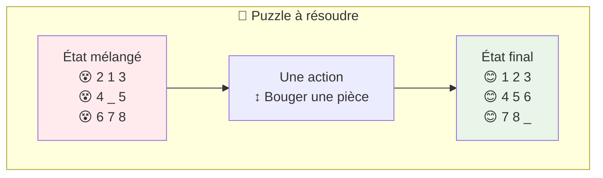

**Ce qu'il faut faire :**
- **État de départ** : Puzzle mélangé
- **État final** : Puzzle résolu
- **Actions possibles** : Faire glisser une pièce dans l'espace vide
- **Objectif** : Résoudre en un minimum de mouvements

### 🏰 Exemple 3 : Jeu vidéo d'aventure

**La situation :** Vous êtes un héros qui doit sauver la princesse.

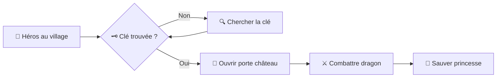

**Les règles du jeu :**
- **État de départ** : Héros au village, pas de clé, princesse prisonnière
- **État final** : Princesse sauvée
- **Actions possibles** : Se déplacer, ramasser objets, combattre, utiliser objets
- **Contraintes** : Il faut la clé pour ouvrir la porte !

### 🎯 Pourquoi c'est important de comprendre ça ?

**Tous ces problèmes ont la même structure :**

1. **🎬 Un point de départ** (où on est maintenant)
2. **🏁 Un ou plusieurs points d'arrivée** (où on veut aller)
3. **🎮 Des actions possibles** (ce qu'on peut faire à chaque étape)
4. **📏 Un critère de qualité** (qu'est-ce qui fait une "bonne" solution)

**La magie de l'informatique :** Une fois qu'on a traduit notre problème dans cette forme, on peut utiliser les mêmes algorithmes pour :
- 🗺️ Calculer un itinéraire
- 🧩 Résoudre un puzzle
- 🤖 Faire bouger un robot
- 🎲 Gagner à un jeu
- 📊 Optimiser un planning

**Le message principal :** Même si les problèmes semblent très différents, ils suivent tous le même schéma ! C'est pour ça qu'on peut utiliser les mêmes "recettes" (algorithmes) pour les résoudre.

#### 2. Recherche combinatoire : Résoudre des puzzles géants

**L'idée simple** : Imaginez que vous devez choisir la meilleure option parmi des millions de possibilités. C'est exactement ce qu'est la recherche combinatoire !

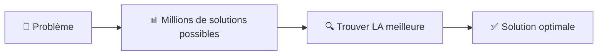

**Pourquoi c'est difficile ?**
- Il y a trop de possibilités à vérifier une par une
- Le nombre de solutions explose très vite (10 villes = 181,000 trajets possibles !)
- Il faut être malin pour ne pas perdre des années à calculer

### 🚗 Exemple 1 : Le livreur et ses tournées (TSP)

**Le problème en français simple :**
Un livreur doit visiter 5 clients et revenir à son dépôt. Quel est le chemin le plus court ?

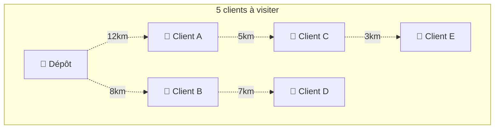

**Pourquoi c'est compliqué :**
- Avec 5 clients, il y a 120 trajets différents possibles
- Avec 10 clients, il y a 3,628,800 trajets !
- Avec 20 clients, votre ordinateur mettrait des milliards d'années

**Solutions pratiques :**
1. **Méthode du plus proche voisin** : "Je vais toujours au client le plus proche"
   - ✅ Très rapide à calculer
   - ❌ Pas forcément le meilleur chemin

2. **Amélioration par échanges** : "J'essaie d'échanger 2 clients dans mon trajet"
   - ✅ Améliore une solution existante
   - ✅ Marche bien en pratique

**Utilisé dans la vraie vie :**
- 📦 Amazon pour optimiser les livraisons
- 🚛 Entreprises de transport
- 🔧 Maintenance d'équipements
- 🏭 Robots dans les usines

### 🎨 Exemple 2 : Colorier une carte sans conflit

**Le problème en français simple :**
Vous devez colorier une carte où chaque région voisine doit avoir une couleur différente. Combien de couleurs minimum vous faut-il ?

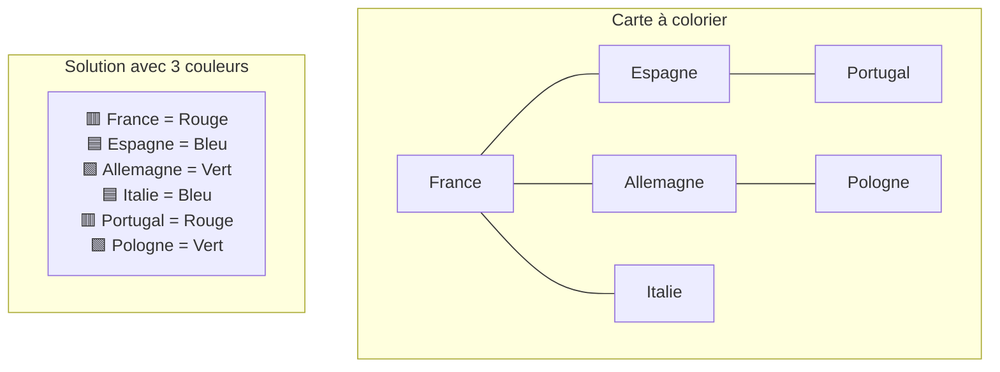

**Règle simple :** Deux pays qui se touchent ne peuvent pas avoir la même couleur.

**Méthode de résolution :**
1. Prendre le premier pays → lui donner la couleur 1
2. Prendre le pays suivant → lui donner la première couleur possible
3. Répéter jusqu'à la fin

**Utilisé dans la vraie vie :**
- 📅 Planning des cours (2 cours au même créneau = conflit)
- 📡 Attribution des fréquences radio
- 🏥 Planning des médecins dans un hôpital
- 🎮 Sudoku (version complexe du coloriage)

### ⚙️ Exemple 3 : Organiser des tâches sur des machines

**Le problème en français simple :**
Vous avez 4 tâches à faire sur 2 machines. Comment les organiser pour finir le plus vite possible ?

```mermaid
gantt
    title Mauvaise organisation vs Bonne organisation
    dateFormat X
    axisFormat %s
    
    section Machine 1 (mauvais)
    Tâche A (3h) :0, 3
    Tâche C (2h) :3, 2
    Attente      :5, 1
    
    section Machine 2 (mauvais)
    Attente      :0, 2
    Tâche B (4h) :2, 4
    
    section Machine 1 (bon)
    Tâche A (3h) :crit, 6, 3
    Tâche D (1h) :9, 1
    
    section Machine 2 (bon)  
    Tâche B (4h) :6, 4
    Tâche C (2h) :10, 2
```

**L'objectif :** Finir toutes les tâches le plus rapidement possible.

**Stratégies simples :**
1. **Les plus longues d'abord** : Commence par les tâches qui prennent le plus de temps
2. **Équilibrer les machines** : Évite qu'une machine soit inactive trop longtemps
3. **Respecter les priorités** : Certaines tâches doivent être faites avant d'autres

**Utilisé dans la vraie vie :**
- 🏭 Chaînes de production en usine
- 💻 Répartition des calculs sur plusieurs processeurs
- 🏥 Planning des opérations chirurgicales
- 🚛 Organisation des équipes de transport

### 🎯 Le message principal

**Ces problèmes ont tous le même défi :**
- Beaucoup trop de possibilités pour tout essayer
- Il faut trouver des "raccourcis intelligents"
- On accepte parfois une très bonne solution plutôt que LA solution parfaite

**Techniques générales :**
1. **Commencer par une solution simple** (même si elle n'est pas parfaite)
2. **L'améliorer petit à petit** en faisant de petits changements
3. **Utiliser son bon sens** et des règles pratiques
4. **Arrêter quand c'est assez bien** plutôt que de chercher la perfection

C'est exactement ce que font les algorithmes modernes : ils sont malins plutôt que brutaux !

## 🧭 Maintenant, découvrons les "recettes" concrètes !

Bon, maintenant que vous comprenez le principe général (partir d'un état, faire des actions, arriver au but), il est temps de voir **comment** l'ordinateur explore toutes ces possibilités.

**Imaginez que vous cherchez vos clés perdues dans votre maison** 🔑

Il y a plusieurs stratégies possibles :
1. **🌊 Méthode "vague d'eau"** : Chercher pièce par pièce, étage par étage
2. **⬇️ Méthode "tunnel"** : Fouiller complètement une pièce avant de passer à la suivante
3. **🧭 Méthode "GPS"** : Utiliser des indices pour aller directement vers la bonne pièce

Ces 3 approches correspondent exactement aux 3 grandes familles d'algorithmes de recherche !

### 🎯 Pourquoi commencer par les algorithmes "aveugles" ?

Les algorithmes **"non informés"** (ou "aveugles") ne connaissent rien sur le problème à part :
- ✅ L'état actuel
- ✅ Les actions possibles  
- ✅ Comment reconnaître la solution

Ils n'ont **aucune information** sur la direction à prendre. C'est comme chercher ses clés **sans aucun indice** !

**Pourquoi apprendre ça en premier ?**
- 🎯 Plus simple à comprendre
- 🧱 Base de tous les autres algorithmes
- 💡 Montre clairement les avantages/inconvénients de chaque approche
- 🛠️ Utilisés en pratique dans de nombreux cas

---

## 🌊 Algorithme 1 : La "vague d'eau" (Recherche en largeur - BFS)

### 🏠 L'analogie simple : Chercher ses clés comme une vague

**Imaginez que vous cherchez vos clés perdues dans votre maison :**

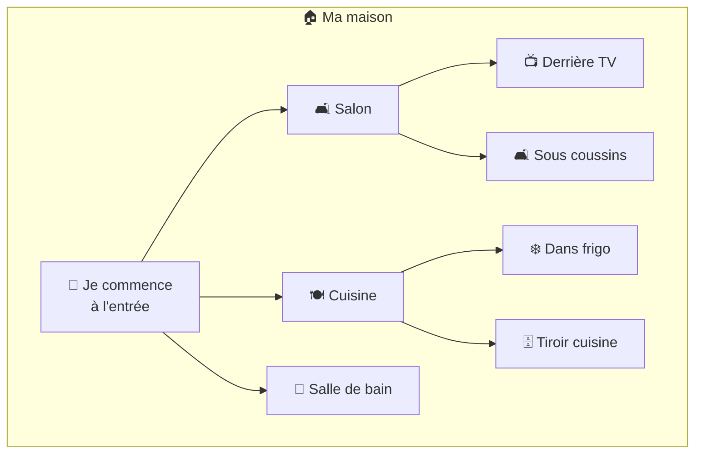

**La stratégie "vague d'eau" :**
1. 🎯 Je regarde d'abord **toutes** les pièces du rez-de-chaussée
2. 🎯 Puis **toutes** les pièces du 1er étage  
3. 🎯 Puis **toutes** les pièces du 2ème étage
4. ✅ Je trouve forcément mes clés !

### 🤔 Pourquoi cette méthode est intelligente ?

**✅ Avantages :**
- **📏 Distance minimale garantie** : Si mes clés sont au rez-de-chaussée, je ne perds pas de temps à monter au 2ème étage !
- **✅ Succès garanti** : Je finirai forcément par les trouver
- **📊 Systématique** : Je ne peux pas "oublier" une pièce

**❌ Inconvénients :**
- **🧠 Mémoire** : Je dois me rappeler de TOUTES les pièces déjà visitées
- **⏱️ Lenteur** : Si mes clés sont au 3ème étage, ça va prendre du temps...

### 🔍 Comment ça marche concrètement ?

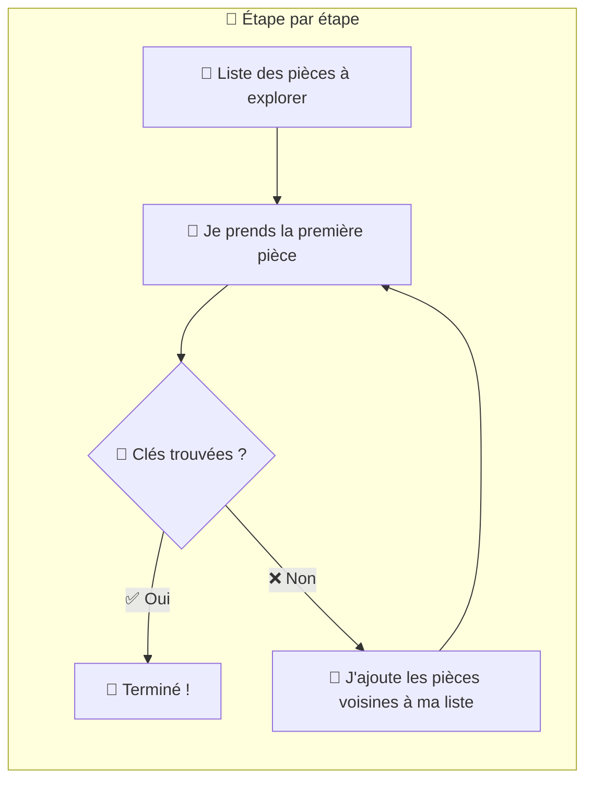

**Exemple concret :**
- **Tour 1** : J'explore l'entrée → J'ajoute salon, cuisine, salle de bain à ma liste
- **Tour 2** : J'explore salon → J'ajoute derrière TV, sous coussins à ma liste  
- **Tour 3** : J'explore cuisine → J'ajoute frigo, tiroir à ma liste
- **Tour 4** : J'explore salle de bain → Mes clés sont là ! 🎉

### 🎮 Pourquoi on appelle ça "Breadth-First Search" (BFS) ?

- **"Breadth"** = Largeur → On explore en **largeur** d'abord
- **"First"** = D'abord → Avant d'aller plus **profond**

C'est comme une vague qui s'étend de plus en plus loin !

---

### 💻 Version technique pour les curieux

Maintenant que vous comprenez le principe, voici comment l'ordinateur fait ça précisément :

### 1. Recherche en largeur (BFS) - Analyse approfondie

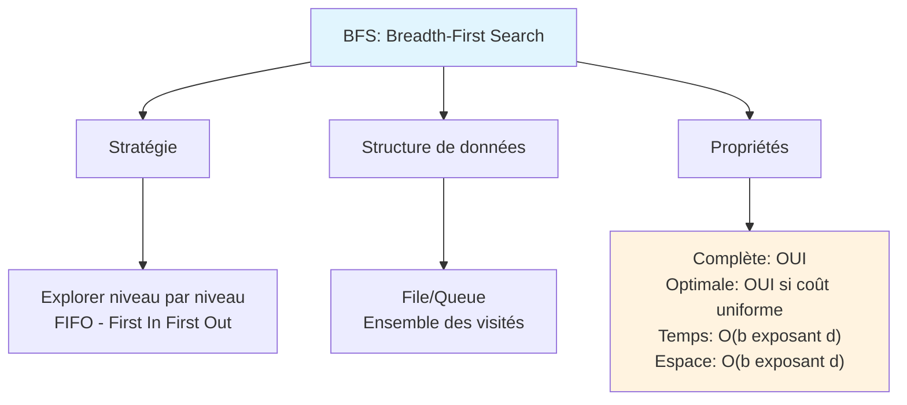

**Principe détaillé** : Explorer systématiquement niveau par niveau depuis la racine.

**Avantages spécifiques** :

- **Complétude garantie** : Trouve toujours une solution si elle existe (espace fini)
- **Optimalité** : Trouve la solution la plus courte en nombre d'étapes (coût uniforme)
- **Prévisibilité** : Comportement déterministe et analysable
- **Parallélisation** : Facilement parallélisable par niveau

**Inconvénients et limitations** :

- **Explosion mémoire** : O(b^d) peut devenir prohibitif rapidement
- **Lenteur en profondeur** : Inefficace si la solution est très profonde
- **Coût uniforme requis** : Non optimal si les actions ont des coûts différents
- **Pas de guidage** : N'utilise aucune information sur la direction du but

**Cas d'usage optimaux** :

- **Puzzles simples** : 8-puzzle, 15-puzzle avec solutions peu profondes
- **Graphes sociaux** : Trouver le plus court chemin entre personnes
- **Réseaux** : Routage avec nombre minimal de sauts
- **Jeux** : Résolution de niveaux avec solutions courtes garanties

**Problèmes fréquents** :

- **Out of Memory** : Avec facteur de branchement > 10 et profondeur > 6
- **Thrashing** : Accès mémoire chaotiques avec grandes structures
- **Redondance** : Exploration d'états équivalents par différents chemins

**Optimisations pratiques** :

```python
# Optimisation mémoire avec générateurs
def bfs_optimized(problem):
    visited = set()
    queue = deque([initial_node])
    
    # Éviter les doublons dans la queue même
    in_queue = {initial_state}
    
    while queue:
        node = queue.popleft()
        in_queue.remove(node.state)
        
        if node.state in visited:
            continue
            
        visited.add(node.state)
        # ... rest of algorithm
```

### 2. Recherche en profondeur (DFS) - Analyse approfondie

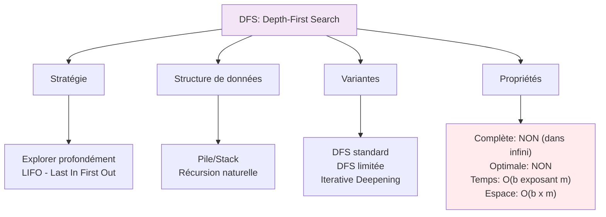

**Principe détaillé** : Explorer une branche complètement avant de revenir en arrière (backtracking).

**Avantages spécifiques** :

- **Mémoire linéaire** : O(bm) beaucoup plus gérable que BFS
- **Solutions profondes** : Excellente pour problèmes avec solutions loin de la racine
- **Implémentation simple** : Récursion naturelle, code élégant
- **Bon pour énumération** : Parcourir tous les états possibles

**Inconvénients et limitations** :

- **Cycles infinis** : Peut boucler indéfiniment sans détection de cycles
- **Non optimale** : Trouve une solution, pas forcément la meilleure
- **Incomplète** : Peut ne jamais trouver de solution (espaces infinis)
- **Dépendance à l'ordre** : Performance très variable selon ordre d'exploration

**Cas d'usage optimaux** :

- **Backtracking** : N-reines, Sudoku, coloration de graphes
- **Génération exhaustive** : Toutes les permutations, combinaisons
- **Arbres de décision** : Quand toutes les branches doivent être explorées
- **Détection de cycles** : Dans les graphes (avec marquage)

**Variantes spécialisées** :

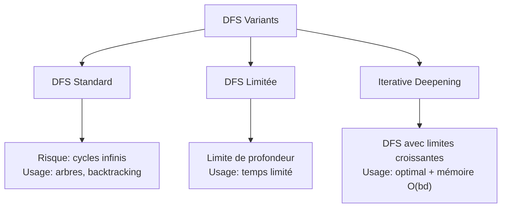

**Problèmes fréquents et solutions** :

```python
# Problème: Stack Overflow avec récursion profonde
# Solution: Implémentation itérative
def dfs_iterative(problem):
    stack = [initial_node]
    visited = set()
    
    while stack:
        node = stack.pop()
        if node.state in visited:
            continue
        visited.add(node.state)
        
        for child in expand(node):
            if child.state not in visited:
                stack.append(child)
```

---

## ⬇️ Algorithme 2 : Le "tunnel" (Recherche en profondeur - DFS)

### 🏠 L'analogie simple : Chercher ses clés comme un explorateur de grottes

**Revenons à nos clés perdues, mais avec une stratégie différente :**

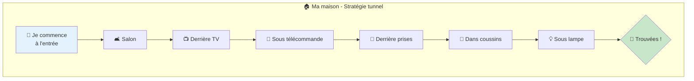

**La stratégie "tunnel" :**
1. 🎯 J'entre dans le salon
2. 🎯 Je fouille **complètement** derrière la TV
3. 🎯 Si pas trouvé, je fouille **complètement** la télécommande  
4. 🎯 Si pas trouvé, je fouille **complètement** derrière les prises
5. 🎯 Je continue jusqu'au bout de cette "branche", puis je reviens en arrière

### 🤔 Pourquoi cette méthode est intelligente ?

**✅ Avantages :**
- **🧠 Mémoire économe** : Je n'ai besoin de me rappeler que du "chemin" que je suis en train de suivre
- **⚡ Peut être très rapide** : Si mes clés sont cachées profondément quelque part, je peux tomber dessus rapidement !
- **🔄 Simple à programmer** : Très naturel avec la récursion

**❌ Inconvénients :**  
- **🌀 Risque de boucle** : Je peux tourner en rond si je ne fais pas attention !
- **❌ Pas forcément optimal** : Je peux trouver mes clés au 3ème étage alors qu'elles étaient dans l'entrée...
- **🎲 Dépend de la chance** : Si je commence par la mauvaise direction, ça peut prendre très longtemps

### 🔍 Comment ça marche concrètement ?

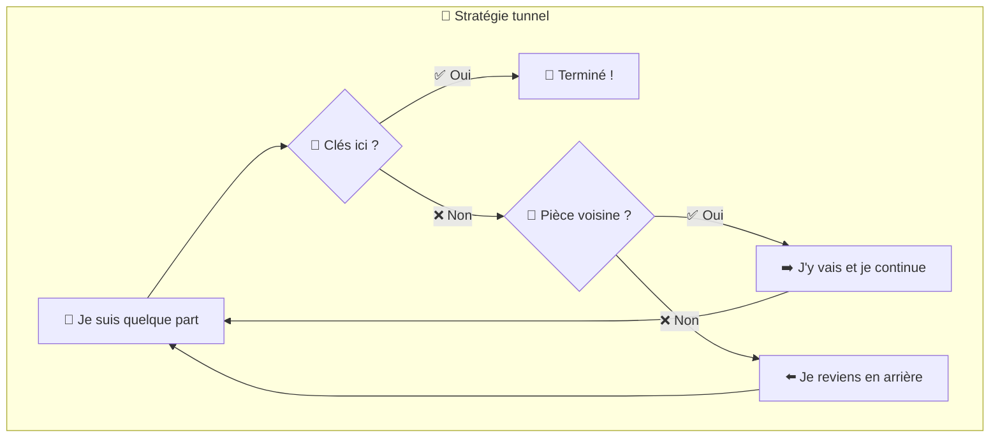

**Exemple concret :**
- **Étape 1** : Entrée → Salon (je choisis le salon)
- **Étape 2** : Salon → Derrière TV (je m'enfonce)
- **Étape 3** : Derrière TV → Sous télécommande (je continue à m'enfoncer)
- **Étape 4** : Sous télécommande → Pas trouvé, je reviens
- **Étape 5** : Derrière TV → Derrière prises (j'essaie autre chose au même niveau)
- **Etc...**

### 🎮 Pourquoi on appelle ça "Depth-First Search" (DFS) ?

- **"Depth"** = Profondeur → On va le plus **profond** possible
- **"First"** = D'abord → Avant d'essayer autre chose

C'est comme un spéléologue qui explore une grotte jusqu'au bout !

### 🆚 DFS vs BFS : Quelle différence ?

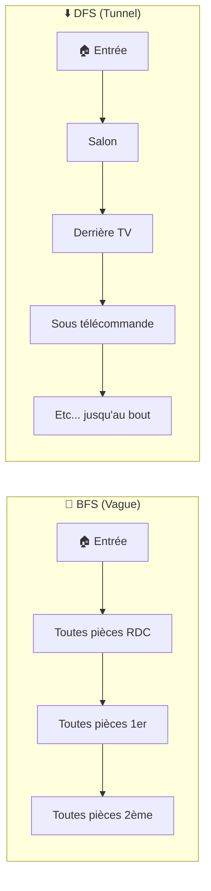

**Analogie simple :**
- **BFS** = comme remplir une piscine 🏊‍♂️ (l'eau monte niveau par niveau)
- **DFS** = comme creuser un puits ⛏️ (on va profond en premier)

---

### 💻 Version technique pour les curieux

### 2. Recherche en profondeur (DFS) - Analyse approfondie

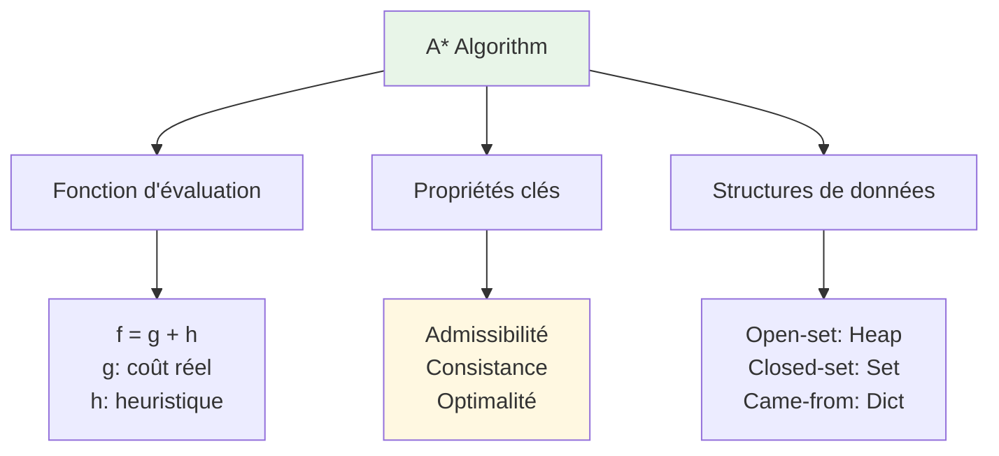

**Principe détaillé** : Recherche informée utilisant une heuristique admissible pour guider l'exploration vers le but.

**Avantages spécifiques** :

- **Optimale garantie** : Avec heuristique admissible, trouve toujours le chemin optimal
- **Efficacité dirigée** : Guide l'exploration vers le but, évite les détours inutiles
- **Flexible** : S'adapte à différents domaines via l'heuristique
- **Théoriquement optimal** : Développe le minimum de nœuds nécessaires (optimalité relative)

**Inconvénients et limitations** :

- **Dépendance heuristique** : Performance directement liée à la qualité de h(n)
- **Mémoire élevée** : Doit maintenir tous les nœuds dans l'open-set
- **Coût computationnel** : Calcul d'heuristique + gestion de structures complexes
- **Pas de garantie temporelle** : Peut être très lent avec heuristiques pauvres

**Analyse de complexité détaillée** :

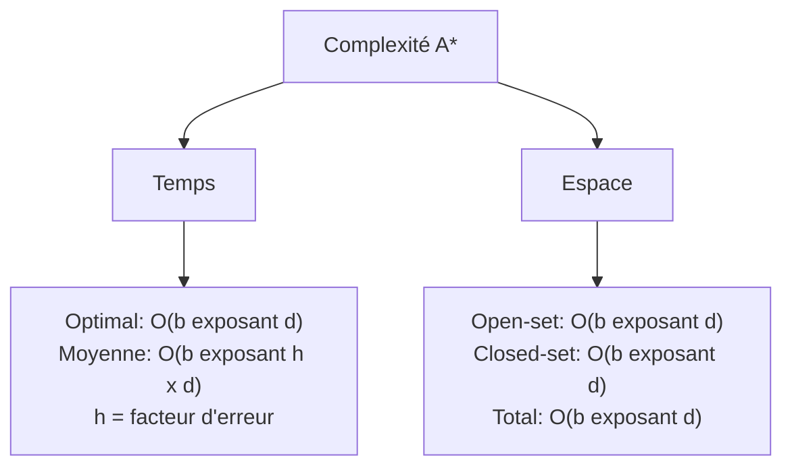

**Cas d'usage optimaux** :

- **Navigation GPS** : Avec heuristique distance euclidienne
- **Jeux vidéo** : Pathfinding NPCs avec obstacles
- **Robotique** : Planification de mouvement avec contraintes
- **Réseaux** : Routage optimal avec métriques de coût

**Problèmes courants et solutions** :

```python
# Problème: Tie-breaking sous-optimal
# Solution: Préférer nœuds avec g plus élevé
def tie_breaking_heuristic(node, goal):
    h = manhattan_distance(node, goal)
    # Légère préférence pour chemins plus longs
    return h + 0.001 * node.g

# Problème: Reopen de nœuds fermés
# Solution: Vérifier si nouveau chemin est meilleur
if neighbor in closed_set:
    if tentative_g < g_score[neighbor]:
        closed_set.remove(neighbor)
        # Réinsérer dans open_set avec nouveau score
```

### 4. Recherche locale (Hill Climbing) - Analyse approfondie

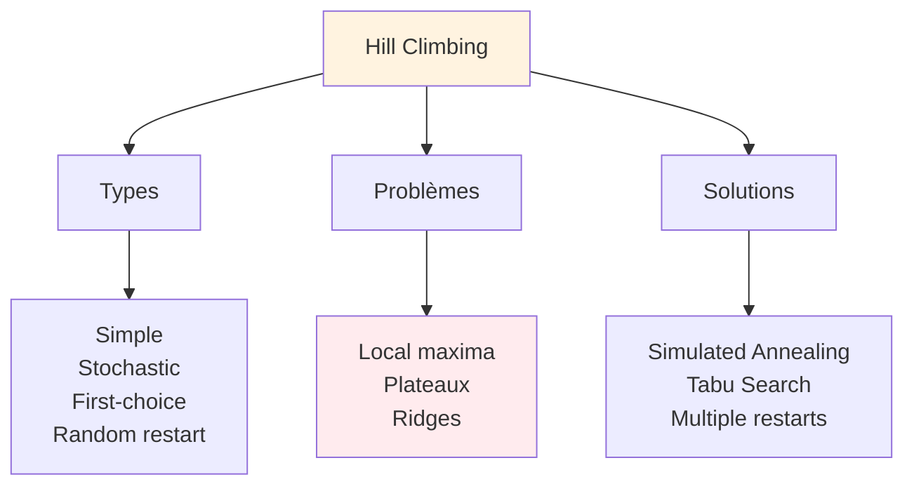

**Principe détaillé** : Partir d'une solution et l'améliorer itérativement en choisissant toujours le meilleur voisin.

**Avantages spécifiques** :

- **Simplicité extrême** : Algorithme intuitif et facile à implémenter
- **Mémoire constante** : Ne garde que la solution courante
- **Rapidité** : Convergence rapide vers optimum local
- **Polyvalence** : Applicable à tout problème avec voisinage défini

**Inconvénients et limitations** :

- **Optima locaux** : Se bloque sur solutions sous-optimales
- **Pas de backtracking** : Ne peut pas revenir en arrière
- **Dépendance à l'initial** : Résultat très variable selon point de départ
- **Plateaux** : Progression impossible sur zones plates

**Types et leurs caractéristiques** :

```python
# Simple Hill Climbing - déterministe
def simple_hill_climbing(problem):
    current = random_state()
    while True:
        neighbor = best_neighbor(current)
        if value(neighbor) <= value(current):
            return current
        current = neighbor

# Stochastic - choix probabiliste parmi améliorations
def stochastic_hill_climbing(problem):
    current = random_state()
    while True:
        neighbors = get_improving_neighbors(current)
        if not neighbors:
            return current
        current = random.choice(neighbors)
```

**Stratégies d'amélioration** :

- **Random Restart** : Multiples exécutions depuis points différents
- **Tabu Search** : Éviter de revisiter récentes solutions
- **Variable Neighborhood** : Changer de voisinage quand bloqué

### 5. Recuit Simulé (Simulated Annealing) - Analyse approfondie

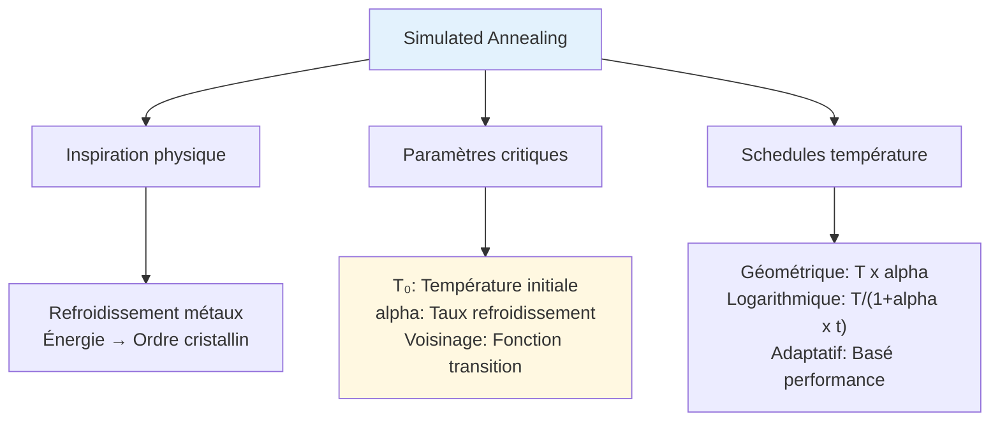

**Principe détaillé** : Accepter des dégradations temporaires avec probabilité décroissante pour échapper aux optima locaux.

**Avantages spécifiques** :

- **Échappement garanti** : Peut sortir des optima locaux contrairement à Hill Climbing
- **Convergence théorique** : Avec schedule approprié, converge vers optimum global
- **Simplicité relative** : Plus simple que les méta-heuristiques populationnelles
- **Contrôle fin** : Paramètres permettent ajustement précis du comportement

**Inconvénients et limitations** :

- **Réglage délicat** : Paramètres T₀ et α critiques pour performance
- **Pas de garantie temps** : Convergence peut être très lente
- **Voisinage crucial** : Qualité dépend fortement de la fonction de transition
- **Stochastique** : Résultats variables entre exécutions

**Réglage pratique des paramètres** :

```python
# Estimation T₀: accepter ~80% des mauvais mouvements initialement
def estimate_initial_temperature(problem, sample_size=100):
    current = random_solution()
    deltas = []
    
    for _ in range(sample_size):
        neighbor = random_neighbor(current)
        delta = cost(neighbor) - cost(current)
        if delta > 0:
            deltas.append(delta)
        current = neighbor
    
    # T₀ tel que exp(-avg_delta/T₀) = 0.8
    avg_delta = sum(deltas) / len(deltas)
    return -avg_delta / math.log(0.8)
```

**Schedules de refroidissement avancés** :

```mermaid
graph LR
    A[Cooling Schedules] --> B[Géométrique]
    A --> C[Logarithmique]  
    A --> D[Adaptatif]
    
    B --> B1["T = T₀ x alpha exposant t<br/>alpha ∈ [0.8, 0.99]"]
    C --> C1["T = T₀ / (1 + alpha x t)<br/>Plus lent"]
    D --> D1["Ajuste selon<br/>taux acceptation"]
```

### 6. Algorithmes Génétiques - Analyse approfondie

```mermaid
flowchart TD
    A[Genetic Algorithms] --> B[Composants]
    A --> C[Opérateurs]
    A --> D[Paramètres]
    
    B --> B1[Population<br/>Fitness<br/>Sélection<br/>Reproduction]
    C --> C1[Crossover<br/>Mutation<br/>Sélection survivants]
    D --> D1[Taille population<br/>Taux crossover<br/>Taux mutation<br/>Générations]
    
    style A fill:#f1f8e9
    style D1 fill:#fff3e0
```

**Principe détaillé** : Évolution d'une population de solutions par sélection, croisement et mutation.

**Avantages spécifiques** :

- **Exploration globale** : Population diverse évite les optima locaux
- **Parallélisme naturel** : Évaluation fitness et opérateurs parallélisables
- **Pas de gradient requis** : Fonctionne sur espaces discrets et discontinus
- **Robustesse** : Résistant au bruit et aux espaces multimodaux

**Inconvénients et limitations** :

- **Nombreux paramètres** : Réglage délicat de tous les hyperparamètres
- **Convergence lente** : Peut nécessiter many générations
- **Pas de garantie** : Aucune garantie d'optimalité ou même d'amélioration
- **Représentation critique** : Encodage doit être adapté au problème

**Opérateurs spécialisés par type de problème** :

```mermaid
graph TD
    A[Problème] --> B[TSP - Permutations]
    A --> C[Optimisation continue]
    A --> D[Problèmes binaires]
    
    B --> B1[PMX, OX, CX<br/>Inversion, Swap]
    C --> C1["BLX-alpha, SBX<br/>Gaussian mutation"]
    D --> D1[Uniform, N-point<br/>Bit flip]
```

**Réglage des paramètres** :

```python
# Règles empiriques courantes
population_size = min(100, 4 * problem_dimension)
crossover_rate = 0.7  # 70% des individus se reproduisent
mutation_rate = 1.0 / chromosome_length  # ~1 bit par individu
selection_pressure = 2.0  # dans tournament selection

# Adaptation dynamique
def adaptive_mutation_rate(generation, max_generations):
    # Forte mutation au début, faible à la fin
    return 0.1 * (1 - generation / max_generations) + 0.01
```

**Algorithmes hybrides (Memetic)** :

```python
# Combinaison GA + recherche locale
def memetic_algorithm(problem):
    population = initialize_population()
    
    for generation in range(max_generations):
        # Phase génétique classique
        offspring = genetic_operations(population)
        
        # Phase recherche locale sur les meilleurs
        for individual in best_n(offspring, local_search_ratio):
            individual = local_search(individual)  # 2-opt, hill climbing, etc.
        
        population = select_survivors(population + offspring)
    
    return best_individual(population)
```

**Pseudocode** :
```python
from collections import deque

def bfs(probleme):
    """
    Recherche en largeur d'abord
    
    Args:
        probleme: Objet problème avec méthodes:
            - etat_initial: état de départ
            - est_but(etat): test si état est solution
            - actions(etat): actions possibles depuis l'état
            - resultat(etat, action): nouvel état après action
    
    Returns:
        Chemin vers la solution ou None si pas de solution
    """
    noeud_initial = Noeud(probleme.etat_initial)
    
    if probleme.est_but(noeud_initial.etat):
        return noeud_initial.chemin()
    
    frontiere = deque([noeud_initial])  # File FIFO
    explore = set()
    
    while frontiere:
        noeud = frontiere.popleft()
        explore.add(noeud.etat)
        
        for action in probleme.actions(noeud.etat):
            enfant = noeud.enfant(probleme, action)
            
            if enfant.etat not in explore and enfant not in frontiere:
                if probleme.est_but(enfant.etat):
                    return enfant.chemin()
                frontiere.append(enfant)
    
    return None  # Pas de solution trouvée

class Noeud:
    """Nœud dans l'arbre de recherche"""
    def __init__(self, etat, parent=None, action=None, cout_chemin=0):
        self.etat = etat
        self.parent = parent
        self.action = action
        self.cout_chemin = cout_chemin
        self.profondeur = 0 if parent is None else parent.profondeur + 1
    
    def enfant(self, probleme, action):
        """Crée un nœud enfant en appliquant une action"""
        nouvel_etat = probleme.resultat(self.etat, action)
        cout = self.cout_chemin + probleme.cout_action(self.etat, action)
        return Noeud(nouvel_etat, self, action, cout)
    
    def chemin(self):
        """Retourne le chemin depuis la racine"""
        noeud, chemin = self, []
        while noeud:
            chemin.append(noeud.action)
            noeud = noeud.parent
        return list(reversed(chemin))[1:]  # Exclut None initial

# Exemple d'utilisation : Puzzle 8
class Puzzle8:
    def __init__(self, etat_initial, etat_but):
        self.etat_initial = tuple(etat_initial)
        self.etat_but = tuple(etat_but)
    
    def est_but(self, etat):
        return etat == self.etat_but
    
    def actions(self, etat):
        """Actions possibles : déplacer la case vide"""
        actions = []
        pos_vide = etat.index(0)
        ligne, col = pos_vide // 3, pos_vide % 3
        
        if ligne > 0: actions.append('HAUT')
        if ligne < 2: actions.append('BAS')
        if col > 0: actions.append('GAUCHE')
        if col < 2: actions.append('DROITE')
        
        return actions
    
    def resultat(self, etat, action):
        """Applique l'action et retourne le nouvel état"""
        etat = list(etat)
        pos_vide = etat.index(0)
        ligne, col = pos_vide // 3, pos_vide % 3
        
        if action == 'HAUT':
            nouvelle_pos = (ligne - 1) * 3 + col
        elif action == 'BAS':
            nouvelle_pos = (ligne + 1) * 3 + col
        elif action == 'GAUCHE':
            nouvelle_pos = ligne * 3 + (col - 1)
        elif action == 'DROITE':
            nouvelle_pos = ligne * 3 + (col + 1)
        
        # Échange case vide avec case adjacente
        etat[pos_vide], etat[nouvelle_pos] = etat[nouvelle_pos], etat[pos_vide]
        return tuple(etat)
    
    def cout_action(self, etat, action):
        return 1  # Coût uniforme

# Test sur un puzzle simple
puzzle = Puzzle8(
    etat_initial=[1, 2, 3, 4, 0, 5, 6, 7, 8],
    etat_but=[1, 2, 3, 4, 5, 0, 6, 7, 8]
)

solution = bfs(puzzle)
print("Solution trouvée:", solution)
# Sortie: ['DROITE', 'BAS']
```

### Diagramme et intuition BFS vs DFS

```mermaid
flowchart LR
    subgraph BFS[Recherche en largeur - BFS]
        A1[Start] --> B1[Niveau 1]
        B1 --> C1[Niveau 2]
        C1 --> D1[Goal]
    end
    subgraph DFS[Recherche en profondeur - DFS]
        A2[Start] --> B2[Branche A]
        B2 --> C2[Branche A profonde]
        C2 --> D2[Goal possible profond]
    end
    classDef startend fill:#eef,stroke:#333;
    class A1,A2,D1,D2 startend;
```

Explication :
- BFS explore par couches : utile pour trouver le chemin le plus court en nombre d'actions. Mémoire élevée.
- DFS plonge profond dans une branche : faible mémoire mais risque d'entrer dans des boucles ou de manquer une solution peu profonde.

Cas pratiques et astuces :
- Utiliser BFS quand la profondeur de la solution est faible et le facteur de branchement raisonnable.
- Utiliser DFS (avec visite) ou DFS limitée quand la profondeur est élevée mais la mémoire est contrainte.
- Pour espaces infinis ou avec cycles, toujours garder un ensemble d'états visités ou appliquer une limite de profondeur.

### 2. Recherche en profondeur (DFS)

**Principe** : Explorer une branche complètement avant de revenir en arrière.

**Avantages** :
- Mémoire linéaire O(bm) où m = profondeur maximale
- Peut trouver des solutions rapidement si elles sont profondes

**Inconvénients** :
- Non optimale
- Peut boucler infiniment
- Mauvaise performance si la solution est proche de la racine

### 3. Recherche en profondeur limitée

Variante de DFS avec une limite de profondeur pour éviter les boucles infinies.

## Algorithmes de recherche informée (heuristique)

### 1. Recherche gourmande (Greedy)

Utilise une fonction heuristique h(n) qui estime le coût du nœud n vers le but.

**Avantages** :
- Rapide et économe en mémoire
- Efficace quand l'heuristique est bonne

**Inconvénients** :
- Non optimale
- Incomplète (peut se coincer dans des impasses)

---

## 🧭 Algorithme 3 : Le "GPS intelligent" (Algorithme A*)

### 🏠 L'analogie simple : Chercher ses clés avec des indices

**Revenons encore à nos clés perdues, mais cette fois avec une approche plus maligne :**

Imaginez que vous avez un **détecteur de clés** qui bipte plus fort quand vous vous rapprochez ! 🔊

```mermaid
graph TD
    subgraph "🏠 Ma maison avec détecteur"
        A[🚪 Entrée<br/>🔊 Bip faible] 
        A --> B[🛋️ Salon<br/>🔊🔊 Bip moyen]
        A --> C[🍽️ Cuisine<br/>🔊 Bip faible]  
        B --> D[📺 Derrière TV<br/>🔊🔊🔊 Bip fort]
        D --> E[🔑 MES CLÉS !<br/>🔊🔊🔊🔊 TRÈS FORT]
    end
    
    style A fill:#e3f2fd
    style E fill:#c8e6c9
```

**La stratégie "GPS intelligent" :**
1. 🎯 Je commence comme BFS, mais...
2. 🧭 **Au lieu d'explorer au hasard, je privilégie les directions où le détecteur bipe le plus fort !**
3. 🎯 Je combine : "distance parcourue" + "signal du détecteur"
4. ✅ J'arrive plus vite au bon endroit !

### 🤔 Pourquoi cette méthode est géniale ?

**✅ Avantages :**
- **📏 Optimal comme BFS** : Trouve toujours le chemin le plus court !
- **🚀 Plus rapide que BFS** : Évite d'explorer dans les mauvaises directions
- **🧭 Utilise l'intelligence** : Exploite les informations disponibles sur le problème
- **⚖️ Équilibre parfait** : Combine systematic (BFS) + guidage intelligent

**❌ Inconvénients :**
- **🧠 Plus complexe** : Il faut programmer le "détecteur" (heuristique)
- **🧮 Plus de calculs** : Doit évaluer chaque position
- **🎯 Dépend de la qualité du détecteur** : Si le détecteur ment, ça marche mal !

### 🔍 Comment ça marche concrètement ?

```mermaid
flowchart TD
    subgraph "🎯 A* en action"
        A[📍 Je suis quelque part] --> B["🧮 Je calcule pour chaque voisin :<br/>Distance parcourue + Signal détecteur"]
        B --> C[📊 Je classe tous les voisins]
        C --> D[👑 Je choisis le MEILLEUR voisin]
        D --> E{🔑 Clés trouvées ?}
        E -->|✅ Oui| F[🎉 Terminé !]
        E -->|❌ Non| A
    end
```

**Exemple concret avec des chiffres :**

| Endroit | Distance parcourue | Signal détecteur | **TOTAL** | Décision |
|---------|-------------------|------------------|-----------|----------|
| 🍽️ Cuisine | 3 étapes | 8 (bip faible) | **11** | ❌ |
| 🛋️ Salon | 2 étapes | 4 (bip moyen) | **6** | ✅ **CHOISI !** |
| 🚿 Salle de bain | 2 étapes | 9 (bip faible) | **11** | ❌ |

🎯 **A* choisit toujours le voisin avec le PLUS PETIT total !**

### 🎮 Pourquoi on appelle ça "A-star" (A*) ?

- **A** = Le nom de l'algorithme (comme dans "Algorithm A")
- **\*** = "Star" = ⭐ = **OPTIMAL** = Le meilleur possible !

C'est l'algorithme "étoile" parce qu'il combine le meilleur des deux mondes !

### 🆚 A* vs BFS vs DFS : La comparaison ultime

```mermaid
graph TD
    subgraph "🌊 BFS : Systématique mais aveugle"
        A1[Explore TOUT niveau par niveau<br/>✅ Optimal ❌ Peut être lent]
    end
    
    subgraph "⬇️ DFS : Rapide mais risqué"  
        A2[Va profond directement<br/>✅ Économe ❌ Pas optimal]
    end
    
    subgraph "🧭 A* : Le meilleur des deux !"
        A3[Systématique + Guidage intelligent<br/>✅ Optimal ✅ Rapide ✅ Malin]
    end
    
    style A3 fill:#c8e6c9
```

**Analogie simple :**
- **BFS** = Explorer méthodiquement mais sans réfléchir 🤖
- **DFS** = Foncer au hasard en espérant avoir de la chance 🎲  
- **A*** = Utiliser sa tête ET être méthodique 🧠⭐

### 🔮 Le secret de A* : L'heuristique

**L'heuristique, c'est votre "détecteur de clés" !**

Quelques exemples de "détecteurs" selon le problème :

#### 🗺️ Pour la navigation GPS :
- **Détecteur** : Distance à vol d'oiseau vers la destination
- **Logique** : Plus je suis proche à vol d'oiseau, plus je suis probablement proche par la route

#### 🧩 Pour un puzzle :
- **Détecteur** : Nombre de pièces mal placées
- **Logique** : Moins il y a de pièces mal placées, plus je suis proche de la solution

#### 🎮 Pour un jeu vidéo :
- **Détecteur** : Distance Manhattan vers le trésor  
- **Logique** : Plus je suis proche du trésor, mieux c'est

### 🎯 La règle d'or de A*

**Pour que A* soit optimal, le détecteur ne doit JAMAIS surestimer !**

🚫 **Mauvais détecteur** : "Il reste 2 km" alors qu'il en reste vraiment 5 km
✅ **Bon détecteur** : "Il reste 5 km" alors qu'il en reste vraiment 3 km

**Pourquoi ?** Si le détecteur sous-estime, A* peut ignorer le vrai chemin optimal !

---

### 💻 Version technique pour les curieux

### 2. Algorithme A*

**Fonction d'évaluation** : f(n) = g(n) + h(n)
- g(n) : coût réel du chemin depuis le début
- h(n) : heuristique (estimation du coût vers le but)

**Conditions pour l'optimalité** :
- **Heuristique admissible** : h(n) ≤ h*(n) où h*(n) est le coût réel optimal
- **Heuristique consistante** : h(n) ≤ c(n,a,n') + h(n') pour toute action a

**Exemple d'heuristique** : Distance euclidienne pour la navigation
```
h(n) = racine[(x_but - x_n)² + (y_but - y_n)²]
```

**Implémentation complète d'A*** :

```python
import heapq
import math

class AStar:
    def __init__(self, grille, debut, fin):
        self.grille = grille
        self.debut = debut
        self.fin = fin
        self.lignes = len(grille)
        self.cols = len(grille[0])
    
    def heuristique(self, noeud):
        """Distance euclidienne vers le but"""
        x1, y1 = noeud
        x2, y2 = self.fin
        return math.sqrt((x2 - x1)**2 + (y2 - y1)**2)
    
    def voisins(self, noeud):
        """Retourne les voisins valides d'un nœud"""
        x, y = noeud
        voisins = []
        
        # 8 directions possibles (incluant diagonales)
        directions = [(-1,-1), (-1,0), (-1,1), (0,-1), (0,1), (1,-1), (1,0), (1,1)]
        
        for dx, dy in directions:
            nx, ny = x + dx, y + dy
            
            # Vérifier les limites
            if 0 <= nx < self.lignes and 0 <= ny < self.cols:
                # Vérifier si la case n'est pas un obstacle
                if self.grille[nx][ny] != 1:  # 0 = libre, 1 = obstacle
                    voisins.append((nx, ny))
        
        return voisins
    
    def cout_mouvement(self, actuel, voisin):
        """Coût de déplacement entre deux cases adjacentes"""
        x1, y1 = actuel
        x2, y2 = voisin
        
        # Coût diagonal = racine(2), coût orthogonal = 1
        if abs(x2 - x1) == 1 and abs(y2 - y1) == 1:
            return math.sqrt(2)
        else:
            return 1
    
    def rechercher(self):
        """Algorithme A* principal"""
        # File de priorité : (f_score, noeud)
        frontiere = [(0, self.debut)]
        heapq.heapify(frontiere)
        
        # Dictionnaires pour stocker les scores et chemins
        g_score = {self.debut: 0}  # Coût réel depuis le début
        f_score = {self.debut: self.heuristique(self.debut)}  # f = g + h
        vient_de = {}  # Pour reconstruire le chemin
        explore = set()
        
        while frontiere:
            # Prendre le nœud avec le plus petit f_score
            _, actuel = heapq.heappop(frontiere)
            
            if actuel in explore:
                continue
            
            explore.add(actuel)
            
            # But atteint ?
            if actuel == self.fin:
                return self.reconstruire_chemin(vient_de, actuel)
            
            # Explorer les voisins
            for voisin in self.voisins(actuel):
                if voisin in explore:
                    continue
                
                # Calcul du nouveau g_score
                cout_tentative = g_score[actuel] + self.cout_mouvement(actuel, voisin)
                
                # Si on a trouvé un meilleur chemin vers ce voisin
                if voisin not in g_score or cout_tentative < g_score[voisin]:
                    vient_de[voisin] = actuel
                    g_score[voisin] = cout_tentative
                    f_score[voisin] = cout_tentative + self.heuristique(voisin)
                    
                    # Ajouter à la frontière
                    heapq.heappush(frontiere, (f_score[voisin], voisin))
        
        return None  # Pas de chemin trouvé
    
    def reconstruire_chemin(self, vient_de, actuel):
        """Reconstruit le chemin depuis le début"""
        chemin = [actuel]
        while actuel in vient_de:
            actuel = vient_de[actuel]
            chemin.append(actuel)
        return list(reversed(chemin))

# Exemple d'utilisation
grille = [
    [0, 0, 0, 1, 0],
    [0, 1, 0, 1, 0],
    [0, 1, 0, 0, 0],
    [0, 0, 0, 1, 0],
    [0, 0, 0, 0, 0]
]

astar = AStar(grille, debut=(0, 0), fin=(4, 4))
chemin = astar.rechercher()

if chemin:
    print("Chemin optimal trouvé:")
    for i, (x, y) in enumerate(chemin):
        print(f"Étape {i}: ({x}, {y})")
    print(f"Longueur totale: {len(chemin) - 1} étapes")
else:
    print("Aucun chemin trouvé")

# Sortie exemple:
# Chemin optimal trouvé:
# Étape 0: (0, 0)
# Étape 1: (1, 0)
# Étape 2: (2, 0)
# Étape 3: (3, 0)
# Étape 4: (3, 1)
# Étape 5: (4, 2)
# Étape 6: (4, 3)
# Étape 7: (4, 4)
```

### Diagramme de flux A* (haute-niveau)

```mermaid
flowchart TB
    A[Début] --> B{Frontière non vide}
    B -->|oui| C[Extraire nœud min f]
    C --> D{Noeud = but ?}
    D -->|oui| E[Reconstruire chemin]
    D -->|non| F[Explorer voisins]
    F --> G{Meilleur g?}
    G -->|oui| H[Mettre à jour g,f et ajouter à frontière]
    G -->|non| I[Ignorer]
    H --> B
    I --> B
    B -->|non| J[Échec - pas de chemin]
```


### Admissibilité vs Consistance — intuition et preuve courte

- **Admissibilité** (h(n) ≤ h*(n)) : garantit que l'heuristique ne sous-estime jamais le coût restant. Ainsi, A* retourne un chemin optimal lorsque le but est extrait de l'open-set la première fois.
- **Consistance** (h(n) ≤ c(n,a,n') + h(n')) : plus forte que l'admissibilité ; elle implique que f(n) = g(n)+h(n) est non-décroissante le long de n'importe quel chemin. Quand h est consistante, on n'a pas besoin de réexaminer un nœud fermé.

Esquisse de preuve : si h est admissible, pour tout n, f(n) = g(n) + h(n) ≤ g(n) + h*(n) = coût d'un chemin optimal passant par n. Donc le chemin optimal global ne peut pas être ignoré par A*.

---

## 🔮 Le guide des "détecteurs magiques" (Heuristiques)

Rappelez-vous : A* utilise un "détecteur" pour savoir dans quelle direction aller. En informatique, on appelle ça une **heuristique** !

### 🎯 Pourquoi les heuristiques sont importantes ?

**Imaginez que vous êtes un taxi** 🚕

Sans heuristique (détecteur), vous êtes comme un taxi **aveugle** :
- Vous devez explorer toutes les rues une par une
- Vous ne savez pas si vous vous rapprochez ou vous éloignez du client
- Ça peut prendre des heures pour une course simple !

Avec une bonne heuristique, vous êtes comme un taxi avec **GPS** :
- Vous savez toujours quelle direction prendre
- Vous évitez les détours inutiles  
- Vous arrivez rapidement à destination !

### 🗺️ Les 3 grandes familles de "détecteurs"

```mermaid
graph TD
    subgraph "🔮 Types de détecteurs magiques"
        A[📐 Géométriques<br/>Basés sur la distance] 
        B[🎯 Spécialisés<br/>Basés sur le problème]
        C[🧠 Appris<br/>Basés sur l'expérience]
    end
    
    A --> A1[📏 Distance Manhattan<br/>🗺️ Distance Euclidienne<br/>♔ Distance Chebyshev]
    B --> B1[🧩 Puzzles<br/>🎮 Jeux<br/>📊 Problèmes spécifiques]
    C --> C1[🤖 Intelligence artificielle<br/>📊 Apprentissage automatique]
```

---

## 📐 Famille 1 : Les détecteurs géométriques

Ces détecteurs utilisent la **géométrie simple** pour estimer les distances.

### 🏙️ Détecteur "Manhattan" : Pour les villes en grille

**L'idée simple :** À New York, vous ne pouvez pas voler ! Vous devez suivre les rues qui forment une grille.

```mermaid
graph LR
    subgraph "🗽 Manhattan (New York)"
        A[🏠 Départ<br/>5e Avenue & 14e Rue] --> B[📍 Vous devez aller<br/>2 blocs → Est<br/>3 blocs ↑ Nord]
        B --> C[🎯 Arrivée<br/>7e Avenue & 17e Rue]
    end
```

**Calcul super simple :**
Distance Manhattan = |différence horizontale| + |différence verticale|
= |7-5| + |17-14| = 2 + 3 = **5 blocs**

**Quand l'utiliser ?**
- ✅ Navigation en ville (rues perpendiculaires)
- ✅ Robots qui bougent sur une grille
- ✅ Jeux sur grille (Pac-Man, puzzles)
- ❌ Navigation à vol d'oiseau (avion, bateau)

### 🦅 Détecteur "Euclidien" : Pour voler comme un oiseau

**L'idée simple :** Si vous étiez un oiseau, quelle serait la distance en ligne droite ?

```mermaid
graph LR
    subgraph "🦅 Vol d'oiseau"
        A[🏠 Départ] -.->|ligne droite| C[🎯 Arrivée]
        A --> B["📏 Distance = racine((x₂-x₁)² + (y₂-y₁)²)"]
    end
```

**Exemple concret :**
- Départ : (0, 0)  
- Arrivée : (3, 4)
- Distance = racine((3-0)² + (4-0)²) = racine(9 + 16) = racine(25) = **5 unités**

**Quand l'utiliser ?**
- ✅ Navigation aérienne/maritime  
- ✅ Robotique en espace ouvert
- ✅ Jeux avec mouvement libre (RTS)
- ❌ Environnements avec beaucoup d'obstacles

### ♔ Détecteur "Chebyshev" : Pour les rois d'échecs

**L'idée simple :** Un roi aux échecs peut bouger dans 8 directions (↑↓←→↖↗↙↘). 

```mermaid
graph TD
    subgraph "♔ Mouvement du roi"
        A[👑 Roi] --> B[↖]
        A --> C[↑] 
        A --> D[↗]
        A --> E[←]
        A --> F[→]
        A --> G[↙]
        A --> H[↓]
        A --> I[↘]
    end
```

**Calcul simple :**
Distance Chebyshev = max(|différence horizontale|, |différence verticale|)

**Exemple :** Pour aller de (0,0) à (3,2)
- Différence horizontale : |3-0| = 3
- Différence verticale : |2-0| = 2  
- Distance = max(3, 2) = **3 mouvements**

**Quand l'utiliser ?**
- ✅ Jeux d'échecs (mouvement du roi)
- ✅ Grilles où diagonales = même coût qu'orthogonal
- ❌ La plupart des autres cas

---

## 🎯 Famille 2 : Les détecteurs spécialisés

Ces détecteurs sont conçus spécialement pour certains types de problèmes.

### 🧩 Pour les puzzles : Compter ce qui ne va pas

```mermaid
graph TD
    subgraph "🧩 Puzzle 8"
        A["État actuel<br/>1 2 3<br/>4 _ 6<br/>7 5 8"] 
        B["État désiré<br/>1 2 3<br/>4 5 6<br/>7 8 _"]
        C["Détecteur Hamming<br/>3 pièces mal placées = 3"]
        D["Détecteur Manhattan<br/>Somme distances = 4"]
    end
```

**Détecteur Hamming (simple) :**
- Compte juste le nombre de pièces mal placées
- Très rapide mais peu précis

**Détecteur Manhattan (mieux) :**
- Calcule la distance que chaque pièce doit parcourir
- Plus lent mais beaucoup plus précis

### 🎮 Pour les jeux : Utiliser les règles du jeu

Chaque jeu a ses propres "astuces" pour estimer qui gagne :

**🔴 Puissance 4 :** Compter les alignements possibles
**♟️ Échecs :** Valeur des pièces + position + contrôle du centre
**🎯 Tic-tac-toe :** Nombre de lignes/colonnes/diagonales libres

---

## 🧠 Famille 3 : Les détecteurs appris

**L'idée révolutionnaire :** Et si l'ordinateur apprenait tout seul quel est le meilleur détecteur ?

```mermaid
flowchart LR
    A[🎮 Jouer 1000 parties] --> B[🧠 Analyser les patterns]
    B --> C[🔮 Créer un détecteur intelligent]
    C --> D[🎯 Utiliser dans A*]
    D --> E[📈 Performance améliorée !]
```

**Exemples modernes :**
- **AlphaGo** : A appris tout seul à jouer au Go
- **GPS modernes** : Apprennent des embouteillages en temps réel
- **Jeux vidéo** : IA qui s'adapte au style du joueur

---

## ⚖️ La règle d'or : L'admissibilité

**LA règle la plus importante pour A* :**

### 🚫 Détecteur qui ment (non-admissible)

```mermaid
graph LR
    A[🏠 Position] --> B[🔮 Détecteur dit : 2 km]
    B --> C[🎯 Réalité : 5 km]
    C --> D[❌ A* peut rater le chemin optimal !]
```

### ✅ Détecteur honnête (admissible)

```mermaid
graph LR
    A[🏠 Position] --> B[🔮 Détecteur dit : 5 km]  
    B --> C[🎯 Réalité : 3 km]
    C --> D[✅ A* trouve toujours l'optimal !]
```

**La règle simple :** Votre détecteur peut sous-estimer, mais ne doit JAMAIS surestimer !

---

## 🛠️ Comment créer son propre détecteur ?

### Méthode de la "relaxation" 

**L'astuce géniale :** Simplifiez votre problème !

```mermaid
flowchart TD
    A[🧩 Problème original<br/>avec contraintes compliquées] --> B[✂️ Supprimer contraintes]
    B --> C[🧩 Problème simplifié<br/>facile à résoudre]
    C --> D[📏 Solution = heuristique !]
```

**Exemple pour le puzzle 8 :**
- **Contrainte originale :** Une seule pièce peut bouger à la fois
- **Relaxation :** Toutes les pièces peuvent "téléporter" instantanément  
- **Solution du problème relaxé :** Distance Manhattan de chaque pièce
- **Heuristique :** Somme de toutes ces distances !

### 💡 Conseils pratiques

1. **🎯 Commencez simple :** Distance euclidienne marche souvent bien
2. **📊 Testez et mesurez :** Comparez les performances 
3. **⚖️ Vérifiez l'admissibilité :** Votre détecteur sous-estime-t-il toujours ?
4. **🔄 Itérez :** Améliorez progressivement votre détecteur

---

### 💻 Version technique pour les curieux

## Heuristiques : Guide complet et classification

Les heuristiques sont le cœur de la recherche informée. Une bonne heuristique peut transformer un problème insoluble en problème tractable.

### 1. Classification des heuristiques

```mermaid
graph TD
    A[Heuristiques] --> B[Par Admissibilité]
    A --> C[Par Source]
    A --> D[Par Complexité]
    
    B --> B1[Admissibles]
    B --> B2[Non-admissibles]
    
    C --> C1[Géométriques]
    C --> C2[Domaine-spécifique]
    C --> C3[Apprises]
    
    D --> D1["O(1) - Constante"]
    D --> D2["O(n) - Linéaire"]
    D --> D3["O(n²) - Quadratique"]
```

### 2. Heuristiques géométriques

#### Distance de Manhattan

```mermaid
graph LR
    subgraph "Grille 4-connexe"
        A[Start] --> B[• • •]
        B --> C[• • •]
        C --> D[• • Goal]
    end
    subgraph "Calcul"
        E["h = abs(x₁-x₂) + abs(y₁-y₂)"]
    end
```

**Formule** : h(n) = |x₁ - x₂| + |y₁ - y₂|

**Avantages** :
- Admissible pour grilles avec mouvements orthogonaux uniquement
- Calcul très rapide O(1)
- Facile à comprendre et implémenter
- Fonctionne bien pour la navigation urbaine (rues en grille)

**Inconvénients** :
- Sous-estime les distances quand les diagonales sont autorisées
- Non optimal pour espaces continus
- Rigide : ne s'adapte pas aux obstacles

**Usage typique** :
- Navigation sur grille (robots, jeux)
- Planification de chemin urbain
- Puzzles sur grille (8-puzzle, Sokoban)

**Limitations** :
- Ne considère pas les obstacles
- Inadaptée aux espaces non-euclidiens
- Perd en précision avec terrains variés

#### Distance Euclidienne

```mermaid
graph LR
    subgraph "Espace continu"
        A[Start] -.->|ligne droite| B[Goal]
    end
    subgraph "Calcul"
        C["h = racine((x₁-x₂)² + (y₁-y₂)²)"]
    end
```

**Formule** : h(n) = racine[(x₁ - x₂)² + (y₁ - y₂)²]

**Avantages** :
- Admissible pour mouvements en ligne droite
- Optimale pour espaces continus sans obstacles
- Bonne estimation pour navigation aérienne/maritime
- Intuitive géométriquement

**Inconvénients** :
- Calcul plus coûteux (racine carrée)
- Sous-estime en présence d'obstacles
- Inadaptée aux contraintes de mouvement

**Usage typique** :
- Navigation aérienne/spatiale
- Robotique mobile en espace ouvert
- Géolocalisation GPS (approximation)

**Optimisations** :
- Utiliser le carré de la distance pour éviter racine
- Pré-calculer pour grilles fixes
- Approximation par séries de Taylor

#### Distance de Chebyshev

```mermaid
graph LR
    subgraph "Grille 8-connexe"
        A[Start] -.->|diagonale| B[Goal]
    end
    subgraph "Calcul"
        C["h = max(abs(x₁-x₂), abs(y₁-y₂))"]
    end
```

**Formule** : h(n) = max(|x₁ - x₂|, |y₁ - y₂|)

**Avantages** :
- Admissible pour grilles avec diagonales au même coût
- Très rapide à calculer
- Parfaite pour jeux d'échecs (roi)

**Inconvénients** :
- Très spécifique aux grilles 8-connexes
- Sous-estime si diagonales coûtent plus cher
- Peu adaptée aux problèmes réels

### 3. Heuristiques domain-spécifiques

#### 8-Puzzle : Heuristique de Hamming

```mermaid
graph TD
    subgraph "État actuel"
        A[1 2 3<br/>4 0 6<br/>7 5 8]
    end
    subgraph "État but"
        B[1 2 3<br/>4 5 6<br/>7 8 0]
    end
    subgraph "Calcul"
        C["Tuiles mal placées : 3<br/>h = 3"]
    end
```

**Principe** : Compter le nombre de tuiles mal placées (sauf case vide)

**Avantages** :
- Très simple à implémenter
- Admissible (chaque tuile nécessite ≥1 mouvement)
- Calcul rapide O(n)

**Inconvénients** :
- Peu informatif (sous-estime beaucoup)
- Ne considère pas la distance à parcourir
- Performance médiocre comparée à Manhattan

#### 8-Puzzle : Heuristique Manhattan mosaïque

```mermaid
graph TD
    subgraph "Pour chaque tuile"
        A["Tuile 5 en (1,2)"]
        B["Position but (1,1)"]
        C["Distance = abs(1-1) + abs(2-1) = 1"]
    end
    subgraph "Total"
        D["Somme toutes distances = h"]
    end
```

**Principe** : Somme des distances Manhattan de chaque tuile vers sa position but

**Avantages** :
- Plus informatif que Hamming
- Admissible
- Bon équilibre précision/calcul

**Inconvénients** :
- Ignore les conflits linéaires
- Sous-estime les séquences de mouvements
- Ne considère pas les blocages

#### 8-Puzzle : Linear Conflict

```mermaid
graph TD
    subgraph "Conflit détecté"
        A["Ligne: 2 1 3<br/>But: 1 2 3"]
        B["Tuiles 1 et 2 en conflit"]
        C["+2 mouvements additionnels"]
    end
```

**Principe** : Manhattan + 2 × nombre de conflits linéaires

**Avantages** :
- Plus précis que Manhattan pure
- Toujours admissible
- Capture les patterns complexes

**Inconvénients** :
- Calcul plus complexe O(n²)
- Implémentation délicate
- Spécifique aux puzzles coulissants

### 4. Heuristiques pour problèmes de graphes

#### Voyageur de Commerce (TSP)

```mermaid
graph TD
    A[TSP Heuristiques] --> B[MST Lower Bound]
    A --> C[Nearest Neighbor]
    A --> D[Held-Karp]
    
    B --> B1["Admissible<br/>Rapide O(n²)"]
    C --> C1["Non-admissible<br/>Constructive"]
    D --> D1["Très précise<br/>Coûteuse O(n³)"]
```

**MST Lower Bound** :
- **Principe** : Coût de l'arbre couvrant minimal + 2 arêtes minimales
- **Avantages** : Admissible, calcul polynomial
- **Inconvénients** : Peut être très lâche

**Nearest Neighbor** :
- **Principe** : Construction gloutonne, toujours choisir la ville la plus proche
- **Avantages** : Très rapide, donne une solution complète
- **Inconvénients** : Non-admissible, peut être très sous-optimale

### 5. Heuristiques apprises et adaptatifs

#### Heuristiques neuronales

```mermaid
graph LR
    A["État du problème"] --> B["Réseau de neurones"]
    B --> C["Estimation h(n)"]
    C --> D["Guidage A*"]
    D --> E["Feedback performance"]
    E --> B
```

**Avantages** :
- S'adaptent au domaine
- Peuvent capturer des patterns complexes
- Généralisent à partir d'expérience

**Inconvénients** :
- Pas de garantie d'admissibilité
- Nécessitent données d'entraînement
- Coût computationnel élevé

### 6. Métriques et évaluation des heuristiques

#### Facteur de branchement effectif

```mermaid
graph TD
    A[Mesure qualité heuristique] --> B[Effective Branching Factor]
    B --> C["b* tel que 1+b*+b*²+...+b* exposant d = N"]
    C --> D["N = nœuds développés<br/>d = profondeur solution"]
```

**Interprétation** :
- b* proche de 1 : excellente heuristique
- b* = b (facteur réel) : heuristique inutile
- Permet comparaison objective

#### Dominance heuristique

```mermaid
graph LR
    A["h₁ domine h₂"] --> B["si ∀n: h₁(n) ≥ h₂(n)"]
    B --> C["et h₁, h₂ admissibles"]
    C --> D["⟹ h₁ développe ≤ nœuds que h₂"]
```

### 7. Conception pratique d'heuristiques

#### Méthode de relaxation

```mermaid
flowchart TD
    A[Problème original] --> B[Identifier contraintes]
    B --> C[Supprimer contraintes]
    C --> D[Résoudre problème relaxé]
    D --> E[Solution = heuristique]
```

**Exemple 8-puzzle** :
- Contrainte : une seule tuile peut bouger à la fois
- Relaxation : toutes les tuiles peuvent "téléporter"
- Heuristique : somme des distances Manhattan

#### Pattern Databases

```mermaid
graph TD
    A[Problème complet] --> B[Extraire sous-problème]
    B --> C[Résoudre exhaustivement]
    C --> D[Stocker solutions]
    D --> E[Lookup pendant recherche]
```

**Avantages** :
- Heuristiques très précises
- Admissibles par construction
- Parallélisables

**Inconvénients** :
- Mémoire importante
- Temps de pré-calcul
- Limité aux sous-problèmes

### 3. Optimisations de A*

#### A* bidirectionnel
- Recherche simultanée depuis le début et la fin
- Rencontre au milieu
- Complexité réduite de O(b^d) à O(b^(d/2))

#### IDA* (Iterative Deepening A*)
- Combine les avantages de la recherche en profondeur et A*
- Mémoire linéaire, optimalité préservée

### A* bidirectionnel et IDA* — quand les utiliser

- A* bidirectionnel : utile quand on peut rechercher depuis le début et la fin et combiner les frontières. Réduit souvent le coût exponentiel en profondeur.
- IDA* : appliquer des limites successives sur f (g+h) et faire une profondeur limitée. Idéal quand la mémoire est contrainte mais que h est informative.

---

## 🏔️ Quand le problème est trop gros : La recherche locale

Jusqu'ici, nous avons vu des algorithmes qui **explorent méthodiquement** pour trouver la solution parfaite. Mais que faire quand le problème est **gigantesque** ?

### 🤯 Le défi des gros problèmes

**Imaginez que vous devez organiser un planning pour :**
- 🏥 100 médecins dans un hôpital
- 📅 Sur 365 jours  
- ⏰ Avec 1000 contraintes différentes

**Le nombre de possibilités ?** Plus que le nombre d'atomes dans l'univers ! 🌌

**Avec BFS/DFS/A*** : Votre ordinateur mettrait des milliards d'années ⏳
**Solution** : Changer complètement de stratégie ! 💡

---

## 🎯 Nouvelle stratégie : "Améliorer au lieu d'explorer"

**L'idée révolutionnaire :** Au lieu de partir de zéro et tout explorer, on va :

1. 🎲 **Commencer avec une solution "pas terrible"** (mais qui marche)
2. 🔧 **L'améliorer petit à petit** 
3. 🎯 **S'arrêter quand c'est assez bien**

```mermaid
graph LR
    subgraph "🗺️ Ancienne méthode (exploration)"
        A1[🚩 Départ] --> B1[Explorer TOUT]
        B1 --> C1[⭐ Solution parfaite]
    end
    
    subgraph "🏔️ Nouvelle méthode (amélioration locale)"
        A2[🎲 Solution aléatoire] --> B2[Améliorer petit à petit]
        B2 --> C2[✅ Très bonne solution]
    end
    
    style C2 fill:#c8e6c9
```

---

## 🏔️ Algorithme 1 : L'escalade de montagne (Hill Climbing)

### 🧗 L'analogie de l'alpiniste aveugle

**Imaginez que vous êtes un alpiniste dans le brouillard** 🌫️

```mermaid
graph TD
    subgraph "⛰️ Montagne dans le brouillard"
        A["🧗 Vous êtes ici<br/>Altitude: 1500m"] 
        A --> B["👈 Gauche: 1400m"]
        A --> C["👆 Haut: 1600m"]
        A --> D["👉 Droite: 1480m"]
        A --> E["👇 Bas: 1450m"]
    end
```

**Votre stratégie "Hill Climbing" :**
1. 🔍 Regarder autour de vous (les voisins)
2. 📈 Choisir la direction qui monte le plus
3. 🚶 Faire un pas dans cette direction  
4. 🔄 Répéter jusqu'à ne plus pouvoir monter

**Dans notre exemple :** Vous irez vers le HAUT (1600m) !

### 🎯 Hill Climbing pour les problèmes d'optimisation

**Exemple concret : Organiser un planning d'hôpital**

```mermaid
flowchart TD
    A["📋 Planning initial<br/>Score: 60/100<br/>😒 Beaucoup de problèmes"] --> B[🔄 Essayer petits changements]
    B --> C["📋 Planning modifié<br/>Score: 75/100<br/>😊 Un peu mieux !"]
    C --> D[🔄 Continuer à améliorer]
    D --> E["📋 Planning final<br/>Score: 90/100<br/>😄 Très bien !"]
```

**Les "voisins" dans un planning :**
- Échanger 2 médecins de service  
- Décaler un service d'une heure
- Changer les jours de congé

### ✅ Avantages de Hill Climbing

- **🚀 Très rapide** : Pas besoin d'explorer tout
- **🧠 Peu de mémoire** : Garde juste la solution actuelle  
- **🔧 Simple à programmer** : Logique intuitive
- **📊 Marche bien en pratique** : Donne souvent de bons résultats

### ❌ Le gros problème : Les "faux sommets"

```mermaid
graph TD
    subgraph "🏔️ Paysage montagneux"
        A["🧗 Vous êtes ici<br/>Petit sommet: 1800m"] 
        A --> B[👈 1700m ⬇️]
        A --> C[👉 1750m ⬇️] 
        A --> D[👆 1750m ⬇️]
        A --> E[👇 1700m ⬇️]
        
        F[🏔️ VRAI sommet<br/>3000m - Mais loin !]
    end
    
    style A fill:#ffeb3b
    style F fill:#4caf50
```

**Le drame :** Vous êtes bloqué sur un petit sommet ! Tous les voisins sont plus bas, donc Hill Climbing s'arrête. Mais le VRAI sommet est ailleurs ! 😱

**Ce problème s'appelle :** "Optimum local" vs "Optimum global"

---

## 🔥 Algorithme 2 : Le refroidissement du métal (Simulated Annealing)

### 🔧 L'analogie du forgeron

**Imaginez un forgeron qui fabrique une épée** ⚔️

```mermaid
flowchart LR
    A[🔥 Métal très chaud<br/>Très malléable] --> B[🌡️ Refroidissement lent]
    B --> C[❄️ Métal froid<br/>Forme finale parfaite]
```

**Le secret du forgeron :**
- **🔥 Début (chaud) :** Le métal peut faire de GROS changements de forme
- **🌡️ Milieu (tiède) :** Le métal fait des changements moyens
- **❄️ Fin (froid) :** Le métal ne bouge presque plus, forme finale !

### 🎲 Simulated Annealing : L'alpiniste intelligent

**Reprenons notre alpiniste, mais cette fois il est malin !**

```mermaid
graph TD
    subgraph "🏔️ Stratégie intelligente"
        A[🧗 Petit sommet<br/>🌡️ Température: CHAUDE] --> B{🎲 Descendre malgré tout ?}
        B -->|🔥 Oui! Température chaude<br/>J'ose prendre des risques| C[⬇️ Je descends volontairement]
        C --> D[🚶 Je trouve un chemin<br/>vers le vrai sommet !]
        
        B -->|❄️ Non, température froide<br/>Je reste sage| E[🏔️ Je reste au sommet actuel]
    end
```

**La règle magique de Simulated Annealing :**

1. **🔥 Au début (température chaude) :** J'accepte facilement les mauvaises décisions
2. **🌡️ Au milieu (température tiède) :** J'accepte parfois les mauvaises décisions  
3. **❄️ À la fin (température froide) :** Je n'accepte presque que les bonnes décisions

### 🎯 Pourquoi ça marche mieux ?

**Hill Climbing classique :**
```
😒 Bloqué sur le premier petit sommet trouvé
```

**Simulated Annealing :**  
```
😊 Explore plus largement au début, puis se stabilise sur un bon sommet
```

**Exemple de "température" :**
- **🔥 Début :** 80% de chance d'accepter une mauvaise décision
- **🌡️ Milieu :** 30% de chance d'accepter une mauvaise décision
- **❄️ Fin :** 5% de chance d'accepter une mauvaise décision

---

## 🧬 Algorithme 3 : L'évolution naturelle (Algorithmes Génétiques)

### 🦎 L'analogie de Darwin

**Imaginez une île avec des lézards** 🦎

```mermaid
graph TD
    subgraph "🏝️ Évolution des lézards"
        A[👥 Population initiale<br/>Lézards variés] --> B[🏆 Sélection<br/>Les meilleurs survivent]
        B --> C[👶 Reproduction<br/>Bébés = mélange parents]
        C --> D[🎲 Mutations<br/>Quelques changements aléatoires]
        D --> E[👥 Nouvelle génération<br/>Encore mieux adaptée !]
        E --> B
    end
```

**Le processus d'évolution :**
1. **👥 Population** : Plein de lézards différents
2. **🏆 Sélection** : Ceux qui courent le plus vite survivent
3. **👶 Reproduction** : Les survivants font des bébés  
4. **🎲 Mutation** : Parfois un bébé a une nouveauté (queue plus longue, etc.)
5. **🔄 Répétition** : Au bout de 100 générations → super-lézards !

### 🎯 Algorithmes Génétiques pour l'optimisation

**Exemple : Optimiser un planning d'hôpital**

```mermaid
flowchart TD
    A[👥 100 plannings aléatoires<br/>📊 Scores: 30 à 70/100] --> B[🏆 Garder les 20 meilleurs]
    B --> C[👶 Créer 80 nouveaux plannings<br/>en mélangeant les bons]
    C --> D[🎲 Ajouter quelques changements<br/>aléatoires]
    D --> E[👥 Nouvelle génération<br/>📊 Scores: 50 à 85/100]
    E --> F{Assez bon ?}
    F -->|Non| B
    F -->|Oui| G[🎉 Meilleur planning trouvé !]
```

**Comment "mélanger" deux plannings :**
- **Planning Papa** : Docteur A le matin, Docteur B l'après-midi
- **Planning Maman** : Docteur C le matin, Docteur A l'après-midi  
- **Planning Bébé** : Docteur A le matin, Docteur A l'après-midi

### ✅ Pourquoi les Algorithmes Génétiques sont puissants

- **🌍 Exploration globale** : La population explore plein d'endroits différents
- **🧬 Innovation** : Les mutations créent des solutions inattendues
- **🏆 Amélioration continue** : Chaque génération est mieux que la précédente
- **🔄 Robustesse** : Marche même si on ne comprend pas le problème

---

## 🤔 Quand utiliser quoi ?

### 🎯 Choisir sa stratégie selon la situation

| Situation | Algorithme recommandé | Pourquoi ? |
|-----------|----------------------|------------|
| 🧩 **Petit problème** | BFS/DFS/A* | On peut explorer complètement |
| 🏢 **Gros problème, besoin du parfait** | A* + bonne heuristique | Optimal mais plus lent |
| ⚡ **Gros problème, vite fait** | Hill Climbing | Ultra rapide |
| 🎯 **Gros problème, bonne qualité** | Simulated Annealing | Bon compromis |
| 🌍 **Problème très complexe** | Algorithmes Génétiques | Exploration globale |

### 💡 Conseils pratiques

1. **🚀 Commencez simple** : Hill Climbing d'abord !
2. **📊 Mesurez** : Comparez les résultats de différents algorithmes
3. **🎲 Testez plusieurs fois** : Les algorithmes aléatoires donnent des résultats variables
4. **🔄 Combinez** : Utilisez Simulated Annealing + Hill Climbing pour finir

---

### 💻 Version technique pour les curieux

## Recherche locale et méta-heuristiques

### 1. Recherche par montée de gradient (Hill Climbing)

**Principe** : À chaque étape, choisir le voisin qui améliore le plus la fonction objectif.

**Problèmes** :
- **Maxima locaux** : Solutions sous-optimales dont tous les voisins sont pires
- **Plateaux** : Zones plates sans gradient clair
- **Crêtes** : Optimum accessible seulement par une séquence d'actions

**Variantes** :
- **Montée stochastique** : Choix aléatoire parmi les améliorations
- **Premier choix** : Prendre la première amélioration trouvée
- **Redémarrage aléatoire** : Plusieurs exécutions depuis des points différents

### 2. Recuit simulé (Simulated Annealing)

Inspiré du processus physique de refroidissement des métaux.

**Principe** : Accepter parfois des solutions dégradantes avec une probabilité décroissante.

**Fonction de probabilité** :
```
P(accepter) = exp(ΔE / T)
```
où ΔE = différence d'énergie, T = température

**Programme de refroidissement** :
```
T(t) = T₀ × α^t   (refroidissement géométrique)
ou
T(t) = T₀ / (1 + αt)   (refroidissement logarithmique)
```

### Diagramme Simulated Annealing

```mermaid
flowchart TD
    Start(["Init solution S0"]) --> Eval{"Eval f(S)"}
    Eval --> Iterate["Pour t = 1..T"]
    Iterate --> Neighbor["Échantillonner voisin S'"]
    Neighbor --> Delta["Δ = f(S') - f(S)"]
    Delta --> Decide{"Δ < 0 ?"}
    Decide -->|oui| Accept["Accepter S <- S'"]
    Decide -->|non| Prob["Accepter avec prob exp(-Δ/T)"]
    Prob --> UpdateT["Mettre à jour T"]
    UpdateT --> Iterate
    Iterate --> Done["Retourner meilleure solution"]
```

Conseils pratiques :
- Initialiser T0 de manière à accepter ~80% des mauvais mouvements au départ (règle empirique), puis réduire lentement.
- Choisir un voisinage (2-opt pour TSP, swap pour permutations) adapté au problème.
- Répéter plusieurs redémarrages pour améliorer la robustesse.

### 3. Algorithmes génétiques

**Population** : Ensemble de solutions candidates
**Sélection** : Choisir les meilleurs individus pour reproduction
**Croisement** : Combiner deux parents pour créer des descendants
**Mutation** : Modifications aléatoires pour maintenir la diversité

**Algorithme principal** :
```
population = initialiser_population()
répéter:
    évaluer_fitness(population)
    parents = sélectionner(population)
    descendants = croiser_et_muter(parents)
    population = sélectionner_survivants(parents + descendants)
jusqu'à critère_arrêt
```

```mermaid
flowchart TB
    A[Initialiser population] --> B[Évaluer fitness]
    B --> C[Sélection parents]
    C --> D[Crossover]
    D --> E[Mutation]
    E --> F[Sélection survivants]
    F --> G{critère atteint ?}
    G -->|non| B
    G -->|oui| H[Sortie meilleure solution]
```

Bonnes pratiques :
- Encodage : choisissez binaire, vecteur, ou permutation selon le problème (TSP → permutation).
- Opérateurs : pour permutations utiliser PMX / OX / CX ; pour vecteurs réels utiliser BLX-α ou SBX.
- Paramètres : taille de population, taux de crossover/mutation, méthode de sélection (tournament/roulette) ont un fort impact.

Astuce : combiner un GA avec une recherche locale (memetic algorithm) : appliquer 2-opt sur les meilleurs individus à chaque génération.

---

## 🎲 Jouer contre un adversaire intelligent

Jusqu'ici, nous avons résolu des problèmes **"en solo"** : trouver un chemin, résoudre un puzzle, optimiser un planning.

Mais que faire quand il faut jouer **contre quelqu'un d'autre** qui essaie de vous battre ? 🤔

### 🆚 Le nouveau défi : L'adversaire intelligent

**Imaginez que vous jouez aux échecs** ♟️

```mermaid
graph LR
    subgraph "🤖 Vous (ordinateur)"
        A[🧠 Je réfléchis à mon coup] --> B[🎯 Je veux GAGNER]
    end
    
    subgraph "👤 Adversaire (humain)"  
        C[🧠 Il réfléchit à son coup] --> D[🎯 Il veut GAGNER aussi !]
    end
    
    B -.-> D
    D -.-> B
    
    style B fill:#c8e6c9
    style D fill:#ffcdd2
```

**La différence cruciale :**
- ✅ **Problème normal** : L'environnement est passif (la grille ne bouge pas toute seule)
- 🆚 **Jeu adversarial** : L'adversaire **réagit** à vos coups et essaie de vous contrer !

### 🧩 La stratégie révolutionnaire : "Penser comme l'adversaire"

**L'astuce géniale de Minimax :**

```mermaid
flowchart TD
    A[🤖 Mon tour] --> B[🤔 Si je joue ce coup...]
    B --> C[👤 Que ferait l'adversaire ?<br/>Il choisira son MEILLEUR coup]
    C --> D[🤖 Et après, que ferais-je ?<br/>Je choisirai MON meilleur coup]
    D --> E[👤 Et lui après ?<br/>SON meilleur coup]
    E --> F[🎯 Au final : qui gagne ?]
```

**L'idée :** Simuler plusieurs coups à l'avance en supposant que l'adversaire joue **parfaitement** !

---

## 🎯 Minimax : L'algorithme du parfait stratège

### 🎮 L'analogie simple : Le tic-tac-toe

**Regardons un exemple concret avec tic-tac-toe :**

```mermaid
graph TD
    subgraph "🎮 Position actuelle"
        A["❌ _ ⭕<br/>_ ❌ _<br/>⭕ _ _<br/><br/>🤖 Mon tour (❌)"]
    end
    
    A --> B["Coup 1: En haut milieu"]
    A --> C["Coup 2: Au milieu droite"]  
    A --> D["Coup 3: En bas milieu"]
    
    B --> B1["❌ ❌ ⭕<br/>_ ❌ _<br/>⭕ _ _<br/><br/>👤 L'adversaire joue..."]
    C --> C1["❌ _ ⭕<br/>_ ❌ ⭕<br/>⭕ _ _<br/><br/>👤 L'adversaire joue..."]
    D --> D1["❌ _ ⭕<br/>_ ❌ _<br/>⭕ ❌ _<br/><br/>👤 L'adversaire joue..."]
```

**Minimax va calculer :**
- Pour chaque coup possible → Qu'est-ce que l'adversaire ferait ?
- Pour chaque réponse de l'adversaire → Qu'est-ce que je ferais ?
- Et ainsi de suite jusqu'à la fin de la partie
- **Résultat final :** Victoire/Défaite/Match nul

### 🏆 L'algorithme en action

```mermaid
flowchart TD
    A[🤖 MON tour<br/>Je veux MAXIMISER mes chances] --> B[👤 SON tour<br/>Il va MINIMISER mes chances]
    B --> C[🤖 MON tour<br/>Je veux MAXIMISER mes chances]
    C --> D[👤 SON tour<br/>Il va MINIMISER mes chances]
    D --> E[🏁 Fin de partie<br/>Qui gagne ?]
    
    style A fill:#c8e6c9
    style C fill:#c8e6c9
    style B fill:#ffcdd2
    style D fill:#ffcdd2
```

**Le nom "Minimax" vient de :**
- **MAX** : Mes tours → je veux **MAXimiser** mon score
- **MIN** : Ses tours → il va **MINimiser** mon score

### 🎯 Comment évaluer "qui gagne" ?

**Pour des jeux simples (tic-tac-toe) :**
- ✅ **Je gagne** = +1 point
- ❌ **Je perds** = -1 point  
- 🤝 **Match nul** = 0 point

**Pour des jeux complexes (échecs) :**
- 🏰 **Valeur des pièces** : Reine=9, Tour=5, Fou=3, etc.
- 🎯 **Position** : Contrôle du centre = bonus
- 👑 **Sécurité du roi** : Roi en danger = malus
- **Score total** = Mes points - Ses points

### ✅ Pourquoi Minimax est génial

- **🏆 Stratégie optimale** : Joue le meilleur coup possible (théoriquement)
- **🔮 Vision à long terme** : Pense plusieurs coups à l'avance
- **🧠 Intelligence** : Comprend les plans de l'adversaire
- **📊 Mesurable** : Peut calculer précisément qui a l'avantage

### ❌ Le gros problème : L'explosion combinatoire

**Exemple concret avec les échecs :**

```mermaid
graph TD
    A["🏁 Position actuelle<br/>35 coups possibles"] --> B["📊 Profondeur 1<br/>35 positions"]
    B --> C["📊 Profondeur 2<br/>35 x 35 = 1,225 positions"]
    C --> D["📊 Profondeur 3<br/>35³ = 42,875 positions"]
    D --> E["📊 Profondeur 10<br/>35¹⁰ = 2,758,547,353,515,625 positions"]
    E --> F["😱 Plus que l'âge de l'univers !"]
```

**Solution :** Limiter la profondeur + utiliser des techniques d'optimisation !

---

## ⚡ Alpha-Beta : L'optimisation intelligente

### ✂️ L'astuce pour aller plus vite

**L'idée géniale :** Éviter de calculer les branches "inutiles" !

```mermaid
graph TD
    subgraph "🌳 Arbre de jeu"
        A[🤖 Mon tour] --> B[Option A]
        A --> C[Option B]
        A --> D[Option C]
        
        B --> E[👤 Sa réponse 1<br/>Score: -5]
        B --> F[👤 Sa réponse 2<br/>Score: -3]
        
        C --> G[👤 Sa réponse 1<br/>Score: -2]
        C --> H[👤 Sa réponse 2<br/>❌ Pas besoin de calculer !]
    end
```

**Le raisonnement :**
1. Option A → Au mieux je score -3
2. Option B → J'ai déjà -2, c'est mieux que -3
3. **Donc pas besoin de finir de calculer Option A !** ✂️

### 🚀 Gain de performance spectaculaire

**Sans Alpha-Beta :** Explorer 1,000,000 de positions
**Avec Alpha-Beta :** Explorer seulement 10,000 positions
**Gain :** 100 fois plus rapide ! 🚀

---

## 🎮 Applications concrètes

### 🏆 Succès historiques

- **🔵 Deep Blue (1997)** : Premier ordinateur à battre un champion du monde d'échecs
- **🔴 AlphaGo (2016)** : Maîtrise du jeu de Go, considéré impossible avant
- **🎮 Jeux vidéo** : IA des NPCs dans les jeux de stratégie

### 💡 Utilisations modernes

- **🎯 Planification militaire** : Anticiper les mouvements ennemis
- **💼 Stratégie d'entreprise** : Prévoir les réactions des concurrents  
- **🤖 Négociation automatique** : Systèmes qui négocient des contrats
- **🎲 Poker IA** : Jouer avec des informations incomplètes

---

### 💻 Version technique pour les curieux

## Jeux et recherche adversariale

### 1. Algorithme Minimax - Analyse approfondie

```mermaid
flowchart TD
    A[Minimax Algorithm] --> B[Principe]
    A --> C[Structure arbre]
    A --> D[Évaluation]
    
    B --> B1[Joueur MAX: maximise<br/>Joueur MIN: minimise<br/>Alternance niveaux]
    C --> C1[Nœuds MAX<br/>Nœuds MIN<br/>Feuilles: évaluation]
    D --> D1[Bottom-up<br/>Propagation valeurs<br/>Décision racine]
    
    style A fill:#e8f5e8
    style D1 fill:#fff3e0
```

**Principe détaillé** : Exploration exhaustive d'un arbre de jeu en supposant que l'adversaire joue optimalement.

**Avantages spécifiques** :

- **Optimalité théorique** : Garantit le meilleur coup possible contre adversaire optimal
- **Simplicité conceptuelle** : Logique récursive naturelle et intuitive
- **Complétude** : Explore toutes les possibilités jusqu'à la profondeur limite
- **Déterminisme** : Résultat reproductible pour état donné

**Inconvénients et limitations** :

- **Explosion combinatoire** : O(b^d) devient rapidement intraitable
- **Hypothèse forte** : Assume que l'adversaire joue parfaitement
- **Profondeur limitée** : Doit tronquer l'arbre, évaluation approximative
- **Pas d'apprentissage** : Ne s'améliore pas avec l'expérience

**Complexité détaillée** :

```mermaid
graph TD
    A[Complexité Minimax] --> B["Temps: O(b exposant d)"]
    A --> C["Espace: O(b x d)"]
    A --> D[Exemples pratiques]
    
    D --> D1["Tic-tac-toe: b=9, d=9<br/>≈ 300,000 nœuds"]
    D --> D2["Échecs: b≈35, d=10<br/>≈ 3 x 10^15 nœuds"]
    D --> D3["Go: b≈361, d=361<br/>Impossible sans pruning"]
```

**Cas d'usage optimaux** :

- **Jeux parfaits petits** : Tic-tac-toe, Connect 4, Othello (profondeur réduite)
- **Fins de partie** : Échecs avec peu de pièces (tableaux de finale)
- **Puzzles adversariaux** : Nim, Hex avec états limités
- **Validation théorique** : Prouver optimalité dans jeux simples

**Implémentation optimisée** :

```python
def minimax_optimized(state, depth, maximizing_player, memo={}):
    # Mémoïzation pour éviter recalculs
    state_key = (state.hash(), depth, maximizing_player)
    if state_key in memo:
        return memo[state_key]
    
    if depth == 0 or state.is_terminal():
        value = state.evaluate()
        memo[state_key] = value
        return value
    
    if maximizing_player:
        max_eval = float('-inf')
        for move in state.get_legal_moves():
            new_state = state.make_move(move)
            eval_score = minimax_optimized(new_state, depth-1, False, memo)
            max_eval = max(max_eval, eval_score)
        memo[state_key] = max_eval
        return max_eval
    else:
        min_eval = float('inf')
        for move in state.get_legal_moves():
            new_state = state.make_move(move)
            eval_score = minimax_optimized(new_state, depth-1, True, memo)
            min_eval = min(min_eval, eval_score)
        memo[state_key] = min_eval
        return min_eval
```

### 2. Élagage Alpha-Bêta - Analyse approfondie

```mermaid
flowchart TD
    A[Alpha-Beta Pruning] --> B[Principe]
    A --> C[Mécanisme]
    A --> D[Optimisation]
    
    B --> B1["alpha: meilleur pour MAX<br/>beta: meilleur pour MIN<br/>Élagage si alpha ≥ beta"]
    C --> C1[Propagation bornes<br/>Test à chaque nœud<br/>Coupe branches inutiles]
    D --> D1[Move ordering<br/>Transposition tables<br/>Aspiration windows]
    
    style A fill:#e3f2fd
    style D1 fill:#fff8e1
```

**Principe détaillé** : Optimisation de minimax qui évite l'exploration de branches qui ne peuvent pas influencer le résultat final.

**Avantages spécifiques** :

- **Réduction drastique** : O(b^(d/2)) dans le meilleur cas vs O(b^d)
- **Même résultat** : Identique à minimax, juste plus efficace
- **Applicable partout** : Peut être ajouté à tout algorithme minimax
- **Amélioration garantie** : Jamais pire que minimax standard

**Mécanisme détaillé** :

```mermaid
sequenceDiagram
    participant MAX as Nœud MAX
    participant MIN as Nœud MIN
    participant LEAF as Feuille
    
    MAX->>MIN: α = -∞, β = +∞
    MIN->>LEAF: Évalue premier enfant
    LEAF-->>MIN: Valeur = 5
    MIN->>MIN: β = min(β, 5) = 5
    MIN->>LEAF: Évalue second enfant
    LEAF-->>MIN: Valeur = 2
    MIN->>MIN: β = min(5, 2) = 2
    MAX->>MAX: α = max(α, 2) = 2
    Note over MAX: Si prochain MIN trouve ≥ 2, élagage!
```

**Facteurs d'efficacité** :

- **Ordre des mouvements** : Crucial pour performance
- **Profondeur paire/impaire** : Affecte qualité des coupes
- **Largeur de l'arbre** : Plus b est grand, plus le gain est important

**Techniques d'amélioration** :

```python
# Move Ordering : évaluer les meilleurs coups en premier
def order_moves(state, moves):
    scored_moves = []
    for move in moves:
        new_state = state.make_move(move)
        # Évaluation rapide pour estimation
        score = quick_evaluate(new_state)
        scored_moves.append((score, move))
    
    # Trier par score décroissant pour MAX, croissant pour MIN
    return [move for score, move in sorted(scored_moves, reverse=state.is_max_turn())]

# Transposition Table : éviter recalculs
class TranspositionTable:
    def __init__(self, size=1000000):
        self.table = {}
        self.size = size
    
    def store(self, state_hash, depth, value, flag):
        if len(self.table) >= self.size:
            # Stratégie de remplacement : virer les anciens
            self.table.clear()
        self.table[state_hash] = (depth, value, flag)
    
    def lookup(self, state_hash, depth, alpha, beta):
        if state_hash not in self.table:
            return None
        stored_depth, value, flag = self.table[state_hash]
        if stored_depth >= depth:
            if flag == 'EXACT':
                return value
            elif flag == 'LOWERBOUND' and value >= beta:
                return value
            elif flag == 'UPPERBOUND' and value <= alpha:
                return value
        return None
```

**Variantes avancées** :

```mermaid
graph TD
    A[Alpha-Beta Variants] --> B[Principal Variation Search]
    A --> C[Negascout]
    A --> D[MTD-f]
    
    B --> B1[Recherche fenêtre nulle<br/>Re-recherche si nécessaire]
    C --> C1[Version simplifiée PVS<br/>Plus facile à implémenter]
    D --> D1[Memory-enhanced Test Driver<br/>Recherches successives]
```

### Comparaison performance Minimax vs Alpha-Bêta

```mermaid
graph LR
    subgraph "Arbre exemple (b=3, d=3)"
        A[Racine] --> B1[MIN]
        A --> B2[MIN] 
        A --> B3[MIN]
        B1 --> C1[3]
        B1 --> C2[5]
        B1 --> C3[2]
        B2 --> C4[1]
        B2 --> C5[4]
        B2 --> C6[6]
        B3 --> C7[7]
        B3 --> C8[1]
        B3 --> C9[8]
    end
    
    subgraph "Résultats"
        D[Minimax: 27 nœuds]
        E[Alpha-Beta: 15 nœuds]
        F[Gain: 44%]
    end
```

**Problèmes fréquents et solutions** :

- **Mauvais ordering** : Implémenter killer moves, history heuristic
- **Overhead des coupes** : Ne pas activer sur arbres très petits
- **Débordement de pile** : Implémenter version itérative pour profondeurs importantes
- **Évaluation coûteuse** : Mettre en cache, évaluation incrémentale

### Diagramme Minimax & Alpha-Bêta

```mermaid
graph TD
    root[État initial]
    root --> a1[MAX]
    root --> b1[MAX]
    a1 --> a1a[MIN]
    a1 --> a1b[MIN]
    a1a --> a1a1[Feuille: 3]
    a1a --> a1a2[Feuille: 5]
    a1b --> a1b1[Feuille: 2]
    a1b --> a1b2[Feuille: 9]
    b1 --> b1a[MIN]
    b1 --> b1b[MIN]
    b1a --> b1a1[Feuille: 7]
    b1a --> b1a2[Feuille: 4]
```

Explication rapide : Alpha-Bêta maintient deux bornes (α pour MAX, β pour MIN). Quand une branche ne peut améliorer la valeur actuelle du joueur courant (α ≥ β), on peut l'élaguer.

## Applications pratiques

### 1. Navigation et robotique
- Planification de chemin pour robots autonomes
- Navigation GPS avec contraintes de trafic
- Évitement d'obstacles dynamiques

### 2. Jeux vidéo
- IA des NPCs (comportements, pathfinding)
- Génération procédurale de contenu
- Équilibrage automatique de difficulté

### 3. Optimisation industrielle
- Ordonnancement de production
- Allocation de ressources
- Optimisation de chaînes logistiques

### 4. Intelligence artificielle générale
- Planification automatique
- Raisonnement symbolique
- Résolution de problèmes complexes

## Défis et perspectives

### Limitations actuelles
- **Malédiction de la dimensionnalité** : Explosion combinatoire
- **Heuristiques domain-specific** : Difficiles à généraliser
- **Équilibre exploration/exploitation** : Compromis fondamental

### Directions futures
- **Apprentissage d'heuristiques** : Réseaux de neurones pour guider la recherche
- **Recherche hybride** : Combinaison avec l'apprentissage par renforcement
- **Parallélisation** : Exploitation des architectures multi-cœurs

## Exercices pratiques

1. **Implémentation A*** : Programmer A* pour résoudre le 8-puzzle. Implémentez au moins deux heuristiques (Hamming, Manhattan) et une variante avec Linear Conflict. Comparez : temps CPU, nombre de nœuds développés, longueur de solution.
2. **Comparaison empirique** : Mesurer (temps, mémoire, nœuds explorés) BFS vs DFS vs A* sur labyrinthes de tailles croissantes. Fournir graphiques (taille vs nœuds) et analyser les points de basculement.
3. **Conception d'heuristique** : Pour un robot sur grille avec diagonales, proposer deux heuristiques admissibles, montrer leur admissibilité et mesurer laquelle domine (développe moins de nœuds).
4. **Recuit simulé (TSP)** : Implémenter voisinage 2-opt, tester plusieurs schedules (géométrique α=0.99, logarithmique), exécuter plusieurs semences et comparer meilleures distances trouvées.
5. **Algorithmes génétiques (TSP)** : Implémenter encodage permutation, crossover PMX/OX, mutation swap/inversion. Comparer GA pur vs GA + 2-opt (memetic).
6. **Minimax & Alpha-Bêta** : Implémenter minimax et alpha-beta pour tic-tac-toe ; mesurer le nombre de nœuds visités avec/without ordering heuristics.


## Annexes : Guides pratiques et comparaisons

### 1. Tableau de comparaison complet des algorithmes

```mermaid
graph TD
    A[Algorithmes de recherche] --> B[Non informés]
    A --> C[Informés]
    A --> D[Locaux]
    A --> E[Adversariaux]
    
    B --> B1["BFS: Optimal, O(b exposant d)<br/>DFS: Mémoire O(b x d)<br/>UCS: Optimal, coûts variés"]
    C --> C1["Greedy: Rapide, non optimal<br/>A*: Optimal, heuristique<br/>IDA*: Mémoire linéaire"]
    D --> D1["Hill Climbing: Simple<br/>Simulated Annealing: Évite locaux<br/>Genetic: Population"]
    E --> E1["Minimax: Optimal théorique<br/>Alpha-Beta: Pruning efficace"]
```

| Algorithme | Complétude | Optimalité | Complexité Temps | Complexité Espace | Usage typique |
|------------|------------|------------|------------------|-------------------|---------------|
| **BFS** | ✅ Oui | ✅ Oui (coût uniforme) | O(b exposant d) | O(b exposant d) | Puzzles peu profonds |
| **DFS** | ❌ Non (infini) | ❌ Non | O(b exposant m) | O(b x m) | Backtracking, énumération |
| **UCS** | ✅ Oui | ✅ Oui | O(b exposant C*/ε) | O(b exposant C*/ε) | Coûts non-uniformes |
| **Greedy** | ❌ Non | ❌ Non | O(b exposant m) | O(b exposant m) | Approximation rapide |
| **A*** | ✅ Oui | ✅ Oui (h admissible) | O(b exposant d) | O(b exposant d) | Navigation optimale |
| **IDA*** | ✅ Oui | ✅ Oui | O(b exposant d) | O(b x d) | Mémoire limitée |
| **Hill Climbing** | ❌ Non | ❌ Non | Variable | O(1) | Optimisation simple |
| **Simulated Annealing** | ❌ Non | 🔄 Probabiliste | Variable | O(1) | Éviter optima locaux |
| **Genetic Algorithm** | ❌ Non | ❌ Non | Variable | O(population) | Espaces complexes |
| **Minimax** | ✅ Oui | ✅ Oui (théorique) | O(b exposant d) | O(b x d) | Jeux parfaits |
| **Alpha-Beta** | ✅ Oui | ✅ Oui | O(b exposant d/2) | O(b x d) | Jeux avec pruning |

### 2. Guide de sélection d'algorithme

```mermaid
flowchart TD
    A[Choisir un algorithme] --> B{Type de problème ?}
    
    B -->|Recherche chemin| C{Coût uniforme ?}
    B -->|Optimisation| D{Fonction continue ?}
    B -->|Jeu adversarial| E{Temps limité ?}
    
    C -->|Oui| F{Profondeur solution ?}
    C -->|Non| G[A* ou UCS]
    
    F -->|Faible| H[BFS]
    F -->|Élevée| I{Mémoire limitée ?}
    
    I -->|Oui| J[IDA* ou DFS]
    I -->|Non| K[A*]
    
    D -->|Oui| L{Gradient disponible ?}
    D -->|Non| M[Genetic Algorithm]
    
    L -->|Oui| N[Gradient Descent]
    L -->|Non| O{Optima locaux ?}
    
    O -->|Problème| P[Simulated Annealing]
    O -->|OK| Q[Hill Climbing]
    
    E -->|Oui| R[Alpha-Beta + pruning]
    E -->|Non| S[Minimax complet]
```

### 3. Aide-mémoire (Quick Reference)

#### Formules essentielles

- **A*** : f(n) = g(n) + h(n)
- **Admissibilité** : h(n) ≤ h*(n) ∀n
- **Consistance** : h(n) ≤ c(n,a,n') + h(n') ∀n,a,n'
- **SA Acceptance** : P = exp(-ΔE/T)
- **Alpha-Beta** : Prune if α ≥ β

#### Complexités mémorables

- BFS/A* : O(b exposant d) temps et espace
- DFS : O(b exposant m) temps, O(b x m) espace  
- Alpha-Beta : O(b exposant d/2) meilleur cas
- Hill Climbing : O(1) espace constant

#### Checklist de débug

- [ ] Heuristique admissible et consistante ?
- [ ] Détection de cycles implémentée ?
- [ ] Structures de données efficaces ?
- [ ] Paramètres réglés pour le domaine ?
- [ ] Tests sur cas simples validés ?

---

## Ressources complémentaires

- **Livres** : "Artificial Intelligence: A Modern Approach" (Russell & Norvig)
- **Cours en ligne** : CS188 UC Berkeley, MIT 6.034
- **Implémentations** : Bibliothèques Python (NetworkX, DEAP)
- **Compétitions** : ICAPS (International Conference on Automated Planning and Scheduling)

---

*Cette leçon présente les concepts fondamentaux de la recherche en IA. La maîtrise de ces algorithmes est essentielle pour comprendre de nombreux domaines de l'intelligence artificielle moderne.*

## Notebooks d'exercices

Entraînez-vous avec un carnet d'exercices contenant des gabarits "add your code here" :

- Implémenter BFS sur un graphe simple
- Implémenter A* sur une grille avec heuristique Manhattan
- Comparer empiriquement BFS/DFS/A* sur de petits graphes

Accéder au notebook: /notebooks/03_recherche_optimisation_exercices.ipynb
