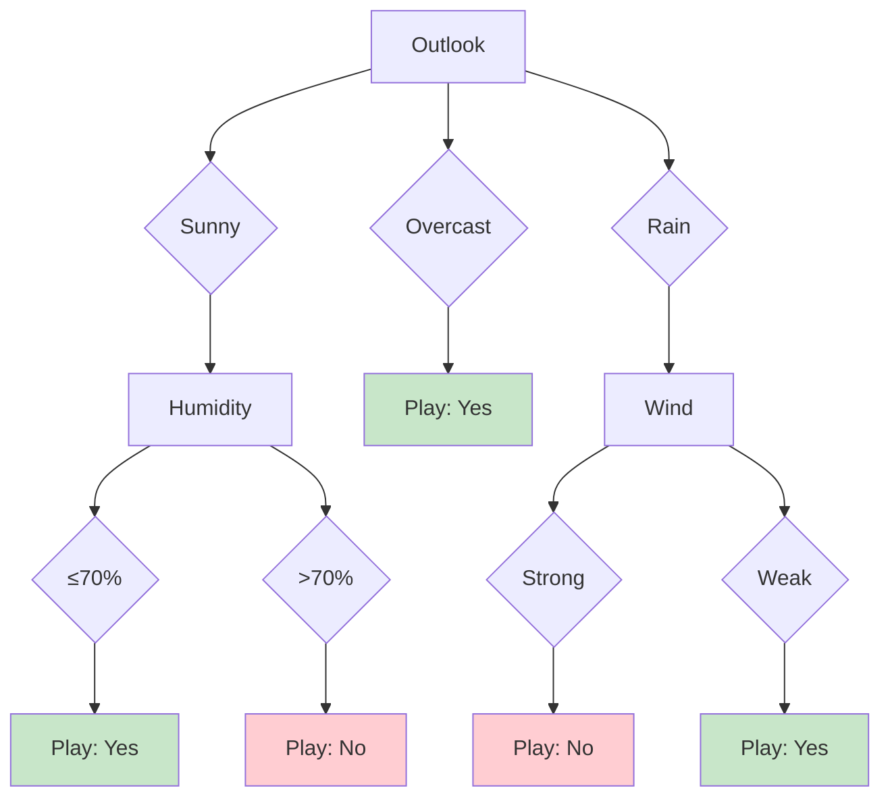
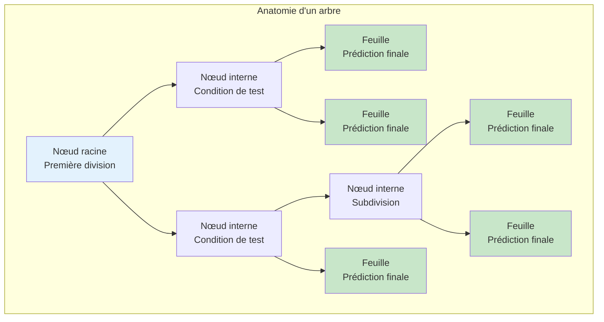
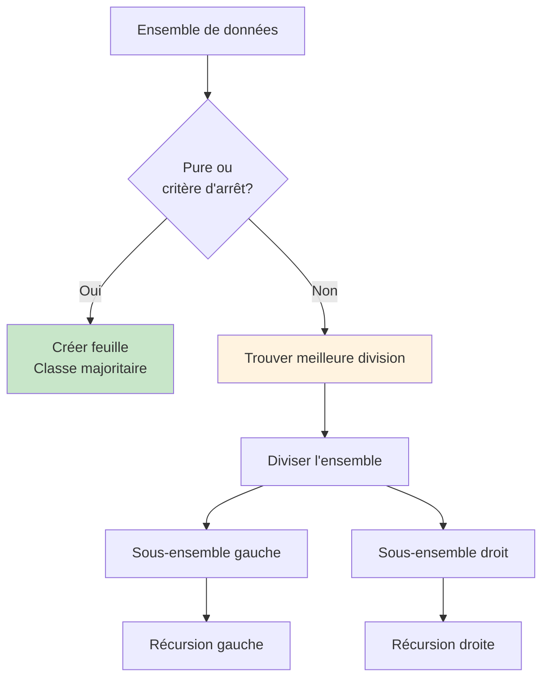
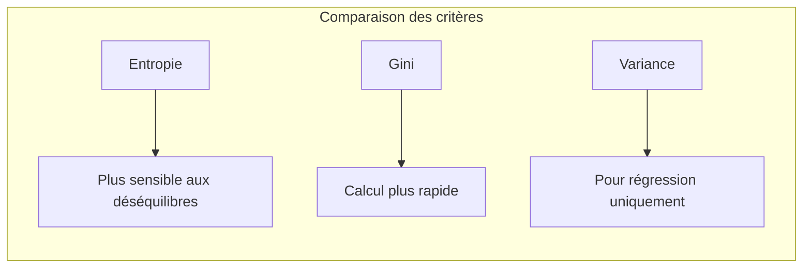
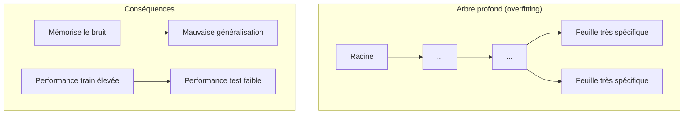
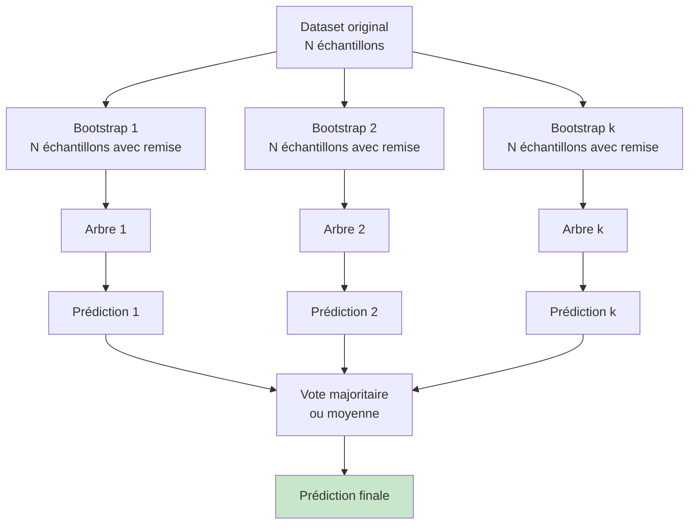
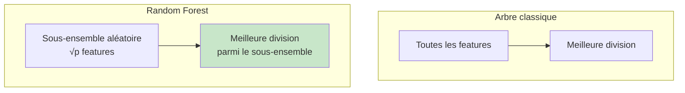
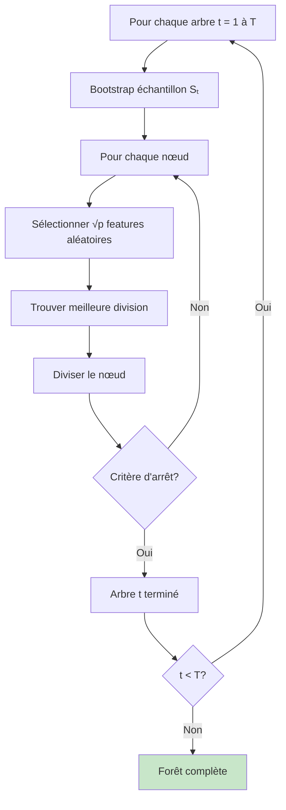
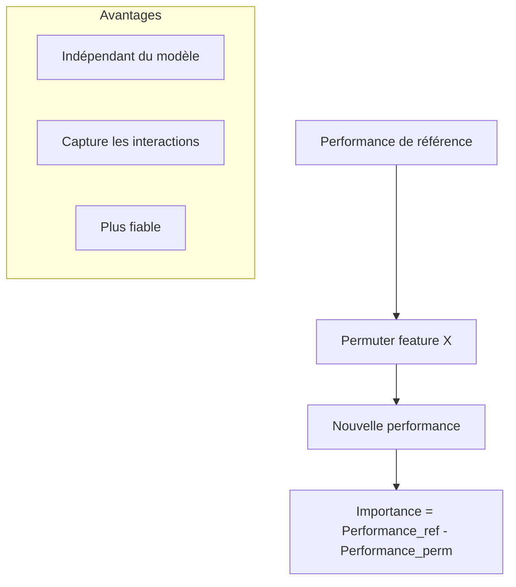
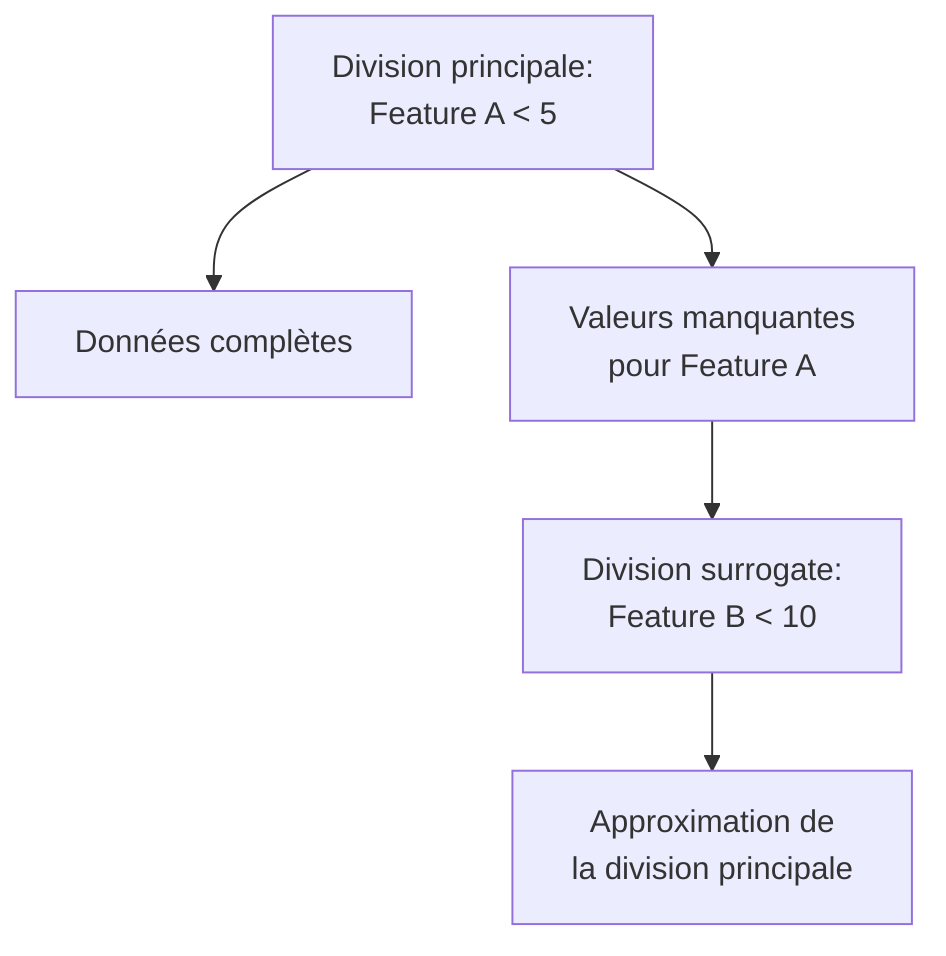

# Arbres de décision et forêts aléatoires

## 🎯 Objectifs d'apprentissage

À la fin de cette leçon, vous serez capable de :
- ✅ Comprendre le fonctionnement des arbres de décision
- ✅ Construire et interpréter un arbre de décision
- ✅ Maîtriser les forêts aléatoires et le bagging
- ✅ Évaluer l'importance des features

---

## 🌳 Arbres de décision

### Principe fondamental

Un **arbre de décision** est un modèle qui prédit une valeur cible en apprenant des règles de décision simples inférées des features.



### Structure d'un arbre

#### Composants essentiels



- **Nœud racine** : Point de départ, divise tout l'ensemble
- **Nœuds internes** : Tests sur les features
- **Branches** : Résultats possibles du test
- **Feuilles** : Prédictions finales

### Algorithme de construction

#### Approche récursive



#### Critères de division

**1. Entropie (Information Gain)**

Entropie(S) = -Σ pᵢ log₂(pᵢ)

où pᵢ est la proportion de la classe i.

**Gain d'information** = Entropie(parent) - Σ (|Sᵥ|/|S|) × Entropie(Sᵥ)

**2. Indice de Gini**

Gini(S) = 1 - Σ pᵢ²

**Gini Impurity** mesure la probabilité qu'un élément soit mal classé.

**3. Variance (pour la régression)**

Variance(S) = Σ (yᵢ - ȳ)² / n



### Exemple de construction pas à pas

#### Dataset exemple : Jouer au tennis

| Outlook | Temperature | Humidity | Wind | Play |
|---------|-------------|----------|------|------|
| Sunny | Hot | High | Weak | No |
| Sunny | Hot | High | Strong | No |
| Overcast | Hot | High | Weak | Yes |
| Rain | Mild | High | Weak | Yes |
| Rain | Cool | Normal | Weak | Yes |
| Rain | Cool | Normal | Strong | No |
| Overcast | Cool | Normal | Strong | Yes |

#### Calcul du gain d'information

**Entropie initiale** :
- Play=Yes: 4/7, Play=No: 3/7
- Entropie = -(4/7)log₂(4/7) - (3/7)log₂(3/7) ≈ 0.985

**Division par Outlook** :
- Sunny: 2 Yes, 2 No → Entropie = 1.0
- Overcast: 2 Yes, 0 No → Entropie = 0.0  
- Rain: 2 Yes, 1 No → Entropie ≈ 0.918

**Gain** = 0.985 - (3/7)×1.0 - (2/7)×0.0 - (2/7)×0.918 ≈ 0.246

### Implémentation Python

```python
from sklearn.tree import DecisionTreeClassifier, export_text, plot_tree
from sklearn.datasets import load_iris
import matplotlib.pyplot as plt

# Chargement des données
iris = load_iris()
X, y = iris.data, iris.target

# Création du modèle
dt = DecisionTreeClassifier(
    criterion='gini',           # ou 'entropy'
    max_depth=3,               # Profondeur maximale
    min_samples_split=2,       # Min échantillons pour diviser
    min_samples_leaf=1,        # Min échantillons par feuille
    random_state=42
)

# Entraînement
dt.fit(X, y)

# Visualisation textuelle
tree_rules = export_text(dt, feature_names=iris.feature_names)
print(tree_rules)

# Visualisation graphique
plt.figure(figsize=(12, 8))
plot_tree(dt, feature_names=iris.feature_names, class_names=iris.target_names, 
          filled=True, rounded=True)
plt.show()

# Importance des features
importances = dt.feature_importances_
for i, importance in enumerate(importances):
    print(f"{iris.feature_names[i]}: {importance:.3f}")
```

---

## 🌲 Problèmes des arbres simples

### 1. Overfitting



### 2. Instabilité

**Petit changement dans les données** → **Arbre complètement différent**

### 3. Biais

- **Biais vers features numériques** (plus de points de coupure possibles)
- **Biais vers features avec plus de modalités**

---

## 🌊 Solutions : Ensemble Methods

### Bagging (Bootstrap Aggregating)

#### Principe



#### Avantages du bagging

1. **Réduction de variance** : Moyenne de prédictions plus stable
2. **Parallélisation** : Arbres indépendants, entraînement parallèle
3. **Robustesse** : Moins sensible au bruit et aux outliers

---

## 🌳 Random Forest

### Principe : Bagging + Randomisation des features

#### Innovation clé

À chaque nœud, considérer seulement un **sous-ensemble aléatoire** des features.



#### Algorithme complet



### Hyperparamètres importants

#### 1. Nombre d'arbres (n_estimators)
- **Plus d'arbres** = moins de variance mais plus de temps
- **Règle pratique** : Commencer par 100

#### 2. Nombre de features par nœud (max_features)
- **Classification** : √p (par défaut)
- **Régression** : p/3 (par défaut)
- **Auto-tuning** recommandé

#### 3. Profondeur maximale (max_depth)
- **Arbres profonds** pour le bagging (contrairement aux arbres simples)
- **None** (pas de limite) souvent optimal

#### 4. Échantillons minimum
- **min_samples_split** : 2 (défaut)
- **min_samples_leaf** : 1 (défaut)
- Augmenter pour réduire l'overfitting

### Implémentation Python

```python
from sklearn.ensemble import RandomForestClassifier, RandomForestRegressor
from sklearn.model_selection import train_test_split
from sklearn.metrics import accuracy_score, classification_report

# Classification
rf_clf = RandomForestClassifier(
    n_estimators=100,          # Nombre d'arbres
    max_features='sqrt',       # √p features par nœud
    max_depth=None,           # Pas de limite de profondeur
    min_samples_split=2,      # Min pour diviser
    min_samples_leaf=1,       # Min par feuille
    bootstrap=True,           # Échantillonnage avec remise
    oob_score=True,          # Score out-of-bag
    random_state=42,
    n_jobs=-1                # Parallélisation
)

# Entraînement
X_train, X_test, y_train, y_test = train_test_split(X, y, test_size=0.3, random_state=42)
rf_clf.fit(X_train, y_train)

# Prédictions
y_pred = rf_clf.predict(X_test)
accuracy = accuracy_score(y_test, y_pred)
print(f"Accuracy: {accuracy:.3f}")

# Score OOB (estimation sans validation set)
print(f"OOB Score: {rf_clf.oob_score_:.3f}")

# Importance des features
feature_importance = rf_clf.feature_importances_
feature_names = ['feature_' + str(i) for i in range(X.shape[1])]

import pandas as pd
importance_df = pd.DataFrame({
    'feature': feature_names,
    'importance': feature_importance
}).sort_values('importance', ascending=False)

print(importance_df)
```

---

## 📊 Importance des features

### Méthodes de calcul

#### 1. Importance basée sur l'impureté (MDI)

**Principe** : Mesurer la réduction d'impureté apportée par chaque feature.

Importance(feature) = Σ (réduction d'impureté lors des divisions utilisant cette feature)

#### 2. Importance par permutation

**Principe** : Mesurer la dégradation de performance quand on permute aléatoirement une feature.



#### Implémentation

```python
from sklearn.inspection import permutation_importance
import matplotlib.pyplot as plt

# Importance par impureté (built-in)
mdi_importance = rf_clf.feature_importances_

# Importance par permutation
perm_importance = permutation_importance(rf_clf, X_test, y_test, 
                                       n_repeats=10, random_state=42)

# Visualisation comparative
fig, (ax1, ax2) = plt.subplots(1, 2, figsize=(12, 5))

# MDI
ax1.barh(range(len(mdi_importance)), mdi_importance)
ax1.set_title('MDI Importance')
ax1.set_xlabel('Importance')

# Permutation
ax2.barh(range(len(perm_importance.importances_mean)), 
         perm_importance.importances_mean)
ax2.set_title('Permutation Importance')
ax2.set_xlabel('Importance')

plt.tight_layout()
plt.show()
```

---

## 🚀 Applications avancées

### 1. Gestion des données manquantes

#### Surrogate splits



#### Random Forest avec valeurs manquantes

```python
from sklearn.impute import SimpleImputer
from sklearn.pipeline import Pipeline

# Pipeline avec imputation
pipeline = Pipeline([
    ('imputer', SimpleImputer(strategy='median')),
    ('rf', RandomForestClassifier(n_estimators=100, random_state=42))
])

pipeline.fit(X_train, y_train)
y_pred = pipeline.predict(X_test)
```

### 2. Détection d'outliers

#### Isolation Forest

**Principe** : Outliers sont plus faciles à isoler (moins de divisions nécessaires)

```python
from sklearn.ensemble import IsolationForest

# Détection d'anomalies
iso_forest = IsolationForest(contamination=0.1, random_state=42)
outliers = iso_forest.fit_predict(X)

# -1 = outlier, 1 = normal
print(f"Nombre d'outliers détectés: {sum(outliers == -1)}")
```

### 3. Feature selection

#### Élimination récursive avec Random Forest

```python
from sklearn.feature_selection import RFE

# Sélection de 5 meilleures features
rf = RandomForestClassifier(n_estimators=50, random_state=42)
rfe = RFE(estimator=rf, n_features_to_select=5, step=1)
rfe.fit(X_train, y_train)

# Features sélectionnées
selected_features = [feature_names[i] for i in range(len(feature_names)) if rfe.support_[i]]
print("Features sélectionnées:", selected_features)
```

---

## ⚡ Optimisation et tuning

### Grid Search pour hyperparamètres

```python
from sklearn.model_selection import GridSearchCV

# Grille de paramètres
param_grid = {
    'n_estimators': [50, 100, 200],
    'max_depth': [None, 10, 20],
    'max_features': ['sqrt', 'log2', None],
    'min_samples_split': [2, 5, 10]
}

# Grid search avec validation croisée
grid_search = GridSearchCV(
    RandomForestClassifier(random_state=42),
    param_grid,
    cv=5,
    scoring='accuracy',
    n_jobs=-1
)

grid_search.fit(X_train, y_train)

print("Meilleurs paramètres:", grid_search.best_params_)
print("Meilleur score:", grid_search.best_score_)

# Modèle optimal
best_rf = grid_search.best_estimator_
```

### Analyse de l'apprentissage

```python
from sklearn.model_selection import learning_curve

# Courbes d'apprentissage
train_sizes, train_scores, val_scores = learning_curve(
    RandomForestClassifier(n_estimators=100, random_state=42),
    X, y, cv=5, n_jobs=-1,
    train_sizes=np.linspace(0.1, 1.0, 10)
)

# Visualisation
plt.figure(figsize=(10, 6))
plt.plot(train_sizes, np.mean(train_scores, axis=1), 'o-', label='Training score')
plt.plot(train_sizes, np.mean(val_scores, axis=1), 'o-', label='Validation score')
plt.xlabel('Training Set Size')
plt.ylabel('Accuracy Score')
plt.legend()
plt.title('Learning Curves - Random Forest')
plt.show()
```

---

## 🎯 Récapitulatif

**Points clés à retenir :**

### Arbres de décision
- **Interprétables** et **intuitifs**
- **Tendance à l'overfitting** si pas contraints
- **Instables** (sensibles aux données)

### Random Forest
- **Combine** bagging + randomisation des features
- **Réduction significative** de la variance
- **Performance robuste** sur de nombreux problèmes
- **Parallélisable** et **scalable**

### Bonnes pratiques
1. **Commencer simple** : arbres de décision pour comprendre
2. **Random Forest** pour la performance
3. **Tuning des hyperparamètres** crucial
4. **Importance des features** pour l'interprétation
5. **Validation croisée** pour l'évaluation fiable

### Quand utiliser ?
- **Classification/régression** traditionnelle
- **Features hétérogènes** (numériques + catégorielles)
- **Besoin d'interprétabilité** (arbres simples)
- **Baseline robuste** (Random Forest)

---

## 🔗 Pour aller plus loin

- **Gradient Boosting** : XGBoost, LightGBM, CatBoost
- **Extra Trees** : Randomisation supplémentaire
- **Isolation Forest** : Détection d'anomalies
- **Multi-output** : Prédiction simultanée de plusieurs cibles