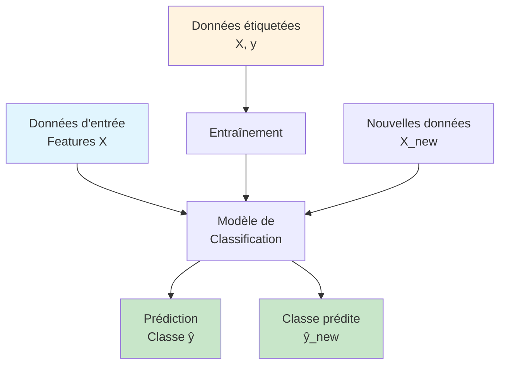
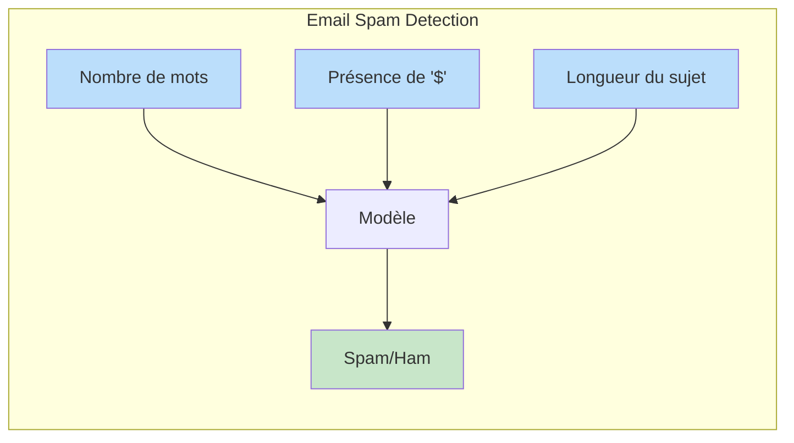
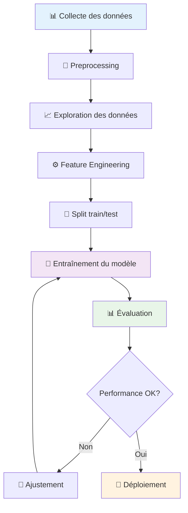
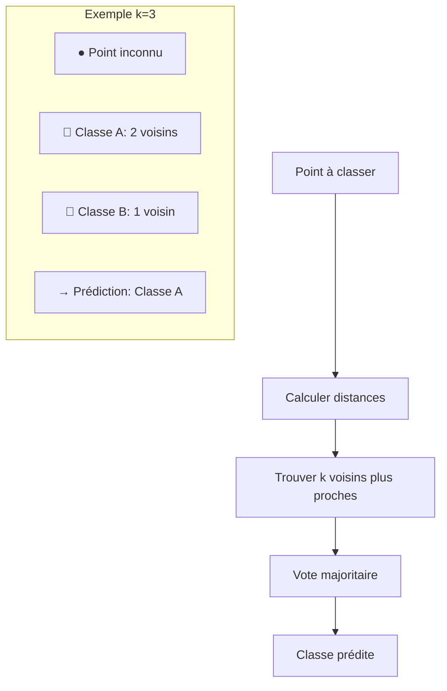
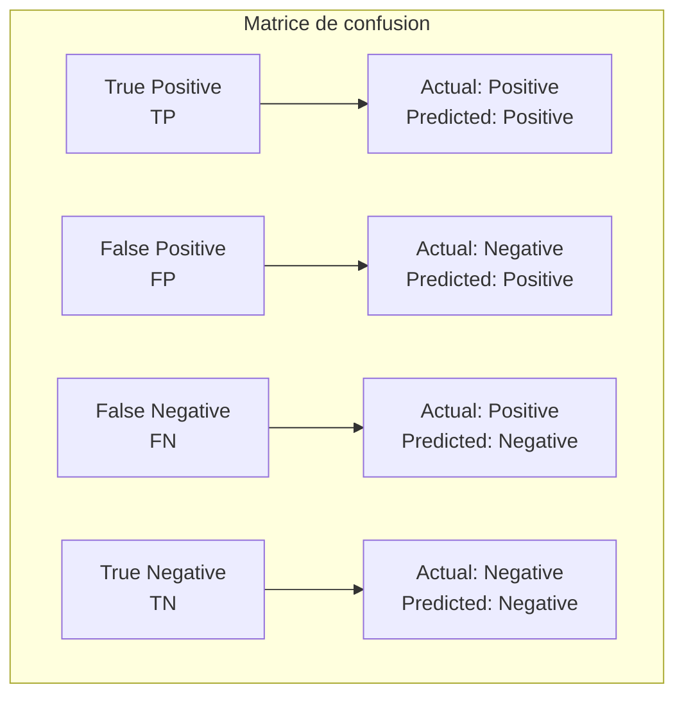

# Classification : concepts et algorithmes de base

## 🎯 Objectifs d'apprentissage

À la fin de cette leçon, vous serez capable de :
- ✅ Comprendre le problème de classification et ses variants
- ✅ Distinguer classification binaire et multi-classes
- ✅ Identifier les composantes d'un problème de classification
- ✅ Préparer des données pour l'entraînement

---

## 🔍 Qu'est-ce que la classification ?

<div data-mermaid="classification-concept">



</div>

**La classification** est une tâche d'apprentissage supervisé où l'objectif est de **prédire une catégorie** (classe) pour de nouvelles observations, basée sur des exemples d'entraînement.

### Types de classification

#### 🔴 Classification binaire
- **2 classes** seulement (ex: spam/non-spam, malade/sain)
- Sortie : 0 ou 1, vrai/faux

#### 🌈 Classification multi-classes
- **Plus de 2 classes** mutuellement exclusives
- Exemple : reconnaissance de chiffres (0-9), classification d'images (chat, chien, oiseau)

#### 🏷️ Classification multi-labels
- **Plusieurs étiquettes** possibles simultanément
- Exemple : tags d'articles (tech, science, actualité)

---

## 📊 Anatomie d'un problème de classification

### 1. Features (caractéristiques)

Les **variables d'entrée** qui décrivent nos observations :



**Types de features :**
- **Numériques** : âge, salaire, taille
- **Catégorielles** : couleur, ville, profession
- **Binaires** : oui/non, présent/absent
- **Textuelles** : mots, phrases (nécessitent preprocessing)

### 2. Labels (étiquettes)

Les **classes cibles** que nous voulons prédire :

| Problème | Classes | Type |
|----------|---------|------|
| Diagnostic médical | Sain, Malade | Binaire |
| Reconnaissance d'images | Chat, Chien, Oiseau | Multi-classes |
| Analyse de sentiment | Positif, Neutre, Négatif | Multi-classes |

### 3. Dataset structure

```python
# Structure typique d'un dataset de classification
import pandas as pd

# Exemple : prédiction de prix immobilier (élevé/bas)
data = {
    'surface': [80, 120, 60, 150],      # Feature numérique
    'ville': ['Paris', 'Lyon', 'Nice', 'Paris'],  # Feature catégorielle  
    'balcon': [1, 0, 1, 1],             # Feature binaire
    'prix_eleve': [1, 1, 0, 1]          # Label cible
}
df = pd.DataFrame(data)
```

---

## 🔧 Pipeline de classification

### Étapes essentielles



### 1. Preprocessing des données

#### Gestion des valeurs manquantes
```python
# Stratégies courantes
df.fillna(df.mean())  # Moyenne pour numériques
df.fillna(df.mode().iloc[0])  # Mode pour catégorielles
df.dropna()  # Suppression (si peu de valeurs manquantes)
```

#### Encoding des variables catégorielles
```python
from sklearn.preprocessing import LabelEncoder, OneHotEncoder

# Label encoding (ordinales)
le = LabelEncoder()
df['ville_encoded'] = le.fit_transform(df['ville'])

# One-hot encoding (nominales)
df_encoded = pd.get_dummies(df, columns=['ville'])
```

#### Normalisation
```python
from sklearn.preprocessing import StandardScaler, MinMaxScaler

# Standardisation (μ=0, σ=1)
scaler = StandardScaler()
X_scaled = scaler.fit_transform(X)

# Normalisation (0-1)
minmax = MinMaxScaler()
X_normalized = minmax.fit_transform(X)
```

### 2. Split des données

```python
from sklearn.model_selection import train_test_split

# Division classique 80/20
X_train, X_test, y_train, y_test = train_test_split(
    X, y, 
    test_size=0.2, 
    random_state=42,
    stratify=y  # Préserve la distribution des classes
)
```

---

## 🎲 Premiers algorithmes

### 1. K-Nearest Neighbors (k-NN)

**Principe** : Classer selon les k voisins les plus proches



**Avantages :**
- Simple à comprendre et implémenter
- Pas d'hypothèse sur la distribution des données
- Fonctionne bien avec peu de données

**Inconvénients :**
- Coûteux en calcul (distance à tous les points)
- Sensible à la dimension (curse of dimensionality)
- Sensible aux données bruitées

### 2. Naïve Bayes

**Principe** : Application du théorème de Bayes avec hypothèse d'indépendance

P(classe|features) = P(features|classe) × P(classe) / P(features)

**Types principaux :**
- **Gaussian NB** : features continues
- **Multinomial NB** : comptages (texte)
- **Bernoulli NB** : features binaires

**Avantages :**
- Très rapide
- Fonctionne bien avec peu de données
- Excellent pour la classification de texte

**Inconvénients :**
- Hypothèse d'indépendance souvent irréaliste
- Performance limitée si hypothèse violée

---

## 📈 Métriques de base

### Pour classification binaire



**Métriques essentielles :**

- **Accuracy** = (TP + TN) / (TP + TN + FP + FN)
- **Precision** = TP / (TP + FP) - "Parmi mes prédictions positives, combien sont correctes ?"
- **Recall** = TP / (TP + FN) - "Parmi les cas positifs réels, combien j'en détecte ?"
- **F1-Score** = 2 × (Precision × Recall) / (Precision + Recall)

### Choix de métrique selon le contexte

| Contexte | Métrique privilégiée | Raison |
|----------|---------------------|---------|
| Détection de fraude | **Recall** | Ne pas manquer de vrais cas |
| Diagnostic médical | **Recall** | Ne pas manquer de malades |
| Filtrage spam | **Precision** | Éviter faux positifs |
| Système équilibré | **F1-Score** | Compromis precision/recall |

---

## 💡 Bonnes pratiques

### 1. Exploration des données

```python
# Distribution des classes
y.value_counts()
y.value_counts(normalize=True)

# Corrélations entre features
df.corr()

# Statistiques descriptives
df.describe()
```

### 2. Gestion du déséquilibre de classes

```python
from sklearn.utils import resample
from imblearn.over_sampling import SMOTE

# Sous-échantillonnage de la classe majoritaire
df_minority = df[df.target == 0]
df_majority = df[df.target == 1]
df_majority_downsampled = resample(df_majority, n_samples=len(df_minority))

# Sur-échantillonnage avec SMOTE
smote = SMOTE(random_state=42)
X_resampled, y_resampled = smote.fit_resample(X, y)
```

### 3. Validation croisée

```python
from sklearn.model_selection import cross_val_score, StratifiedKFold

# Validation croisée stratifiée
cv = StratifiedKFold(n_splits=5, shuffle=True, random_state=42)
scores = cross_val_score(model, X, y, cv=cv, scoring='f1')
print(f"F1-Score moyen: {scores.mean():.3f} (+/- {scores.std() * 2:.3f})")
```

---

## 🎯 Récapitulatif

**Points clés à retenir :**

1. **Classification = prédiction de catégories** à partir d'exemples étiquetés
2. **Preprocessing crucial** : gestion des valeurs manquantes, encoding, normalisation
3. **k-NN et Naïve Bayes** : algorithmes simples mais efficaces pour débuter
4. **Métriques variées** : choisir selon le contexte métier
5. **Validation rigoureuse** : train/test split + validation croisée

**Prochaines étapes :**
- Algorithmes plus sophistiqués (arbres, SVM, réseaux de neurones)
- Techniques d'optimisation des hyperparamètres
- Feature selection et engineering avancé

---

## 🔗 Pour aller plus loin

- **Datasets d'entraînement** : UCI ML Repository, Kaggle, scikit-learn datasets
- **Librairies Python** : scikit-learn, pandas, numpy
- **Visualisation** : matplotlib, seaborn, plotly
- **Métriques avancées** : ROC-AUC, précision-rappel curves