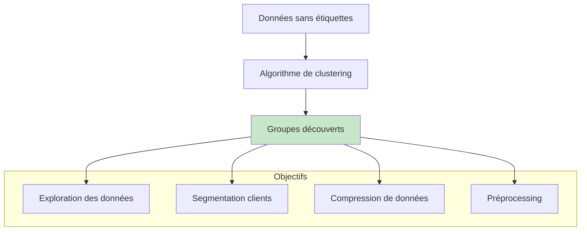
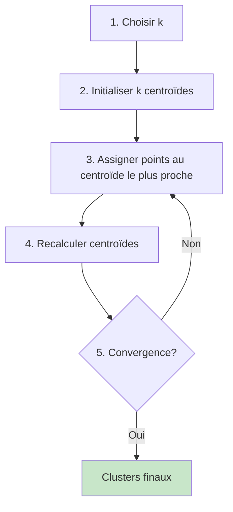
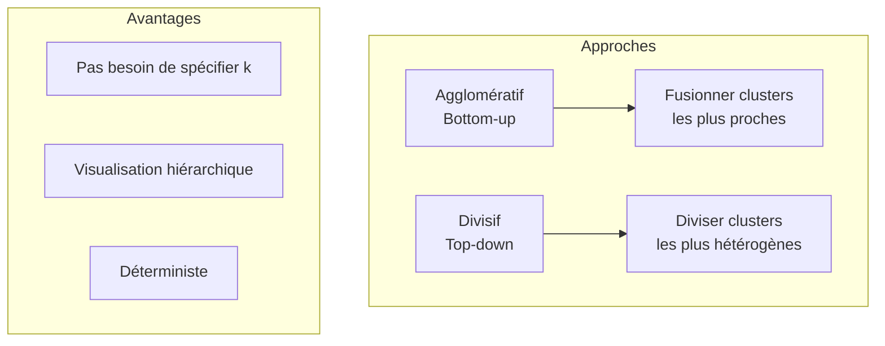
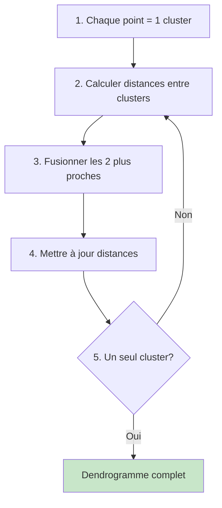
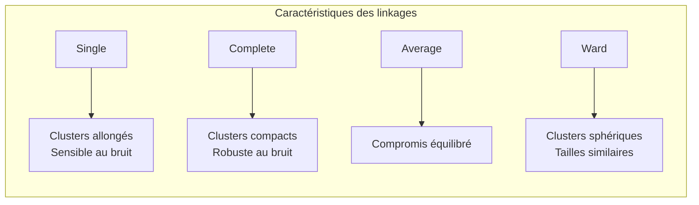

# Clustering : K-means et méthodes hiérarchiques

## 🎯 Objectifs d'apprentissage

À la fin de cette leçon, vous serez capable de :
- ✅ Comprendre les principes du clustering
- ✅ Implémenter et optimiser K-means
- ✅ Utiliser le clustering hiérarchique
- ✅ Évaluer la qualité des clusters

---

## 🔍 Qu'est-ce que le clustering ?

### Définition et objectifs

Le **clustering** (ou classification non supervisée) consiste à **regrouper des observations similaires** sans connaître à l'avance les groupes cibles.



### Différence avec la classification supervisée

| Aspect | Clustering | Classification |
|--------|------------|---------------|
| **Étiquettes** | ❌ Non disponibles | ✅ Fournies lors de l'entraînement |
| **Objectif** | Découvrir des groupes | Prédire des classes connues |
| **Évaluation** | Métriques internes | Métriques de prédiction |
| **Interprétation** | Exploratoire | Prédictive |

---

## 🎯 K-means

### Principe algorithmique

**K-means** partitionne les données en **k clusters** en minimisant la variance intra-cluster.



### Formulation mathématique

**Objectif** : Minimiser la somme des carrés intra-cluster (WCSS)

J = Σᵢ₌₁ᵏ Σₓ∈Cᵢ ||x - μᵢ||²

où :
- **k** : nombre de clusters
- **Cᵢ** : cluster i
- **μᵢ** : centroïde du cluster i

### Algorithme détaillé

#### Étape par étape

```python
import numpy as np
import matplotlib.pyplot as plt
from sklearn.datasets import make_blobs

# Génération de données exemple
X, _ = make_blobs(n_samples=300, centers=3, cluster_std=1.0, random_state=42)

def kmeans_from_scratch(X, k, max_iters=100):
    # 1. Initialisation aléatoire des centroïdes
    n_samples, n_features = X.shape
    centroids = X[np.random.choice(n_samples, k, replace=False)]
    
    for iteration in range(max_iters):
        # 2. Assignment: assigner chaque point au centroïde le plus proche
        distances = np.sqrt(((X - centroids[:, np.newaxis])**2).sum(axis=2))
        labels = np.argmin(distances, axis=0)
        
        # 3. Update: recalculer les centroïdes
        new_centroids = np.array([X[labels == i].mean(axis=0) for i in range(k)])
        
        # 4. Test de convergence
        if np.allclose(centroids, new_centroids):
            print(f"Convergence atteinte à l'itération {iteration}")
            break
            
        centroids = new_centroids
    
    return labels, centroids

# Test de l'implémentation
labels, centroids = kmeans_from_scratch(X, k=3)

# Visualisation
plt.figure(figsize=(10, 8))
colors = ['red', 'blue', 'green', 'purple', 'orange']
for i in range(3):
    plt.scatter(X[labels == i, 0], X[labels == i, 1], 
                c=colors[i], label=f'Cluster {i}', alpha=0.6)
    plt.scatter(centroids[i, 0], centroids[i, 1], 
                c='black', marker='x', s=200, linewidths=3)

plt.title('K-means Clustering - Implémentation from scratch')
plt.xlabel('Feature 1')
plt.ylabel('Feature 2')
plt.legend()
plt.show()
```

### Implémentation avec scikit-learn

```python
from sklearn.cluster import KMeans
from sklearn.preprocessing import StandardScaler

# Normalisation (importante pour K-means)
scaler = StandardScaler()
X_scaled = scaler.fit_transform(X)

# K-means avec scikit-learn
kmeans = KMeans(
    n_clusters=3,           # Nombre de clusters
    init='k-means++',       # Initialisation intelligente
    n_init=10,             # Nombre d'essais différents
    max_iter=300,          # Maximum d'itérations
    random_state=42
)

labels = kmeans.fit_predict(X_scaled)
centroids = kmeans.cluster_centers_

print(f"Inertie (WCSS): {kmeans.inertia_:.2f}")
print(f"Nombre d'itérations: {kmeans.n_iter_}")
```

### Choisir le nombre optimal de clusters

#### Méthode du coude (Elbow Method)

```python
# Test de différentes valeurs de k
k_range = range(1, 11)
wcss = []

for k in k_range:
    kmeans = KMeans(n_clusters=k, random_state=42, n_init=10)
    kmeans.fit(X_scaled)
    wcss.append(kmeans.inertia_)

# Visualisation de la courbe du coude
plt.figure(figsize=(10, 6))
plt.plot(k_range, wcss, 'bo-')
plt.xlabel('Nombre de clusters (k)')
plt.ylabel('WCSS (Within-Cluster Sum of Squares)')
plt.title('Méthode du coude pour déterminer k optimal')
plt.grid(True)

# Détection automatique du coude
from kneed import KneeLocator
knee_locator = KneeLocator(k_range, wcss, curve="convex", direction="decreasing")
optimal_k = knee_locator.elbow
plt.axvline(x=optimal_k, color='red', linestyle='--', label=f'k optimal = {optimal_k}')
plt.legend()
plt.show()

print(f"K optimal détecté: {optimal_k}")
```

#### Coefficient de silhouette

```python
from sklearn.metrics import silhouette_score, silhouette_samples

# Calcul du score de silhouette pour différents k
silhouette_scores = []

for k in range(2, 11):  # Silhouette non définie pour k=1
    kmeans = KMeans(n_clusters=k, random_state=42)
    labels = kmeans.fit_predict(X_scaled)
    score = silhouette_score(X_scaled, labels)
    silhouette_scores.append(score)

# Visualisation
plt.figure(figsize=(10, 6))
plt.plot(range(2, 11), silhouette_scores, 'go-')
plt.xlabel('Nombre de clusters (k)')
plt.ylabel('Score de silhouette')
plt.title('Score de silhouette vs nombre de clusters')
plt.grid(True)

optimal_k_silhouette = range(2, 11)[np.argmax(silhouette_scores)]
plt.axvline(x=optimal_k_silhouette, color='red', linestyle='--', 
           label=f'k optimal = {optimal_k_silhouette}')
plt.legend()
plt.show()

print(f"K optimal (silhouette): {optimal_k_silhouette}")
print(f"Meilleur score de silhouette: {max(silhouette_scores):.3f}")
```

### Analyse détaillée des silhouettes

```python
import matplotlib.cm as cm

def plot_silhouette_analysis(X, n_clusters):
    fig, (ax1, ax2) = plt.subplots(1, 2, figsize=(15, 6))
    
    # K-means
    kmeans = KMeans(n_clusters=n_clusters, random_state=42)
    cluster_labels = kmeans.fit_predict(X)
    
    # Score de silhouette
    silhouette_avg = silhouette_score(X, cluster_labels)
    sample_silhouette_values = silhouette_samples(X, cluster_labels)
    
    # Plot 1: Diagramme en silhouette
    y_lower = 10
    for i in range(n_clusters):
        cluster_silhouette_values = sample_silhouette_values[cluster_labels == i]
        cluster_silhouette_values.sort()
        
        size_cluster_i = cluster_silhouette_values.shape[0]
        y_upper = y_lower + size_cluster_i
        
        color = cm.nipy_spectral(float(i) / n_clusters)
        ax1.fill_betweenx(np.arange(y_lower, y_upper),
                         0, cluster_silhouette_values,
                         facecolor=color, edgecolor=color, alpha=0.7)
        
        ax1.text(-0.05, y_lower + 0.5 * size_cluster_i, str(i))
        y_lower = y_upper + 10
    
    ax1.set_xlabel('Valeurs de coefficient de silhouette')
    ax1.set_ylabel('Étiquettes de cluster')
    ax1.axvline(x=silhouette_avg, color="red", linestyle="--", 
               label=f'Score moyen = {silhouette_avg:.3f}')
    ax1.legend()
    
    # Plot 2: Clusters colorés
    colors = cm.nipy_spectral(cluster_labels.astype(float) / n_clusters)
    ax2.scatter(X[:, 0], X[:, 1], marker='.', s=30, 
               lw=0, alpha=0.7, c=colors, edgecolor='k')
    
    centers = kmeans.cluster_centers_
    ax2.scatter(centers[:, 0], centers[:, 1], marker='o',
               c="white", alpha=1, s=200, edgecolor='k')
    
    for i, c in enumerate(centers):
        ax2.scatter(c[0], c[1], marker='$%d$' % i, alpha=1,
                   s=50, edgecolor='k')
    
    ax2.set_xlabel('Feature 1')
    ax2.set_ylabel('Feature 2')
    plt.suptitle(f'Analyse de silhouette pour {n_clusters} clusters')
    plt.show()

# Test pour différents k
for k in [2, 3, 4, 5]:
    plot_silhouette_analysis(X_scaled, k)
```

---

## 🌳 Clustering hiérarchique

### Principe général

Le **clustering hiérarchique** construit une hiérarchie de clusters sous forme d'arbre (dendrogramme).



### Clustering agglomératif

#### Algorithme



#### Métriques de distance entre clusters

**1. Single Linkage (distance minimale)**
d(A,B) = min{d(aᵢ, bⱼ) : aᵢ ∈ A, bⱼ ∈ B}

**2. Complete Linkage (distance maximale)**  
d(A,B) = max{d(aᵢ, bⱼ) : aᵢ ∈ A, bⱼ ∈ B}

**3. Average Linkage (distance moyenne)**
d(A,B) = (1/|A||B|) Σᵢ Σⱼ d(aᵢ, bⱼ)

**4. Ward Linkage (variance minimale)**
Minimise l'augmentation de variance lors de la fusion



### Implémentation

```python
from sklearn.cluster import AgglomerativeClustering
from scipy.cluster.hierarchy import dendrogram, linkage
import matplotlib.pyplot as plt

# Clustering hiérarchique agglomératif
linkage_methods = ['single', 'complete', 'average', 'ward']

fig, axes = plt.subplots(2, 2, figsize=(15, 12))
axes = axes.ravel()

for i, method in enumerate(linkage_methods):
    # Clustering
    if method == 'ward':
        # Ward nécessite la distance euclidienne
        clustering = AgglomerativeClustering(
            n_clusters=3, 
            linkage=method,
            metric='euclidean'
        )
    else:
        clustering = AgglomerativeClustering(
            n_clusters=3, 
            linkage=method,
            metric='euclidean'
        )
    
    labels = clustering.fit_predict(X_scaled)
    
    # Visualisation
    scatter = axes[i].scatter(X_scaled[:, 0], X_scaled[:, 1], c=labels, cmap='viridis')
    axes[i].set_title(f'{method.capitalize()} Linkage')
    axes[i].set_xlabel('Feature 1')
    axes[i].set_ylabel('Feature 2')

plt.tight_layout()
plt.show()
```

### Dendrogrammes

```python
def plot_dendrogram(X, method='ward', max_d=None):
    # Calcul de la matrice de linkage
    Z = linkage(X, method=method)
    
    # Création du dendrogramme
    plt.figure(figsize=(12, 8))
    dendrogram(Z, 
              truncate_mode='level',  # Tronquer pour lisibilité
              p=5,                   # Niveaux à afficher
              leaf_rotation=90,
              leaf_font_size=12,
              show_contracted=True)
    
    plt.title(f'Dendrogramme - {method.capitalize()} Linkage')
    plt.xlabel('Index des échantillons')
    plt.ylabel('Distance')
    
    # Ligne de coupure
    if max_d:
        plt.axhline(y=max_d, color='red', linestyle='--', 
                   label=f'Distance de coupure = {max_d}')
        plt.legend()
    
    plt.show()
    
    return Z

# Dendrogrammes pour différentes méthodes
for method in ['single', 'complete', 'average', 'ward']:
    Z = plot_dendrogram(X_scaled, method=method)
```

### Détermination automatique du nombre de clusters

```python
from scipy.cluster.hierarchy import fcluster

def find_optimal_clusters_hierarchical(X, method='ward', max_clusters=10):
    Z = linkage(X, method=method)
    
    silhouette_scores = []
    cluster_range = range(2, max_clusters + 1)
    
    for n_clusters in cluster_range:
        # Extraction des clusters
        labels = fcluster(Z, n_clusters, criterion='maxclust')
        score = silhouette_score(X, labels)
        silhouette_scores.append(score)
    
    # Meilleur nombre de clusters
    optimal_n = cluster_range[np.argmax(silhouette_scores)]
    
    plt.figure(figsize=(10, 6))
    plt.plot(cluster_range, silhouette_scores, 'bo-')
    plt.xlabel('Nombre de clusters')
    plt.ylabel('Score de silhouette')
    plt.title(f'Optimisation du nombre de clusters - {method}')
    plt.axvline(x=optimal_n, color='red', linestyle='--', 
               label=f'Optimal = {optimal_n}')
    plt.legend()
    plt.grid(True)
    plt.show()
    
    return optimal_n, max(silhouette_scores)

# Test pour différentes méthodes
for method in ['ward', 'complete', 'average']:
    print(f"\n{method.upper()} LINKAGE:")
    optimal_n, best_score = find_optimal_clusters_hierarchical(X_scaled, method=method)
    print(f"Nombre optimal de clusters: {optimal_n}")
    print(f"Meilleur score de silhouette: {best_score:.3f}")
```

---

## 📊 Évaluation de la qualité du clustering

### Métriques internes (sans vérité terrain)

#### 1. Coefficient de silhouette

```python
from sklearn.metrics import silhouette_score

def evaluate_clustering_internal(X, labels):
    """Évaluation interne du clustering"""
    
    # Silhouette coefficient
    sil_score = silhouette_score(X, labels)
    
    # Calinski-Harabasz Index
    from sklearn.metrics import calinski_harabasz_score
    ch_score = calinski_harabasz_score(X, labels)
    
    # Davies-Bouldin Index
    from sklearn.metrics import davies_bouldin_score
    db_score = davies_bouldin_score(X, labels)
    
    print(f"Silhouette Score: {sil_score:.3f} (plus élevé = mieux)")
    print(f"Calinski-Harabasz Index: {ch_score:.2f} (plus élevé = mieux)")
    print(f"Davies-Bouldin Index: {db_score:.3f} (plus bas = mieux)")
    
    return sil_score, ch_score, db_score

# Test sur K-means
kmeans = KMeans(n_clusters=3, random_state=42)
kmeans_labels = kmeans.fit_predict(X_scaled)

print("ÉVALUATION K-MEANS:")
evaluate_clustering_internal(X_scaled, kmeans_labels)

# Test sur clustering hiérarchique
hierarchical = AgglomerativeClustering(n_clusters=3)
hier_labels = hierarchical.fit_predict(X_scaled)

print("\nÉVALUATION CLUSTERING HIÉRARCHIQUE:")
evaluate_clustering_internal(X_scaled, hier_labels)
```

### Métriques externes (avec vérité terrain)

```python
from sklearn.metrics import adjusted_rand_score, normalized_mutual_info_score

# Génération de données avec vraies classes
X_true, y_true = make_blobs(n_samples=300, centers=3, cluster_std=1.0, random_state=42)
X_true_scaled = StandardScaler().fit_transform(X_true)

# Clustering
kmeans = KMeans(n_clusters=3, random_state=42)
predicted_labels = kmeans.fit_predict(X_true_scaled)

def evaluate_clustering_external(y_true, y_pred):
    """Évaluation externe du clustering"""
    
    # Adjusted Rand Index
    ari = adjusted_rand_score(y_true, y_pred)
    
    # Normalized Mutual Information
    nmi = normalized_mutual_info_score(y_true, y_pred)
    
    # Homogeneity, Completeness, V-measure
    from sklearn.metrics import homogeneity_completeness_v_measure
    homogeneity, completeness, v_measure = homogeneity_completeness_v_measure(y_true, y_pred)
    
    print(f"Adjusted Rand Index: {ari:.3f}")
    print(f"Normalized Mutual Information: {nmi:.3f}")
    print(f"Homogeneity: {homogeneity:.3f}")
    print(f"Completeness: {completeness:.3f}")
    print(f"V-measure: {v_measure:.3f}")
    
    return ari, nmi, v_measure

print("ÉVALUATION EXTERNE:")
evaluate_clustering_external(y_true, predicted_labels)
```

---

## 🚀 Applications pratiques

### Segmentation client

```python
import pandas as pd
from sklearn.preprocessing import StandardScaler

# Données client simulées
np.random.seed(42)
n_customers = 1000

customer_data = pd.DataFrame({
    'age': np.random.normal(40, 15, n_customers),
    'income': np.random.normal(50000, 20000, n_customers),
    'spending_score': np.random.normal(50, 25, n_customers),
    'frequency': np.random.poisson(10, n_customers)
})

# Nettoyage
customer_data = customer_data[(customer_data['age'] > 18) & 
                             (customer_data['income'] > 0) &
                             (customer_data['spending_score'] > 0)]

print("Données client:")
print(customer_data.describe())

# Normalisation
scaler = StandardScaler()
customer_scaled = scaler.fit_transform(customer_data)

# Clustering
kmeans_customer = KMeans(n_clusters=4, random_state=42)
customer_segments = kmeans_customer.fit_predict(customer_scaled)

# Ajout des segments au DataFrame
customer_data['segment'] = customer_segments

# Analyse des segments
print("\nProfils des segments clients:")
segment_profiles = customer_data.groupby('segment').mean()
print(segment_profiles)

# Visualisation
fig, axes = plt.subplots(1, 2, figsize=(15, 6))

# Scatter plot Income vs Spending
axes[0].scatter(customer_data['income'], customer_data['spending_score'], 
               c=customer_segments, cmap='viridis', alpha=0.6)
axes[0].set_xlabel('Revenue')
axes[0].set_ylabel('Spending Score')
axes[0].set_title('Segmentation Client - Revenue vs Spending')

# Scatter plot Age vs Frequency  
axes[1].scatter(customer_data['age'], customer_data['frequency'], 
               c=customer_segments, cmap='viridis', alpha=0.6)
axes[1].set_xlabel('Âge')
axes[1].set_ylabel('Fréquence d\'achat')
axes[1].set_title('Segmentation Client - Âge vs Fréquence')

plt.tight_layout()
plt.show()
```

### Compression d'images

```python
from sklearn.datasets import load_sample_image
from sklearn.cluster import MiniBatchKMeans

# Chargement d'une image d'exemple
china = load_sample_image("china.jpg")
print(f"Forme de l'image: {china.shape}")

# Reshape pour le clustering
X_image = china.reshape(-1, 3)  # RGB
print(f"Données pour clustering: {X_image.shape}")

# Clustering pour réduire les couleurs
n_colors = 16
kmeans_image = MiniBatchKMeans(n_clusters=n_colors, random_state=42, batch_size=1000)
kmeans_image.fit(X_image)

# Reconstruction avec couleurs réduites
compressed_colors = kmeans_image.cluster_centers_[kmeans_image.labels_]
compressed_image = compressed_colors.reshape(china.shape).astype(np.uint8)

# Visualisation
fig, (ax1, ax2) = plt.subplots(1, 2, figsize=(12, 6))

ax1.imshow(china)
ax1.set_title(f'Image originale\n{china.shape[0] * china.shape[1]} pixels × 3 couleurs')
ax1.axis('off')

ax2.imshow(compressed_image)
ax2.set_title(f'Image compressée\n{n_colors} couleurs')
ax2.axis('off')

plt.tight_layout()
plt.show()

# Calcul du ratio de compression
original_size = china.shape[0] * china.shape[1] * 3
compressed_size = n_colors * 3 + china.shape[0] * china.shape[1] * np.log2(n_colors) / 8
compression_ratio = original_size / compressed_size

print(f"Ratio de compression approximatif: {compression_ratio:.1f}:1")
```

---

## ⚡ Optimisations et variantes

### Mini-Batch K-means

```python
from sklearn.cluster import MiniBatchKMeans
import time

# Données plus importantes
X_large, _ = make_blobs(n_samples=10000, centers=5, cluster_std=2.0, random_state=42)
X_large_scaled = StandardScaler().fit_transform(X_large)

# Comparaison K-means vs Mini-Batch K-means
print("Comparaison des performances:")

# K-means standard
start_time = time.time()
kmeans_standard = KMeans(n_clusters=5, random_state=42)
labels_standard = kmeans_standard.fit_predict(X_large_scaled)
time_standard = time.time() - start_time

# Mini-Batch K-means
start_time = time.time()
kmeans_mini = MiniBatchKMeans(n_clusters=5, batch_size=100, random_state=42)
labels_mini = kmeans_mini.fit_predict(X_large_scaled)
time_mini = time.time() - start_time

print(f"K-means standard: {time_standard:.3f}s")
print(f"Mini-Batch K-means: {time_mini:.3f}s")
print(f"Speedup: {time_standard/time_mini:.1f}x")

# Qualité des résultats
print(f"\nQualité (silhouette):")
print(f"K-means standard: {silhouette_score(X_large_scaled, labels_standard):.3f}")
print(f"Mini-Batch K-means: {silhouette_score(X_large_scaled, labels_mini):.3f}")
```

### K-means++

```python
def kmeans_plus_plus_init(X, k):
    """Implémentation de l'initialisation K-means++"""
    n_samples, n_features = X.shape
    centroids = np.zeros((k, n_features))
    
    # 1. Choisir le premier centroïde aléatoirement
    centroids[0] = X[np.random.randint(0, n_samples)]
    
    for i in range(1, k):
        # 2. Calculer les distances au centroïde le plus proche
        distances = np.array([min([np.linalg.norm(x - c)**2 for c in centroids[:i]]) for x in X])
        
        # 3. Choisir le prochain centroïde avec probabilité proportionnelle à la distance²
        probabilities = distances / distances.sum()
        cumulative_probabilities = probabilities.cumsum()
        r = np.random.rand()
        
        for j, p in enumerate(cumulative_probabilities):
            if r < p:
                centroids[i] = X[j]
                break
    
    return centroids

# Test de l'initialisation
X_test, _ = make_blobs(n_samples=300, centers=4, cluster_std=1.5, random_state=42)

# Comparaison des initialisations
fig, axes = plt.subplots(1, 3, figsize=(18, 6))

for i, init_method in enumerate(['random', 'k-means++', kmeans_plus_plus_init]):
    if callable(init_method):
        # Notre implémentation
        initial_centroids = init_method(X_test, 4)
        kmeans = KMeans(n_clusters=4, init=initial_centroids, n_init=1, random_state=42)
        title = 'K-means++ (custom)'
    else:
        kmeans = KMeans(n_clusters=4, init=init_method, n_init=1, random_state=42)
        title = f'Init: {init_method}'
    
    labels = kmeans.fit_predict(X_test)
    
    axes[i].scatter(X_test[:, 0], X_test[:, 1], c=labels, cmap='viridis', alpha=0.6)
    axes[i].scatter(kmeans.cluster_centers_[:, 0], kmeans.cluster_centers_[:, 1], 
                   c='red', marker='x', s=200, linewidths=3)
    axes[i].set_title(f'{title}\nInertie: {kmeans.inertia_:.2f}')

plt.tight_layout()
plt.show()
```

---

## 🎯 Récapitulatif

**Points clés à retenir :**

### K-means
- **Rapide et simple** pour clusters sphériques
- **Sensible à l'initialisation** → Utiliser K-means++
- **Nécessite de spécifier k** → Méthode du coude, silhouette
- **Normalisation importante** pour features d'échelles différentes

### Clustering hiérarchique
- **Pas besoin de spécifier k** à l'avance
- **Dendrogramme informatif** pour explorer la structure
- **Plus lent** que K-means (O(n³))
- **Choix du linkage** influence la forme des clusters

### Évaluation
- **Métriques internes** : Silhouette, Calinski-Harabasz
- **Métriques externes** : ARI, NMI (si vérité terrain)
- **Visualisation** essentielle pour validation

### Applications
- **Segmentation** : Clients, marché, images
- **Exploration** : Structure des données, préprocessing
- **Compression** : Réduction de dimensionnalité, couleurs

### Bonnes pratiques
1. **Normaliser** les données
2. **Tester plusieurs valeurs de k**
3. **Comparer différents algorithmes**
4. **Valider** avec des métriques appropriées
5. **Interpréter** les clusters dans le contexte métier

---

## 🔗 Pour aller plus loin

- **Autres algorithmes** : DBSCAN, Mean Shift, Gaussian Mixtures
- **Clustering de densité** : Pour formes non-sphériques
- **Clustering spectral** : Pour structures complexes
- **Clustering de séries temporelles** : DTW, shape-based clustering