# Réseaux de neurones convolutionnels (CNN) : Vision par ordinateur

## 🎯 Objectifs d'apprentissage

À la fin de cette leçon, vous serez capable de :
- ✅ Comprendre les opérations de convolution et pooling
- ✅ Construire et entraîner un CNN from scratch
- ✅ Analyser les feature maps et filtres appris
- ✅ Appliquer les CNN à la classification d'images

---

## 🖼️ Motivation : Pourquoi les CNN ?

### Limitations des MLP pour les images

```python
import numpy as np
import matplotlib.pyplot as plt
from sklearn.datasets import fetch_openml
from sklearn.neural_network import MLPClassifier
from sklearn.preprocessing import StandardScaler
from sklearn.metrics import classification_report
import tensorflow as tf
from tensorflow import keras
from tensorflow.keras import layers

# Chargement du dataset MNIST
print("Chargement du dataset MNIST...")
mnist = tf.keras.datasets.mnist
(X_train, y_train), (X_test, y_test) = mnist.load_data()

# Normalisation
X_train = X_train.astype('float32') / 255.0
X_test = X_test.astype('float32') / 255.0

print(f"Données d'entraînement: {X_train.shape}")
print(f"Données de test: {X_test.shape}")

# Visualisation d'exemples
fig, axes = plt.subplots(2, 5, figsize=(12, 6))
for i in range(10):
    row, col = i // 5, i % 5
    axes[row, col].imshow(X_train[i], cmap='gray')
    axes[row, col].set_title(f'Chiffre: {y_train[i]}')
    axes[row, col].axis('off')
plt.suptitle('Exemples du dataset MNIST')
plt.tight_layout()
plt.show()

# Problème 1: Taille des données pour MLP
img_height, img_width = X_train.shape[1], X_train.shape[2]
input_size = img_height * img_width

print(f"\n=== PROBLÈMES DES MLP POUR IMAGES ===")
print(f"Taille d'une image: {img_height}x{img_width} = {input_size} pixels")
print(f"Nombre de paramètres pour couche cachée de 128 neurones: {input_size * 128:,}")
print(f"Problème: Explosion du nombre de paramètres!")

# Problème 2: Perte d'information spatiale
plt.figure(figsize=(15, 8))

# Image originale
plt.subplot(2, 4, 1)
original_img = X_train[0]
plt.imshow(original_img, cmap='gray')
plt.title('Image originale')
plt.axis('off')

# Image aplatie (pour MLP)
plt.subplot(2, 4, 2)
flattened = original_img.flatten()
plt.plot(flattened[:100])
plt.title('Premiers 100 pixels aplatis')
plt.xlabel('Position dans le vecteur')
plt.ylabel('Intensité')

# Translation
plt.subplot(2, 4, 3)
shifted_img = np.roll(original_img, 2, axis=1)  # Décalage horizontal
plt.imshow(shifted_img, cmap='gray')
plt.title('Image décalée')
plt.axis('off')

plt.subplot(2, 4, 4)
shifted_flat = shifted_img.flatten()
plt.plot(flattened[:100], label='Original', alpha=0.7)
plt.plot(shifted_flat[:100], label='Décalée', alpha=0.7)
plt.title('Comparaison vecteurs aplatis')
plt.xlabel('Position')
plt.ylabel('Intensité')
plt.legend()

# Rotation
plt.subplot(2, 4, 5)
from scipy.ndimage import rotate
rotated_img = rotate(original_img, 15, reshape=False)
plt.imshow(rotated_img, cmap='gray')
plt.title('Image tournée')
plt.axis('off')

# Zoom
plt.subplot(2, 4, 6)
center = img_height // 2
cropped = original_img[center-10:center+10, center-10:center+10]
zoomed = np.array([[cropped[i//2, j//2] for j in range(40)] for i in range(40)])
plt.imshow(zoomed, cmap='gray')
plt.title('Image zoomée')
plt.axis('off')

# Problème: Distance entre transformations
plt.subplot(2, 4, 7)
distances = [
    np.linalg.norm(flattened - shifted_flat),
    np.linalg.norm(flattened - rotated_img.flatten()),
    np.linalg.norm(flattened - zoomed.flatten())
]
transformations = ['Translation', 'Rotation', 'Zoom']
plt.bar(transformations, distances)
plt.title('Distance euclidienne\nvs image originale')
plt.ylabel('Distance')
plt.xticks(rotation=45)

plt.subplot(2, 4, 8)
# Corrélation croisée pour mesurer similarité locale
from scipy.signal import correlate2d
corr_original = correlate2d(original_img, original_img, mode='valid')[0, 0]
corr_shifted = correlate2d(original_img, shifted_img, mode='valid')[0, 0]
corr_rotated = correlate2d(original_img, rotated_img, mode='valid')[0, 0]

correlations = [corr_original, corr_shifted, corr_rotated]
corr_labels = ['Original', 'Translation', 'Rotation']
plt.bar(corr_labels, correlations)
plt.title('Corrélation spatiale')
plt.ylabel('Corrélation')

plt.tight_layout()
plt.show()

print(f"\n=== INVARIANCES NÉCESSAIRES ===")
print("- Translation: Le contenu ne dépend pas de la position")
print("- Rotation: Reconnaissance indépendante de l'orientation")  
print("- Échelle: Reconnaissance à différentes tailles")
print("- Déformation: Robustesse aux variations de forme")
print("\n→ Les CNN résolvent ces problèmes avec la convolution!")
```

---

## 🔍 Opération de convolution

### Principe mathématique

La **convolution** applique un **filtre** (kernel) sur l'image pour détecter des **motifs locaux**.

```mermaid
graph TD
    A[Image d'entrée<br/>H×W×C] --> B[Filtre/Kernel<br/>F×F×C]
    B --> C[Convolution<br/>H'×W'×1]
    C --> D[Feature Map<br/>Nouvelle représentation]
    
    subgraph "Paramètres"
        E[Stride: pas de déplacement]
        F[Padding: ajout de bordures]
        G[Activation: ReLU, etc.]
    end
    
    style D fill:#c8e6c9
```



### Implémentation de la convolution

```python
def convolution_2d(image, kernel, stride=1, padding=0):
    """Implémentation simple de la convolution 2D"""
    
    # Dimensions
    img_height, img_width = image.shape
    kernel_size = kernel.shape[0]  # Assume carré
    
    # Padding
    if padding > 0:
        padded_img = np.pad(image, padding, mode='constant', constant_values=0)
    else:
        padded_img = image
    
    # Dimensions de sortie
    out_height = (padded_img.shape[0] - kernel_size) // stride + 1
    out_width = (padded_img.shape[1] - kernel_size) // stride + 1
    
    # Convolution
    output = np.zeros((out_height, out_width))
    
    for i in range(0, out_height):
        for j in range(0, out_width):
            # Position dans l'image paddée
            start_i = i * stride
            start_j = j * stride
            
            # Extraction de la région
            region = padded_img[start_i:start_i + kernel_size, 
                               start_j:start_j + kernel_size]
            
            # Produit élément par élément et somme
            output[i, j] = np.sum(region * kernel)
    
    return output

# Démonstration avec différents filtres
def demonstrate_filters():
    """Démonstration de différents types de filtres"""
    
    # Image de test simple
    test_image = np.array([
        [0, 0, 0, 0, 0, 0, 0, 0],
        [0, 1, 1, 1, 1, 1, 1, 0],
        [0, 1, 0, 0, 0, 0, 1, 0],
        [0, 1, 0, 1, 1, 0, 1, 0],
        [0, 1, 0, 1, 1, 0, 1, 0],
        [0, 1, 0, 0, 0, 0, 1, 0],
        [0, 1, 1, 1, 1, 1, 1, 0],
        [0, 0, 0, 0, 0, 0, 0, 0]
    ], dtype=float)
    
    # Définition des filtres
    filters = {
        'Détection contours verticaux': np.array([
            [-1, 0, 1],
            [-1, 0, 1],
            [-1, 0, 1]
        ]),
        'Détection contours horizontaux': np.array([
            [-1, -1, -1],
            [ 0,  0,  0],
            [ 1,  1,  1]
        ]),
        'Détection contours (Sobel)': np.array([
            [-1, -2, -1],
            [ 0,  0,  0],
            [ 1,  2,  1]
        ]),
        'Lissage (Gaussian)': np.array([
            [1, 2, 1],
            [2, 4, 2],
            [1, 2, 1]
        ]) / 16,
        'Accentuation (Sharpen)': np.array([
            [ 0, -1,  0],
            [-1,  5, -1],
            [ 0, -1,  0]
        ])
    }
    
    fig, axes = plt.subplots(2, 3, figsize=(18, 12))
    axes = axes.ravel()
    
    # Image originale
    axes[0].imshow(test_image, cmap='gray', interpolation='nearest')
    axes[0].set_title('Image originale')
    axes[0].axis('off')
    
    # Application des filtres
    for i, (name, kernel) in enumerate(filters.items(), 1):
        filtered = convolution_2d(test_image, kernel, padding=1)
        
        axes[i].imshow(filtered, cmap='gray', interpolation='nearest')
        axes[i].set_title(f'{name}')
        axes[i].axis('off')
        
        # Affichage du kernel
        kernel_text = f"Kernel:\n{kernel}"
        axes[i].text(0.02, 0.98, kernel_text, transform=axes[i].transAxes,
                    verticalalignment='top', bbox=dict(boxstyle='round', 
                    facecolor='white', alpha=0.8), fontsize=8)
    
    plt.tight_layout()
    plt.show()
    
    return test_image, filters

test_img, demo_filters = demonstrate_filters()

# Application sur une vraie image MNIST
def apply_filters_mnist():
    """Application des filtres sur une image MNIST"""
    
    # Sélection d'une image
    sample_img = X_train[0]  # Premier chiffre
    
    # Filtres de détection de contours
    edge_filters = {
        'Vertical': np.array([[-1, 0, 1], [-1, 0, 1], [-1, 0, 1]]),
        'Horizontal': np.array([[-1, -1, -1], [0, 0, 0], [1, 1, 1]]),
        'Diagonal \\': np.array([[-1, -1, 0], [-1, 0, 1], [0, 1, 1]]),
        'Diagonal /': np.array([[0, -1, -1], [1, 0, -1], [1, 1, 0]])
    }
    
    fig, axes = plt.subplots(2, 3, figsize=(15, 10))
    
    # Image originale
    axes[0, 0].imshow(sample_img, cmap='gray')
    axes[0, 0].set_title(f'Original (Chiffre {y_train[0]})')
    axes[0, 0].axis('off')
    
    # Application des filtres
    positions = [(0, 1), (0, 2), (1, 0), (1, 1)]
    for i, (name, kernel) in enumerate(edge_filters.items()):
        row, col = positions[i]
        
        filtered = convolution_2d(sample_img, kernel, padding=1)
        
        axes[row, col].imshow(filtered, cmap='gray')
        axes[row, col].set_title(f'Filtre {name}')
        axes[row, col].axis('off')
    
    # Combinaison des filtres (magnitude du gradient)
    vert_edges = convolution_2d(sample_img, edge_filters['Vertical'], padding=1)
    horiz_edges = convolution_2d(sample_img, edge_filters['Horizontal'], padding=1)
    combined = np.sqrt(vert_edges**2 + horiz_edges**2)
    
    axes[1, 2].imshow(combined, cmap='gray')
    axes[1, 2].set_title('Magnitude gradient\n(combinaison V+H)')
    axes[1, 2].axis('off')
    
    plt.tight_layout()
    plt.show()
    
    return vert_edges, horiz_edges, combined

vert, horiz, gradient_mag = apply_filters_mnist()
```

### Paramètres de convolution

```python
def demonstrate_conv_parameters():
    """Démonstration des paramètres de convolution"""
    
    # Image simple pour la démonstration
    simple_img = np.array([
        [1, 2, 3, 4, 5],
        [6, 7, 8, 9, 10],
        [11, 12, 13, 14, 15],
        [16, 17, 18, 19, 20],
        [21, 22, 23, 24, 25]
    ], dtype=float)
    
    # Kernel simple
    kernel = np.array([
        [1, 0, -1],
        [1, 0, -1],
        [1, 0, -1]
    ])
    
    # Différentes configurations
    configs = [
        {'stride': 1, 'padding': 0, 'title': 'Stride=1, Padding=0'},
        {'stride': 1, 'padding': 1, 'title': 'Stride=1, Padding=1'},
        {'stride': 2, 'padding': 0, 'title': 'Stride=2, Padding=0'},
        {'stride': 2, 'padding': 1, 'title': 'Stride=2, Padding=1'}
    ]
    
    fig, axes = plt.subplots(2, 3, figsize=(18, 12))
    
    # Image originale
    axes[0, 0].imshow(simple_img, cmap='viridis', interpolation='nearest')
    axes[0, 0].set_title('Image originale (5×5)')
    for i in range(5):
        for j in range(5):
            axes[0, 0].text(j, i, f'{simple_img[i,j]:.0f}', 
                           ha='center', va='center', color='white', fontweight='bold')
    axes[0, 0].set_xticks(range(5))
    axes[0, 0].set_yticks(range(5))
    
    # Kernel
    axes[0, 1].imshow(kernel, cmap='RdBu', interpolation='nearest', vmin=-1, vmax=1)
    axes[0, 1].set_title('Kernel (3×3)')
    for i in range(3):
        for j in range(3):
            axes[0, 1].text(j, i, f'{kernel[i,j]:.0f}', 
                           ha='center', va='center', fontweight='bold')
    axes[0, 1].set_xticks(range(3))
    axes[0, 1].set_yticks(range(3))
    
    # Applications avec différents paramètres
    positions = [(0, 2), (1, 0), (1, 1), (1, 2)]
    
    for i, config in enumerate(configs):
        result = convolution_2d(simple_img, kernel, 
                               stride=config['stride'], 
                               padding=config['padding'])
        
        row, col = positions[i]
        
        im = axes[row, col].imshow(result, cmap='RdBu', interpolation='nearest')
        axes[row, col].set_title(f"{config['title']}\nSortie: {result.shape}")
        
        # Affichage des valeurs
        for r in range(result.shape[0]):
            for c in range(result.shape[1]):
                axes[row, col].text(c, r, f'{result[r,c]:.0f}', 
                                   ha='center', va='center', fontweight='bold')
        
        axes[row, col].set_xticks(range(result.shape[1]))
        axes[row, col].set_yticks(range(result.shape[0]))
    
    plt.tight_layout()
    plt.show()
    
    # Calcul des dimensions de sortie
    print("=== CALCUL DES DIMENSIONS DE SORTIE ===")
    print("Formule: Output_size = (Input_size + 2×Padding - Kernel_size) / Stride + 1")
    print()
    
    input_size = 5
    kernel_size = 3
    
    for config in configs:
        stride = config['stride']
        padding = config['padding']
        
        output_size = (input_size + 2*padding - kernel_size) // stride + 1
        
        print(f"{config['title']}:")
        print(f"  ({input_size} + 2×{padding} - {kernel_size}) / {stride} + 1 = {output_size}")
        print()

demonstrate_conv_parameters()
```

---

## 🏊 Pooling (Sous-échantillonnage)

### Principe et types

Le **pooling** réduit la taille spatiale des feature maps et ajoute de l'**invariance** aux petites translations.

```python
def pooling_operations(image, pool_size=2, stride=2, mode='max'):
    """Implémentation des opérations de pooling"""
    
    height, width = image.shape
    
    # Dimensions de sortie
    out_height = (height - pool_size) // stride + 1
    out_width = (width - pool_size) // stride + 1
    
    output = np.zeros((out_height, out_width))
    
    for i in range(out_height):
        for j in range(out_width):
            # Position dans l'image
            start_i = i * stride
            start_j = j * stride
            
            # Extraction de la région
            region = image[start_i:start_i + pool_size, 
                          start_j:start_j + pool_size]
            
            # Opération de pooling
            if mode == 'max':
                output[i, j] = np.max(region)
            elif mode == 'average':
                output[i, j] = np.mean(region)
            elif mode == 'min':
                output[i, j] = np.min(region)
    
    return output

def demonstrate_pooling():
    """Démonstration des différents types de pooling"""
    
    # Image de test avec motifs
    test_pattern = np.array([
        [1, 3, 2, 4, 1, 2],
        [2, 8, 7, 1, 3, 4],
        [1, 2, 9, 3, 2, 1],
        [4, 1, 2, 6, 8, 3],
        [2, 3, 1, 4, 7, 2],
        [1, 2, 3, 2, 1, 4]
    ], dtype=float)
    
    # Différents types de pooling
    pooling_types = ['max', 'average', 'min']
    
    fig, axes = plt.subplots(2, 2, figsize=(12, 10))
    
    # Image originale
    im0 = axes[0, 0].imshow(test_pattern, cmap='viridis', interpolation='nearest')
    axes[0, 0].set_title('Image originale (6×6)')
    for i in range(6):
        for j in range(6):
            axes[0, 0].text(j, i, f'{test_pattern[i,j]:.0f}', 
                           ha='center', va='center', color='white', fontweight='bold')
    axes[0, 0].set_xticks(range(6))
    axes[0, 0].set_yticks(range(6))
    plt.colorbar(im0, ax=axes[0, 0])
    
    # Application des différents pooling
    positions = [(0, 1), (1, 0), (1, 1)]
    
    for i, pool_type in enumerate(pooling_types):
        pooled = pooling_operations(test_pattern, pool_size=2, stride=2, mode=pool_type)
        
        row, col = positions[i]
        
        im = axes[row, col].imshow(pooled, cmap='viridis', interpolation='nearest')
        axes[row, col].set_title(f'{pool_type.capitalize()} Pooling (3×3)')
        
        for r in range(3):
            for c in range(3):
                axes[row, col].text(c, r, f'{pooled[r,c]:.1f}', 
                                   ha='center', va='center', color='white', fontweight='bold')
        
        axes[row, col].set_xticks(range(3))
        axes[row, col].set_yticks(range(3))
        plt.colorbar(im, ax=axes[row, col])
    
    plt.tight_layout()
    plt.show()
    
    # Analyse des effets
    print("=== ANALYSE DES EFFETS DU POOLING ===")
    print(f"Taille originale: {test_pattern.shape}")
    print(f"Réduction de taille: {test_pattern.size} → {pooled.size} pixels")
    print(f"Facteur de compression: {test_pattern.size / pooled.size:.1f}x")
    print()
    
    # Comparaison des valeurs
    print("Comparaison des valeurs par région 2×2:")
    for i in range(0, 6, 2):
        for j in range(0, 6, 2):
            region = test_pattern[i:i+2, j:j+2]
            print(f"Région [{i}:{i+2}, {j}:{j+2}]: {region.flatten()}")
            print(f"  Max: {np.max(region)}, Moyenne: {np.mean(region):.1f}, Min: {np.min(region)}")
            print()

demonstrate_pooling()

# Demonstration de l'invariance à la translation
def demonstrate_translation_invariance():
    """Démonstration de l'invariance à la translation avec pooling"""
    
    # Pattern simple
    pattern = np.array([
        [0, 0, 0, 0, 0, 0],
        [0, 1, 1, 0, 0, 0],
        [0, 1, 1, 0, 0, 0],
        [0, 0, 0, 0, 0, 0],
        [0, 0, 0, 0, 0, 0],
        [0, 0, 0, 0, 0, 0]
    ])
    
    # Pattern décalé
    pattern_shifted = np.array([
        [0, 0, 0, 0, 0, 0],
        [0, 0, 1, 1, 0, 0],
        [0, 0, 1, 1, 0, 0],
        [0, 0, 0, 0, 0, 0],
        [0, 0, 0, 0, 0, 0],
        [0, 0, 0, 0, 0, 0]
    ])
    
    fig, axes = plt.subplots(2, 3, figsize=(15, 10))
    
    # Images originales
    axes[0, 0].imshow(pattern, cmap='gray', interpolation='nearest')
    axes[0, 0].set_title('Pattern original')
    axes[0, 0].axis('off')
    
    axes[0, 1].imshow(pattern_shifted, cmap='gray', interpolation='nearest')
    axes[0, 1].set_title('Pattern décalé')
    axes[0, 1].axis('off')
    
    # Max pooling
    pooled_original = pooling_operations(pattern, pool_size=2, stride=2, mode='max')
    pooled_shifted = pooling_operations(pattern_shifted, pool_size=2, stride=2, mode='max')
    
    axes[1, 0].imshow(pooled_original, cmap='gray', interpolation='nearest')
    axes[1, 0].set_title('Max pooling original')
    axes[1, 0].axis('off')
    
    axes[1, 1].imshow(pooled_shifted, cmap='gray', interpolation='nearest')
    axes[1, 1].set_title('Max pooling décalé')
    axes[1, 1].axis('off')
    
    # Différence
    difference = np.abs(pooled_original - pooled_shifted)
    axes[1, 2].imshow(difference, cmap='Reds', interpolation='nearest')
    axes[1, 2].set_title(f'Différence\n(somme: {np.sum(difference):.1f})')
    axes[1, 2].axis('off')
    
    # Comparison sans pooling
    raw_difference = np.abs(pattern - pattern_shifted)
    axes[0, 2].imshow(raw_difference, cmap='Reds', interpolation='nearest')
    axes[0, 2].set_title(f'Différence brute\n(somme: {np.sum(raw_difference):.1f})')
    axes[0, 2].axis('off')
    
    plt.tight_layout()
    plt.show()
    
    print("=== INVARIANCE À LA TRANSLATION ===")
    print(f"Différence sans pooling: {np.sum(raw_difference)}")
    print(f"Différence avec max pooling: {np.sum(difference)}")
    print("→ Le pooling réduit la sensibilité aux petites translations")

demonstrate_translation_invariance()
```

---

## 🏗️ Architecture CNN complète

### Structure typique

```mermaid
graph LR
    A[Image<br/>28×28×1] --> B[Conv<br/>26×26×32]
    B --> C[Pool<br/>13×13×32]
    C --> D[Conv<br/>11×11×64]
    D --> E[Pool<br/>5×5×64]
    E --> F[Flatten<br/>1600]
    F --> G[Dense<br/>128]
    G --> H[Dense<br/>10]
    
    style A fill:#e3f2fd
    style H fill:#c8e6c9
```



### Implémentation d'un CNN simple

```python
class SimpleCNN:
    """Implémentation simplifiée d'un CNN"""
    
    def __init__(self):
        # Initialisation des filtres (très simple)
        self.conv1_filters = np.random.normal(0, 0.1, (32, 3, 3))  # 32 filtres 3×3
        self.conv2_filters = np.random.normal(0, 0.1, (64, 3, 3))  # 64 filtres 3×3
        
        # Couches fully connected (simplifiées)
        self.fc1_weights = np.random.normal(0, 0.1, (1600, 128))
        self.fc2_weights = np.random.normal(0, 0.1, (128, 10))
    
    def relu(self, x):
        """Activation ReLU"""
        return np.maximum(0, x)
    
    def conv_layer(self, input_maps, filters, pool_size=2):
        """Couche convolutionnelle + ReLU + Max Pooling"""
        
        if len(input_maps.shape) == 2:
            input_maps = input_maps.reshape(1, *input_maps.shape)
        
        output_maps = []
        
        for filter_idx in range(filters.shape[0]):
            feature_map = None
            
            # Convolution avec chaque canal d'entrée
            for channel in range(input_maps.shape[0]):
                conv_result = convolution_2d(input_maps[channel], filters[filter_idx])
                
                if feature_map is None:
                    feature_map = conv_result
                else:
                    feature_map += conv_result
            
            # ReLU
            feature_map = self.relu(feature_map)
            
            # Max Pooling
            pooled = pooling_operations(feature_map, pool_size, stride=pool_size, mode='max')
            
            output_maps.append(pooled)
        
        return np.array(output_maps)
    
    def forward(self, image):
        """Propagation avant simplifiée"""
        
        # Première couche convolutionnelle
        conv1_out = self.conv_layer(image, self.conv1_filters)
        
        # Deuxième couche convolutionnelle  
        conv2_out = self.conv_layer(conv1_out, self.conv2_filters)
        
        # Aplatissement
        flattened = conv2_out.flatten()
        
        # Première couche dense
        fc1_out = self.relu(np.dot(flattened, self.fc1_weights))
        
        # Couche de sortie
        output = np.dot(fc1_out, self.fc2_weights)
        
        # Stockage pour visualisation
        self.conv1_features = conv1_out
        self.conv2_features = conv2_out
        
        return output

# Test du CNN simple
cnn = SimpleCNN()
sample_image = X_train[0]

print("=== TEST CNN SIMPLE ===")
print(f"Image d'entrée: {sample_image.shape}")

output = cnn.forward(sample_image)
print(f"Sortie: {output.shape}")
print(f"Première conv: {cnn.conv1_features.shape}")
print(f"Deuxième conv: {cnn.conv2_features.shape}")

# Visualisation des feature maps
def visualize_feature_maps(cnn, image, max_filters=8):
    """Visualisation des feature maps"""
    
    # Propagation avant
    output = cnn.forward(image)
    
    fig, axes = plt.subplots(3, max_filters, figsize=(20, 12))
    
    # Image originale (répétée pour comparaison)
    for i in range(max_filters):
        axes[0, i].imshow(image, cmap='gray')
        axes[0, i].set_title(f'Image originale\n(répétée {i+1})')
        axes[0, i].axis('off')
    
    # Feature maps de la première couche
    for i in range(min(max_filters, cnn.conv1_features.shape[0])):
        axes[1, i].imshow(cnn.conv1_features[i], cmap='viridis')
        axes[1, i].set_title(f'Conv1 - Filtre {i+1}')
        axes[1, i].axis('off')
    
    # Feature maps de la deuxième couche
    for i in range(min(max_filters, cnn.conv2_features.shape[0])):
        axes[2, i].imshow(cnn.conv2_features[i], cmap='viridis')
        axes[2, i].set_title(f'Conv2 - Filtre {i+1}')
        axes[2, i].axis('off')
    
    plt.tight_layout()
    plt.show()

visualize_feature_maps(cnn, sample_image)
```

### CNN avec TensorFlow/Keras

```python
def build_cnn_keras():
    """Construction d'un CNN avec Keras"""
    
    model = keras.Sequential([
        # Première couche convolutionnelle
        layers.Conv2D(32, (3, 3), activation='relu', input_shape=(28, 28, 1)),
        layers.MaxPooling2D((2, 2)),
        
        # Deuxième couche convolutionnelle
        layers.Conv2D(64, (3, 3), activation='relu'),
        layers.MaxPooling2D((2, 2)),
        
        # Troisième couche convolutionnelle
        layers.Conv2D(64, (3, 3), activation='relu'),
        
        # Aplatissement et couches denses
        layers.Flatten(),
        layers.Dense(64, activation='relu'),
        layers.Dense(10, activation='softmax')
    ])
    
    return model

# Construction et compilation
cnn_model = build_cnn_keras()
cnn_model.compile(optimizer='adam',
                  loss='sparse_categorical_crossentropy',
                  metrics=['accuracy'])

# Affichage de l'architecture
print("=== ARCHITECTURE CNN KERAS ===")
cnn_model.summary()

# Préparation des données
X_train_cnn = X_train.reshape(-1, 28, 28, 1)
X_test_cnn = X_test.reshape(-1, 28, 28, 1)

# Entraînement sur un sous-ensemble pour la démonstration
print("\n=== ENTRAÎNEMENT CNN ===")
subset_size = 5000
history = cnn_model.fit(
    X_train_cnn[:subset_size], 
    y_train[:subset_size],
    validation_split=0.2,
    epochs=5,
    batch_size=32,
    verbose=1
)

# Évaluation
test_loss, test_accuracy = cnn_model.evaluate(X_test_cnn, y_test, verbose=0)
print(f"\nPrécision sur test: {test_accuracy:.4f}")

# Visualisation de l'entraînement
plt.figure(figsize=(12, 4))

plt.subplot(1, 2, 1)
plt.plot(history.history['loss'], label='Entraînement')
plt.plot(history.history['val_loss'], label='Validation')
plt.title('Évolution de la perte')
plt.xlabel('Époque')
plt.ylabel('Perte')
plt.legend()
plt.grid(True)

plt.subplot(1, 2, 2)
plt.plot(history.history['accuracy'], label='Entraînement')
plt.plot(history.history['val_accuracy'], label='Validation')
plt.title('Évolution de la précision')
plt.xlabel('Époque')
plt.ylabel('Précision')
plt.legend()
plt.grid(True)

plt.tight_layout()
plt.show()
```

### Visualisation des filtres appris

```python
def visualize_learned_filters(model, layer_name='conv2d'):
    """Visualisation des filtres appris par le CNN"""
    
    # Extraction des poids de la première couche convolutionnelle
    for layer in model.layers:
        if layer_name in layer.name:
            weights, biases = layer.get_weights()
            break
    
    print(f"=== FILTRES APPRIS ===")
    print(f"Forme des poids: {weights.shape}")
    print(f"Nombre de filtres: {weights.shape[-1]}")
    
    # Normalisation des poids pour visualisation
    weights_norm = (weights - weights.min()) / (weights.max() - weights.min())
    
    # Visualisation des premiers filtres
    n_filters = min(16, weights.shape[-1])
    fig, axes = plt.subplots(4, 4, figsize=(12, 12))
    
    for i in range(n_filters):
        row, col = i // 4, i % 4
        
        # Extraction du filtre (premier canal d'entrée)
        filter_img = weights_norm[:, :, 0, i]
        
        axes[row, col].imshow(filter_img, cmap='RdBu', interpolation='nearest')
        axes[row, col].set_title(f'Filtre {i+1}')
        axes[row, col].axis('off')
    
    plt.suptitle('Filtres appris par la première couche convolutionnelle')
    plt.tight_layout()
    plt.show()
    
    return weights

learned_filters = visualize_learned_filters(cnn_model)

def visualize_feature_maps_keras(model, image, layer_indices=[0, 2, 4]):
    """Visualisation des feature maps avec un modèle Keras"""
    
    # Création de modèles intermédiaires pour extraire les feature maps
    layer_outputs = [model.layers[i].output for i in layer_indices]
    activation_model = keras.Model(inputs=model.input, outputs=layer_outputs)
    
    # Prédiction
    image_batch = image.reshape(1, 28, 28, 1)
    activations = activation_model.predict(image_batch)
    
    fig, axes = plt.subplots(len(layer_indices) + 1, 8, figsize=(20, 3 * (len(layer_indices) + 1)))
    
    # Image originale
    for i in range(8):
        axes[0, i].imshow(image, cmap='gray')
        axes[0, i].set_title('Image originale')
        axes[0, i].axis('off')
    
    # Feature maps pour chaque couche
    for layer_idx, activation in enumerate(activations):
        layer_name = model.layers[layer_indices[layer_idx]].name
        
        # Sélection de 8 feature maps
        n_features = min(8, activation.shape[-1])
        
        for i in range(n_features):
            axes[layer_idx + 1, i].imshow(activation[0, :, :, i], cmap='viridis')
            axes[layer_idx + 1, i].set_title(f'{layer_name}\nFeature {i+1}')
            axes[layer_idx + 1, i].axis('off')
        
        # Remplir les colonnes vides si nécessaire
        for i in range(n_features, 8):
            axes[layer_idx + 1, i].axis('off')
    
    plt.tight_layout()
    plt.show()

# Test sur plusieurs images
print("\n=== FEATURE MAPS SUR DIFFÉRENTS CHIFFRES ===")
for digit in range(3):
    # Trouver une image de ce chiffre
    idx = np.where(y_test == digit)[0][0]
    test_image = X_test[idx]
    
    print(f"\nChiffre {digit}:")
    visualize_feature_maps_keras(cnn_model, test_image)
```

---

## 📊 Analyse et interprétation

### Hiérarchie des features

```python
def analyze_feature_hierarchy():
    """Analyse de la hiérarchie des features dans un CNN"""
    
    # Sélection d'images de test variées
    test_indices = []
    for digit in range(10):
        idx = np.where(y_test == digit)[0][0]
        test_indices.append(idx)
    
    # Extraction des activations pour toutes les couches
    layer_names = []
    layer_outputs = []
    
    for i, layer in enumerate(cnn_model.layers):
        if hasattr(layer, 'activation') or 'conv' in layer.name or 'pool' in layer.name:
            layer_names.append(f"{i}: {layer.name}")
            layer_outputs.append(layer.output)
    
    if layer_outputs:
        activation_model = keras.Model(inputs=cnn_model.input, outputs=layer_outputs)
        
        # Analyse statistique des activations
        print("=== ANALYSE STATISTIQUE DES ACTIVATIONS ===")
        
        for digit in [0, 1, 8]:  # Trois chiffres différents
            idx = np.where(y_test == digit)[0][0]
            image = X_test[idx].reshape(1, 28, 28, 1)
            
            activations = activation_model.predict(image, verbose=0)
            
            print(f"\nChiffre {digit}:")
            print("Couche | Forme | Activations moyennes | Sparsité")
            print("-" * 60)
            
            for i, (name, activation) in enumerate(zip(layer_names, activations)):
                if len(activation.shape) > 2:  # Feature maps
                    mean_activation = np.mean(activation)
                    sparsity = np.mean(activation == 0) * 100  # % d'activations nulles
                    print(f"{name:15s} | {str(activation.shape):15s} | {mean_activation:15.4f} | {sparsity:6.1f}%")

analyze_feature_hierarchy()

def visualize_activation_patterns():
    """Visualisation des patterns d'activation"""
    
    # Sélection d'images contrastées
    examples = [
        (0, "Chiffre simple (0)"),
        (8, "Chiffre complexe (8)"),
        (1, "Chiffre linéaire (1)")
    ]
    
    fig, axes = plt.subplots(len(examples), 4, figsize=(16, 12))
    
    for row, (digit, description) in enumerate(examples):
        # Trouver une image de ce chiffre
        idx = np.where(y_test == digit)[0][0]
        image = X_test[idx]
        
        # Image originale
        axes[row, 0].imshow(image, cmap='gray')
        axes[row, 0].set_title(f'{description}')
        axes[row, 0].axis('off')
        
        # Extraction des activations intermédiaires
        image_batch = image.reshape(1, 28, 28, 1)
        
        # Conv1 output (après première convolution)
        conv1_layer = cnn_model.layers[0]
        conv1_model = keras.Model(inputs=cnn_model.input, outputs=conv1_layer.output)
        conv1_output = conv1_model.predict(image_batch, verbose=0)
        
        # Moyenne des feature maps de conv1
        conv1_mean = np.mean(conv1_output[0], axis=-1)
        axes[row, 1].imshow(conv1_mean, cmap='viridis')
        axes[row, 1].set_title('Conv1 (moyenne)')
        axes[row, 1].axis('off')
        
        # Pool1 output
        pool1_layer = cnn_model.layers[1]
        pool1_model = keras.Model(inputs=cnn_model.input, outputs=pool1_layer.output)
        pool1_output = pool1_model.predict(image_batch, verbose=0)
        
        pool1_mean = np.mean(pool1_output[0], axis=-1)
        axes[row, 2].imshow(pool1_mean, cmap='viridis')
        axes[row, 2].set_title('Pool1 (moyenne)')
        axes[row, 2].axis('off')
        
        # Conv2 output
        conv2_layer = cnn_model.layers[2]
        conv2_model = keras.Model(inputs=cnn_model.input, outputs=conv2_layer.output)
        conv2_output = conv2_model.predict(image_batch, verbose=0)
        
        conv2_mean = np.mean(conv2_output[0], axis=-1)
        axes[row, 3].imshow(conv2_mean, cmap='viridis')
        axes[row, 3].set_title('Conv2 (moyenne)')
        axes[row, 3].axis('off')
    
    plt.tight_layout()
    plt.show()

visualize_activation_patterns()
```

### Matrices de confusion et analyse d'erreurs

```python
from sklearn.metrics import confusion_matrix, classification_report
import seaborn as sns

# Prédictions sur l'ensemble de test
y_pred = cnn_model.predict(X_test_cnn, verbose=0)
y_pred_classes = np.argmax(y_pred, axis=1)

# Matrice de confusion
cm = confusion_matrix(y_test, y_pred_classes)

plt.figure(figsize=(10, 8))
sns.heatmap(cm, annot=True, fmt='d', cmap='Blues', 
            xticklabels=range(10), yticklabels=range(10))
plt.title('Matrice de confusion - CNN sur MNIST')
plt.xlabel('Prédiction')
plt.ylabel('Vraie classe')
plt.show()

# Rapport de classification
print("=== RAPPORT DE CLASSIFICATION ===")
print(classification_report(y_test, y_pred_classes))

# Analyse des erreurs
def analyze_errors():
    """Analyse des erreurs de classification"""
    
    # Images mal classifiées
    errors = y_test != y_pred_classes
    error_indices = np.where(errors)[0]
    
    print(f"\n=== ANALYSE DES ERREURS ===")
    print(f"Nombre d'erreurs: {len(error_indices)} / {len(y_test)} ({len(error_indices)/len(y_test)*100:.1f}%)")
    
    # Exemples d'erreurs
    fig, axes = plt.subplots(2, 5, figsize=(15, 6))
    
    for i in range(10):
        if i < len(error_indices):
            idx = error_indices[i]
            
            row, col = i // 5, i % 5
            
            axes[row, col].imshow(X_test[idx], cmap='gray')
            
            true_label = y_test[idx]
            pred_label = y_pred_classes[idx]
            confidence = y_pred[idx, pred_label]
            
            axes[row, col].set_title(f'Vrai: {true_label}, Prédit: {pred_label}\nConfiance: {confidence:.2f}')
            axes[row, col].axis('off')
        else:
            axes[row, col].axis('off')
    
    plt.suptitle('Exemples d\'erreurs de classification')
    plt.tight_layout()
    plt.show()
    
    # Analyse par classe
    print("\nErreurs par classe:")
    print("Classe | Erreurs | Total | Taux d'erreur")
    print("-" * 45)
    
    for digit in range(10):
        digit_mask = y_test == digit
        digit_errors = np.sum((y_test == digit) & (y_pred_classes != digit))
        digit_total = np.sum(digit_mask)
        error_rate = digit_errors / digit_total * 100
        
        print(f"  {digit:2d}   | {digit_errors:6d} | {digit_total:4d} | {error_rate:8.1f}%")

analyze_errors()
```

---

## 🎯 Récapitulatif

**Points clés à retenir :**

### Motivations des CNN
- **Problèmes des MLP** : Explosion paramétrique, perte structure spatiale
- **Invariances nécessaires** : Translation, rotation, échelle
- **Solution** : Opérations locales et partage de poids

### Opérations fondamentales
- **Convolution** : Détection de motifs locaux avec filtres
- **Pooling** : Réduction dimensionnelle et invariance
- **Activation** : Non-linéarité (ReLU recommandé)

### Architecture typique
- **Feature extraction** : Conv → Pool → Conv → Pool...
- **Classification** : Flatten → Dense → Softmax
- **Hiérarchie** : Features simples → complexes

### Paramètres cruciaux
- **Kernel size** : Taille du champ réceptif
- **Stride** : Chevauchement et taille de sortie  
- **Padding** : Préservation des bordures
- **Depth** : Nombre de filtres/feature maps

### Analyse et interprétation
- **Filtres** : Détecteurs de features visuelles
- **Feature maps** : Activation spatiale des détecteurs
- **Hiérarchie** : Contours → Formes → Objets

### Applications
- **Classification d'images** : Reconnaissance de formes
- **Détection d'objets** : Localisation et identification
- **Segmentation** : Classification pixel par pixel
- **Style transfer** : Manipulation artistique

---

## 🔗 Pour aller plus loin

- **Architectures modernes** : ResNet, VGG, Inception
- **Transfer learning** : Réutilisation de modèles pré-entraînés
- **Data augmentation** : Augmentation artificielle des données
- **Optimisation** : Techniques d'entraînement avancées