# Détection d'anomalies : Isolation Forest et One-Class SVM

## 🎯 Objectifs d'apprentissage

À la fin de cette leçon, vous serez capable de :
- ✅ Comprendre les différents types d'anomalies
- ✅ Implémenter Isolation Forest pour la détection d'anomalies
- ✅ Utiliser One-Class SVM pour des cas complexes
- ✅ Évaluer et comparer les méthodes de détection

---

## 🔍 Qu'est-ce qu'une anomalie ?

### Définition

Une **anomalie** (ou **outlier**) est une observation qui **dévie significativement** du comportement normal ou attendu des données.

```mermaid
graph TD
    A[Données] --> B{Type d'anomalie}
    
    B --> C[Point aberrant<br/>Point outlier]
    B --> D[Anomalie contextuelle<br/>Contextual outlier]
    B --> E[Anomalie collective<br/>Collective outlier]
    
    C --> F["Exemple: Salaire de 1M€<br/>dans dataset étudiants"]
    D --> G["Exemple: 30°C en décembre<br/>à Paris"]
    E --> H["Exemple: Pic de trafic<br/>non justifié"]
    
    style F fill:#ffcdd2
    style G fill:#fff3e0
    style H fill:#e1f5fe
```



### Types d'anomalies

#### 1. Anomalies globales (Point outliers)

```python
import numpy as np
import matplotlib.pyplot as plt
from scipy import stats
import seaborn as sns

# Génération de données avec anomalies globales
np.random.seed(42)
normal_data = np.random.normal(50, 10, 1000)
outliers = np.array([10, 15, 85, 90, 95])  # Points aberrants
data_with_outliers = np.concatenate([normal_data, outliers])

plt.figure(figsize=(12, 4))

plt.subplot(1, 3, 1)
plt.hist(normal_data, bins=30, alpha=0.7, color='blue', label='Données normales')
plt.xlabel('Valeur')
plt.ylabel('Fréquence')
plt.title('Distribution normale')
plt.legend()

plt.subplot(1, 3, 2)
plt.hist(data_with_outliers, bins=35, alpha=0.7, color='green', label='Avec anomalies')
plt.xlabel('Valeur')
plt.ylabel('Fréquence')
plt.title('Distribution avec anomalies globales')
plt.legend()

plt.subplot(1, 3, 3)
plt.boxplot(data_with_outliers)
plt.ylabel('Valeur')
plt.title('Box plot - Anomalies visibles')

plt.tight_layout()
plt.show()

print(f"Données normales: μ={np.mean(normal_data):.1f}, σ={np.std(normal_data):.1f}")
print(f"Anomalies ajoutées: {outliers}")
```

#### 2. Anomalies contextuelles

```python
# Simulation données temporelles avec anomalies contextuelles
dates = np.arange('2023-01', '2024-01', dtype='datetime64[D]')
n_days = len(dates)

# Tendance saisonnière normale
seasonal_pattern = 20 + 15 * np.sin(2 * np.pi * np.arange(n_days) / 365)
noise = np.random.normal(0, 2, n_days)
normal_series = seasonal_pattern + noise

# Injection d'anomalies contextuelles
anomalous_series = normal_series.copy()
# Pic de chaleur en hiver (contextuel)
winter_anomaly_idx = 50  # Février
anomalous_series[winter_anomaly_idx] = 35  # 35°C en février !

# Froid en été (contextuel)
summer_anomaly_idx = 200  # Juillet
anomalous_series[summer_anomaly_idx] = 5   # 5°C en juillet !

plt.figure(figsize=(15, 8))

plt.subplot(2, 1, 1)
plt.plot(dates, normal_series, 'b-', alpha=0.7, label='Série normale')
plt.ylabel('Température (°C)')
plt.title('Série temporelle normale')
plt.legend()
plt.grid(True)

plt.subplot(2, 1, 2)
plt.plot(dates, anomalous_series, 'g-', alpha=0.7, label='Série avec anomalies')
plt.scatter(dates[winter_anomaly_idx], anomalous_series[winter_anomaly_idx], 
           color='red', s=100, zorder=5, label='Anomalie hiver')
plt.scatter(dates[summer_anomaly_idx], anomalous_series[summer_anomaly_idx], 
           color='red', s=100, zorder=5, label='Anomalie été')
plt.ylabel('Température (°C)')
plt.xlabel('Date')
plt.title('Série avec anomalies contextuelles')
plt.legend()
plt.grid(True)

plt.tight_layout()
plt.show()

print(f"Anomalie hiver: {anomalous_series[winter_anomaly_idx]:.1f}°C en {dates[winter_anomaly_idx]}")
print(f"Anomalie été: {anomalous_series[summer_anomaly_idx]:.1f}°C en {dates[summer_anomaly_idx]}")
```

#### 3. Anomalies collectives

```python
# Simulation trafic réseau avec anomalie collective
hours = np.arange(0, 24*7, 0.5)  # Une semaine, mesures toutes les 30min
n_points = len(hours)

# Pattern normal : trafic plus élevé en journée
day_pattern = 50 + 30 * np.sin(2 * np.pi * (hours % 24) / 24) ** 2
week_pattern = day_pattern * (1 + 0.1 * np.sin(2 * np.pi * hours / (24*7)))
noise = np.random.normal(0, 5, n_points)
normal_traffic = np.maximum(week_pattern + noise, 0)

# Injection d'anomalie collective : pic coordonné (DDoS?)
attack_start = int(len(hours) * 0.6)  # Milieu de semaine
attack_duration = 20  # 10 heures
attack_traffic = normal_traffic.copy()
attack_traffic[attack_start:attack_start+attack_duration] *= 3  # Triple du trafic

plt.figure(figsize=(15, 8))

plt.subplot(2, 1, 1)
plt.plot(hours, normal_traffic, 'b-', alpha=0.7)
plt.ylabel('Trafic (Mbps)')
plt.title('Trafic réseau normal')
plt.grid(True)

plt.subplot(2, 1, 2)
plt.plot(hours, attack_traffic, 'g-', alpha=0.7, label='Trafic observé')
plt.axvspan(hours[attack_start], hours[attack_start+attack_duration-1], 
            alpha=0.3, color='red', label='Anomalie collective')
plt.ylabel('Trafic (Mbps)')
plt.xlabel('Heures depuis début semaine')
plt.title('Trafic avec anomalie collective (potentielle attaque)')
plt.legend()
plt.grid(True)

plt.tight_layout()
plt.show()

print(f"Début anomalie: heure {hours[attack_start]:.1f}")
print(f"Durée anomalie: {attack_duration * 0.5} heures")
print(f"Trafic moyen normal: {np.mean(normal_traffic):.1f} Mbps")
print(f"Trafic moyen pendant attaque: {np.mean(attack_traffic[attack_start:attack_start+attack_duration]):.1f} Mbps")
```

---

## 🌳 Isolation Forest

### Principe fondamental

**Isolation Forest** se base sur l'idée que les **anomalies sont plus faciles à isoler** que les points normaux.

```mermaid
graph TD
    A[Dataset] --> B[Construction forêt<br/>d'arbres d'isolation]
    B --> C[Pour chaque point]
    C --> D[Calcul profondeur moyenne<br/>d'isolation]
    D --> E{Profondeur faible?}
    E -->|Oui| F[Point anormal<br/>Facile à isoler]
    E -->|Non| G[Point normal<br/>Difficile à isoler]
    
    style F fill:#ffcdd2
    style G fill:#c8e6c9
```



### Intuition

```python
from sklearn.ensemble import IsolationForest
from sklearn.datasets import make_blobs

# Génération de données avec clusters
X_normal, _ = make_blobs(n_samples=200, centers=2, cluster_std=1.5, 
                        center_box=(-5, 5), random_state=42)

# Ajout d'anomalies
X_anomalies = np.array([[-8, -8], [8, 8], [-8, 8], [8, -8], [0, -10]])
X_combined = np.vstack([X_normal, X_anomalies])

plt.figure(figsize=(15, 5))

# 1. Données avec anomalies
plt.subplot(1, 3, 1)
plt.scatter(X_normal[:, 0], X_normal[:, 1], c='blue', alpha=0.6, label='Normal')
plt.scatter(X_anomalies[:, 0], X_anomalies[:, 1], c='red', s=100, 
           label='Anomalies', marker='x')
plt.xlabel('Feature 1')
plt.ylabel('Feature 2')
plt.title('Données originales')
plt.legend()
plt.grid(True)

# 2. Isolation Forest
iso_forest = IsolationForest(contamination=0.1, random_state=42)
y_pred = iso_forest.fit_predict(X_combined)
scores = iso_forest.score_samples(X_combined)

plt.subplot(1, 3, 2)
# Points normaux (label=1)
normal_mask = y_pred == 1
plt.scatter(X_combined[normal_mask, 0], X_combined[normal_mask, 1], 
           c='blue', alpha=0.6, label='Prédiction: Normal')
# Points anormaux (label=-1)
anomaly_mask = y_pred == -1
plt.scatter(X_combined[anomaly_mask, 0], X_combined[anomaly_mask, 1], 
           c='red', s=100, label='Prédiction: Anomalie', marker='x')
plt.xlabel('Feature 1')
plt.ylabel('Feature 2')
plt.title('Prédictions Isolation Forest')
plt.legend()
plt.grid(True)

# 3. Scores d'anomalie
plt.subplot(1, 3, 3)
colors = ['red' if s < -0.05 else 'blue' for s in scores]
plt.scatter(X_combined[:, 0], X_combined[:, 1], c=scores, 
           cmap='coolwarm', s=60, alpha=0.8)
plt.colorbar(label='Score d\'anomalie')
plt.xlabel('Feature 1')
plt.ylabel('Feature 2')
plt.title('Scores d\'anomalie\n(plus négatif = plus anormal)')
plt.grid(True)

plt.tight_layout()
plt.show()

print("Scores d'anomalie (5 plus faibles):")
worst_indices = np.argsort(scores)[:5]
for i, idx in enumerate(worst_indices):
    print(f"{i+1}. Point {idx}: score={scores[idx]:.3f}, coordonnées={X_combined[idx]}")
```

### Algorithme détaillé

```python
class IsolationTreeSimple:
    """Implémentation simplifiée d'un arbre d'isolation"""
    
    def __init__(self, max_depth=10):
        self.max_depth = max_depth
        self.split_feature = None
        self.split_value = None
        self.left = None
        self.right = None
        self.size = 0
        self.depth = 0
    
    def fit(self, X, depth=0):
        """Construction de l'arbre d'isolation"""
        self.size = len(X)
        self.depth = depth
        
        # Condition d'arrêt
        if depth >= self.max_depth or len(X) <= 1:
            return self
        
        # Sélection aléatoire d'une feature et d'une valeur de split
        n_features = X.shape[1]
        self.split_feature = np.random.randint(0, n_features)
        
        feature_values = X[:, self.split_feature]
        min_val, max_val = feature_values.min(), feature_values.max()
        
        if min_val == max_val:  # Toutes les valeurs identiques
            return self
        
        self.split_value = np.random.uniform(min_val, max_val)
        
        # Division des données
        left_mask = feature_values < self.split_value
        right_mask = ~left_mask
        
        if np.sum(left_mask) > 0:
            self.left = IsolationTreeSimple(self.max_depth)
            self.left.fit(X[left_mask], depth + 1)
        
        if np.sum(right_mask) > 0:
            self.right = IsolationTreeSimple(self.max_depth)
            self.right.fit(X[right_mask], depth + 1)
        
        return self
    
    def path_length(self, x):
        """Calcul de la profondeur d'isolation pour un point"""
        if self.split_feature is None:  # Feuille
            # Approximation pour la profondeur moyenne dans un nœud de taille self.size
            if self.size <= 1:
                return 0
            return np.log2(self.size)  # Approximation BST
        
        if x[self.split_feature] < self.split_value:
            if self.left is not None:
                return 1 + self.left.path_length(x)
        else:
            if self.right is not None:
                return 1 + self.right.path_length(x)
        
        return 1  # Si branche manquante

class IsolationForestSimple:
    """Implémentation simplifiée d'Isolation Forest"""
    
    def __init__(self, n_estimators=100, max_depth=10, contamination=0.1):
        self.n_estimators = n_estimators
        self.max_depth = max_depth
        self.contamination = contamination
        self.trees = []
    
    def fit(self, X):
        """Entraînement de la forêt d'isolation"""
        self.trees = []
        n_samples = len(X)
        
        for _ in range(self.n_estimators):
            # Échantillonnage aléatoire (bootstrap)
            sample_indices = np.random.choice(n_samples, 
                                            size=min(256, n_samples), 
                                            replace=False)
            sample = X[sample_indices]
            
            # Construction de l'arbre
            tree = IsolationTreeSimple(self.max_depth)
            tree.fit(sample)
            self.trees.append(tree)
        
        return self
    
    def score_samples(self, X):
        """Calcul des scores d'anomalie"""
        scores = []
        
        for x in X:
            # Profondeur moyenne d'isolation
            path_lengths = [tree.path_length(x) for tree in self.trees]
            avg_path_length = np.mean(path_lengths)
            
            # Normalisation (formule d'Isolation Forest)
            # c(n) = 2*H(n-1) - (2*(n-1)/n) où H est le nombre harmonique
            n = 256  # Taille d'échantillon standard
            c_n = 2 * (np.log(n - 1) + 0.5772156649) - (2 * (n - 1) / n)
            
            # Score d'anomalie
            score = 2 ** (-avg_path_length / c_n)
            scores.append(score)
        
        return np.array(scores)
    
    def predict(self, X):
        """Prédiction binaire (normal=1, anomalie=-1)"""
        scores = self.score_samples(X)
        threshold = np.percentile(scores, (1 - self.contamination) * 100)
        return np.where(scores > threshold, -1, 1)

# Test de notre implémentation
print("=== Comparaison avec sklearn ===")

# Notre implémentation
iso_custom = IsolationForestSimple(n_estimators=100, contamination=0.1)
iso_custom.fit(X_combined)
scores_custom = iso_custom.score_samples(X_combined)
pred_custom = iso_custom.predict(X_combined)

# Sklearn
iso_sklearn = IsolationForest(n_estimators=100, contamination=0.1, random_state=42)
pred_sklearn = iso_sklearn.fit_predict(X_combined)
scores_sklearn = iso_sklearn.score_samples(X_combined)

# Comparaison
plt.figure(figsize=(12, 5))

plt.subplot(1, 2, 1)
plt.scatter(X_combined[:, 0], X_combined[:, 1], c=scores_custom, 
           cmap='coolwarm', alpha=0.8)
plt.colorbar(label='Score custom')
plt.title('Notre implémentation')
plt.xlabel('Feature 1')
plt.ylabel('Feature 2')

plt.subplot(1, 2, 2)
plt.scatter(X_combined[:, 0], X_combined[:, 1], c=scores_sklearn, 
           cmap='coolwarm', alpha=0.8)
plt.colorbar(label='Score sklearn')
plt.title('Sklearn IsolationForest')
plt.xlabel('Feature 1')
plt.ylabel('Feature 2')

plt.tight_layout()
plt.show()

print(f"Anomalies détectées - Custom: {np.sum(pred_custom == -1)}")
print(f"Anomalies détectées - Sklearn: {np.sum(pred_sklearn == -1)}")
```

---

## 🎯 One-Class SVM

### Principe

**One-Class SVM** crée une **frontière** qui englobe la majorité des données normales et exclut les anomalies.

```mermaid
graph TD
    A[Données d'entraînement<br/>classe normale uniquement] --> B[Mapping vers espace<br/>de features supérieur]
    B --> C[Recherche hyperplan optimal]
    C --> D[Séparation données normales<br/>de l'origine]
    D --> E[Frontière de décision]
    
    subgraph "Paramètres clés"
        F[nu: fraction d'anomalies<br/>attendues]
        G[gamma: largeur du kernel<br/>RBF]
    end
    
    style E fill:#c8e6c9
```



### Implémentation et comparaison

```python
from sklearn.svm import OneClassSVM
from sklearn.preprocessing import StandardScaler

# Préparation des données
scaler = StandardScaler()
X_scaled = scaler.fit_transform(X_combined)

# Comparaison de différents paramètres
fig, axes = plt.subplots(2, 3, figsize=(18, 12))

# Paramètres à tester
nu_values = [0.05, 0.1, 0.2]
gamma_values = ['scale', 0.1, 1.0]

for i, nu in enumerate(nu_values):
    for j, gamma in enumerate(gamma_values):
        # One-Class SVM
        oc_svm = OneClassSVM(nu=nu, gamma=gamma, kernel='rbf')
        y_pred_svm = oc_svm.fit_predict(X_scaled)
        
        # Visualisation
        ax = axes[i, j] if len(axes.shape) > 1 else axes[j]
        
        # Points normaux
        normal_mask = y_pred_svm == 1
        ax.scatter(X_scaled[normal_mask, 0], X_scaled[normal_mask, 1], 
                  c='blue', alpha=0.6, label='Normal')
        
        # Points anormaux
        anomaly_mask = y_pred_svm == -1
        ax.scatter(X_scaled[anomaly_mask, 0], X_scaled[anomaly_mask, 1], 
                  c='red', s=100, label='Anomalie', marker='x')
        
        # Frontière de décision
        xx, yy = np.meshgrid(np.linspace(X_scaled[:, 0].min()-1, X_scaled[:, 0].max()+1, 50),
                            np.linspace(X_scaled[:, 1].min()-1, X_scaled[:, 1].max()+1, 50))
        Z = oc_svm.decision_function(np.c_[xx.ravel(), yy.ravel()])
        Z = Z.reshape(xx.shape)
        
        ax.contour(xx, yy, Z, levels=[0], linewidths=2, colors='green')
        ax.contourf(xx, yy, Z, levels=[0, Z.max()], alpha=0.2, colors=['green'])
        
        ax.set_title(f'nu={nu}, gamma={gamma}\nAnomalies: {np.sum(anomaly_mask)}')
        ax.set_xlabel('Feature 1 (scaled)')
        ax.set_ylabel('Feature 2 (scaled)')
        ax.legend()
        ax.grid(True)

plt.tight_layout()
plt.show()
```

### Comparaison Isolation Forest vs One-Class SVM

```python
def compare_anomaly_methods(X, contamination=0.1, title="Comparaison méthodes"):
    """Comparaison de différentes méthodes de détection d'anomalies"""
    
    # Standardisation
    scaler = StandardScaler()
    X_scaled = scaler.fit_transform(X)
    
    # Méthodes à comparer
    methods = {
        'Isolation Forest': IsolationForest(contamination=contamination, random_state=42),
        'One-Class SVM (RBF)': OneClassSVM(nu=contamination, gamma='scale'),
        'One-Class SVM (Linear)': OneClassSVM(nu=contamination, kernel='linear')
    }
    
    fig, axes = plt.subplots(1, len(methods), figsize=(15, 5))
    
    for i, (name, method) in enumerate(methods.items()):
        # Prédiction
        y_pred = method.fit_predict(X_scaled)
        
        # Visualisation
        normal_mask = y_pred == 1
        anomaly_mask = y_pred == -1
        
        axes[i].scatter(X_scaled[normal_mask, 0], X_scaled[normal_mask, 1], 
                       c='blue', alpha=0.6, label='Normal')
        axes[i].scatter(X_scaled[anomaly_mask, 0], X_scaled[anomaly_mask, 1], 
                       c='red', s=100, label='Anomalie', marker='x')
        
        # Frontière de décision pour SVM
        if 'SVM' in name:
            xx, yy = np.meshgrid(np.linspace(X_scaled[:, 0].min()-1, X_scaled[:, 0].max()+1, 50),
                                np.linspace(X_scaled[:, 1].min()-1, X_scaled[:, 1].max()+1, 50))
            Z = method.decision_function(np.c_[xx.ravel(), yy.ravel()])
            Z = Z.reshape(xx.shape)
            axes[i].contour(xx, yy, Z, levels=[0], linewidths=2, colors='green', alpha=0.7)
        
        axes[i].set_title(f'{name}\nAnomalies: {np.sum(anomaly_mask)} ({np.sum(anomaly_mask)/len(X)*100:.1f}%)')
        axes[i].set_xlabel('Feature 1 (scaled)')
        axes[i].set_ylabel('Feature 2 (scaled)')
        axes[i].legend()
        axes[i].grid(True)
    
    plt.suptitle(title)
    plt.tight_layout()
    plt.show()
    
    return methods

# Application sur nos données
methods_results = compare_anomaly_methods(X_combined, contamination=0.05, 
                                        title="Comparaison sur données synthétiques")
```

---

## 📊 Évaluation des méthodes

### Métriques d'évaluation

```python
from sklearn.metrics import classification_report, confusion_matrix, roc_auc_score, precision_recall_curve

def evaluate_anomaly_detection(y_true, y_pred, y_scores=None, method_name=""):
    """Évaluation complète d'une méthode de détection d'anomalies"""
    
    # Conversion des labels (anomalie=1, normal=0 pour les métriques)
    y_true_bin = (y_true == -1).astype(int)
    y_pred_bin = (y_pred == -1).astype(int)
    
    print(f"=== Évaluation {method_name} ===")
    
    # Matrice de confusion
    cm = confusion_matrix(y_true_bin, y_pred_bin)
    print("Matrice de confusion:")
    print("Prédiction    Normal  Anomalie")
    print(f"Vraie Normal    {cm[0,0]:4d}    {cm[0,1]:4d}")
    print(f"Vraie Anomalie  {cm[1,0]:4d}    {cm[1,1]:4d}")
    
    # Métriques
    tn, fp, fn, tp = cm.ravel()
    precision = tp / (tp + fp) if (tp + fp) > 0 else 0
    recall = tp / (tp + fn) if (tp + fn) > 0 else 0
    f1 = 2 * precision * recall / (precision + recall) if (precision + recall) > 0 else 0
    
    print(f"\nMétriques:")
    print(f"Précision: {precision:.3f}")
    print(f"Rappel: {recall:.3f}")
    print(f"F1-Score: {f1:.3f}")
    
    # AUC si scores disponibles
    if y_scores is not None:
        # Inverser scores pour Isolation Forest (plus négatif = plus anormal)
        if method_name == "Isolation Forest":
            y_scores = -y_scores
        
        try:
            auc = roc_auc_score(y_true_bin, y_scores)
            print(f"AUC-ROC: {auc:.3f}")
        except:
            print("AUC-ROC: Non calculable")
    
    return {
        'precision': precision,
        'recall': recall,
        'f1': f1,
        'confusion_matrix': cm
    }

# Création d'un dataset avec labels connus
np.random.seed(42)
X_eval_normal = np.random.multivariate_normal([0, 0], [[1, 0.3], [0.3, 1]], 200)
X_eval_anomalies = np.random.multivariate_normal([4, 4], [[0.5, 0], [0, 0.5]], 20)
X_eval = np.vstack([X_eval_normal, X_eval_anomalies])
y_eval_true = np.array([1] * 200 + [-1] * 20)  # 1=normal, -1=anomalie

# Test des méthodes
scaler = StandardScaler()
X_eval_scaled = scaler.fit_transform(X_eval)

# Isolation Forest
iso_forest = IsolationForest(contamination=0.1, random_state=42)
y_pred_iso = iso_forest.fit_predict(X_eval_scaled)
scores_iso = iso_forest.score_samples(X_eval_scaled)

# One-Class SVM
oc_svm = OneClassSVM(nu=0.1, gamma='scale')
y_pred_svm = oc_svm.fit_predict(X_eval_scaled)
scores_svm = oc_svm.decision_function(X_eval_scaled)

# Évaluations
results_iso = evaluate_anomaly_detection(y_eval_true, y_pred_iso, scores_iso, "Isolation Forest")
print()
results_svm = evaluate_anomaly_detection(y_eval_true, y_pred_svm, scores_svm, "One-Class SVM")
```

### Courbes ROC et Precision-Recall

```python
from sklearn.metrics import roc_curve, auc

def plot_roc_pr_curves(y_true, methods_scores, methods_names):
    """Visualisation des courbes ROC et Precision-Recall"""
    
    fig, axes = plt.subplots(1, 2, figsize=(15, 6))
    
    # Conversion labels
    y_true_bin = (y_true == -1).astype(int)
    
    for i, (scores, name) in enumerate(zip(methods_scores, methods_names)):
        # Ajustement des scores pour Isolation Forest
        if "Isolation" in name:
            scores = -scores
        
        # ROC Curve
        fpr, tpr, _ = roc_curve(y_true_bin, scores)
        roc_auc = auc(fpr, tpr)
        
        axes[0].plot(fpr, tpr, linewidth=2, 
                    label=f'{name} (AUC = {roc_auc:.3f})')
        
        # Precision-Recall Curve
        precision, recall, _ = precision_recall_curve(y_true_bin, scores)
        pr_auc = auc(recall, precision)
        
        axes[1].plot(recall, precision, linewidth=2,
                    label=f'{name} (AUC = {pr_auc:.3f})')
    
    # ROC plot
    axes[0].plot([0, 1], [0, 1], 'k--', alpha=0.5)
    axes[0].set_xlabel('Taux de Faux Positifs')
    axes[0].set_ylabel('Taux de Vrais Positifs')
    axes[0].set_title('Courbe ROC')
    axes[0].legend()
    axes[0].grid(True)
    
    # PR plot
    baseline = np.sum(y_true_bin) / len(y_true_bin)
    axes[1].axhline(y=baseline, color='k', linestyle='--', alpha=0.5, 
                   label=f'Baseline ({baseline:.3f})')
    axes[1].set_xlabel('Rappel')
    axes[1].set_ylabel('Précision')
    axes[1].set_title('Courbe Précision-Rappel')
    axes[1].legend()
    axes[1].grid(True)
    
    plt.tight_layout()
    plt.show()

# Application
plot_roc_pr_curves(y_eval_true, 
                  [scores_iso, scores_svm], 
                  ["Isolation Forest", "One-Class SVM"])
```

---

## 🛡️ Applications pratiques

### 1. Détection de fraude dans les transactions

```python
# Simulation de données de transactions
np.random.seed(42)

def generate_transaction_data(n_normal=1000, n_fraud=50):
    """Génération de données simulées de transactions"""
    
    # Transactions normales
    normal_amounts = np.random.lognormal(mean=3, sigma=1, size=n_normal)
    normal_times = np.random.uniform(6, 22, size=n_normal)  # Heures normales
    normal_locations = np.random.multivariate_normal([48.8566, 2.3522], 
                                                    [[0.01, 0], [0, 0.01]], n_normal)  # Paris
    
    # Transactions frauduleuses
    fraud_amounts = np.concatenate([
        np.random.uniform(5000, 20000, n_fraud//2),  # Montants très élevés
        np.random.uniform(0.01, 1, n_fraud//2)       # Montants très faibles (tests)
    ])
    fraud_times = np.random.uniform(0, 24, size=n_fraud)  # N'importe quelle heure
    fraud_locations = np.random.uniform([40, -5], [55, 15], size=(n_fraud, 2))  # Locations variées
    
    # Combinaison
    amounts = np.concatenate([normal_amounts, fraud_amounts])
    times = np.concatenate([normal_times, fraud_times])
    locations = np.vstack([normal_locations, fraud_locations])
    
    # Features
    X = np.column_stack([
        amounts,
        times,
        locations[:, 0],  # latitude
        locations[:, 1],  # longitude
    ])
    
    y = np.array([1] * n_normal + [-1] * n_fraud)
    
    return X, y

# Génération des données
X_transactions, y_transactions = generate_transaction_data()

feature_names = ['Montant (€)', 'Heure', 'Latitude', 'Longitude']

# Visualisation des données
fig, axes = plt.subplots(2, 2, figsize=(15, 12))

for i, feature in enumerate(feature_names):
    ax = axes[i//2, i%2]
    
    normal_data = X_transactions[y_transactions == 1, i]
    fraud_data = X_transactions[y_transactions == -1, i]
    
    ax.hist(normal_data, bins=30, alpha=0.7, label='Normal', density=True)
    ax.hist(fraud_data, bins=20, alpha=0.7, label='Fraude', density=True)
    ax.set_xlabel(feature)
    ax.set_ylabel('Densité')
    ax.set_title(f'Distribution {feature}')
    ax.legend()
    ax.grid(True)

plt.tight_layout()
plt.show()

# Application des méthodes de détection
scaler = StandardScaler()
X_transactions_scaled = scaler.fit_transform(X_transactions)

# Isolation Forest pour fraude
iso_fraud = IsolationForest(contamination=0.05, random_state=42)
y_pred_fraud_iso = iso_fraud.fit_predict(X_transactions_scaled)
scores_fraud_iso = iso_fraud.score_samples(X_transactions_scaled)

# One-Class SVM pour fraude
svm_fraud = OneClassSVM(nu=0.05, gamma='scale')
y_pred_fraud_svm = svm_fraud.fit_predict(X_transactions_scaled)
scores_fraud_svm = svm_fraud.decision_function(X_transactions_scaled)

# Évaluation
print("=== DÉTECTION DE FRAUDE ===")
eval_fraud_iso = evaluate_anomaly_detection(y_transactions, y_pred_fraud_iso, 
                                           scores_fraud_iso, "Isolation Forest")
print()
eval_fraud_svm = evaluate_anomaly_detection(y_transactions, y_pred_fraud_svm, 
                                           scores_fraud_svm, "One-Class SVM")

# Analyse des transactions détectées comme frauduleuses
fraud_detected_iso = X_transactions[y_pred_fraud_iso == -1]
print(f"\n=== ANALYSE DES FRAUDES DÉTECTÉES (Isolation Forest) ===")
print(f"Nombre total détecté: {len(fraud_detected_iso)}")
print(f"Montant moyen détecté: {np.mean(fraud_detected_iso[:, 0]):.2f}€")
print(f"Montant médian détecté: {np.median(fraud_detected_iso[:, 0]):.2f}€")
print(f"Heure moyenne détectée: {np.mean(fraud_detected_iso[:, 1]):.1f}h")
```

### 2. Surveillance de performance système

```python
def generate_system_metrics(n_days=30):
    """Génération de métriques système sur n_days jours"""
    
    hours = np.arange(0, 24 * n_days, 0.5)  # Mesures toutes les 30min
    n_points = len(hours)
    
    # Patterns normaux
    # CPU : plus élevé en journée
    cpu_base = 30 + 20 * np.sin(2 * np.pi * (hours % 24) / 24) ** 2
    cpu_noise = np.random.normal(0, 5, n_points)
    cpu_usage = np.clip(cpu_base + cpu_noise, 0, 100)
    
    # Mémoire : croissance lente + cycles
    memory_trend = 40 + 0.5 * hours / 24  # Légère croissance
    memory_cycle = 10 * np.sin(2 * np.pi * hours / 24)
    memory_noise = np.random.normal(0, 3, n_points)
    memory_usage = np.clip(memory_trend + memory_cycle + memory_noise, 0, 100)
    
    # Réseau : bursts aléatoires
    network_base = np.random.exponential(10, n_points)
    network_usage = np.clip(network_base, 0, 100)
    
    # Disk I/O : corrélé au CPU
    disk_base = 0.7 * cpu_usage + np.random.normal(0, 5, n_points)
    disk_usage = np.clip(disk_base, 0, 100)
    
    # Injection d'anomalies
    # Pic CPU prolongé (incident)
    incident_start = len(hours) // 2
    incident_duration = 48  # 24 heures
    cpu_usage[incident_start:incident_start+incident_duration] += 40
    cpu_usage = np.clip(cpu_usage, 0, 100)
    
    # Fuite mémoire
    leak_start = int(len(hours) * 0.7)
    memory_usage[leak_start:] += np.linspace(0, 30, len(hours) - leak_start)
    memory_usage = np.clip(memory_usage, 0, 100)
    
    # Pic réseau soudain
    network_spike = int(len(hours) * 0.8)
    network_usage[network_spike:network_spike+4] = 95
    
    X = np.column_stack([cpu_usage, memory_usage, network_usage, disk_usage])
    timestamps = hours
    
    return X, timestamps

# Génération et visualisation
X_system, timestamps = generate_system_metrics()
feature_names = ['CPU (%)', 'Memory (%)', 'Network (%)', 'Disk I/O (%)']

plt.figure(figsize=(15, 12))

for i, feature in enumerate(feature_names):
    plt.subplot(4, 1, i+1)
    plt.plot(timestamps, X_system[:, i], alpha=0.8)
    plt.ylabel(feature)
    plt.title(f'Métriques système - {feature}')
    plt.grid(True)
    
    if i == len(feature_names) - 1:
        plt.xlabel('Heures depuis début surveillance')

plt.tight_layout()
plt.show()

# Détection d'anomalies système
scaler_system = StandardScaler()
X_system_scaled = scaler_system.fit_transform(X_system)

iso_system = IsolationForest(contamination=0.05, random_state=42)
y_pred_system = iso_system.fit_predict(X_system_scaled)
scores_system = iso_system.score_samples(X_system_scaled)

# Visualisation des anomalies détectées
anomaly_indices = np.where(y_pred_system == -1)[0]
anomaly_times = timestamps[anomaly_indices]

plt.figure(figsize=(15, 12))

for i, feature in enumerate(feature_names):
    plt.subplot(4, 1, i+1)
    plt.plot(timestamps, X_system[:, i], alpha=0.8, label='Normal')
    plt.scatter(anomaly_times, X_system[anomaly_indices, i], 
               color='red', s=20, label='Anomalie détectée', zorder=5)
    plt.ylabel(feature)
    plt.title(f'{feature} - Anomalies détectées')
    plt.legend()
    plt.grid(True)
    
    if i == len(feature_names) - 1:
        plt.xlabel('Heures depuis début surveillance')

plt.tight_layout()
plt.show()

print(f"=== SURVEILLANCE SYSTÈME ===")
print(f"Nombre d'anomalies détectées: {len(anomaly_indices)}")
print(f"Pourcentage du temps anormal: {len(anomaly_indices)/len(X_system)*100:.2f}%")

# Analyse des périodes anormales
if len(anomaly_indices) > 0:
    print(f"\nPremières anomalies détectées:")
    for i, idx in enumerate(anomaly_indices[:5]):
        print(f"Heure {timestamps[idx]:.1f}: CPU={X_system[idx,0]:.1f}%, "
              f"Mem={X_system[idx,1]:.1f}%, Net={X_system[idx,2]:.1f}%, "
              f"Disk={X_system[idx,3]:.1f}%")
```

---

## 🔄 Techniques avancées

### Local Outlier Factor (LOF)

```python
from sklearn.neighbors import LocalOutlierFactor

def compare_with_lof(X, contamination=0.1):
    """Comparaison avec Local Outlier Factor"""
    
    scaler = StandardScaler()
    X_scaled = scaler.fit_transform(X)
    
    # Méthodes
    methods = {
        'Isolation Forest': IsolationForest(contamination=contamination, random_state=42),
        'One-Class SVM': OneClassSVM(nu=contamination, gamma='scale'),
        'LOF': LocalOutlierFactor(contamination=contamination, novelty=False)
    }
    
    fig, axes = plt.subplots(1, 3, figsize=(18, 6))
    
    for i, (name, method) in enumerate(methods.items()):
        if name == 'LOF':
            y_pred = method.fit_predict(X_scaled)
            scores = method.negative_outlier_factor_
        else:
            y_pred = method.fit_predict(X_scaled)
            scores = method.score_samples(X_scaled) if hasattr(method, 'score_samples') else method.decision_function(X_scaled)
        
        # Visualisation
        normal_mask = y_pred == 1
        anomaly_mask = y_pred == -1
        
        axes[i].scatter(X_scaled[normal_mask, 0], X_scaled[normal_mask, 1], 
                       c='blue', alpha=0.6, s=30, label='Normal')
        axes[i].scatter(X_scaled[anomaly_mask, 0], X_scaled[anomaly_mask, 1], 
                       c='red', s=100, label='Anomalie', marker='x')
        
        axes[i].set_title(f'{name}\nAnomalies: {np.sum(anomaly_mask)}')
        axes[i].set_xlabel('Feature 1 (scaled)')
        axes[i].set_ylabel('Feature 2 (scaled)')
        axes[i].legend()
        axes[i].grid(True)
    
    plt.tight_layout()
    plt.show()

compare_with_lof(X_combined, contamination=0.1)
```

### Ensemble de détecteurs

```python
def ensemble_anomaly_detection(X, contamination=0.1, voting='soft'):
    """Ensemble de méthodes de détection d'anomalies"""
    
    scaler = StandardScaler()
    X_scaled = scaler.fit_transform(X)
    
    # Différents détecteurs
    detectors = {
        'iso_forest_1': IsolationForest(contamination=contamination, 
                                       n_estimators=50, random_state=42),
        'iso_forest_2': IsolationForest(contamination=contamination, 
                                       n_estimators=100, max_samples=0.8, random_state=123),
        'svm_rbf': OneClassSVM(nu=contamination, gamma='scale'),
        'svm_poly': OneClassSVM(nu=contamination, kernel='poly', degree=3),
    }
    
    # Prédictions
    predictions = {}
    scores_all = {}
    
    for name, detector in detectors.items():
        y_pred = detector.fit_predict(X_scaled)
        predictions[name] = y_pred
        
        # Scores
        if hasattr(detector, 'score_samples'):
            scores = detector.score_samples(X_scaled)
        else:
            scores = detector.decision_function(X_scaled)
        scores_all[name] = scores
    
    # Voting
    if voting == 'hard':
        # Vote majoritaire
        pred_matrix = np.array(list(predictions.values())).T
        ensemble_pred = np.array([
            1 if np.sum(row == 1) > len(detectors) / 2 else -1 
            for row in pred_matrix
        ])
    else:  # soft voting
        # Moyenne des scores normalisés
        scores_normalized = []
        for name, scores in scores_all.items():
            # Normalisation min-max
            scores_norm = (scores - scores.min()) / (scores.max() - scores.min())
            scores_normalized.append(scores_norm)
        
        ensemble_scores = np.mean(scores_normalized, axis=0)
        threshold = np.percentile(ensemble_scores, (1 - contamination) * 100)
        ensemble_pred = np.where(ensemble_scores >= threshold, 1, -1)
    
    return ensemble_pred, predictions, scores_all

# Test de l'ensemble
ensemble_pred, individual_preds, individual_scores = ensemble_anomaly_detection(X_combined)

# Visualisation
fig, axes = plt.subplots(2, 3, figsize=(18, 12))

# Méthodes individuelles
for i, (name, pred) in enumerate(individual_preds.items()):
    row, col = i // 3, i % 3
    
    normal_mask = pred == 1
    anomaly_mask = pred == -1
    
    axes[row, col].scatter(X_combined[normal_mask, 0], X_combined[normal_mask, 1], 
                          c='blue', alpha=0.6, s=30, label='Normal')
    axes[row, col].scatter(X_combined[anomaly_mask, 0], X_combined[anomaly_mask, 1], 
                          c='red', s=100, label='Anomalie', marker='x')
    
    axes[row, col].set_title(f'{name}\nAnomalies: {np.sum(anomaly_mask)}')
    axes[row, col].legend()
    axes[row, col].grid(True)

# Ensemble
normal_mask_ensemble = ensemble_pred == 1
anomaly_mask_ensemble = ensemble_pred == -1

axes[1, 2].scatter(X_combined[normal_mask_ensemble, 0], X_combined[normal_mask_ensemble, 1], 
                  c='blue', alpha=0.6, s=30, label='Normal')
axes[1, 2].scatter(X_combined[anomaly_mask_ensemble, 0], X_combined[anomaly_mask_ensemble, 1], 
                  c='red', s=100, label='Anomalie', marker='x')

axes[1, 2].set_title(f'Ensemble (Soft Voting)\nAnomalies: {np.sum(anomaly_mask_ensemble)}')
axes[1, 2].legend()
axes[1, 2].grid(True)

plt.tight_layout()
plt.show()

print(f"=== RÉSULTATS ENSEMBLE ===")
for name, pred in individual_preds.items():
    print(f"{name}: {np.sum(pred == -1)} anomalies")
print(f"Ensemble: {np.sum(ensemble_pred == -1)} anomalies")
```

---

## 🎯 Guide de choix de méthode

### Tableau de comparaison

| Critère | Isolation Forest | One-Class SVM | LOF |
|---------|------------------|---------------|-----|
| **Type de données** | Numériques | Numériques | Numériques |
| **Scalabilité** | ✅ Excellente | ⚠️ Limitée | ⚠️ Limitée |
| **Temps d'entraînement** | 🚀 Rapide | 🐌 Lent | 🐌 Très lent |
| **Mémoire** | ✅ Faible | ⚠️ Moyenne | ❌ Élevée |
| **Interprétabilité** | ✅ Bonne | ⚠️ Limitée | ✅ Bonne |
| **Hyperparamètres** | 🎯 Peu | 🎛️ Plusieurs | 🎛️ Plusieurs |
| **Robustesse au bruit** | ✅ Bonne | ⚠️ Sensible | ⚠️ Sensible |
| **Données haute dimension** | ✅ Adapté | ❌ Difficile | ❌ Curse of dimensionality |

### Arbre de décision

```mermaid
flowchart TD
    A[Détection d'anomalies] --> B{Taille du dataset?}
    
    B --> C[Grand > 10k points]
    B --> D[Moyen/Petit < 10k points]
    
    C --> E[Isolation Forest]
    
    D --> F{Structure des données?}
    
    F --> G[Clusters denses] --> H[LOF ou DBSCAN]
    F --> I[Frontière complexe] --> J[One-Class SVM RBF]
    F --> K[Frontière simple] --> L[One-Class SVM Linear]
    
    style E fill:#c8e6c9
    style H fill:#c8e6c9
    style J fill:#c8e6c9
    style L fill:#c8e6c9
```



### Recommandations par domaine

| Domaine d'application | Méthode recommandée | Raison |
|----------------------|-------------------|---------|
| **Fraude bancaire** | Isolation Forest | Gros volumes, temps réel |
| **Cybersécurité** | Ensemble methods | Robustesse critique |
| **IoT/Capteurs** | Isolation Forest | Streaming, scalabilité |
| **Images médicales** | One-Class SVM | Précision requise |
| **Maintenance prédictive** | LOF + domain knowledge | Patterns locaux |
| **Qualité industrielle** | Statistical methods + ML | Seuils connus |

---

## 🎯 Récapitulatif

**Points clés à retenir :**

### Isolation Forest
- **Principe** : Isolation plus facile pour anomalies
- **Avantages** : Rapide, scalable, peu d'hyperparamètres
- **Inconvénients** : Suppose isolation facile
- **Usage** : Détection générale, gros datasets

### One-Class SVM
- **Principe** : Frontière englobant données normales
- **Avantages** : Frontières complexes, kernel trick
- **Inconvénients** : Lent, sensible aux paramètres
- **Usage** : Frontières non-linéaires, petits datasets

### LOF (Local Outlier Factor)
- **Principe** : Densité locale comparative
- **Avantages** : Détecte anomalies dans clusters
- **Inconvénients** : Très lent, mémoire importante
- **Usage** : Structures locales complexes

### Bonnes pratiques
1. **Commencer par Isolation Forest** : Simple et efficace
2. **Normaliser les données** : Crucial pour SVM et LOF
3. **Validation avec domaine expert** : Les anomalies doivent faire sens
4. **Surveiller dérive** : Recalibrer régulièrement
5. **Ensemble methods** : Pour applications critiques

### Évaluation
1. **Métriques appropriées** : Précision/Rappel > Accuracy
2. **Validation temporelle** : Train/test chronologique
3. **Coût des erreurs** : Faux positifs vs faux négatifs
4. **Feedback loop** : Amélioration continue

---

## 🔗 Pour aller plus loin

- **Deep Learning** : Autoencoders pour anomalies complexes
- **Time Series** : LSTM, Prophet pour données temporelles  
- **Streaming** : Algorithmes incrémentaux en temps réel
- **Explainabilité** : SHAP pour comprendre les détections