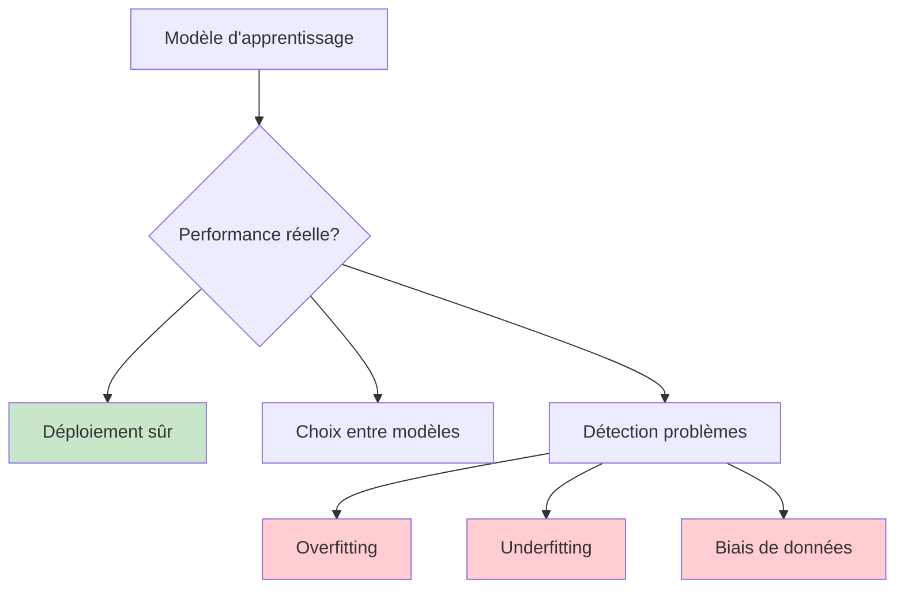
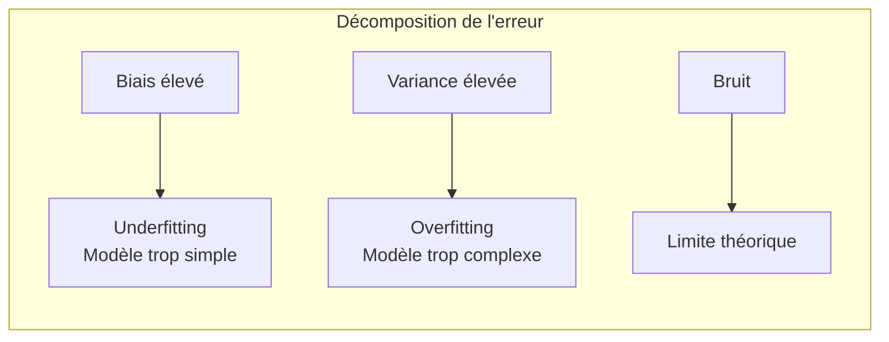
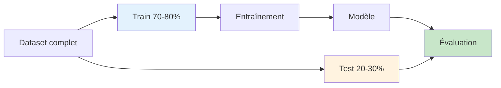
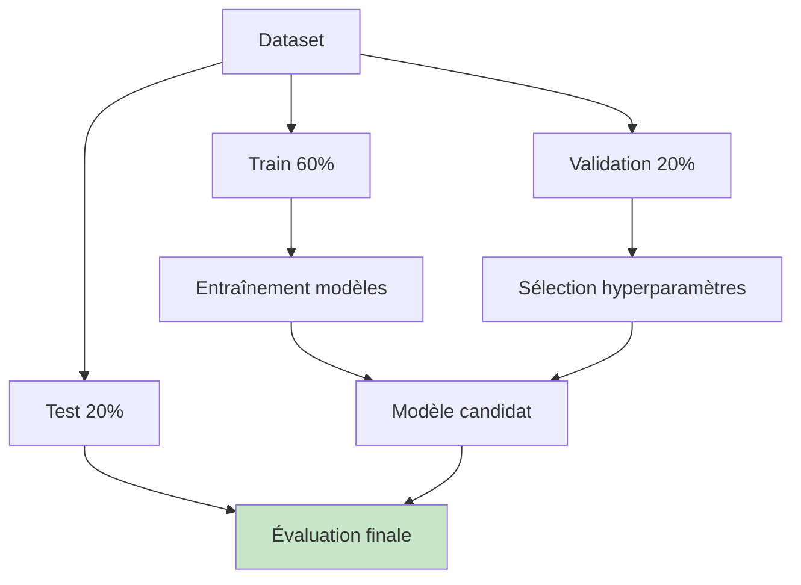
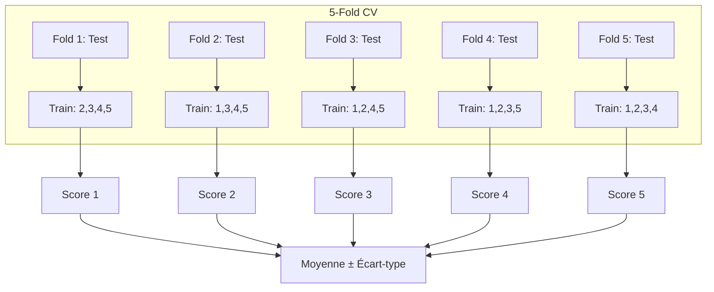
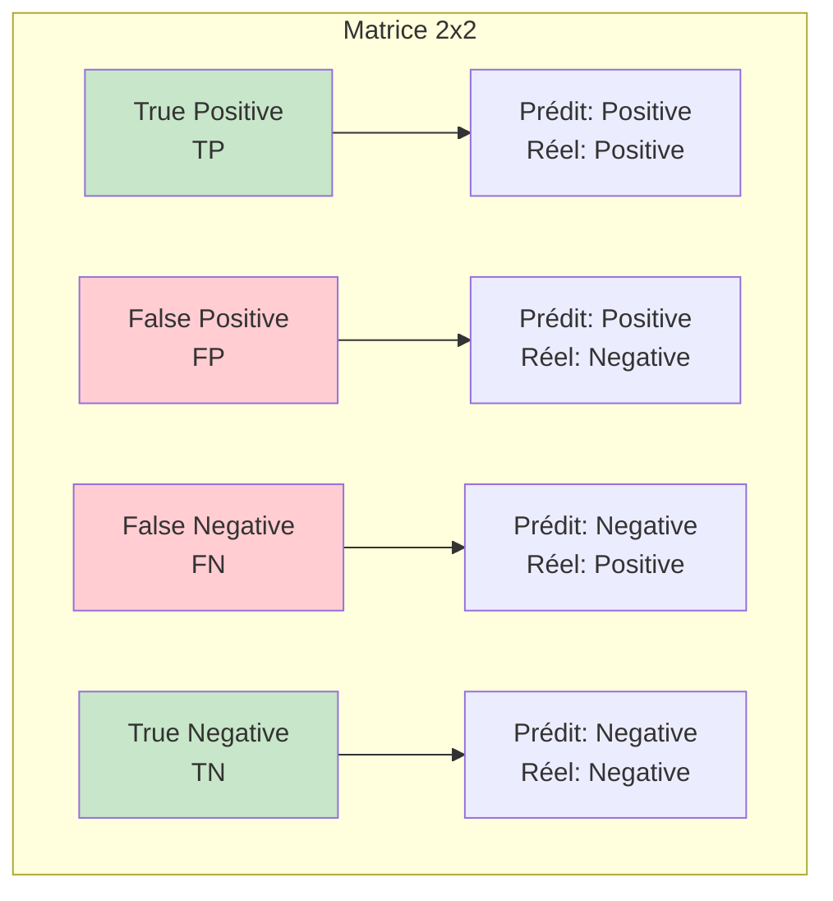
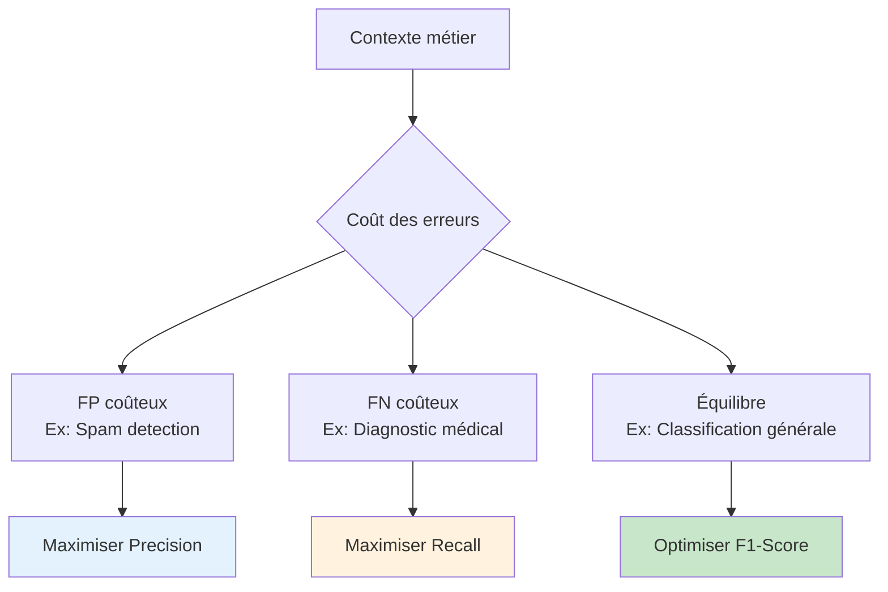
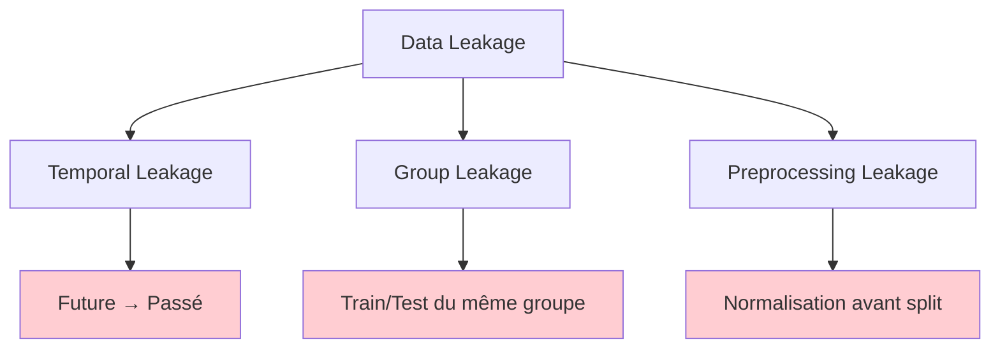

# Évaluation et validation de modèles

## 🎯 Objectifs d'apprentissage

À la fin de cette leçon, vous serez capable de :
- ✅ Mettre en place une validation robuste
- ✅ Choisir les métriques appropriées selon le contexte
- ✅ Diagnostiquer l'overfitting et l'underfitting
- ✅ Interpréter les courbes d'apprentissage

---

## 🎯 Fondements de l'évaluation

### Pourquoi évaluer ?



### Erreur de généralisation

**Objectif** : Estimer la performance sur des **données non vues**

**Erreur totale** = Biais² + Variance + Bruit irréductible



---

## 📊 Stratégies de validation

### 1. Train/Test Split

#### Principe de base



#### Implémentation

```python
from sklearn.model_selection import train_test_split
from sklearn.ensemble import RandomForestClassifier
from sklearn.metrics import accuracy_score

# Split stratifié (préserve les proportions de classes)
X_train, X_test, y_train, y_test = train_test_split(
    X, y, 
    test_size=0.2,           # 20% pour test
    random_state=42,         # Reproductibilité
    stratify=y              # Stratification
)

# Entraînement
model = RandomForestClassifier(random_state=42)
model.fit(X_train, y_train)

# Évaluation
y_pred = model.predict(X_test)
accuracy = accuracy_score(y_test, y_pred)
print(f"Accuracy: {accuracy:.3f}")
```

#### Limites du simple split

- **Variance élevée** : Résultat dépend du split aléatoire
- **Gaspillage de données** : Moins de données pour l'entraînement
- **Pas de tuning** : Comment choisir les hyperparamètres ?

### 2. Train/Validation/Test Split

#### Structure à trois niveaux



#### Workflow complet

```python
from sklearn.model_selection import train_test_split
from sklearn.model_selection import GridSearchCV

# Premier split : Train + Val / Test
X_temp, X_test, y_temp, y_test = train_test_split(
    X, y, test_size=0.2, random_state=42, stratify=y
)

# Deuxième split : Train / Val
X_train, X_val, y_train, y_val = train_test_split(
    X_temp, y_temp, test_size=0.25, random_state=42, stratify=y_temp
)

print(f"Train: {len(X_train)} samples")
print(f"Validation: {len(X_val)} samples") 
print(f"Test: {len(X_test)} samples")

# Grid search sur train/val
param_grid = {'n_estimators': [50, 100, 200], 'max_depth': [5, 10, None]}
grid_search = GridSearchCV(
    RandomForestClassifier(random_state=42),
    param_grid,
    cv=5,  # CV sur les données train/val
    scoring='accuracy'
)

grid_search.fit(X_train, y_train)

# Évaluation finale sur test set (une seule fois!)
final_model = grid_search.best_estimator_
test_accuracy = final_model.score(X_test, y_test)
print(f"Test accuracy finale: {test_accuracy:.3f}")
```

### 3. Validation croisée (Cross-Validation)

#### K-Fold Cross-Validation



#### Implémentation

```python
from sklearn.model_selection import cross_val_score, StratifiedKFold
import numpy as np

# Validation croisée simple
scores = cross_val_score(
    RandomForestClassifier(random_state=42),
    X, y,
    cv=5,                    # 5 folds
    scoring='accuracy'
)

print(f"CV Accuracy: {scores.mean():.3f} (+/- {scores.std() * 2:.3f})")

# Validation croisée stratifiée (recommandée)
skf = StratifiedKFold(n_splits=5, shuffle=True, random_state=42)
stratified_scores = cross_val_score(
    RandomForestClassifier(random_state=42),
    X, y,
    cv=skf,
    scoring='accuracy'
)

print(f"Stratified CV: {stratified_scores.mean():.3f} (+/- {stratified_scores.std() * 2:.3f})")
```

#### Variants de CV

**Leave-One-Out (LOO)**
```python
from sklearn.model_selection import LeaveOneOut

loo = LeaveOneOut()
loo_scores = cross_val_score(model, X, y, cv=loo)
# Attention: très coûteux pour gros datasets
```

**Time Series Split**
```python
from sklearn.model_selection import TimeSeriesSplit

tscv = TimeSeriesSplit(n_splits=5)
ts_scores = cross_val_score(model, X, y, cv=tscv)
# Respecte l'ordre temporel
```

**Group K-Fold**
```python
from sklearn.model_selection import GroupKFold

groups = [0, 0, 1, 1, 2, 2, 3, 3]  # Groupes de données
gkf = GroupKFold(n_splits=3)
group_scores = cross_val_score(model, X, y, cv=gkf, groups=groups)
# Évite le data leakage entre groupes
```

---

## 📊 Métriques d'évaluation

### Classification binaire

#### Matrice de confusion



#### Métriques principales

```python
from sklearn.metrics import classification_report, confusion_matrix
from sklearn.metrics import accuracy_score, precision_score, recall_score, f1_score

# Prédictions
y_pred = model.predict(X_test)

# Métriques individuelles
accuracy = accuracy_score(y_test, y_pred)
precision = precision_score(y_test, y_pred, average='binary')
recall = recall_score(y_test, y_pred, average='binary')
f1 = f1_score(y_test, y_pred, average='binary')

print(f"Accuracy:  {accuracy:.3f}")
print(f"Precision: {precision:.3f}")
print(f"Recall:    {recall:.3f}")
print(f"F1-Score:  {f1:.3f}")

# Rapport complet
print("\nClassification Report:")
print(classification_report(y_test, y_pred))

# Matrice de confusion
print("\nConfusion Matrix:")
print(confusion_matrix(y_test, y_pred))
```

**Formules** :
- **Accuracy** = (TP + TN) / (TP + TN + FP + FN)
- **Precision** = TP / (TP + FP)
- **Recall (Sensitivity)** = TP / (TP + FN)
- **Specificity** = TN / (TN + FP)
- **F1-Score** = 2 × (Precision × Recall) / (Precision + Recall)

#### Choix de métrique selon le contexte



### Métriques probabilistes

#### ROC et AUC

```python
from sklearn.metrics import roc_curve, roc_auc_score
import matplotlib.pyplot as plt

# Probabilités (nécessaires pour ROC)
y_proba = model.predict_proba(X_test)[:, 1]

# Calcul ROC
fpr, tpr, thresholds = roc_curve(y_test, y_proba)
auc_score = roc_auc_score(y_test, y_proba)

# Visualisation
plt.figure(figsize=(8, 6))
plt.plot(fpr, tpr, color='darkorange', lw=2, 
         label=f'ROC curve (AUC = {auc_score:.2f})')
plt.plot([0, 1], [0, 1], color='navy', lw=2, linestyle='--', label='Random')
plt.xlim([0.0, 1.0])
plt.ylim([0.0, 1.05])
plt.xlabel('False Positive Rate')
plt.ylabel('True Positive Rate')
plt.title('Receiver Operating Characteristic')
plt.legend(loc="lower right")
plt.show()

print(f"AUC-ROC: {auc_score:.3f}")
```

#### Precision-Recall Curve

```python
from sklearn.metrics import precision_recall_curve, average_precision_score

# Courbe Precision-Recall
precision, recall, thresholds = precision_recall_curve(y_test, y_proba)
ap_score = average_precision_score(y_test, y_proba)

plt.figure(figsize=(8, 6))
plt.plot(recall, precision, color='blue', lw=2,
         label=f'PR curve (AP = {ap_score:.2f})')
plt.xlabel('Recall')
plt.ylabel('Precision')
plt.title('Precision-Recall Curve')
plt.legend()
plt.show()
```

**Quand utiliser quoi ?**
- **ROC-AUC** : Classes équilibrées
- **PR-AUC** : Classes déséquilibrées (focus sur classe minoritaire)

### Classification multiclasse

#### Stratégies d'agrégation

```python
from sklearn.metrics import classification_report

# Micro-average: Agrège puis calcule
# Macro-average: Calcule puis agrège
# Weighted-average: Pondéré par support

# Exemple avec iris
from sklearn.datasets import load_iris
iris = load_iris()
X, y = iris.data, iris.target

# Modèle multiclasse
model_multi = RandomForestClassifier(random_state=42)
model_multi.fit(X_train, y_train)
y_pred_multi = model_multi.predict(X_test)

# Métriques multiclasses
print("Micro-average:", f1_score(y_test, y_pred_multi, average='micro'))
print("Macro-average:", f1_score(y_test, y_pred_multi, average='macro'))
print("Weighted-average:", f1_score(y_test, y_pred_multi, average='weighted'))

# Rapport détaillé
print("\n", classification_report(y_test, y_pred_multi, target_names=iris.target_names))
```

### Métriques de régression

```python
from sklearn.metrics import mean_squared_error, mean_absolute_error, r2_score
import numpy as np

# Générer des données de régression
from sklearn.datasets import make_regression
X_reg, y_reg = make_regression(n_samples=1000, n_features=10, noise=0.1, random_state=42)

# Entraînement
from sklearn.linear_model import LinearRegression
reg_model = LinearRegression()
reg_model.fit(X_train, y_train)
y_pred_reg = reg_model.predict(X_test)

# Métriques de régression
mse = mean_squared_error(y_test, y_pred_reg)
rmse = np.sqrt(mse)
mae = mean_absolute_error(y_test, y_pred_reg)
r2 = r2_score(y_test, y_pred_reg)

print(f"MSE:  {mse:.3f}")
print(f"RMSE: {rmse:.3f}")
print(f"MAE:  {mae:.3f}")
print(f"R²:   {r2:.3f}")

# MAPE (Mean Absolute Percentage Error)
mape = np.mean(np.abs((y_test - y_pred_reg) / y_test)) * 100
print(f"MAPE: {mape:.1f}%")
```

---

## 📈 Diagnostic des modèles

### Courbes d'apprentissage

```python
from sklearn.model_selection import learning_curve

# Génération des courbes
train_sizes, train_scores, val_scores = learning_curve(
    RandomForestClassifier(random_state=42),
    X, y,
    cv=5,
    train_sizes=np.linspace(0.1, 1.0, 10),
    scoring='accuracy',
    n_jobs=-1
)

# Calcul des moyennes et écarts-types
train_mean = np.mean(train_scores, axis=1)
train_std = np.std(train_scores, axis=1)
val_mean = np.mean(val_scores, axis=1)
val_std = np.std(val_scores, axis=1)

# Visualisation
plt.figure(figsize=(10, 6))
plt.plot(train_sizes, train_mean, 'o-', color='blue', label='Training score')
plt.fill_between(train_sizes, train_mean - train_std, train_mean + train_std, alpha=0.1, color='blue')

plt.plot(train_sizes, val_mean, 'o-', color='red', label='Validation score')
plt.fill_between(train_sizes, val_mean - val_std, val_mean + val_std, alpha=0.1, color='red')

plt.xlabel('Training Set Size')
plt.ylabel('Accuracy Score')
plt.title('Learning Curves')
plt.legend(loc='best')
plt.grid(True)
plt.show()
```

### Interprétation des courbes

```mermaid
graph TD
    subgraph "Underfitting"
        A[Train score bas] --> B[Val score bas]
        B --> C[Écart faible]
        C --> D[→ Modèle plus complexe]
    end
    
    subgraph "Overfitting"
        E[Train score élevé] --> F[Val score bas]
        F --> G[Écart important]
        G --> H[→ Régularisation]
    end
    
    subgraph "Bon modèle"
        I[Train score élevé] --> J[Val score élevé]
        J --> K[Écart faible]
        K --> L[→ Modèle optimal]
    end
    
    style D fill:#fff3e0
    style H fill:#ffcdd2
    style L fill:#c8e6c9
```



### Courbes de validation

```python
from sklearn.model_selection import validation_curve

# Validation curve pour un hyperparamètre
param_range = [1, 5, 10, 20, 50, 100, 200]
train_scores, val_scores = validation_curve(
    RandomForestClassifier(random_state=42),
    X, y,
    param_name='n_estimators',
    param_range=param_range,
    cv=5,
    scoring='accuracy'
)

train_mean = np.mean(train_scores, axis=1)
train_std = np.std(train_scores, axis=1)
val_mean = np.mean(val_scores, axis=1)
val_std = np.std(val_scores, axis=1)

plt.figure(figsize=(10, 6))
plt.semilogx(param_range, train_mean, 'o-', color='blue', label='Training score')
plt.fill_between(param_range, train_mean - train_std, train_mean + train_std, alpha=0.1, color='blue')

plt.semilogx(param_range, val_mean, 'o-', color='red', label='Validation score')
plt.fill_between(param_range, val_mean - val_std, val_mean + val_std, alpha=0.1, color='red')

plt.xlabel('n_estimators')
plt.ylabel('Accuracy Score')
plt.title('Validation Curve')
plt.legend(loc='best')
plt.grid(True)
plt.show()
```

---

## ⚠️ Pièges et bonnes pratiques

### Data Leakage

#### Types de fuites



#### Prévention

```python
# ❌ MAUVAIS: Normalisation avant split
scaler = StandardScaler()
X_scaled = scaler.fit_transform(X)  # Fuite d'information
X_train, X_test = train_test_split(X_scaled, y)

# ✅ BON: Normalisation après split
X_train, X_test, y_train, y_test = train_test_split(X, y)
scaler = StandardScaler()
X_train_scaled = scaler.fit_transform(X_train)
X_test_scaled = scaler.transform(X_test)  # Seulement transform!
```

### Validation pour données temporelles

```python
from sklearn.model_selection import TimeSeriesSplit

# Respect de l'ordre temporel
tscv = TimeSeriesSplit(n_splits=5)

for train_idx, test_idx in tscv.split(X):
    X_train_fold, X_test_fold = X[train_idx], X[test_idx]
    y_train_fold, y_test_fold = y[train_idx], y[test_idx]
    
    # Train seulement sur le passé
    # Test sur le futur
```

### Classes déséquilibrées

```python
from sklearn.metrics import classification_report
from sklearn.utils.class_weight import compute_class_weight

# Stratification obligatoire
X_train, X_test, y_train, y_test = train_test_split(
    X, y, stratify=y, test_size=0.2
)

# Pondération des classes
class_weights = compute_class_weight('balanced', classes=np.unique(y_train), y=y_train)
weight_dict = dict(zip(np.unique(y_train), class_weights))

model_balanced = RandomForestClassifier(
    class_weight=weight_dict,  # ou 'balanced'
    random_state=42
)

# Métriques adaptées
print(classification_report(y_test, y_pred, target_names=['Class 0', 'Class 1']))
```

---

## 🚀 Techniques avancées

### Validation croisée imbriquée

```python
from sklearn.model_selection import cross_val_score, GridSearchCV

# CV externe pour estimation non biaisée
outer_cv = StratifiedKFold(n_splits=5, shuffle=True, random_state=42)
inner_cv = StratifiedKFold(n_splits=3, shuffle=True, random_state=42)

# Grid search avec CV interne
grid_search = GridSearchCV(
    RandomForestClassifier(random_state=42),
    param_grid={'n_estimators': [50, 100], 'max_depth': [5, 10]},
    cv=inner_cv
)

# Évaluation avec CV externe
nested_scores = cross_val_score(grid_search, X, y, cv=outer_cv)
print(f"Nested CV score: {nested_scores.mean():.3f} (+/- {nested_scores.std() * 2:.3f})")
```

### Bootstrap et intervalles de confiance

```python
from sklearn.utils import resample

def bootstrap_metric(y_true, y_pred, metric_func, n_bootstrap=1000):
    """Calcule l'intervalle de confiance d'une métrique via bootstrap"""
    n_samples = len(y_true)
    bootstrap_scores = []
    
    for _ in range(n_bootstrap):
        # Échantillonnage avec remise
        indices = resample(range(n_samples), n_samples=n_samples)
        y_true_boot = [y_true[i] for i in indices]
        y_pred_boot = [y_pred[i] for i in indices]
        
        # Calcul de la métrique
        score = metric_func(y_true_boot, y_pred_boot)
        bootstrap_scores.append(score)
    
    # Intervalles de confiance
    ci_lower = np.percentile(bootstrap_scores, 2.5)
    ci_upper = np.percentile(bootstrap_scores, 97.5)
    
    return bootstrap_scores, ci_lower, ci_upper

# Exemple d'utilisation
y_pred = model.predict(X_test)
boot_scores, ci_low, ci_high = bootstrap_metric(y_test, y_pred, accuracy_score)

print(f"Accuracy: {accuracy_score(y_test, y_pred):.3f}")
print(f"95% CI: [{ci_low:.3f}, {ci_high:.3f}]")
```

---

## 🎯 Récapitulatif

**Points clés à retenir :**

### Stratégies de validation
1. **Simple split** : Pour prototypage rapide
2. **Train/Val/Test** : Pour sélection de modèles
3. **Cross-validation** : Estimation robuste
4. **Validation imbriquée** : Évaluation non biaisée

### Choix des métriques
- **Classification équilibrée** : Accuracy, F1-score
- **Classification déséquilibrée** : Precision, Recall, AUC-PR
- **Régression** : RMSE (outliers), MAE (robuste)
- **Contexte métier** : Coût des erreurs

### Diagnostic des problèmes
- **Courbes d'apprentissage** : Détection underfitting/overfitting
- **Courbes de validation** : Optimisation hyperparamètres
- **Matrice de confusion** : Analyse des erreurs

### Bonnes pratiques
1. **Stratification** pour classes déséquilibrées
2. **Preprocessing** après split seulement
3. **Validation temporelle** pour séries temporelles
4. **Test set** utilisé une seule fois
5. **Intervalles de confiance** pour la robustesse

---

## 🔗 Pour aller plus loin

- **Métriques métier** : Profit, coût, impact business
- **Tests statistiques** : Significativité des différences
- **Validation adversariale** : Robustesse aux attaques
- **Fairness metrics** : Équité et biais algorithmique