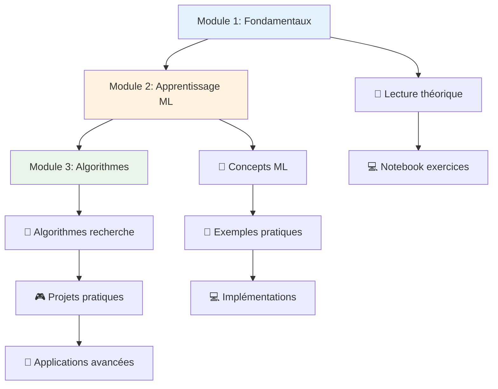

# 🎓 Cours d'Intelligence Artificielle

Bienvenue dans ce parcours d'apprentissage complet de l'Intelligence Artificielle ! Ce cours vous guidera des concepts fondamentaux aux applications pratiques modernes.

## 📚 Structure du cours

### 🎯 Module 1 : Fondamentaux
**[Fondamentaux de l'Intelligence Artificielle](./intro-ia-fondamentaux.md)**
- ⏱️ **Durée :** 25 minutes
- 📊 **Niveau :** Débutant
- 🎯 **Objectifs :** Comprendre les concepts de base, l'histoire et les approches de l'IA

**Ce que vous apprendrez :**
- Définition et domaines d'application de l'IA
- Histoire et évolution des cycles technologiques
- Différences entre approches symboliques et statistiques
- Architecture moderne d'un projet IA
- Défis éthiques et perspectives d'avenir

### 🤖 Module 2 : Apprentissage automatique
**[Types d'apprentissage automatique](./intro-ia-types-ml.md)**
- ⏱️ **Durée :** 30 minutes
- 📊 **Niveau :** Intermédiaire
- 🎯 **Objectifs :** Maîtriser les paradigmes d'apprentissage et leurs applications

**Ce que vous apprendrez :**
- Apprentissage supervisé (classification, régression)
- Apprentissage non supervisé (clustering, réduction de dimensionnalité)
- Apprentissage par renforcement (MDP, Q-learning, applications)
- Métriques d'évaluation et validation
- Choix d'algorithmes selon le contexte

### 🔍 Module 3 : Algorithmes et optimisation
**[Algorithmes de recherche et optimisation](./algorithmes-recherche-optimisation.md)**
- ⏱️ **Durée :** 45 minutes
- 📊 **Niveau :** Intermédiaire
- 🎯 **Objectifs :** Comprendre les algorithmes de recherche et d'optimisation

**Ce que vous apprendrez :**
- Algorithmes de recherche non informée (BFS, DFS)
- Recherche heuristique (A*, recherche gourmande)
- Méta-heuristiques (recuit simulé, algorithmes génétiques)
- Jeux et recherche adversariale (minimax, alpha-bêta)
- Applications pratiques et optimisation

## 🎯 Progression recommandée



## 💻 Ressources pratiques

### Notebooks d'exercices
Chaque module inclut un notebook Jupyter avec des exercices pratiques :

1. **[Fondamentaux](/notebooks/01_fondamentaux_exercices.ipynb)**
   - Domaines d'application de l'IA
   - Mini-système expert avec règles
   - Quiz sur l'histoire de l'IA

2. **[Types d'apprentissage](/notebooks/02_types_ml_exercices.ipynb)**
   - Calcul de métriques (précision, rappel, F1)
   - Régression linéaire univariée
   - K-means step by step

3. **[Algorithmes de recherche](/notebooks/03_recherche_optimisation_exercices.ipynb)**
   - Implémentation BFS sur graphe
   - A* avec heuristique Manhattan
   - Comparaison empirique d'algorithmes

### 🛠️ Environnement de développement

**Prérequis :**
```bash
# Installation des dépendances Python
pip install numpy pandas scikit-learn matplotlib jupyter
pip install networkx  # Pour les graphes
pip install deap      # Pour les algorithmes génétiques
```

**Structure de fichiers recommandée :**
```
projet-ia/
├── notebooks/          # Exercices pratiques
├── data/              # Datasets pour les exemples
├── src/               # Code source des implémentations
└── docs/              # Documentation supplémentaire
```

## 🎯 Objectifs d'apprentissage globaux

À la fin de ce cours, vous serez capable de :

### 🧠 Compétences théoriques
- ✅ Expliquer les concepts fondamentaux de l'IA
- ✅ Choisir l'approche ML appropriée selon le problème
- ✅ Évaluer et optimiser des modèles d'apprentissage
- ✅ Concevoir des algorithmes de recherche efficaces

### 💻 Compétences pratiques
- ✅ Implémenter des algorithmes ML de base
- ✅ Utiliser scikit-learn pour résoudre des problèmes réels
- ✅ Programmer des algorithmes de recherche (BFS, DFS, A*)
- ✅ Analyser et visualiser des résultats d'expériences

### 🚀 Applications métier
- ✅ Identifier les opportunités d'IA dans votre domaine
- ✅ Concevoir et mener un projet IA de bout en bout
- ✅ Évaluer les risques et défis éthiques
- ✅ Communiquer efficacement sur des projets IA

## 📈 Évaluation et certification

### Tests de connaissances
- **Quiz interactifs** à la fin de chaque module
- **Projets pratiques** avec correction automatisée
- **Études de cas** pour l'application métier

### Critères de réussite
- **Théorie :** 80% de bonnes réponses aux quiz
- **Pratique :** Implémentation fonctionnelle des algorithmes
- **Application :** Présentation d'un projet personnel

## 🔗 Ressources complémentaires

### 📚 Lectures essentielles
- **"Artificial Intelligence: A Modern Approach"** (Russell & Norvig)
- **"The Elements of Statistical Learning"** (Hastie, Tibshirani, Friedman)
- **"Pattern Recognition and Machine Learning"** (Bishop)

### 🎓 Cours universitaires
- **MIT 6.034:** Introduction to Artificial Intelligence
- **Stanford CS229:** Machine Learning
- **UC Berkeley CS188:** Introduction to Artificial Intelligence

### 🔧 Outils et bibliothèques
- **Python ML:** scikit-learn, pandas, numpy
- **Deep Learning:** TensorFlow, PyTorch
- **Visualisation:** matplotlib, seaborn, plotly
- **Recherche:** NetworkX, Python-constraint

## 🚀 Après ce cours

### Spécialisations possibles
- **Deep Learning** : Réseaux de neurones avancés
- **Computer Vision** : Traitement d'images et vidéos
- **NLP** : Traitement du langage naturel
- **Robotique** : IA embarquée et contrôle
- **IA éthique** : Gouvernance et responsabilité

### Projets avancés suggérés
- Système de recommandation personnalisé
- Chatbot intelligent avec NLP
- Reconnaissance d'objets en temps réel
- Trading algorithmique avec RL
- Optimisation de planning avec contraintes

---

*Bon apprentissage ! N'hésitez pas à prendre votre temps avec chaque module et à pratiquer les exercices. La maîtrise de l'IA demande de la patience et de la pratique régulière.*