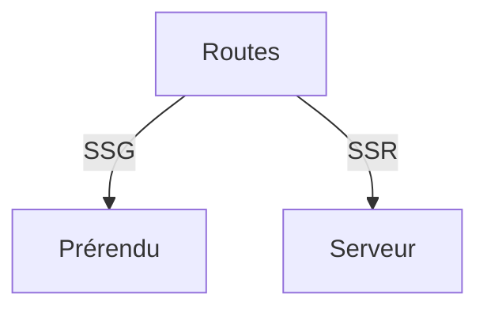

# Objectifs d'apprentissage
- Comprendre le file-based routing avec App Router
- Mettre en place SSG et SSR pour des pages
- Récupérer des données côté serveur et client

# Contenu

## 1. Routing par fichiers
- `app/page.tsx`, `app/posts/[slug]/page.tsx`
- Segment dynamique vs statique

## 2. SSG/SSR
- `generateStaticParams` pour SSG
- Pages avec fetch côté serveur

## 3. Data fetching
- Côté serveur: `fetch` dans une Server Component
- Côté client: `useEffect`, SWR, react-query (aperçu)

# Exercices
1. Créer une page dynamique SSG pour une liste d’items.
2. Ajouter une page SSR qui consomme une API.
