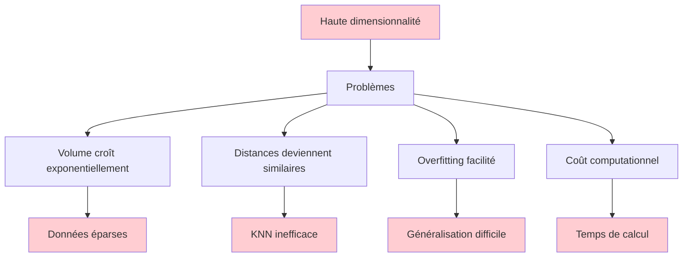
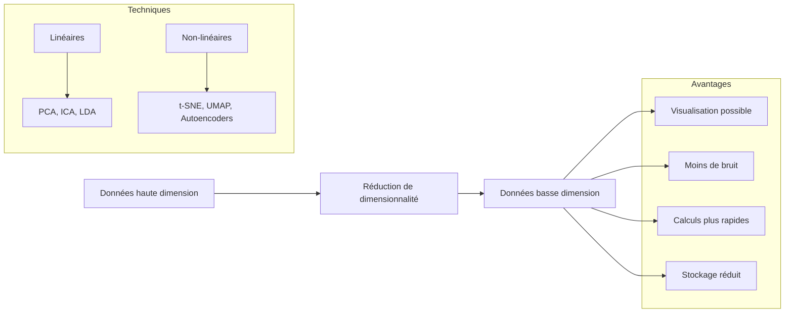
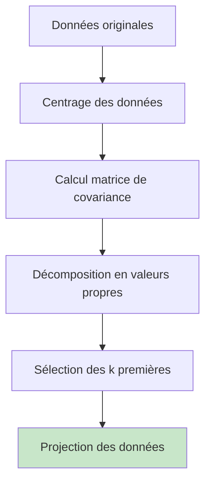
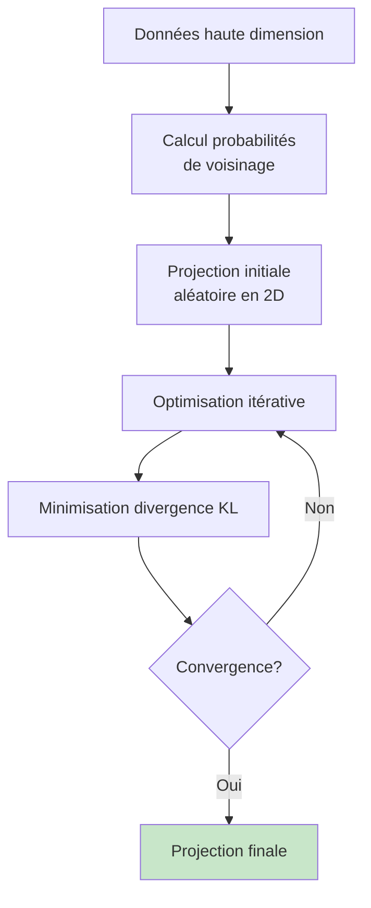
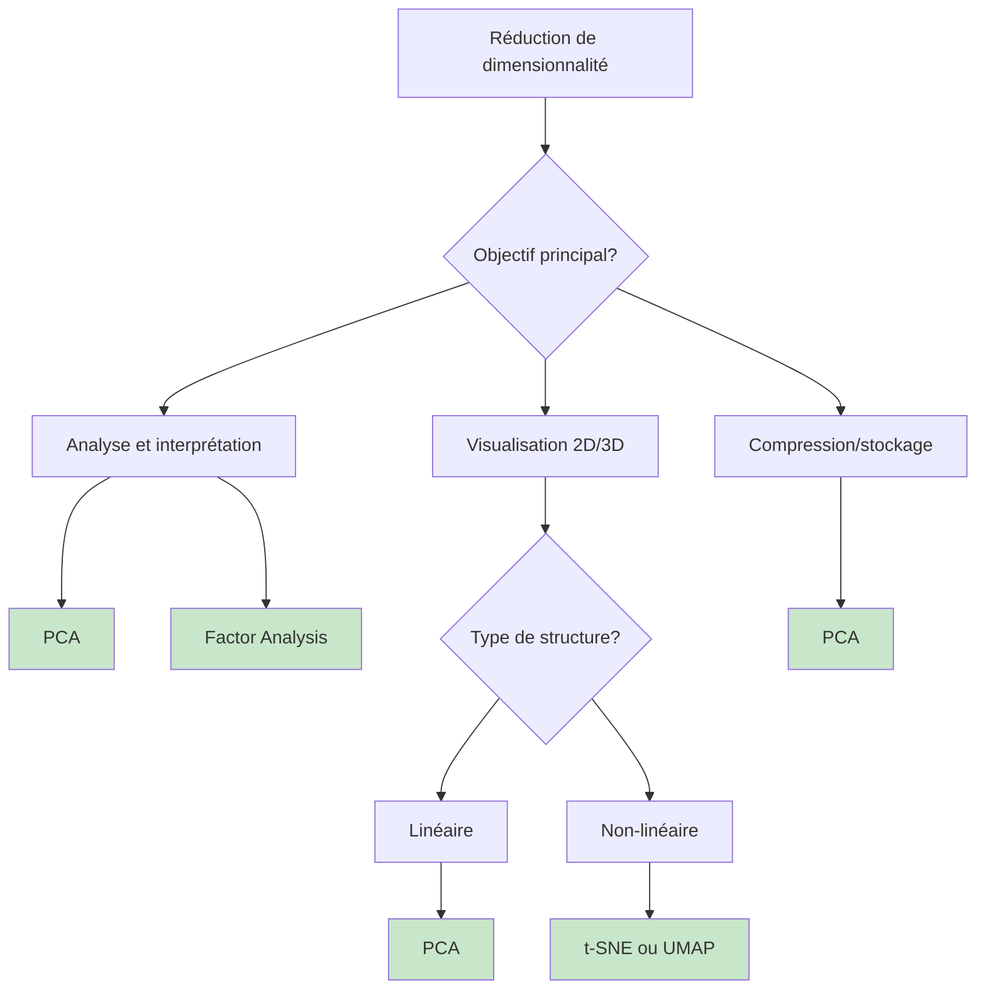

# Réduction de dimensionnalité : PCA et t-SNE

## 🎯 Objectifs d'apprentissage

À la fin de cette leçon, vous serez capable de :
- ✅ Comprendre le problème de la haute dimensionnalité
- ✅ Implémenter et interpréter PCA (Analyse en Composantes Principales)
- ✅ Utiliser t-SNE pour la visualisation de données complexes
- ✅ Choisir la technique appropriée selon le contexte

---

## 🔍 Le problème de la haute dimensionnalité

### Curse of Dimensionality

Plus le nombre de dimensions augmente, plus les données deviennent **éparses** et les algorithmes **inefficaces**.



### Démonstration du problème

```python
import numpy as np
import matplotlib.pyplot as plt
from sklearn.neighbors import NearestNeighbors

def demonstrate_curse_dimensionality():
    """Démonstration de la malédiction de la dimensionnalité"""
    dimensions = [1, 2, 5, 10, 20, 50, 100]
    n_samples = 1000
    
    avg_distances = []
    std_distances = []
    
    for d in dimensions:
        # Génération de données aléatoires
        X = np.random.uniform(-1, 1, (n_samples, d))
        
        # Calcul des distances au point origine
        distances = np.linalg.norm(X, axis=1)
        
        avg_distances.append(np.mean(distances))
        std_distances.append(np.std(distances))
    
    # Visualisation
    plt.figure(figsize=(12, 5))
    
    plt.subplot(1, 2, 1)
    plt.errorbar(dimensions, avg_distances, yerr=std_distances, 
                marker='o', capsize=5, capthick=2)
    plt.xlabel('Nombre de dimensions')
    plt.ylabel('Distance moyenne à l\'origine')
    plt.title('Concentration des distances en haute dimension')
    plt.grid(True)
    
    plt.subplot(1, 2, 2)
    plt.plot(dimensions, np.array(std_distances) / np.array(avg_distances), 
             'ro-', linewidth=2, markersize=8)
    plt.xlabel('Nombre de dimensions')
    plt.ylabel('Coefficient de variation (std/mean)')
    plt.title('Relativement, les distances deviennent similaires')
    plt.grid(True)
    
    plt.tight_layout()
    plt.show()

demonstrate_curse_dimensionality()
```

### Solutions : Réduction de dimensionnalité



---

## 📊 Analyse en Composantes Principales (PCA)

### Principe mathématique

**PCA** trouve les **directions de variance maximale** dans les données et projette sur un sous-espace de dimension réduite.



### Algorithme étape par étape

#### 1. Centrage des données

```python
import numpy as np
import matplotlib.pyplot as plt
from sklearn.datasets import load_iris, make_blobs
from sklearn.preprocessing import StandardScaler

# Données d'exemple
iris = load_iris()
X, y = iris.data, iris.target

# Centrage (importante étape!)
X_centered = X - np.mean(X, axis=0)

print("Données originales - moyennes par feature:")
print(np.mean(X, axis=0))
print("Données centrées - moyennes par feature:")
print(np.mean(X_centered, axis=0))
```

#### 2. Matrice de covariance

```python
# Calcul de la matrice de covariance
cov_matrix = np.cov(X_centered.T)
print("Matrice de covariance:")
print(cov_matrix)

# Visualisation
plt.figure(figsize=(8, 6))
plt.imshow(cov_matrix, cmap='coolwarm', center=0)
plt.colorbar()
plt.title('Matrice de covariance')
plt.xlabel('Features')
plt.ylabel('Features')
plt.show()
```

#### 3. Décomposition en valeurs propres

```python
# Calcul des valeurs et vecteurs propres
eigenvalues, eigenvectors = np.linalg.eig(cov_matrix)

# Tri par valeurs propres décroissantes
idx = np.argsort(eigenvalues)[::-1]
eigenvalues = eigenvalues[idx]
eigenvectors = eigenvectors[:, idx]

print("Valeurs propres (variance expliquée):")
for i, val in enumerate(eigenvalues):
    print(f"PC{i+1}: {val:.3f} ({val/np.sum(eigenvalues)*100:.1f}%)")

# Variance expliquée cumulée
cumsum_var = np.cumsum(eigenvalues) / np.sum(eigenvalues)
print(f"\nVariance cumulée PC1+PC2: {cumsum_var[1]*100:.1f}%")
```

#### 4. Projection des données

```python
def pca_transform(X, n_components=2):
    """Implémentation PCA from scratch"""
    # Centrage
    X_centered = X - np.mean(X, axis=0)
    
    # Matrice de covariance
    cov_matrix = np.cov(X_centered.T)
    
    # Valeurs et vecteurs propres
    eigenvalues, eigenvectors = np.linalg.eig(cov_matrix)
    
    # Tri
    idx = np.argsort(eigenvalues)[::-1]
    eigenvalues = eigenvalues[idx]
    eigenvectors = eigenvectors[:, idx]
    
    # Sélection des n_components premières composantes
    components = eigenvectors[:, :n_components]
    
    # Projection
    X_pca = X_centered @ components
    
    return X_pca, components, eigenvalues

# Application
X_pca_custom, components, eigenvalues = pca_transform(X, n_components=2)

# Visualisation
plt.figure(figsize=(12, 5))

plt.subplot(1, 2, 1)
plt.scatter(X[:, 0], X[:, 1], c=y, cmap='viridis', alpha=0.7)
plt.xlabel(iris.feature_names[0])
plt.ylabel(iris.feature_names[1])
plt.title('Données originales (2 premières features)')

plt.subplot(1, 2, 2)
plt.scatter(X_pca_custom[:, 0], X_pca_custom[:, 1], c=y, cmap='viridis', alpha=0.7)
plt.xlabel('PC1')
plt.ylabel('PC2')
plt.title('Projection PCA')

plt.tight_layout()
plt.show()
```

### Implémentation avec scikit-learn

```python
from sklearn.decomposition import PCA

# PCA avec scikit-learn
pca = PCA(n_components=2)
X_pca_sklearn = pca.fit_transform(X)

print("Variance expliquée par composante:")
print(pca.explained_variance_ratio_)
print(f"Variance totale expliquée: {np.sum(pca.explained_variance_ratio_)*100:.1f}%")

# Comparaison avec notre implémentation
print(f"\nDifférence max entre implémentations: {np.max(np.abs(X_pca_custom - X_pca_sklearn)):.6f}")

# Composantes principales
print("\nComposantes principales (directions de variance max):")
feature_names = iris.feature_names
for i, component in enumerate(pca.components_):
    print(f"PC{i+1}:")
    for j, coef in enumerate(component):
        print(f"  {feature_names[j]}: {coef:.3f}")
```

### Choisir le nombre de composantes

#### Variance expliquée

```python
# PCA avec toutes les composantes
pca_full = PCA()
pca_full.fit(X)

# Graphique de variance expliquée
plt.figure(figsize=(12, 5))

plt.subplot(1, 2, 1)
plt.plot(range(1, len(pca_full.explained_variance_ratio_) + 1), 
         pca_full.explained_variance_ratio_, 'bo-', linewidth=2, markersize=8)
plt.xlabel('Composante')
plt.ylabel('Variance expliquée')
plt.title('Variance expliquée par composante')
plt.grid(True)

plt.subplot(1, 2, 2)
plt.plot(range(1, len(pca_full.explained_variance_ratio_) + 1), 
         np.cumsum(pca_full.explained_variance_ratio_), 'ro-', linewidth=2, markersize=8)
plt.axhline(y=0.95, color='green', linestyle='--', label='95% variance')
plt.axhline(y=0.90, color='orange', linestyle='--', label='90% variance')
plt.xlabel('Nombre de composantes')
plt.ylabel('Variance cumulative expliquée')
plt.title('Variance cumulative expliquée')
plt.legend()
plt.grid(True)

plt.tight_layout()
plt.show()

# Nombre de composantes pour 95% de variance
n_components_95 = np.argmax(np.cumsum(pca_full.explained_variance_ratio_) >= 0.95) + 1
print(f"Composantes nécessaires pour 95% de variance: {n_components_95}")
```

#### Automatisation du choix

```python
def select_n_components(X, variance_threshold=0.95):
    """Sélection automatique du nombre de composantes"""
    pca = PCA()
    pca.fit(X)
    
    cumsum_var = np.cumsum(pca.explained_variance_ratio_)
    n_components = np.argmax(cumsum_var >= variance_threshold) + 1
    
    print(f"Pour {variance_threshold*100}% de variance expliquée:")
    print(f"Nombre de composantes nécessaires: {n_components}")
    print(f"Variance réellement expliquée: {cumsum_var[n_components-1]*100:.2f}%")
    
    return n_components

# Test avec différents seuils
for threshold in [0.85, 0.90, 0.95, 0.99]:
    select_n_components(X, threshold)
    print()
```

---

## 🌍 t-SNE (t-Distributed Stochastic Neighbor Embedding)

### Principe et motivation

**t-SNE** préserve la **structure locale** des données en haute dimension lors de la projection en 2D/3D.



### Différences PCA vs t-SNE

| Aspect | PCA | t-SNE |
|--------|-----|-------|
| **Objectif** | Variance maximale | Structure locale |
| **Type** | Linéaire | Non-linéaire |
| **Déterministe** | ✅ Oui | ❌ Non (stochastique) |
| **Vitesse** | 🚀 Rapide | 🐌 Lent |
| **Interprétation** | ✅ Components interprétables | ❌ Axes non interprétables |
| **Usage** | Réduction + analyse | Visualisation uniquement |

### Implémentation et visualisation

```python
from sklearn.manifold import TSNE
from sklearn.datasets import load_digits
import time

# Dataset plus complexe pour montrer l'intérêt de t-SNE
digits = load_digits()
X_digits, y_digits = digits.data, digits.target

print(f"Dataset digits: {X_digits.shape}")
print(f"Dimension originale: {X_digits.shape[1]}")

# Standardisation (recommandée)
scaler = StandardScaler()
X_digits_scaled = scaler.fit_transform(X_digits)

# Comparaison PCA vs t-SNE
fig, axes = plt.subplots(2, 2, figsize=(15, 12))

# 1. Données originales (2 premières features seulement)
axes[0, 0].scatter(X_digits[:, 0], X_digits[:, 1], c=y_digits, cmap='tab10', alpha=0.7)
axes[0, 0].set_title('Données originales (2 premières features)')
axes[0, 0].set_xlabel('Feature 0')
axes[0, 0].set_ylabel('Feature 1')

# 2. PCA
start_time = time.time()
pca_digits = PCA(n_components=2)
X_pca_digits = pca_digits.fit_transform(X_digits_scaled)
pca_time = time.time() - start_time

axes[0, 1].scatter(X_pca_digits[:, 0], X_pca_digits[:, 1], c=y_digits, cmap='tab10', alpha=0.7)
axes[0, 1].set_title(f'PCA ({pca_time:.3f}s)\nVariance expliquée: {np.sum(pca_digits.explained_variance_ratio_)*100:.1f}%')
axes[0, 1].set_xlabel('PC1')
axes[0, 1].set_ylabel('PC2')

# 3. t-SNE avec perplexité par défaut
start_time = time.time()
tsne_default = TSNE(n_components=2, perplexity=30, random_state=42)
X_tsne_default = tsne_default.fit_transform(X_digits_scaled)
tsne_time = time.time() - start_time

axes[1, 0].scatter(X_tsne_default[:, 0], X_tsne_default[:, 1], c=y_digits, cmap='tab10', alpha=0.7)
axes[1, 0].set_title(f't-SNE perplexity=30 ({tsne_time:.1f}s)')
axes[1, 0].set_xlabel('t-SNE 1')
axes[1, 0].set_ylabel('t-SNE 2')

# 4. t-SNE avec perplexité différente
start_time = time.time()
tsne_low = TSNE(n_components=2, perplexity=5, random_state=42)
X_tsne_low = tsne_low.fit_transform(X_digits_scaled)
tsne_low_time = time.time() - start_time

axes[1, 1].scatter(X_tsne_low[:, 0], X_tsne_low[:, 1], c=y_digits, cmap='tab10', alpha=0.7)
axes[1, 1].set_title(f't-SNE perplexity=5 ({tsne_low_time:.1f}s)')
axes[1, 1].set_xlabel('t-SNE 1')
axes[1, 1].set_ylabel('t-SNE 2')

plt.tight_layout()
plt.show()

print(f"PCA: Temps = {pca_time:.3f}s")
print(f"t-SNE (perp=30): Temps = {tsne_time:.1f}s")
print(f"t-SNE (perp=5): Temps = {tsne_low_time:.1f}s")
```

### Hyperparamètres de t-SNE

#### Perplexité

```python
def compare_perplexities(X, y, perplexities=[5, 15, 30, 50]):
    """Compare différentes valeurs de perplexité"""
    fig, axes = plt.subplots(2, 2, figsize=(15, 12))
    axes = axes.ravel()
    
    for i, perp in enumerate(perplexities):
        tsne = TSNE(n_components=2, perplexity=perp, random_state=42)
        X_tsne = tsne.fit_transform(X)
        
        axes[i].scatter(X_tsne[:, 0], X_tsne[:, 1], c=y, cmap='tab10', alpha=0.7)
        axes[i].set_title(f'Perplexité = {perp}')
        axes[i].set_xlabel('t-SNE 1')
        axes[i].set_ylabel('t-SNE 2')
    
    plt.tight_layout()
    plt.show()

# Test sur un sous-échantillon pour accélérer
n_samples = 1000
indices = np.random.choice(len(X_digits), n_samples, replace=False)
X_sample = X_digits_scaled[indices]
y_sample = y_digits[indices]

compare_perplexities(X_sample, y_sample)
```

#### Learning rate et itérations

```python
def compare_learning_rates(X, y, learning_rates=[10, 100, 200, 1000]):
    """Compare différents learning rates"""
    fig, axes = plt.subplots(2, 2, figsize=(15, 12))
    axes = axes.ravel()
    
    for i, lr in enumerate(learning_rates):
        tsne = TSNE(n_components=2, learning_rate=lr, n_iter=1000, random_state=42)
        X_tsne = tsne.fit_transform(X)
        
        axes[i].scatter(X_tsne[:, 0], X_tsne[:, 1], c=y, cmap='tab10', alpha=0.7)
        axes[i].set_title(f'Learning rate = {lr}')
        axes[i].set_xlabel('t-SNE 1')
        axes[i].set_ylabel('t-SNE 2')
    
    plt.tight_layout()
    plt.show()

compare_learning_rates(X_sample, y_sample)
```

---

## 🔄 Autres techniques de réduction

### UMAP (Uniform Manifold Approximation and Projection)

```python
# Installation: pip install umap-learn
try:
    import umap
    
    # UMAP: Plus rapide que t-SNE, préserve structure globale et locale
    start_time = time.time()
    reducer = umap.UMAP(n_components=2, random_state=42)
    X_umap = reducer.fit_transform(X_digits_scaled)
    umap_time = time.time() - start_time
    
    plt.figure(figsize=(15, 5))
    
    plt.subplot(1, 3, 1)
    plt.scatter(X_pca_digits[:, 0], X_pca_digits[:, 1], c=y_digits, cmap='tab10', alpha=0.7)
    plt.title(f'PCA ({pca_time:.3f}s)')
    
    plt.subplot(1, 3, 2)
    plt.scatter(X_tsne_default[:, 0], X_tsne_default[:, 1], c=y_digits, cmap='tab10', alpha=0.7)
    plt.title(f't-SNE ({tsne_time:.1f}s)')
    
    plt.subplot(1, 3, 3)
    plt.scatter(X_umap[:, 0], X_umap[:, 1], c=y_digits, cmap='tab10', alpha=0.7)
    plt.title(f'UMAP ({umap_time:.2f}s)')
    
    plt.tight_layout()
    plt.show()
    
    print(f"Temps d'exécution:")
    print(f"PCA: {pca_time:.3f}s")
    print(f"t-SNE: {tsne_time:.1f}s") 
    print(f"UMAP: {umap_time:.2f}s")
    
except ImportError:
    print("UMAP non installé. Installer avec: pip install umap-learn")
```

### Factor Analysis

```python
from sklearn.decomposition import FactorAnalysis

# Factor Analysis: Modèle probabiliste, trouve facteurs latents
fa = FactorAnalysis(n_components=2, random_state=42)
X_fa = fa.fit_transform(X_digits_scaled)

plt.figure(figsize=(10, 5))

plt.subplot(1, 2, 1)
plt.scatter(X_pca_digits[:, 0], X_pca_digits[:, 1], c=y_digits, cmap='tab10', alpha=0.7)
plt.title('PCA')
plt.xlabel('PC1')
plt.ylabel('PC2')

plt.subplot(1, 2, 2)
plt.scatter(X_fa[:, 0], X_fa[:, 1], c=y_digits, cmap='tab10', alpha=0.7)
plt.title('Factor Analysis')
plt.xlabel('Factor 1')
plt.ylabel('Factor 2')

plt.tight_layout()
plt.show()

print("Comparaison PCA vs Factor Analysis:")
print(f"PCA - Variance expliquée: {np.sum(pca_digits.explained_variance_ratio_)*100:.1f}%")
print(f"FA - Log-likelihood: {fa.score(X_digits_scaled):.2f}")
```

---

## 📊 Applications pratiques

### Visualisation de données complexes

```python
# Dataset réel : Reconnaissance de chiffres manuscrits
def visualize_digits_sample(X, y, title=""):
    """Visualise un échantillon de chiffres"""
    fig, axes = plt.subplots(2, 5, figsize=(12, 6))
    for i in range(10):
        idx = np.where(y == i)[0][0]
        axes[i//5, i%5].imshow(X[idx].reshape(8, 8), cmap='gray')
        axes[i//5, i%5].set_title(f'Chiffre {i}')
        axes[i//5, i%5].axis('off')
    plt.suptitle(title)
    plt.tight_layout()
    plt.show()

visualize_digits_sample(X_digits, y_digits, "Échantillon du dataset Digits")

# Application de PCA pour compression/débruitage
def pca_compression_demo(X, n_components_list=[10, 20, 40, 64]):
    """Démonstration de compression avec PCA"""
    original_dim = X.shape[1]
    
    fig, axes = plt.subplots(2, len(n_components_list), figsize=(15, 8))
    
    for i, n_comp in enumerate(n_components_list):
        # PCA
        pca = PCA(n_components=n_comp)
        X_compressed = pca.fit_transform(X)
        X_reconstructed = pca.inverse_transform(X_compressed)
        
        # Taux de compression
        compression_ratio = original_dim / n_comp
        variance_retained = np.sum(pca.explained_variance_ratio_) * 100
        
        # Visualisation d'un exemple
        example_idx = 0
        
        axes[0, i].imshow(X[example_idx].reshape(8, 8), cmap='gray')
        axes[0, i].set_title(f'Original (64D)')
        axes[0, i].axis('off')
        
        axes[1, i].imshow(X_reconstructed[example_idx].reshape(8, 8), cmap='gray')
        axes[1, i].set_title(f'{n_comp}D\n{compression_ratio:.1f}x compression\n{variance_retained:.1f}% variance')
        axes[1, i].axis('off')
    
    plt.tight_layout()
    plt.show()

pca_compression_demo(X_digits)
```

### Détection d'anomalies avec PCA

```python
def pca_anomaly_detection(X, contamination=0.1):
    """Détection d'anomalies basée sur l'erreur de reconstruction PCA"""
    # PCA avec toutes les composantes
    pca = PCA()
    X_transformed = pca.fit_transform(X)
    X_reconstructed = pca.inverse_transform(X_transformed)
    
    # Erreur de reconstruction
    reconstruction_errors = np.sum((X - X_reconstructed) ** 2, axis=1)
    
    # Seuil pour anomalies (percentile)
    threshold = np.percentile(reconstruction_errors, (1 - contamination) * 100)
    anomalies = reconstruction_errors > threshold
    
    return reconstruction_errors, anomalies, threshold

# Application
reconstruction_errors, anomalies, threshold = pca_anomaly_detection(X_digits_scaled, contamination=0.05)

# Visualisation
plt.figure(figsize=(15, 5))

plt.subplot(1, 3, 1)
plt.hist(reconstruction_errors, bins=50, alpha=0.7, color='blue')
plt.axvline(threshold, color='red', linestyle='--', label=f'Seuil = {threshold:.3f}')
plt.xlabel('Erreur de reconstruction')
plt.ylabel('Fréquence')
plt.title('Distribution des erreurs de reconstruction')
plt.legend()

plt.subplot(1, 3, 2)
plt.scatter(X_pca_digits[~anomalies, 0], X_pca_digits[~anomalies, 1], 
           c='blue', alpha=0.7, label='Normal')
plt.scatter(X_pca_digits[anomalies, 0], X_pca_digits[anomalies, 1], 
           c='red', alpha=0.7, label='Anomalie')
plt.xlabel('PC1')
plt.ylabel('PC2')
plt.title('Détection d\'anomalies dans l\'espace PCA')
plt.legend()

# Exemples d'anomalies détectées
plt.subplot(1, 3, 3)
anomaly_indices = np.where(anomalies)[0][:6]
for i, idx in enumerate(anomaly_indices):
    plt.subplot(2, 3, i+1)
    plt.imshow(X_digits[idx].reshape(8, 8), cmap='gray')
    plt.title(f'Anomalie {i+1}\nErreur: {reconstruction_errors[idx]:.3f}')
    plt.axis('off')

plt.tight_layout()
plt.show()

print(f"Nombre d'anomalies détectées: {np.sum(anomalies)} ({np.sum(anomalies)/len(X_digits)*100:.1f}%)")
```

---

## 🎯 Guide de choix de technique

### Arbre de décision



### Tableau de recommandations

| Contexte | Technique recommandée | Raison |
|----------|----------------------|---------|
| **Exploration initiale** | PCA | Rapide, interprétable |
| **Visualisation clusters** | t-SNE ou UMAP | Préserve structure locale |
| **Preprocessing ML** | PCA | Déterministe, inversible |
| **Compression d'images** | PCA | Linéaire, efficace |
| **Détection anomalies** | PCA | Erreur reconstruction |
| **Données catégorielles** | Correspondence Analysis | Adapté aux catégories |
| **Séries temporelles** | PCA ou ICA | Capture patterns temporels |

### Pipeline recommandé

```python
def dimensionality_reduction_pipeline(X, y=None, target_dim=2, methods=['pca', 'tsne']):
    """Pipeline complet de réduction de dimensionnalité"""
    
    # 1. Préparation des données
    scaler = StandardScaler()
    X_scaled = scaler.fit_transform(X)
    
    results = {}
    
    # 2. PCA (toujours recommandé en premier)
    if 'pca' in methods:
        print("=== PCA ===")
        start_time = time.time()
        
        pca = PCA(n_components=target_dim)
        X_pca = pca.fit_transform(X_scaled)
        
        pca_time = time.time() - start_time
        variance_explained = np.sum(pca.explained_variance_ratio_) * 100
        
        results['pca'] = {
            'data': X_pca,
            'time': pca_time,
            'variance_explained': variance_explained,
            'model': pca
        }
        
        print(f"Temps: {pca_time:.3f}s")
        print(f"Variance expliquée: {variance_explained:.1f}%")
    
    # 3. t-SNE (pour visualisation)
    if 'tsne' in methods:
        print("\n=== t-SNE ===")
        start_time = time.time()
        
        # Pré-réduction avec PCA si dimension > 50
        if X_scaled.shape[1] > 50:
            pca_prep = PCA(n_components=50)
            X_prep = pca_prep.fit_transform(X_scaled)
            print("Pré-réduction PCA: 50 composantes")
        else:
            X_prep = X_scaled
        
        tsne = TSNE(n_components=target_dim, random_state=42)
        X_tsne = tsne.fit_transform(X_prep)
        
        tsne_time = time.time() - start_time
        
        results['tsne'] = {
            'data': X_tsne,
            'time': tsne_time,
            'model': tsne
        }
        
        print(f"Temps: {tsne_time:.1f}s")
    
    # 4. Visualisation comparative
    if target_dim == 2 and y is not None:
        n_methods = len(methods)
        fig, axes = plt.subplots(1, n_methods, figsize=(5*n_methods, 4))
        if n_methods == 1:
            axes = [axes]
        
        for i, method in enumerate(methods):
            if method in results:
                data = results[method]['data']
                scatter = axes[i].scatter(data[:, 0], data[:, 1], c=y, cmap='tab10', alpha=0.7)
                axes[i].set_title(f'{method.upper()}\nTemps: {results[method]["time"]:.2f}s')
                axes[i].set_xlabel(f'{method.upper()} 1')
                axes[i].set_ylabel(f'{method.upper()} 2')
        
        plt.colorbar(scatter, ax=axes[-1])
        plt.tight_layout()
        plt.show()
    
    return results

# Test du pipeline
print("Pipeline de réduction de dimensionnalité:")
pipeline_results = dimensionality_reduction_pipeline(
    X_digits_scaled[:1000], 
    y_digits[:1000], 
    methods=['pca', 'tsne']
)
```

---

## 🎯 Récapitulatif

**Points clés à retenir :**

### PCA
- **Technique linéaire** : Trouve directions de variance maximale
- **Déterministe** : Résultats reproductibles
- **Interprétable** : Composantes ont un sens
- **Rapide** : Scalable à de gros datasets
- **Inversible** : Peut reconstruire données originales

### t-SNE
- **Technique non-linéaire** : Préserve structure locale
- **Stochastique** : Résultats varient selon l'initialisation
- **Visualisation** : Excellent pour explorer structure des données
- **Lent** : Temps de calcul élevé
- **Non-inversible** : Pas de reconstruction possible

### Applications
1. **Exploration** : PCA pour vue d'ensemble, t-SNE pour détails
2. **Preprocessing** : PCA pour réduire dimensionnalité avant ML
3. **Compression** : PCA pour stockage/transmission efficace
4. **Anomalies** : Erreur de reconstruction PCA
5. **Visualisation** : t-SNE/UMAP pour clusters complexes

### Bonnes pratiques
1. **Toujours normaliser** les données avant réduction
2. **Commencer par PCA** pour comprendre la structure
3. **t-SNE pour visualisation finale** seulement
4. **Valider avec métriques** appropriées
5. **Considérer le coût computationnel**

---

## 🔗 Pour aller plus loin

- **Autoencoders** : Réduction non-linéaire avec deep learning
- **Manifold learning** : LLE, Isomap, Spectral Embedding
- **Sparse PCA** : PCA avec parcimonie pour interprétabilité
- **Kernel PCA** : PCA non-linéaire avec kernel trick