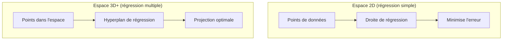
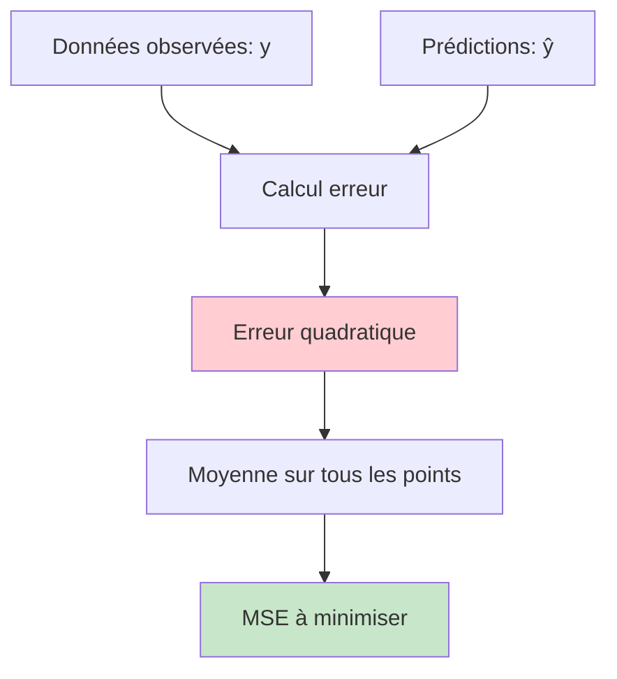
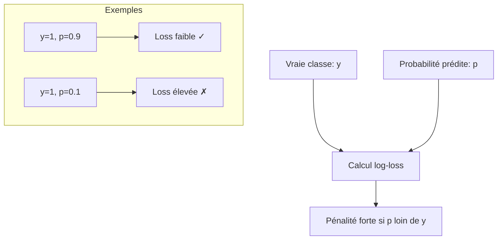
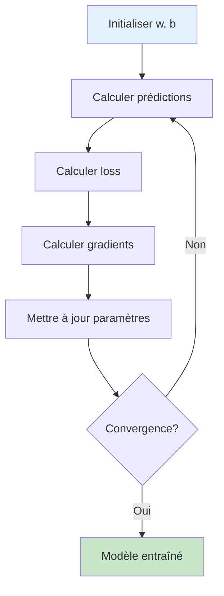
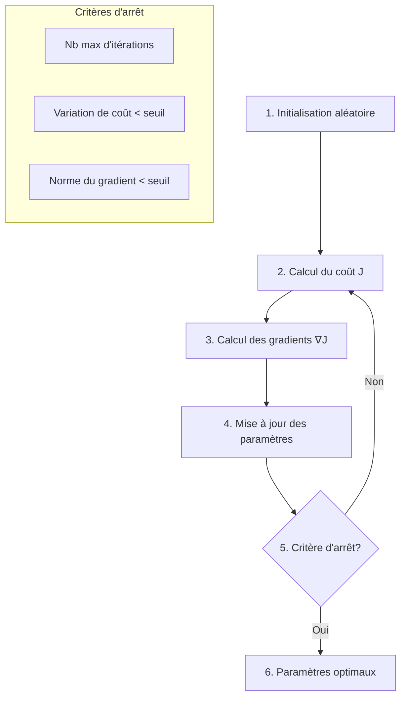
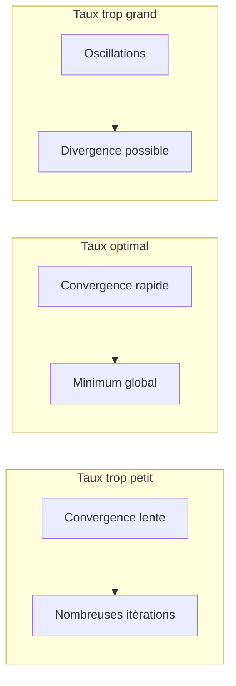
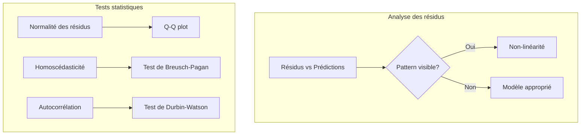

# Régression linéaire et logistique

## 🎯 Objectifs d'apprentissage

À la fin de cette leçon, vous serez capable de :
- ✅ Comprendre les principes de la régression linéaire
- ✅ Implémenter la régression logistique pour la classification
- ✅ Optimiser les paramètres avec la descente de gradient
- ✅ Évaluer et interpréter les résultats

---

## 📈 Régression linéaire

### Principe fondamental

La **régression linéaire** modélise la relation entre une variable dépendante et des variables indépendantes par une fonction linéaire.

```mermaid
graph LR
    subgraph "Régression simple"
        A[x: Variable indépendante] --> B[f(x) = ax + b]
        B --> C[y: Variable dépendante]
    end
    
    subgraph "Régression multiple"
        D[x₁, x₂, ..., xₙ] --> E[f(x) = w₁x₁ + w₂x₂ + ... + wₙxₙ + b]
        E --> F[y: Prédiction]
    end
```

### Formulation mathématique

#### Régression simple
**Équation** : ŷ = ax + b

où :
- **ŷ** : valeur prédite
- **a** : pente (coefficient)
- **b** : ordonnée à l'origine (biais)
- **x** : variable d'entrée

#### Régression multiple
**Équation** : ŷ = w₁x₁ + w₂x₂ + ... + wₙxₙ + b

**Notation vectorielle** : ŷ = w^T x + b

### Visualisation géométrique



### Fonction de coût : Moindres carrés

**Objectif** : Minimiser l'erreur quadratique moyenne

MSE = (1/n) × Σᵢ(yᵢ - ŷᵢ)²



### Solution analytique

Pour la régression linéaire simple :

**Formules optimales** :
- a = Σ[(xᵢ - x̄)(yᵢ - ȳ)] / Σ[(xᵢ - x̄)²]
- b = ȳ - a × x̄

**En notation matricielle** :
w = (X^T X)⁻¹ X^T y

### Implémentation Python

```python
import numpy as np
import matplotlib.pyplot as plt
from sklearn.linear_model import LinearRegression
from sklearn.metrics import mean_squared_error, r2_score

# Génération de données exemple
np.random.seed(42)
X = np.random.randn(100, 1)
y = 3 * X.squeeze() + 2 + np.random.randn(100) * 0.5

# Entraînement du modèle
model = LinearRegression()
model.fit(X, y)

# Prédictions
y_pred = model.predict(X)

# Évaluation
mse = mean_squared_error(y, y_pred)
r2 = r2_score(y, y_pred)

print(f"Coefficient: {model.coef_[0]:.2f}")
print(f"Intercept: {model.intercept_:.2f}")
print(f"MSE: {mse:.2f}")
print(f"R²: {r2:.2f}")
```

---

## 🎯 Régression logistique

### Du linéaire au logistique

**Problème** : La régression linéaire produit des valeurs continues, mais la classification nécessite des probabilités (0-1).

**Solution** : Fonction sigmoïde pour "compresser" la sortie linéaire.

```mermaid
graph LR
    A[Entrée linéaire<br/>z = wx + b] --> B[Fonction sigmoïde<br/>σ(z) = 1/(1 + e^-z)]
    B --> C[Probabilité<br/>p ∈ [0,1]]
    
    subgraph "Décision"
        C --> D{p ≥ 0.5?}
        D -->|Oui| E[Classe 1]
        D -->|Non| F[Classe 0]
    end
```

### Fonction sigmoïde

**Équation** : σ(z) = 1 / (1 + e^(-z))

**Propriétés** :
- Sortie entre 0 et 1 (interprétable comme probabilité)
- Forme en S lisse
- Dérivée simple : σ'(z) = σ(z)(1 - σ(z))

```mermaid
graph TD
    subgraph "Comportement de la sigmoïde"
        A[z → -∞] --> B[σ(z) → 0]
        C[z = 0] --> D[σ(z) = 0.5]
        E[z → +∞] --> F[σ(z) → 1]
    end
```

### Fonction de coût : Log-vraisemblance

**Problème** : MSE n'est pas convexe pour la régression logistique

**Solution** : Log-loss (entropie croisée)

**Loss = -[y log(p) + (1-y) log(1-p)]**



### Optimisation : Descente de gradient

**Principe** : Mise à jour itérative des paramètres



**Règles de mise à jour** :
- w := w - α × ∇w J
- b := b - α × ∇b J

où α est le taux d'apprentissage.

### Implémentation Python

```python
import numpy as np
from sklearn.linear_model import LogisticRegression
from sklearn.metrics import accuracy_score, classification_report
from sklearn.datasets import make_classification

# Génération de données
X, y = make_classification(n_samples=1000, n_features=2, n_redundant=0, 
                          n_informative=2, n_clusters_per_class=1, random_state=42)

# Entraînement
model = LogisticRegression()
model.fit(X, y)

# Prédictions
y_pred = model.predict(X)
y_prob = model.predict_proba(X)

# Évaluation
accuracy = accuracy_score(y, y_pred)
print(f"Accuracy: {accuracy:.2f}")
print(f"Coefficients: {model.coef_}")
print(f"Intercept: {model.intercept_}")
```

---

## ⚙️ Descente de gradient détaillée

### Algorithme général



### Variants de la descente de gradient

#### 1. Batch Gradient Descent
- **Utilise** : Tout le dataset à chaque itération
- **Avantages** : Convergence stable
- **Inconvénients** : Lent sur gros datasets

#### 2. Stochastic Gradient Descent (SGD)
- **Utilise** : Un échantillon à la fois
- **Avantages** : Rapide, peut échapper aux minima locaux
- **Inconvénients** : Convergence bruitée

#### 3. Mini-batch Gradient Descent
- **Utilise** : Petits lots d'échantillons
- **Avantages** : Compromis vitesse/stabilité
- **Inconvénients** : Hyperparamètre supplémentaire (taille de batch)

### Hyperparamètres critiques

#### Taux d'apprentissage (α)



**Stratégies d'adaptation** :
- **Learning rate scheduling** : Diminuer α au fil du temps
- **Adaptive methods** : Adam, RMSprop (ajustement automatique)

---

## 📊 Évaluation et diagnostic

### Métriques pour régression linéaire

#### 1. R² (Coefficient de détermination)
**Interprétation** : Proportion de variance expliquée par le modèle

R² = 1 - (SS_res / SS_tot)

- **R² = 1** : Modèle parfait
- **R² = 0** : Modèle équivalent à la moyenne
- **R² < 0** : Modèle pire que la moyenne

#### 2. Mean Absolute Error (MAE)
MAE = (1/n) × Σ|yᵢ - ŷᵢ|

**Avantage** : Robuste aux outliers

#### 3. Root Mean Square Error (RMSE)
RMSE = √MSE

**Avantage** : Même unité que la variable cible

### Diagnostic des problèmes



### Régularisation

#### Problème : Overfitting

**Symptômes** :
- Performance excellente sur données d'entraînement
- Performance médiocre sur données de test
- Coefficients très élevés

#### Solutions : Ridge et Lasso

##### Ridge Regression (L2)
**Pénalité** : λ × Σwᵢ²

- Réduit les coefficients sans les annuler
- Garde toutes les features

##### Lasso Regression (L1)
**Pénalité** : λ × Σ|wᵢ|

- Peut annuler certains coefficients
- Sélection automatique de features

```python
from sklearn.linear_model import Ridge, Lasso

# Ridge
ridge = Ridge(alpha=1.0)
ridge.fit(X_train, y_train)

# Lasso
lasso = Lasso(alpha=0.1)
lasso.fit(X_train, y_train)
```

---

## 🚀 Applications pratiques

### Régression linéaire : Prédiction de prix

```python
# Exemple : Prix immobilier
features = ['surface', 'nombre_pieces', 'age', 'distance_centre']
target = 'prix'

# Preprocessing
from sklearn.preprocessing import StandardScaler
scaler = StandardScaler()
X_scaled = scaler.fit_transform(X)

# Modèle avec régularisation
from sklearn.linear_model import ElasticNet
model = ElasticNet(alpha=0.1, l1_ratio=0.5)
model.fit(X_scaled, y)

# Interprétation des coefficients
feature_importance = dict(zip(features, model.coef_))
print("Impact de chaque feature:")
for feature, coef in feature_importance.items():
    print(f"{feature}: {coef:.2f}")
```

### Régression logistique : Classification médicale

```python
# Exemple : Diagnostic médical
from sklearn.model_selection import train_test_split
from sklearn.metrics import roc_auc_score, roc_curve

# Split des données
X_train, X_test, y_train, y_test = train_test_split(X, y, test_size=0.3, random_state=42)

# Modèle
logistic = LogisticRegression(C=1.0)  # C = 1/λ
logistic.fit(X_train, y_train)

# Évaluation
y_prob = logistic.predict_proba(X_test)[:, 1]
auc = roc_auc_score(y_test, y_prob)
print(f"AUC-ROC: {auc:.3f}")

# Courbe ROC
fpr, tpr, thresholds = roc_curve(y_test, y_prob)
plt.plot(fpr, tpr, label=f'ROC Curve (AUC = {auc:.2f})')
plt.plot([0, 1], [0, 1], 'k--', label='Random')
plt.xlabel('False Positive Rate')
plt.ylabel('True Positive Rate')
plt.legend()
plt.show()
```

---

## 🎯 Récapitulatif

**Points clés à retenir :**

### Régression linéaire
- **Modèle simple** mais puissant pour relations linéaires
- **Solution analytique** existe (moindres carrés)
- **Interprétable** : coefficients = impact des features

### Régression logistique
- **Classification** via fonction sigmoïde
- **Optimisation** par descente de gradient
- **Probabilités** en sortie, pas juste des classes

### Bonnes pratiques
1. **Normaliser les features** pour la stabilité numérique
2. **Régularisation** pour éviter l'overfitting
3. **Validation croisée** pour l'évaluation
4. **Analyse des résidus** pour le diagnostic

---

## 🔗 Pour aller plus loin

- **Extensions** : Régression polynomiale, interactions entre features
- **Algorithmes avancés** : Elastic Net, régression robuste
- **Optimisation** : Méthodes adaptatives (Adam, AdaGrad)
- **Applications** : GLM (Generalized Linear Models), survival analysis