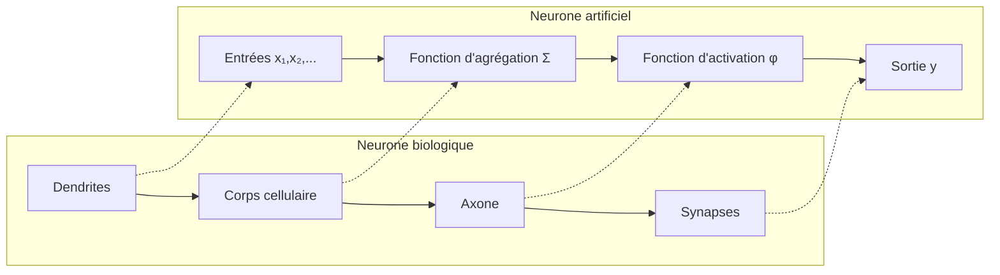
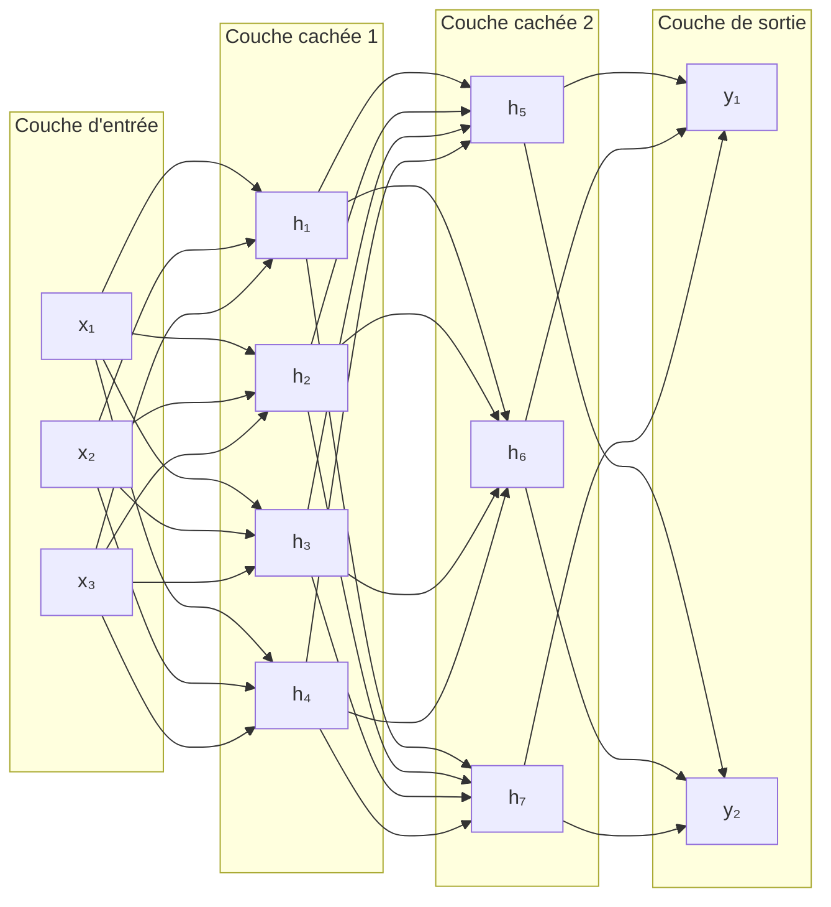
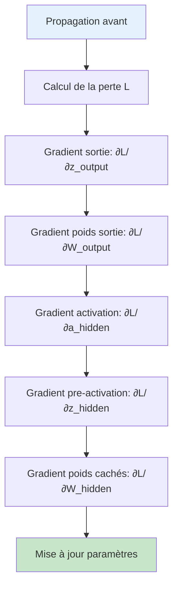

# Introduction aux réseaux de neurones : Perceptron et MLP

## 🎯 Objectifs d'apprentissage

À la fin de cette leçon, vous serez capable de :
- ✅ Comprendre le fonctionnement d'un neurone artificiel
- ✅ Implémenter un perceptron from scratch
- ✅ Construire et entraîner un réseau multicouches (MLP)
- ✅ Maîtriser l'algorithme de rétropropagation

---

## 🧠 Le neurone artificiel

### Inspiration biologique



### Modèle mathématique

Un **neurone artificiel** calcule une combinaison linéaire de ses entrées, puis applique une **fonction d'activation** :

$$y = \phi\left(\sum_{i=1}^{n} w_i x_i + b\right) = \phi(w^T x + b)$$

Où :
- $x_i$ : entrées
- $w_i$ : poids synaptiques  
- $b$ : biais (bias)
- $\phi$ : fonction d'activation

### Implémentation d'un neurone

```python
import numpy as np
import matplotlib.pyplot as plt
from sklearn.datasets import make_classification, make_circles
from sklearn.preprocessing import StandardScaler

class Neurone:
    """Implémentation d'un neurone artificiel"""
    
    def __init__(self, n_inputs):
        # Initialisation aléatoire des poids
        self.weights = np.random.normal(0, 0.1, n_inputs)
        self.bias = np.random.normal(0, 0.1)
    
    def sigmoid(self, z):
        """Fonction d'activation sigmoïde"""
        return 1 / (1 + np.exp(-np.clip(z, -500, 500)))  # Clipping pour stabilité
    
    def forward(self, x):
        """Propagation avant"""
        z = np.dot(x, self.weights) + self.bias
        return self.sigmoid(z)
    
    def predict(self, x, threshold=0.5):
        """Prédiction binaire"""
        return (self.forward(x) > threshold).astype(int)

# Test d'un neurone
neurone = Neurone(n_inputs=2)
print(f"Poids initiaux: {neurone.weights}")
print(f"Biais initial: {neurone.bias:.3f}")

# Test sur quelques points
test_points = np.array([[0, 0], [0, 1], [1, 0], [1, 1]])
for point in test_points:
    output = neurone.forward(point)
    prediction = neurone.predict(point)
    print(f"Point {point}: sortie={output:.3f}, prédiction={prediction}")
```

### Fonctions d'activation

```python
def plot_activation_functions():
    """Visualisation des principales fonctions d'activation"""
    
    x = np.linspace(-5, 5, 1000)
    
    # Définition des fonctions
    def sigmoid(x):
        return 1 / (1 + np.exp(-np.clip(x, -500, 500)))
    
    def tanh(x):
        return np.tanh(x)
    
    def relu(x):
        return np.maximum(0, x)
    
    def leaky_relu(x, alpha=0.01):
        return np.where(x > 0, x, alpha * x)
    
    # Visualisation
    fig, axes = plt.subplots(2, 2, figsize=(12, 10))
    
    axes[0, 0].plot(x, sigmoid(x), 'b-', linewidth=2)
    axes[0, 0].set_title('Sigmoid: σ(x) = 1/(1+e⁻ˣ)')
    axes[0, 0].set_ylabel('σ(x)')
    axes[0, 0].grid(True)
    axes[0, 0].axhline(y=0, color='k', linestyle='-', alpha=0.3)
    axes[0, 0].axvline(x=0, color='k', linestyle='-', alpha=0.3)
    
    axes[0, 1].plot(x, tanh(x), 'r-', linewidth=2)
    axes[0, 1].set_title('Tanh: tanh(x) = (eˣ-e⁻ˣ)/(eˣ+e⁻ˣ)')
    axes[0, 1].set_ylabel('tanh(x)')
    axes[0, 1].grid(True)
    axes[0, 1].axhline(y=0, color='k', linestyle='-', alpha=0.3)
    axes[0, 1].axvline(x=0, color='k', linestyle='-', alpha=0.3)
    
    axes[1, 0].plot(x, relu(x), 'g-', linewidth=2)
    axes[1, 0].set_title('ReLU: max(0,x)')
    axes[1, 0].set_xlabel('x')
    axes[1, 0].set_ylabel('ReLU(x)')
    axes[1, 0].grid(True)
    axes[1, 0].axhline(y=0, color='k', linestyle='-', alpha=0.3)
    axes[1, 0].axvline(x=0, color='k', linestyle='-', alpha=0.3)
    
    axes[1, 1].plot(x, leaky_relu(x), 'm-', linewidth=2)
    axes[1, 1].set_title('Leaky ReLU: max(αx,x) avec α=0.01')
    axes[1, 1].set_xlabel('x')
    axes[1, 1].set_ylabel('Leaky ReLU(x)')
    axes[1, 1].grid(True)
    axes[1, 1].axhline(y=0, color='k', linestyle='-', alpha=0.3)
    axes[1, 1].axvline(x=0, color='k', linestyle='-', alpha=0.3)
    
    plt.tight_layout()
    plt.show()
    
    # Propriétés des fonctions
    print("Propriétés des fonctions d'activation:")
    print("="*50)
    print("Sigmoid:")
    print("  - Sortie: [0, 1]")
    print("  - Dérivée: σ(x)(1-σ(x))")
    print("  - Problème: vanishing gradient")
    print()
    print("Tanh:")
    print("  - Sortie: [-1, 1]")
    print("  - Dérivée: 1-tanh²(x)")
    print("  - Avantage: centré en 0")
    print()
    print("ReLU:")
    print("  - Sortie: [0, +∞]")
    print("  - Dérivée: 1 si x>0, 0 sinon")
    print("  - Avantage: pas de vanishing gradient")
    print("  - Problème: dying ReLU")
    print()
    print("Leaky ReLU:")
    print("  - Sortie: [-∞, +∞]")
    print("  - Dérivée: 1 si x>0, α sinon")
    print("  - Avantage: évite dying ReLU")

plot_activation_functions()
```

---

## ⚡ Le Perceptron

### Algorithme historique

Le **Perceptron** (Rosenblatt, 1957) est le premier algorithme d'apprentissage pour neurones artificiels.

```mermaid
graph TD
    A[Initialisation poids aléatoires] --> B[Pour chaque exemple]
    B --> C[Calcul prédiction ŷ]
    C --> D{ŷ = y?}
    D -->|Oui| E[Exemple suivant]
    D -->|Non| F[Mise à jour poids]
    F --> G[w ← w + η(y-ŷ)x]
    G --> E
    E --> H{Tous exemples?}
    H -->|Non| B
    H -->|Oui| I{Convergence?}
    I -->|Non| B
    I -->|Oui| J[Arrêt]
    
    style J fill:#c8e6c9
```

### Implémentation du Perceptron

```python
class Perceptron:
    """Implémentation du Perceptron classique"""
    
    def __init__(self, learning_rate=0.1, max_iter=1000):
        self.learning_rate = learning_rate
        self.max_iter = max_iter
        self.weights = None
        self.bias = None
        self.history = {'weights': [], 'bias': [], 'errors': []}
    
    def activation(self, z):
        """Fonction d'activation step (seuil)"""
        return np.where(z >= 0, 1, 0)
    
    def fit(self, X, y):
        """Entraînement du perceptron"""
        n_samples, n_features = X.shape
        
        # Initialisation
        self.weights = np.random.normal(0, 0.1, n_features)
        self.bias = np.random.normal(0, 0.1)
        
        # Entraînement
        for iteration in range(self.max_iter):
            errors = 0
            
            for i in range(n_samples):
                # Propagation avant
                z = np.dot(X[i], self.weights) + self.bias
                y_pred = self.activation(z)
                
                # Calcul erreur
                error = y[i] - y_pred
                
                if error != 0:
                    errors += 1
                    # Mise à jour poids (règle de Hebb modifiée)
                    self.weights += self.learning_rate * error * X[i]
                    self.bias += self.learning_rate * error
            
            # Sauvegarde pour historique
            self.history['weights'].append(self.weights.copy())
            self.history['bias'].append(self.bias)
            self.history['errors'].append(errors)
            
            # Critère d'arrêt
            if errors == 0:
                print(f"Convergence atteinte en {iteration + 1} itérations")
                break
        
        return self
    
    def predict(self, X):
        """Prédiction"""
        z = np.dot(X, self.weights) + self.bias
        return self.activation(z)
    
    def decision_function(self, X):
        """Fonction de décision (avant activation)"""
        return np.dot(X, self.weights) + self.bias

# Test sur données linéairement séparables
np.random.seed(42)
X_linear, y_linear = make_classification(n_samples=100, n_features=2, 
                                        n_redundant=0, n_informative=2,
                                        n_clusters_per_class=1, random_state=42)

# Standardisation
scaler = StandardScaler()
X_linear_scaled = scaler.fit_transform(X_linear)

# Entraînement
perceptron = Perceptron(learning_rate=0.1, max_iter=1000)
perceptron.fit(X_linear_scaled, y_linear)

# Visualisation des résultats
def plot_perceptron_results(X, y, model, title="Perceptron"):
    """Visualisation des résultats du perceptron"""
    
    fig, axes = plt.subplots(1, 3, figsize=(18, 6))
    
    # 1. Frontière de décision
    h = 0.02
    x_min, x_max = X[:, 0].min() - 1, X[:, 0].max() + 1
    y_min, y_max = X[:, 1].min() - 1, X[:, 1].max() + 1
    xx, yy = np.meshgrid(np.arange(x_min, x_max, h),
                        np.arange(y_min, y_max, h))
    
    Z = model.decision_function(np.c_[xx.ravel(), yy.ravel()])
    Z = Z.reshape(xx.shape)
    
    axes[0].contourf(xx, yy, Z, levels=50, alpha=0.3, cmap='RdYlBu')
    axes[0].contour(xx, yy, Z, levels=[0], colors='black', linewidths=2)
    
    # Points de données
    scatter = axes[0].scatter(X[:, 0], X[:, 1], c=y, cmap='RdYlBu', edgecolors='black')
    axes[0].set_title(f'{title} - Frontière de décision')
    axes[0].set_xlabel('Feature 1')
    axes[0].set_ylabel('Feature 2')
    axes[0].grid(True)
    
    # 2. Évolution des erreurs
    axes[1].plot(model.history['errors'], 'b-', linewidth=2)
    axes[1].set_title('Convergence - Nombre d\'erreurs')
    axes[1].set_xlabel('Itération')
    axes[1].set_ylabel('Nombre d\'erreurs')
    axes[1].grid(True)
    
    # 3. Évolution des poids
    weights_history = np.array(model.history['weights'])
    bias_history = np.array(model.history['bias'])
    
    axes[2].plot(weights_history[:, 0], label='w1', linewidth=2)
    axes[2].plot(weights_history[:, 1], label='w2', linewidth=2)
    axes[2].plot(bias_history, label='bias', linewidth=2)
    axes[2].set_title('Évolution des paramètres')
    axes[2].set_xlabel('Itération')
    axes[2].set_ylabel('Valeur')
    axes[2].legend()
    axes[2].grid(True)
    
    plt.tight_layout()
    plt.show()

plot_perceptron_results(X_linear_scaled, y_linear, perceptron)

# Évaluation
y_pred = perceptron.predict(X_linear_scaled)
accuracy = np.mean(y_pred == y_linear)
print(f"Précision: {accuracy:.3f}")
print(f"Poids finaux: {perceptron.weights}")
print(f"Biais final: {perceptron.bias:.3f}")
```

### Limitations du Perceptron

#### Problème XOR

```python
# Le perceptron ne peut pas résoudre XOR (non linéairement séparable)
X_xor = np.array([[0, 0], [0, 1], [1, 0], [1, 1]])
y_xor = np.array([0, 1, 1, 0])  # XOR

print("Problème XOR:")
print("Entrées | Sortie attendue")
print("x1  x2  | y")
print("-" * 15)
for i in range(len(X_xor)):
    print(f"{X_xor[i, 0]:2d}  {X_xor[i, 1]:2d}  | {y_xor[i]}")

# Tentative d'entraînement
perceptron_xor = Perceptron(learning_rate=0.1, max_iter=1000)
perceptron_xor.fit(X_xor, y_xor)

# Prédictions
y_pred_xor = perceptron_xor.predict(X_xor)
print(f"\nPrédictions: {y_pred_xor}")
print(f"Attendu:     {y_xor}")
print(f"Précision: {np.mean(y_pred_xor == y_xor):.3f}")

# Visualisation du problème
plt.figure(figsize=(12, 5))

plt.subplot(1, 2, 1)
colors = ['red' if label == 0 else 'blue' for label in y_xor]
plt.scatter(X_xor[:, 0], X_xor[:, 1], c=colors, s=200, edgecolors='black', linewidth=2)
for i, (x, y) in enumerate(X_xor):
    plt.annotate(f'({x},{y})\nXOR={y_xor[i]}', (x, y), 
                xytext=(10, 10), textcoords='offset points')
plt.title('Problème XOR\n(Non linéairement séparable)')
plt.xlabel('x1')
plt.ylabel('x2')
plt.grid(True)
plt.xlim(-0.5, 1.5)
plt.ylim(-0.5, 1.5)

# Tentative de frontière linéaire
plt.subplot(1, 2, 2)
plt.scatter(X_xor[:, 0], X_xor[:, 1], c=colors, s=200, edgecolors='black', linewidth=2)

# Frontière trouvée par le perceptron
if perceptron_xor.weights[1] != 0:  # Éviter division par zéro
    x_line = np.linspace(-0.5, 1.5, 100)
    y_line = -(perceptron_xor.weights[0] * x_line + perceptron_xor.bias) / perceptron_xor.weights[1]
    plt.plot(x_line, y_line, 'green', linewidth=2, label='Frontière trouvée')

plt.title('Frontière de décision\n(Impossible avec une droite)')
plt.xlabel('x1')
plt.ylabel('x2')
plt.legend()
plt.grid(True)
plt.xlim(-0.5, 1.5)
plt.ylim(-0.5, 1.5)

plt.tight_layout()
plt.show()
```

---

## 🌐 Réseaux multicouches (MLP)

### Architecture

Un **Multi-Layer Perceptron (MLP)** combine plusieurs couches de neurones pour résoudre des problèmes non-linéaires.



### Implémentation d'un MLP simple

```python
class MLPSimple:
    """Implémentation simple d'un MLP à une couche cachée"""
    
    def __init__(self, input_size, hidden_size, output_size, learning_rate=0.01):
        self.input_size = input_size
        self.hidden_size = hidden_size
        self.output_size = output_size
        self.learning_rate = learning_rate
        
        # Initialisation Xavier/Glorot
        self.W1 = np.random.normal(0, np.sqrt(2/(input_size + hidden_size)), 
                                  (input_size, hidden_size))
        self.b1 = np.zeros((1, hidden_size))
        
        self.W2 = np.random.normal(0, np.sqrt(2/(hidden_size + output_size)), 
                                  (hidden_size, output_size))
        self.b2 = np.zeros((1, output_size))
        
        # Historique pour analyse
        self.loss_history = []
        self.accuracy_history = []
    
    def sigmoid(self, z):
        """Fonction d'activation sigmoïde"""
        return 1 / (1 + np.exp(-np.clip(z, -500, 500)))
    
    def sigmoid_derivative(self, z):
        """Dérivée de la sigmoïde"""
        s = self.sigmoid(z)
        return s * (1 - s)
    
    def forward(self, X):
        """Propagation avant"""
        # Couche cachée
        self.z1 = np.dot(X, self.W1) + self.b1
        self.a1 = self.sigmoid(self.z1)
        
        # Couche de sortie
        self.z2 = np.dot(self.a1, self.W2) + self.b2
        self.a2 = self.sigmoid(self.z2)
        
        return self.a2
    
    def compute_loss(self, y_true, y_pred):
        """Calcul de la perte (entropie croisée binaire)"""
        m = y_true.shape[0]
        # Éviter log(0)
        y_pred = np.clip(y_pred, 1e-7, 1-1e-7)
        loss = -np.sum(y_true * np.log(y_pred) + (1 - y_true) * np.log(1 - y_pred)) / m
        return loss
    
    def backward(self, X, y_true, y_pred):
        """Rétropropagation"""
        m = X.shape[0]
        
        # Gradient de la couche de sortie
        dz2 = y_pred - y_true
        dW2 = np.dot(self.a1.T, dz2) / m
        db2 = np.sum(dz2, axis=0, keepdims=True) / m
        
        # Gradient de la couche cachée
        da1 = np.dot(dz2, self.W2.T)
        dz1 = da1 * self.sigmoid_derivative(self.z1)
        dW1 = np.dot(X.T, dz1) / m
        db1 = np.sum(dz1, axis=0, keepdims=True) / m
        
        # Mise à jour des paramètres
        self.W2 -= self.learning_rate * dW2
        self.b2 -= self.learning_rate * db2
        self.W1 -= self.learning_rate * dW1
        self.b1 -= self.learning_rate * db1
    
    def fit(self, X, y, epochs=1000, verbose=True):
        """Entraînement du réseau"""
        for epoch in range(epochs):
            # Propagation avant
            y_pred = self.forward(X)
            
            # Calcul de la perte
            loss = self.compute_loss(y, y_pred)
            
            # Rétropropagation
            self.backward(X, y, y_pred)
            
            # Calcul de la précision
            predictions = (y_pred > 0.5).astype(int)
            accuracy = np.mean(predictions == y)
            
            # Sauvegarde historique
            self.loss_history.append(loss)
            self.accuracy_history.append(accuracy)
            
            # Affichage
            if verbose and epoch % 100 == 0:
                print(f"Époque {epoch}: Perte = {loss:.4f}, Précision = {accuracy:.4f}")
    
    def predict(self, X):
        """Prédiction"""
        y_pred = self.forward(X)
        return (y_pred > 0.5).astype(int)
    
    def predict_proba(self, X):
        """Probabilité de prédiction"""
        return self.forward(X)

# Test sur le problème XOR
print("=== Résolution XOR avec MLP ===")

# Préparation des données XOR
X_xor_expanded = X_xor.astype(float)
y_xor_expanded = y_xor.reshape(-1, 1).astype(float)

# Création et entraînement du MLP
mlp = MLPSimple(input_size=2, hidden_size=4, output_size=1, learning_rate=0.5)
mlp.fit(X_xor_expanded, y_xor_expanded, epochs=2000)

# Test des prédictions
y_pred_mlp = mlp.predict(X_xor_expanded)
proba_mlp = mlp.predict_proba(X_xor_expanded)

print(f"\n=== Résultats XOR ===")
print("Entrées | Attendu | Prédit | Probabilité")
print("-" * 45)
for i in range(len(X_xor)):
    print(f"[{X_xor[i, 0]}, {X_xor[i, 1]}]  |    {y_xor[i]:d}    |   {y_pred_mlp[i, 0]:d}   |   {proba_mlp[i, 0]:.3f}")

print(f"\nPrécision finale: {np.mean(y_pred_mlp.flatten() == y_xor):.3f}")
```

### Visualisation de l'apprentissage

```python
def visualize_mlp_learning(mlp, X, y, title="MLP Learning"):
    """Visualisation de l'apprentissage du MLP"""
    
    fig, axes = plt.subplots(2, 2, figsize=(15, 12))
    
    # 1. Évolution de la perte
    axes[0, 0].plot(mlp.loss_history, 'b-', linewidth=2)
    axes[0, 0].set_title('Évolution de la perte')
    axes[0, 0].set_xlabel('Époque')
    axes[0, 0].set_ylabel('Perte')
    axes[0, 0].grid(True)
    axes[0, 0].set_yscale('log')
    
    # 2. Évolution de la précision
    axes[0, 1].plot(mlp.accuracy_history, 'g-', linewidth=2)
    axes[0, 1].set_title('Évolution de la précision')
    axes[0, 1].set_xlabel('Époque')
    axes[0, 1].set_ylabel('Précision')
    axes[0, 1].grid(True)
    axes[0, 1].set_ylim(0, 1.05)
    
    # 3. Frontière de décision (si 2D)
    if X.shape[1] == 2:
        h = 0.02
        x_min, x_max = X[:, 0].min() - 0.5, X[:, 0].max() + 0.5
        y_min, y_max = X[:, 1].min() - 0.5, X[:, 1].max() + 0.5
        xx, yy = np.meshgrid(np.arange(x_min, x_max, h),
                            np.arange(y_min, y_max, h))
        
        grid_points = np.c_[xx.ravel(), yy.ravel()]
        Z = mlp.predict_proba(grid_points)
        Z = Z.reshape(xx.shape)
        
        contour = axes[1, 0].contourf(xx, yy, Z, levels=50, alpha=0.8, cmap='RdYlBu')
        axes[1, 0].contour(xx, yy, Z, levels=[0.5], colors='black', linewidths=2)
        
        # Points de données
        colors = ['red' if label == 0 else 'blue' for label in y.flatten()]
        axes[1, 0].scatter(X[:, 0], X[:, 1], c=colors, s=200, edgecolors='black', linewidth=2)
        
        axes[1, 0].set_title('Frontière de décision')
        axes[1, 0].set_xlabel('x1')
        axes[1, 0].set_ylabel('x2')
        plt.colorbar(contour, ax=axes[1, 0])
    
    # 4. Distribution des poids
    all_weights = np.concatenate([mlp.W1.flatten(), mlp.W2.flatten()])
    axes[1, 1].hist(all_weights, bins=20, alpha=0.7, edgecolor='black')
    axes[1, 1].set_title('Distribution des poids finaux')
    axes[1, 1].set_xlabel('Valeur du poids')
    axes[1, 1].set_ylabel('Fréquence')
    axes[1, 1].grid(True)
    
    plt.suptitle(title)
    plt.tight_layout()
    plt.show()

# Visualisation pour XOR
visualize_mlp_learning(mlp, X_xor_expanded, y_xor_expanded, "MLP - Résolution XOR")

# Analyse des poids appris
print("\n=== Analyse des poids appris ===")
print("Poids W1 (entrée -> couche cachée):")
print(mlp.W1)
print("\nBiais b1 (couche cachée):")
print(mlp.b1)
print("\nPoids W2 (couche cachée -> sortie):")
print(mlp.W2)
print("\nBiais b2 (sortie):")
print(mlp.b2)
```

---

## 🔄 Algorithme de rétropropagation

### Principe mathématique

La **rétropropagation** calcule les gradients en propageant l'erreur de la sortie vers l'entrée.



### Formules détaillées

Pour une couche $l$ avec :
- $z^{(l)} = W^{(l)} a^{(l-1)} + b^{(l)}$
- $a^{(l)} = \sigma(z^{(l)})$

Les gradients sont :
- $\frac{\partial L}{\partial W^{(l)}} = \frac{\partial L}{\partial z^{(l)}} \cdot (a^{(l-1)})^T$
- $\frac{\partial L}{\partial b^{(l)}} = \frac{\partial L}{\partial z^{(l)}}$
- $\frac{\partial L}{\partial a^{(l-1)}} = (W^{(l)})^T \cdot \frac{\partial L}{\partial z^{(l)}}$
- $\frac{\partial L}{\partial z^{(l-1)}} = \frac{\partial L}{\partial a^{(l-1)}} \odot \sigma'(z^{(l-1)})$

### Implémentation détaillée avec calculs étape par étape

```python
class MLPDetailed:
    """MLP avec calculs détaillés pour comprendre la rétropropagation"""
    
    def __init__(self, layers_sizes, learning_rate=0.01):
        self.layers_sizes = layers_sizes
        self.learning_rate = learning_rate
        self.num_layers = len(layers_sizes)
        
        # Initialisation des poids
        self.weights = {}
        self.biases = {}
        
        for i in range(1, self.num_layers):
            self.weights[i] = np.random.normal(0, np.sqrt(2/layers_sizes[i-1]), 
                                             (layers_sizes[i-1], layers_sizes[i]))
            self.biases[i] = np.zeros((1, layers_sizes[i]))
        
        # Stockage pour analyse
        self.activations = {}
        self.z_values = {}
        self.gradients = {}
    
    def sigmoid(self, z):
        return 1 / (1 + np.exp(-np.clip(z, -500, 500)))
    
    def sigmoid_derivative(self, z):
        s = self.sigmoid(z)
        return s * (1 - s)
    
    def forward_detailed(self, X, verbose=False):
        """Propagation avant avec détails"""
        self.activations[0] = X
        
        if verbose:
            print("=== PROPAGATION AVANT ===")
            print(f"Entrée a^(0): shape {X.shape}")
            print(f"Première ligne: {X[0]}")
        
        for i in range(1, self.num_layers):
            # Calcul pre-activation
            self.z_values[i] = np.dot(self.activations[i-1], self.weights[i]) + self.biases[i]
            # Calcul activation
            self.activations[i] = self.sigmoid(self.z_values[i])
            
            if verbose:
                print(f"\nCouche {i}:")
                print(f"  Poids W^({i}): shape {self.weights[i].shape}")
                print(f"  z^({i}): shape {self.z_values[i].shape}")
                print(f"  a^({i}): shape {self.activations[i].shape}")
                print(f"  a^({i})[0]: {self.activations[i][0]}")
        
        return self.activations[self.num_layers - 1]
    
    def backward_detailed(self, y_true, verbose=False):
        """Rétropropagation avec détails"""
        m = y_true.shape[0]
        
        if verbose:
            print("\n=== RÉTROPROPAGATION ===")
        
        # Gradient de la couche de sortie
        output_layer = self.num_layers - 1
        y_pred = self.activations[output_layer]
        
        # dL/dz pour la dernière couche (entropie croisée + sigmoïde)
        self.gradients[f'dz{output_layer}'] = (y_pred - y_true) / m
        
        if verbose:
            print(f"Gradient sortie dz^({output_layer}): shape {self.gradients[f'dz{output_layer}'].shape}")
            print(f"Valeur moyenne: {np.mean(self.gradients[f'dz{output_layer}']):.4f}")
        
        # Propagation inverse couche par couche
        for i in range(output_layer, 0, -1):
            # Gradients des poids et biais
            self.gradients[f'dW{i}'] = np.dot(self.activations[i-1].T, self.gradients[f'dz{i}'])
            self.gradients[f'db{i}'] = np.sum(self.gradients[f'dz{i}'], axis=0, keepdims=True)
            
            if verbose:
                print(f"\nCouche {i}:")
                print(f"  dW^({i}): shape {self.gradients[f'dW{i}'].shape}")
                print(f"  db^({i}): shape {self.gradients[f'db{i}'].shape}")
            
            # Gradient pour la couche précédente (si elle existe)
            if i > 1:
                # dL/da^(i-1)
                self.gradients[f'da{i-1}'] = np.dot(self.gradients[f'dz{i}'], self.weights[i].T)
                # dL/dz^(i-1)
                self.gradients[f'dz{i-1}'] = (self.gradients[f'da{i-1}'] * 
                                            self.sigmoid_derivative(self.z_values[i-1]))
                
                if verbose:
                    print(f"  da^({i-1}): shape {self.gradients[f'da{i-1}'].shape}")
                    print(f"  dz^({i-1}): shape {self.gradients[f'dz{i-1}'].shape}")
    
    def update_parameters(self, verbose=False):
        """Mise à jour des paramètres"""
        if verbose:
            print("\n=== MISE À JOUR PARAMÈTRES ===")
        
        for i in range(1, self.num_layers):
            old_w = self.weights[i].copy()
            old_b = self.biases[i].copy()
            
            self.weights[i] -= self.learning_rate * self.gradients[f'dW{i}']
            self.biases[i] -= self.learning_rate * self.gradients[f'db{i}']
            
            if verbose:
                weight_change = np.mean(np.abs(self.weights[i] - old_w))
                bias_change = np.mean(np.abs(self.biases[i] - old_b))
                print(f"Couche {i}: Δpoids={weight_change:.6f}, Δbiais={bias_change:.6f}")
    
    def train_step(self, X, y, verbose=False):
        """Une étape d'entraînement complète"""
        # Propagation avant
        y_pred = self.forward_detailed(X, verbose=verbose)
        
        # Calcul perte
        y_pred_clipped = np.clip(y_pred, 1e-7, 1-1e-7)
        loss = -np.mean(y * np.log(y_pred_clipped) + (1 - y) * np.log(1 - y_pred_clipped))
        
        # Rétropropagation
        self.backward_detailed(y, verbose=verbose)
        
        # Mise à jour
        self.update_parameters(verbose=verbose)
        
        return loss, y_pred

# Test détaillé sur XOR
print("=== ENTRAÎNEMENT DÉTAILLÉ XOR ===")

mlp_detailed = MLPDetailed([2, 3, 1], learning_rate=1.0)
X_xor_float = X_xor.astype(float)
y_xor_float = y_xor.reshape(-1, 1).astype(float)

# Première itération avec détails
print("PREMIÈRE ITÉRATION:")
loss, pred = mlp_detailed.train_step(X_xor_float, y_xor_float, verbose=True)
print(f"\nPerte: {loss:.4f}")
print(f"Prédictions: {pred.flatten()}")

# Quelques itérations supplémentaires
print("\n" + "="*50)
print("ENTRAÎNEMENT COMPLET:")
for epoch in range(1000):
    loss, pred = mlp_detailed.train_step(X_xor_float, y_xor_float, verbose=False)
    if epoch % 200 == 0:
        accuracy = np.mean((pred > 0.5) == y_xor_float)
        print(f"Époque {epoch}: Perte = {loss:.4f}, Précision = {accuracy:.4f}")

# Résultats finaux
final_pred = (pred > 0.5).astype(int)
print(f"\n=== RÉSULTATS FINAUX ===")
print("x1 x2 | Attendu | Prédit | Probabilité")
print("-" * 40)
for i in range(len(X_xor)):
    print(f"{X_xor[i, 0]:2d} {X_xor[i, 1]:2d} |    {y_xor[i]:d}    |   {final_pred[i, 0]:d}   |   {pred[i, 0]:.3f}")
```

---

## 🎛️ Hyperparamètres et optimisation

### Taux d'apprentissage

```python
def compare_learning_rates():
    """Comparaison de différents taux d'apprentissage"""
    
    learning_rates = [0.1, 0.5, 1.0, 2.0, 5.0]
    colors = ['blue', 'green', 'red', 'orange', 'purple']
    
    plt.figure(figsize=(15, 10))
    
    for i, lr in enumerate(learning_rates):
        mlp = MLPSimple(2, 4, 1, learning_rate=lr)
        mlp.fit(X_xor_expanded, y_xor_expanded, epochs=1000, verbose=False)
        
        # Perte
        plt.subplot(2, 2, 1)
        plt.plot(mlp.loss_history, color=colors[i], label=f'LR = {lr}', linewidth=2)
        
        # Précision
        plt.subplot(2, 2, 2)
        plt.plot(mlp.accuracy_history, color=colors[i], label=f'LR = {lr}', linewidth=2)
        
        # Convergence (dernières 100 époques)
        final_loss = np.mean(mlp.loss_history[-100:])
        final_accuracy = np.mean(mlp.accuracy_history[-100:])
        
        plt.subplot(2, 2, 3)
        plt.bar(i, final_loss, color=colors[i], alpha=0.7)
        
        plt.subplot(2, 2, 4)
        plt.bar(i, final_accuracy, color=colors[i], alpha=0.7)
    
    plt.subplot(2, 2, 1)
    plt.title('Évolution de la perte')
    plt.xlabel('Époque')
    plt.ylabel('Perte')
    plt.legend()
    plt.grid(True)
    plt.yscale('log')
    
    plt.subplot(2, 2, 2)
    plt.title('Évolution de la précision')
    plt.xlabel('Époque')
    plt.ylabel('Précision')
    plt.legend()
    plt.grid(True)
    
    plt.subplot(2, 2, 3)
    plt.title('Perte finale (moyenne 100 dernières époques)')
    plt.xlabel('Taux d\'apprentissage')
    plt.ylabel('Perte')
    plt.xticks(range(len(learning_rates)), learning_rates)
    plt.grid(True)
    
    plt.subplot(2, 2, 4)
    plt.title('Précision finale')
    plt.xlabel('Taux d\'apprentissage')
    plt.ylabel('Précision')
    plt.xticks(range(len(learning_rates)), learning_rates)
    plt.grid(True)
    
    plt.tight_layout()
    plt.show()

compare_learning_rates()
```

### Architecture du réseau

```python
def compare_architectures():
    """Comparaison de différentes architectures"""
    
    architectures = [
        (2, 2, 1),   # Minimal
        (2, 4, 1),   # Standard
        (2, 8, 1),   # Plus de neurones
        (2, 4, 2, 1), # Plus de couches
        (2, 6, 4, 1)  # Large puis étroit
    ]
    
    names = ['Minimal (2-2-1)', 'Standard (2-4-1)', 'Large (2-8-1)', 
             'Profond (2-4-2-1)', 'Pyramidal (2-6-4-1)']
    
    colors = ['blue', 'green', 'red', 'orange', 'purple']
    
    plt.figure(figsize=(15, 10))
    
    results = []
    
    for i, (arch, name) in enumerate(zip(architectures, names)):
        if len(arch) == 3:  # MLP simple
            mlp = MLPSimple(arch[0], arch[1], arch[2], learning_rate=0.5)
            mlp.fit(X_xor_expanded, y_xor_expanded, epochs=1500, verbose=False)
            
            plt.subplot(2, 2, 1)
            plt.plot(mlp.loss_history, color=colors[i], label=name, linewidth=2)
            
            plt.subplot(2, 2, 2)
            plt.plot(mlp.accuracy_history, color=colors[i], label=name, linewidth=2)
            
            final_accuracy = mlp.accuracy_history[-1]
            
        else:  # MLP détaillé pour architectures complexes
            mlp = MLPDetailed(list(arch), learning_rate=0.5)
            
            losses = []
            accuracies = []
            
            for epoch in range(1500):
                loss, pred = mlp.train_step(X_xor_expanded, y_xor_expanded)
                losses.append(loss)
                accuracy = np.mean((pred > 0.5) == y_xor_expanded)
                accuracies.append(accuracy)
            
            plt.subplot(2, 2, 1)
            plt.plot(losses, color=colors[i], label=name, linewidth=2)
            
            plt.subplot(2, 2, 2)
            plt.plot(accuracies, color=colors[i], label=name, linewidth=2)
            
            final_accuracy = accuracies[-1]
        
        # Calcul du nombre de paramètres
        if len(arch) == 3:
            n_params = arch[0] * arch[1] + arch[1] + arch[1] * arch[2] + arch[2]
        else:
            n_params = sum(arch[j] * arch[j+1] + arch[j+1] for j in range(len(arch)-1))
        
        results.append((name, final_accuracy, n_params))
        
        plt.subplot(2, 2, 3)
        plt.bar(i, final_accuracy, color=colors[i], alpha=0.7)
        
        plt.subplot(2, 2, 4)
        plt.bar(i, n_params, color=colors[i], alpha=0.7)
    
    plt.subplot(2, 2, 1)
    plt.title('Évolution de la perte par architecture')
    plt.xlabel('Époque')
    plt.ylabel('Perte')
    plt.legend()
    plt.grid(True)
    plt.yscale('log')
    
    plt.subplot(2, 2, 2)
    plt.title('Évolution de la précision par architecture')
    plt.xlabel('Époque')
    plt.ylabel('Précision')
    plt.legend()
    plt.grid(True)
    
    plt.subplot(2, 2, 3)
    plt.title('Précision finale par architecture')
    plt.ylabel('Précision')
    plt.xticks(range(len(names)), [n.split()[0] for n in names], rotation=45)
    plt.grid(True)
    
    plt.subplot(2, 2, 4)
    plt.title('Nombre de paramètres')
    plt.ylabel('Paramètres')
    plt.xticks(range(len(names)), [n.split()[0] for n in names], rotation=45)
    plt.grid(True)
    
    plt.tight_layout()
    plt.show()
    
    # Tableau récapitulatif
    print("=== COMPARAISON ARCHITECTURES ===")
    print("Architecture | Précision | Paramètres | Efficacité")
    print("-" * 55)
    for name, acc, params in results:
        efficiency = acc / params * 1000  # Précision par 1000 paramètres
        print(f"{name:12} | {acc:8.3f} | {params:10d} | {efficiency:8.2f}")

compare_architectures()
```

---

## 🎯 Récapitulatif

**Points clés à retenir :**

### Neurone artificiel
- **Modèle** : Combinaison linéaire + fonction d'activation
- **Fonctions d'activation** : Sigmoid, tanh, ReLU, Leaky ReLU
- **Limitation** : Séparation linéaire uniquement

### Perceptron
- **Algorithme historique** : Premier apprentissage supervisé
- **Règle d'apprentissage** : Correction d'erreur simple
- **Limitation** : Problèmes non linéairement séparables (XOR)

### MLP (Multi-Layer Perceptron)
- **Architecture** : Couches de neurones connectées
- **Capacité** : Approximation universelle
- **Entraînement** : Rétropropagation du gradient

### Rétropropagation
- **Principe** : Calcul efficace des gradients
- **Étapes** : Forward → Loss → Backward → Update
- **Règle de chaîne** : Dérivation composée

### Hyperparamètres
- **Learning rate** : Vitesse de convergence vs stabilité
- **Architecture** : Profondeur vs largeur
- **Activation** : Non-linéarité et gradient

### Applications
- **Classification** : Problèmes non linéaires
- **Régression** : Approximation de fonctions
- **Preprocessing** : Extraction de features

---

## 🔗 Pour aller plus loin

- **Optimisation** : SGD, Adam, RMSprop
- **Régularisation** : Dropout, batch normalization
- **CNN** : Réseaux convolutionnels pour images
- **RNN** : Réseaux récurrents pour séquences