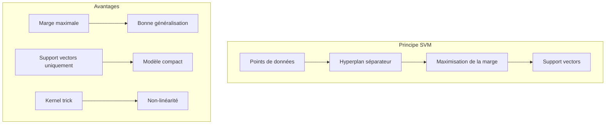
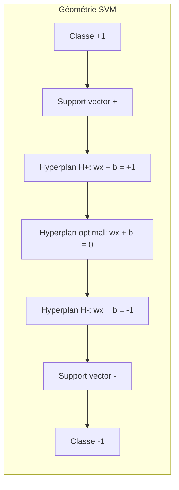
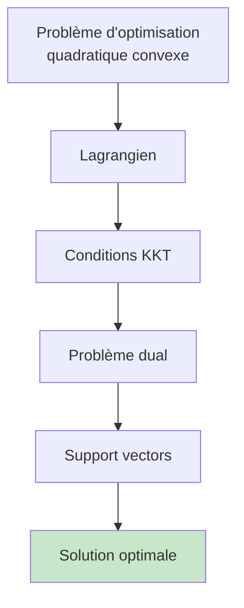
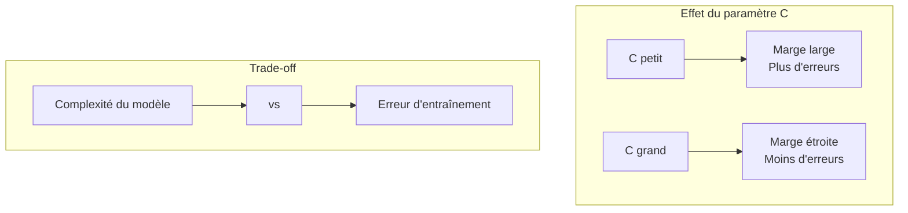
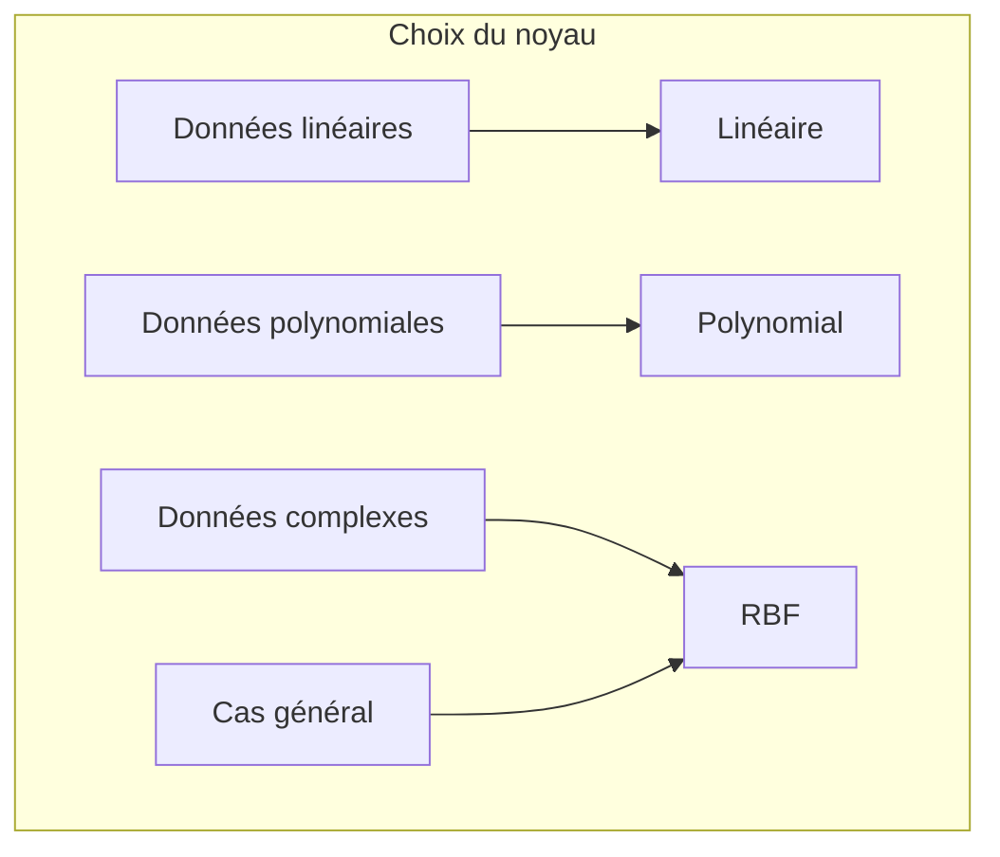
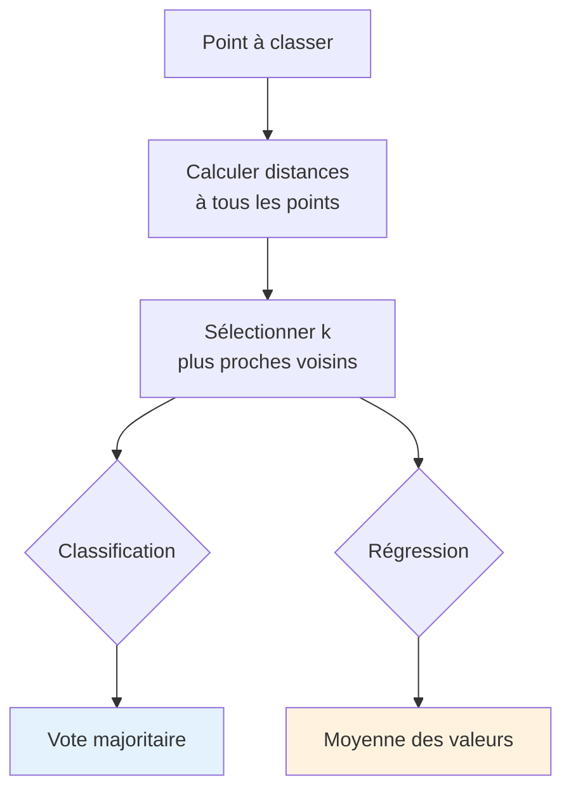
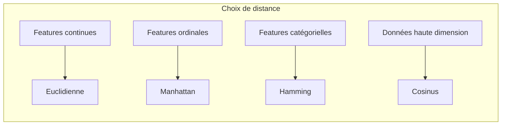
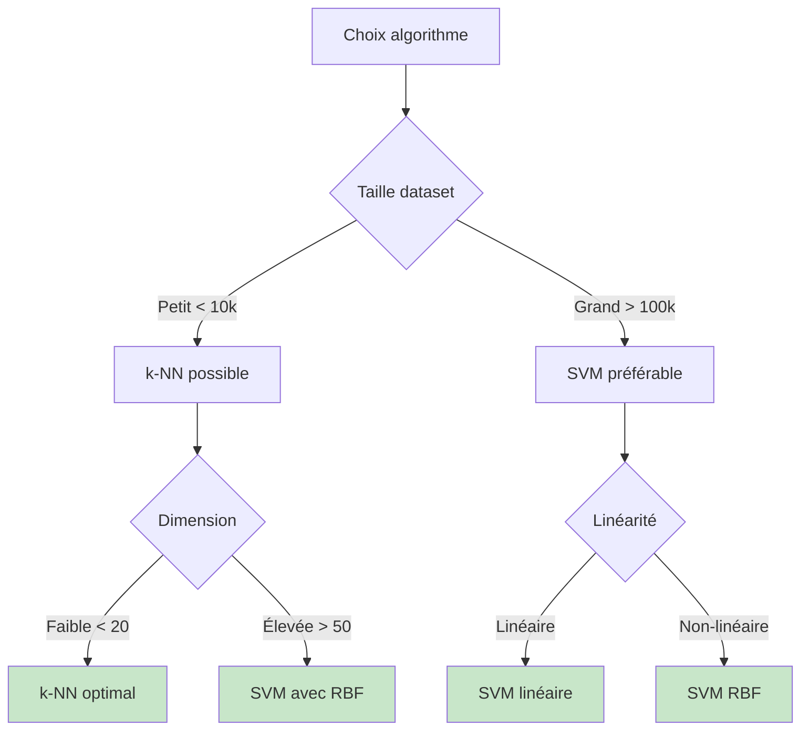

# SVM et k-NN : méthodes géométriques

## 🎯 Objectifs d'apprentissage

À la fin de cette leçon, vous serez capable de :
- ✅ Comprendre les principes géométriques du SVM
- ✅ Maîtriser le kernel trick et les noyaux
- ✅ Implémenter et optimiser k-NN
- ✅ Choisir entre SVM et k-NN selon le contexte

---

## 🎯 Support Vector Machines (SVM)

### Intuition géométrique

Le **SVM** cherche à trouver l'**hyperplan optimal** qui sépare les classes avec la **marge maximale**.


```mermaid
graph TD
    subgraph "Principe SVM"
        A[Points de données] --> B[Hyperplan séparateur]
        B --> C[Maximisation de la marge]
        C --> D[Support vectors]
    end
    
    subgraph "Avantages"
        E[Marge maximale] --> F[Bonne généralisation]
        G[Support vectors uniquement] --> H[Modèle compact]
        I[Kernel trick] --> J[Non-linéarité]
    end
```

### Cas linéairement séparable

#### Définition de l'hyperplan

**Équation** : w^T x + b = 0

où :
- **w** : vecteur normal à l'hyperplan
- **b** : biais (offset)
- **x** : point dans l'espace

#### Marge géométrique

La **marge** est la distance minimale entre l'hyperplan et les points les plus proches de chaque classe.


```mermaid
graph LR
    subgraph "Géométrie SVM"
        A[Classe +1] --> B[Support vector +]
        B --> C[Hyperplan H+: wx + b = +1]
        C --> D[Hyperplan optimal: wx + b = 0]
        D --> E[Hyperplan H-: wx + b = -1]
        E --> F[Support vector -]
        F --> G[Classe -1]
    end
```

**Marge** = 2/||w||

**Objectif** : Maximiser la marge ⟺ Minimiser ||w||²

#### Formulation d'optimisation

**Problème primal** :
- Minimiser : (1/2)||w||²
- Sous contraintes : yᵢ(w^T xᵢ + b) ≥ 1, ∀i


```mermaid
flowchart TD
    A[Problème d'optimisation<br/>quadratique convexe] --> B[Lagrangien]
    B --> C[Conditions KKT]
    C --> D[Problème dual]
    D --> E[Support vectors]
    E --> F[Solution optimale]
    
    style F fill:#c8e6c9
```

### Cas non-linéairement séparable

#### Slack variables (variables de relâchement)

Permettre quelques erreurs de classification avec pénalité.

**Problème modifié** :
- Minimiser : (1/2)||w||² + C Σξᵢ
- Sous contraintes : yᵢ(w^T xᵢ + b) ≥ 1 - ξᵢ, ξᵢ ≥ 0

où :
- **ξᵢ** : variables de relâchement
- **C** : paramètre de régularisation


```mermaid
graph TD
    subgraph "Effet du paramètre C"
        A[C petit] --> B[Marge large<br/>Plus d'erreurs]
        C[C grand] --> D[Marge étroite<br/>Moins d'erreurs]
    end
    
    subgraph "Trade-off"
        E[Complexité du modèle] --> F[vs]
        F --> G[Erreur d'entraînement]
    end
```

---

## 🔄 Kernel Trick

### Motivation

**Problème** : Données non-linéairement séparables dans l'espace original

**Solution** : Projeter dans un espace de dimension supérieure où elles deviennent linéairement séparables

```mermaid
graph LR
    subgraph "Espace original (2D)"
        A[Classes mélangées] --> B[Non séparable<br/>linéairement]
    end
    
    subgraph "Espace transformé (3D+)"
        C[φ(x): transformation] --> D[Classes séparables<br/>linéairement]
    end
    
    A --> C
```

### Astuce mathématique

Au lieu de calculer φ(x) explicitement, utiliser directement K(xᵢ, xⱼ) = φ(xᵢ)^T φ(xⱼ)

**Avantage** : Évite le calcul coûteux dans l'espace de haute dimension

### Noyaux populaires

#### 1. Noyau linéaire
K(xᵢ, xⱼ) = xᵢ^T xⱼ

**Usage** : Données déjà linéairement séparables

#### 2. Noyau polynomial
K(xᵢ, xⱼ) = (γ xᵢ^T xⱼ + r)^d

**Paramètres** :
- **d** : degré du polynôme
- **γ** : coefficient d'échelle
- **r** : terme constant

#### 3. Noyau RBF (Radial Basis Function)
K(xᵢ, xⱼ) = exp(-γ ||xᵢ - xⱼ||²)

**Caractéristiques** :
- Plus populaire et polyvalent
- **γ** contrôle la "largeur" de l'influence
- Dimension infinie implicite

#### 4. Noyau sigmoïde
K(xᵢ, xⱼ) = tanh(γ xᵢ^T xⱼ + r)

**Usage** : Moins fréquent, similaire aux réseaux de neurones


```mermaid
graph TD
    subgraph "Choix du noyau"
        A[Données linéaires] --> B[Linéaire]
        C[Données polynomiales] --> D[Polynomial]
        E[Données complexes] --> F[RBF]
        G[Cas général] --> F
    end
```

### Implémentation Python

```python
from sklearn.svm import SVC
from sklearn.model_selection import train_test_split, GridSearchCV
from sklearn.preprocessing import StandardScaler
from sklearn.metrics import classification_report, confusion_matrix
import numpy as np
import matplotlib.pyplot as plt

# Génération de données non-linéaires
from sklearn.datasets import make_circles
X, y = make_circles(n_samples=1000, noise=0.1, factor=0.3, random_state=42)

# Normalisation (importante pour SVM)
scaler = StandardScaler()
X_scaled = scaler.fit_transform(X)

# Split
X_train, X_test, y_train, y_test = train_test_split(X_scaled, y, test_size=0.3, random_state=42)

# SVM avec différents noyaux
kernels = ['linear', 'poly', 'rbf', 'sigmoid']
results = {}

for kernel in kernels:
    svm = SVC(kernel=kernel, random_state=42)
    svm.fit(X_train, y_train)
    score = svm.score(X_test, y_test)
    results[kernel] = score
    print(f"{kernel.capitalize()} kernel accuracy: {score:.3f}")

# Meilleur noyau
best_kernel = max(results, key=results.get)
print(f"\nMeilleur noyau: {best_kernel}")
```

### Optimisation des hyperparamètres

```python
# Grid search pour SVM RBF
param_grid = {
    'C': [0.1, 1, 10, 100],
    'gamma': ['scale', 'auto', 0.01, 0.1, 1, 10]
}

svm_rbf = SVC(kernel='rbf', random_state=42)
grid_search = GridSearchCV(svm_rbf, param_grid, cv=5, scoring='accuracy')
grid_search.fit(X_train, y_train)

print("Meilleurs paramètres:", grid_search.best_params_)
print("Meilleur score CV:", grid_search.best_score_)

# Modèle final
best_svm = grid_search.best_estimator_
test_score = best_svm.score(X_test, y_test)
print(f"Score sur test: {test_score:.3f}")
```

---

## 🎯 k-Nearest Neighbors (k-NN)

### Principe fondamental

**k-NN** classe un point en se basant sur les **k voisins les plus proches** dans l'espace des features.


```mermaid
graph TD
    A[Point à classer] --> B[Calculer distances<br/>à tous les points]
    B --> C[Sélectionner k<br/>plus proches voisins]
    C --> D{Classification}
    D --> E[Vote majoritaire]
    C --> F{Régression}
    F --> G[Moyenne des valeurs]
    
    style E fill:#e3f2fd
    style G fill:#fff3e0
```

### Algorithme détaillé

#### Classification

```python
def knn_classify(X_train, y_train, x_query, k):
    # 1. Calculer distances
    distances = [euclidean_distance(x_query, x_train) for x_train in X_train]
    
    # 2. Trouver k plus proches voisins
    k_indices = sorted(range(len(distances)), key=lambda i: distances[i])[:k]
    
    # 3. Vote majoritaire
    k_labels = [y_train[i] for i in k_indices]
    return most_frequent(k_labels)
```

#### Métriques de distance

**1. Distance euclidienne** (la plus courante)
d(x, y) = √Σ(xᵢ - yᵢ)²

**2. Distance de Manhattan**
d(x, y) = Σ|xᵢ - yᵢ|

**3. Distance de Minkowski**
d(x, y) = (Σ|xᵢ - yᵢ|^p)^(1/p)

**4. Distance de Hamming** (variables catégorielles)
d(x, y) = Σ(xᵢ ≠ yᵢ)


```mermaid
graph LR
    subgraph "Choix de distance"
        A[Features continues] --> B[Euclidienne]
        C[Features ordinales] --> D[Manhattan]
        E[Features catégorielles] --> F[Hamming]
        G[Données haute dimension] --> H[Cosinus]
    end
```

### Implémentation et optimisation

```python
from sklearn.neighbors import KNeighborsClassifier
from sklearn.metrics import accuracy_score
import time

# Dataset exemple
from sklearn.datasets import load_digits
digits = load_digits()
X, y = digits.data, digits.target

# Normalisation (importante pour k-NN)
scaler = StandardScaler()
X_scaled = scaler.fit_transform(X)

# Split
X_train, X_test, y_train, y_test = train_test_split(X_scaled, y, test_size=0.3, random_state=42)

# Test de différentes valeurs de k
k_range = range(1, 31)
accuracies = []
times = []

for k in k_range:
    knn = KNeighborsClassifier(n_neighbors=k)
    
    start_time = time.time()
    knn.fit(X_train, y_train)
    y_pred = knn.predict(X_test)
    end_time = time.time()
    
    accuracy = accuracy_score(y_test, y_pred)
    accuracies.append(accuracy)
    times.append(end_time - start_time)

# Visualisation
plt.figure(figsize=(12, 4))

plt.subplot(1, 2, 1)
plt.plot(k_range, accuracies, 'b-', marker='o')
plt.xlabel('k')
plt.ylabel('Accuracy')
plt.title('Accuracy vs k')

plt.subplot(1, 2, 2)
plt.plot(k_range, times, 'r-', marker='s')
plt.xlabel('k')
plt.ylabel('Time (seconds)')
plt.title('Training time vs k')

plt.tight_layout()
plt.show()

# k optimal
optimal_k = k_range[np.argmax(accuracies)]
print(f"k optimal: {optimal_k}")
print(f"Meilleure accuracy: {max(accuracies):.3f}")
```

### Optimisation de performance

#### 1. Structures de données efficaces

**KD-Tree** : Efficace en faible dimension (< 20)
```python
knn_kdtree = KNeighborsClassifier(n_neighbors=5, algorithm='kd_tree')
```

**Ball Tree** : Efficace en haute dimension
```python
knn_balltree = KNeighborsClassifier(n_neighbors=5, algorithm='ball_tree')
```

**Brute force** : Calcul direct des distances
```python
knn_brute = KNeighborsClassifier(n_neighbors=5, algorithm='brute')
```

#### 2. Approximation pour gros datasets

**LSH (Locality Sensitive Hashing)** : Approximation rapide

```python
from sklearn.neighbors import NearestNeighbors

# Recherche approximative
nn = NearestNeighbors(n_neighbors=5, metric='cosine')
nn.fit(X_train)

# Recherche des voisins
distances, indices = nn.kneighbors(X_test[:10])
```

---

## ⚖️ Comparaison SVM vs k-NN

### Tableau comparatif

| Aspect | SVM | k-NN |
|--------|-----|------|
| **Complexité d'entraînement** | O(n³) à O(n²) | O(1) (lazy learning) |
| **Complexité de prédiction** | O(n_sv) | O(n) ou O(log n) avec index |
| **Mémoire** | Support vectors seulement | Tout le dataset |
| **Performance** | Excellente avec bon noyau | Bonne si k bien choisi |
| **Interprétabilité** | Faible (sauf linéaire) | Élevée |
| **Robustesse au bruit** | Bonne (marge) | Faible |
| **Données haute dimension** | Excellente | Problématique (curse) |
| **Données déséquilibrées** | Problématique | Problématique |

### Critères de choix


```mermaid
flowchart TD
    A[Choix algorithme] --> B{Taille dataset}
    B -->|Petit < 10k| C[k-NN possible]
    B -->|Grand > 100k| D[SVM préférable]
    
    C --> E{Dimension}
    E -->|Faible < 20| F[k-NN optimal]
    E -->|Élevée > 50| G[SVM avec RBF]
    
    D --> H{Linéarité}
    H -->|Linéaire| I[SVM linéaire]
    H -->|Non-linéaire| J[SVM RBF]
    
    style F fill:#c8e6c9
    style G fill:#c8e6c9
    style I fill:#c8e6c9
    style J fill:#c8e6c9
```

---

## 🚀 Applications pratiques

### SVM pour classification de texte

```python
from sklearn.feature_extraction.text import TfidfVectorizer
from sklearn.pipeline import Pipeline

# Pipeline SVM + TF-IDF
text_classifier = Pipeline([
    ('tfidf', TfidfVectorizer(max_features=5000, stop_words='english')),
    ('svm', SVC(kernel='linear', C=1.0))
])

# Données d'exemple (sentiment analysis)
texts = ["I love this movie", "This is terrible", "Great film!", "Awful acting"]
labels = [1, 0, 1, 0]  # 1=positive, 0=negative

text_classifier.fit(texts, labels)

# Prédiction
new_texts = ["Amazing movie!", "Bad story"]
predictions = text_classifier.predict(new_texts)
print(f"Prédictions: {predictions}")
```

### k-NN pour système de recommandation

```python
from sklearn.neighbors import NearestNeighbors
import pandas as pd

# Matrice utilisateur-item (exemple)
user_item_matrix = pd.DataFrame({
    'user_1': [5, 3, 0, 1],
    'user_2': [4, 0, 0, 1], 
    'user_3': [1, 1, 0, 5],
    'user_4': [1, 0, 0, 4],
    'user_5': [0, 1, 5, 4]
}, index=['item_A', 'item_B', 'item_C', 'item_D'])

# k-NN pour trouver utilisateurs similaires
nn_model = NearestNeighbors(n_neighbors=3, metric='cosine')
nn_model.fit(user_item_matrix.T)  # Transpose: users en rows

# Recommandations pour user_1
distances, indices = nn_model.kneighbors([user_item_matrix['user_1']])
similar_users = user_item_matrix.columns[indices[0][1:]]  # Exclure user_1 lui-même

print(f"Utilisateurs similaires à user_1: {list(similar_users)}")
```

---

## 🎯 Techniques avancées

### SVM multiclasse

#### Stratégies de décomposition

**1. One-vs-One (OvO)**
- n(n-1)/2 classificateurs binaires
- Chaque paire de classes

**2. One-vs-Rest (OvR)**
- n classificateurs binaires
- Chaque classe vs toutes les autres

```python
from sklearn.multiclass import OneVsOneClassifier, OneVsRestClassifier

# OvO
ovo_svm = OneVsOneClassifier(SVC(kernel='rbf'))
ovo_svm.fit(X_train, y_train)

# OvR  
ovr_svm = OneVsRestClassifier(SVC(kernel='rbf'))
ovr_svm.fit(X_train, y_train)
```

### k-NN pondéré

#### Pondération par distance

Plus un voisin est proche, plus son vote compte.

```python
# k-NN avec pondération par distance
knn_weighted = KNeighborsClassifier(
    n_neighbors=5,
    weights='distance'  # ou 'uniform'
)
knn_weighted.fit(X_train, y_train)
```

#### Pondération adaptative

```python
def adaptive_knn(X_train, y_train, x_query, k_max=20):
    distances = [euclidean_distance(x_query, x) for x in X_train]
    sorted_indices = sorted(range(len(distances)), key=lambda i: distances[i])
    
    # Adaptation du k selon la densité locale
    local_density = estimate_density(x_query, X_train, radius=1.0)
    k = min(k_max, max(3, int(local_density * 10)))
    
    # Classification avec k adaptatif
    k_indices = sorted_indices[:k]
    k_labels = [y_train[i] for i in k_indices]
    return most_frequent(k_labels), k
```

---

## 🎯 Récapitulatif

**Points clés à retenir :**

### SVM
- **Géométrie** : Marge maximale entre classes
- **Kernel trick** : Non-linéarité sans calcul explicite
- **Robuste** mais sensible aux paramètres
- **Excellent** pour haute dimension et texte

### k-NN
- **Simplicité** : Pas d'entraînement, conceptuellement simple
- **Versatilité** : Classification et régression
- **Local** : Prédictions basées sur voisinage immédiat
- **Problématique** en haute dimension

### Bonnes pratiques
1. **Normalisation obligatoire** pour les deux méthodes
2. **Cross-validation** pour choix des hyperparamètres
3. **SVM** pour problèmes complexes, **k-NN** pour prototypage rapide
4. **Considérer la taille** du dataset pour le choix

### Applications typiques
- **SVM** : Classification de texte, bioinformatique, vision
- **k-NN** : Recommandations, détection d'anomalies, baseline

---

## 🔗 Pour aller plus loin

- **SVM avancé** : Nu-SVM, Least Squares SVM
- **k-NN variants** : Radius neighbors, Local Outlier Factor
- **Approximation** : Random projections, hashing
- **Ensemble methods** : Bagging de k-NN, SVM committees